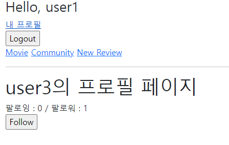
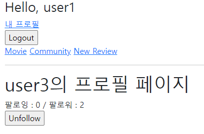
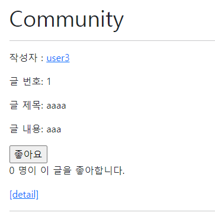
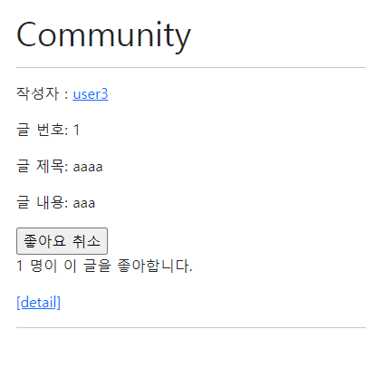
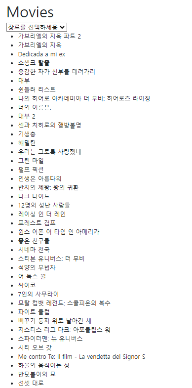
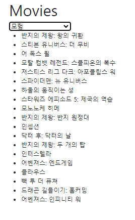
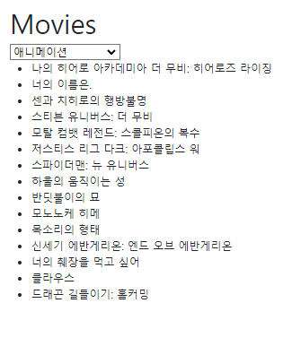

# 08 관통 프로젝트
## 목표: Axios 비동기 통신을 이용한 웹 사이트 구현

## 개요 
> 1. AJAX와 JSON 데이터를 활용하는 커뮤니티 웹 서비스의 구성
> 2. 장르 별 영화 데이터 조회가 가능한 애플리케이션 완성
> 3. 영화 리뷰의 좋아요가 가능한 애플리케이션 완성
> 4. 유저 간 팔로우가 가능한 애플리케이션 완성
> 5. 알고리즘을 통한 영화 추천이 가능한 애플리케이션 완성

### 요구사항
> 1. 데이터를 생성, 조회, 수정, 삭제할 수 있는 애플리케이션 제작
> 2. AJAX와 JSON에 대한 이해
> 3. N:1에 대한 이해
> 4. N:M에 대한 이해
> 5. 추천 알고리즘 설계 (선택 목표)


### 사전 준비
1. 초기 데이터 설정   
  ```py
  $ python manage.py migrate
  $ python manage.py loaddata movies/movies.json
  ```

### 요구사항
A. 유저 팔로우 기능

B. 리뷰 좋아요 기능

C. 영화 장르 필터링

&nbsp;

### A. 유저 팔로우 기능
> A와 B 기능에서 동일한 로직이 작성되어있기 때문에 A 기능에서만 자세하게 작성하기로 한다. 

#### follow 하기 전

#### follow 한 후 


> views 함수를 요구 사항에 따라 수정하였다. : `is_followed`, `followings_count`, `followers_count`를 context에 받아서 html에서 javascript를 통해 작성하였다. 


```py
# accounts/views.py
@login_required
def follow(request, user_pk):
    User = get_user_model()
    person = User.objects.get(pk=user_pk)
    if person != request.user:
        if request.user in person.followers.all():
            person.followers.remove(request.user)
            is_followed = False
        else:
            person.followers.add(request.user)
            is_followed = True
        context = {
            'is_followed': is_followed,
            'followings_count': person.followings.count(),
            'followers_count': person.followers.count(),
        }
        return JsonResponse(context)
    return redirect('accounts:profile', person.username)
```
- `event.preventDefault()` 로 form에서 submit를 제출하여 새로고침 되는 것을 막는다.   
- `data-user-id="{{ person.pk}}"` => `const userId = event.currentTarget.dataset.userId` : data -* 속성을 통해 userId를 할당할 수 있도록 설정한다, axios에서 url로 할당하여 follow view 함수를 실행할 수 있도록 설정하였다. 
- `const csrfToken = document.querySelector('[name=csrfmiddlewaretoken]').value` `...headers: {'X-CSRFToken': csrfToken},})` : 브라우저에서 사용자 모드를 통해 hidden 속성인 csrf 토큰의 name을 가져와 axios에 할당한다.   
- ` ... followingsCount.textContent = response.data.followings_count ...` : views함수에서 설정했던 값을 새로 할당하여 값을 업데이트한다. 

```html



  <h1>{{ person.username }}의 프로필 페이지</h1>
  <div>
    <div>
      팔로잉 : <span id="followings-count">{{ person.followings.all|length }}</span> / 
      팔로워 : <span id="followers-count">{{ person.followers.all|length }}</span>
    </div>
    
      <div>
        <form id="followForm" data-user-id="{{ person.pk}}">
          
          
            <input type="submit" value="Unfollow" id="followbtn">
          
            <input type="submit" value="Follow" i>
          
        </form>
      </div>
    
  </div>

  <script src="https://cdn.jsdelivr.net/npm/axios/dist/axios.min.js"></script>
  <script>
    const formTag = document.querySelector('#followForm')

    formTag.addEventListener('submit', function(event) {
      event.preventDefault()
      const userId = event.currentTarget.dataset.userId
      const csrfToken = document.querySelector('[name=csrfmiddlewaretoken]').value

      axios({
        method: 'post',
        url: `/accounts/${userId}/follow/`,
        headers: {'X-CSRFToken': csrfToken},
      })
        .then((response) => {
          const isFollowed = response.data.is_followed
          const followBtn = formTag.querySelector('input[type=submit]')
          const followingsCount = document.querySelector('#followings-count')
          const followersCount = document.querySelector('#followers-count')

          followingsCount.textContent = response.data.followings_count
          followersCount.textContent = response.data.followers_count
          if (isFollowed === true) {
            followBtn.value = 'Unfollow'
          } else {
            followBtn.value = 'Follow'
          }
        })
        .catch( (error) => {
          consloe.log('error => ', error)
        })
    })

  </script>


```


&nbsp;

### B. 리뷰 좋아요
#### 좋아요 구현 (좋아요를 하지 않았을 경우)

#### 좋아요 취소 구현 (좋아요를 했을 경우)


```py
...
@login_required
def like(request, review_pk):
    review = Review.objects.get(id = review_pk)
    me = request.user 
    
    if me in review.like_users.all():
        review.like_users.remove(me)
        is_liked = False
    else:
        review.like_users.add(me)
        is_liked = True

    context = {
        'is_liked' : is_liked,
        'like_count':review.like_users.count()
    }
    return JsonResponse(context)
...
```
&nbsp;


### C. 영화 장르 필터링

#### 전체 보기 (장르 선택 전)


#### 장르 선택 (모험 선택)


#### 장르 선택 (애니메이션 선택)

<br>
<br>

- `axios({... params : {'genre':genre}})` : html에서 data로 genre를 전달할 수 있도록 설정 
- select의 기본값으로 설정해 두었던 'none' 일 경우의 if문을 추가하여 처리해주었다. 
  - none일 경우 전체 영화 목록이 보여져야 한다.
  - `if genre_name == 'none'` 일 경우 모든 영화를 받을 수 있도록 설정 :`filtered_movies = Movie.objects.all()`    
  - 그 외의 경우 선택한 장르를 받을 수 있도록 설정 : `filtered_movies = genre.movie_set.all()`
- 현재 `filtered_movies` 의 타입이 `QuerySet`이기 때문에 새로운 배열을 생성하여 해당하는 영화 제목을 추가해주었다.


```py
# movies/views.py

def filter_genre(request):
    genre_name = request.GET.get('genre')
    if genre_name == 'none':
        filtered_movies = Movie.objects.all()
    else:
        genre = Genre.objects.get(name=genre_name)
        filtered_movies = genre.movie_set.all()


    movies_list = []
    for movie in filtered_movies:
        movies_list.append(movie.title)
    context = {
        'movies_list' : movies_list
    }
    return JsonResponse(context)


```
----

- 처음 페이지를 로드할 경우와 필터를 한 후를 나누어서 출력하도록 설정하였다. (주석 참고)
- 장르는 등록되어있는 데이터에서 조회하여 출력할 수 있도록 설정하였다.
  - 인덱스 뷰 함수 참고: 모든 영화 장르를 조회할 수 있도록 설정

  ```py
  # movies.views.py
  @require_safe
  def index(request):
      movies = Movie.objects.all()
      genres= Genre.objects.all()
      context={
          'movies':movies,
          'genres':genres
      }
      return render(request,'movies/index.html',context)

  ```
- 장르를 선택할 경우 비동기적 작업 처리로, script 부분에서 새로 작성해주었다. 
  - `const genreSelect = document.querySelector('#genre-select')` : 선택된 장르가 바뀔 때 마다 이벤트가 발생할 수 있도록 변수명 먼저 설정
  - `genreSelect.addEventListener('change',function(event) {...}` : 이벤트 함수 설정 
  - 처음 페이지를 로드했을 경우와 장르 변경 후를 구분하여 전체 영화 목록을 출력할 수 있도록 작성하였다.: `... articleTag.remove() ...`    
    -> 처음 작성되어 있던 전체 영화 목록을 제거한다. 
  - 그 외의 경우 view함수에서 작성하였던 조건문을 통해 `movies_list`로 새로 작성되도록 한다. 
  - 필터된 영화 목록들을 순회하며 상위 DOM인 `ul(#movies_list)`가 하위 DOM을 상속할 수 있도록 코드를 작성하였다. 

```html


  <h1>Movies</h1>
  <select name="genre" id="genre-select" >
    <option value="none" >장르를 선택하세요</option>
    
    <option value="{{genre.name}}">{{genre.name}}</option>
    
  </select>

   처음 출력 한 경우 or 장르를 선택하세용 선택한 경우 
  <ul id='article'>
     
      <li>{{movie.title}}</li>
    
  </ul>

   선택할 경우 변경 
  <ul id="movies_list">
  </ul>

  <script src="https://cdn.jsdelivr.net/npm/axios/dist/axios.min.js"></script>
  <script>
    const genreSelect = document.querySelector('#genre-select')
    genreSelect.addEventListener('change',function(event) {
      event.preventDefault()
      const genre = event.target.value
      axios({
        method : 'get',
        url : `/movies/filter-genre/`,
        params : {
          'genre':genre
        }

      })
        .then((response) =>{
          const articleTag = document.querySelector('#article')
          if (articleTag) {
            articleTag.remove()
          }
        
          const movies_list = response.data.movies_list
          console.log(movies_list)
          let listTag = document.querySelector('#movies_list')
          listTag.textContent =''
          for (movie of movies_list) {
            let liTag = document.createElement('li')
            liTag.textContent = movie
            listTag.appendChild(liTag)
          }

        })
        .catch((error) =>{
          console.log(error)
        })
    })

  </script>

```

----
----


### 소감

- 김민수: 팔로우 기능을 맡아서 했습니다. A, B는 복습의 내용이라 어려움 없이 진행할 수 있었다. 하지만 바닐라 자바스크립트를 진행하면서 헷갈리고 기억이 안나는 부분이 많아 교안을 참고하며 진행했습니다. 복습을 통해 바닐라 자바스크립트에 대해 더 보완을 해야겠다는 생각이 들었다. 지금 뷰를 배우면서 자바스크립트를 보완하여 뷰를 더 이해하기 위해 노력하겠다.

<br>

- 정진영 : 이번 프로젝트는 자바스크립트를 통해 비동기적 작업을 처리하는 것에 집중되어 있었기 때문에, axios를 통해 처음부터 작업을 해야 했다. Vue 커리큘럼을 진행하면서 거의 사용하지 않았던 코드들을 작성하며, 페이지를 새로 로드하지 않고 처리하는 과정을 다시 한번 복습할 수 있어서 좋았다. 뿐만 아니라 데이터를 우리가 설정한 조건에 맞춰 필터링 하는 과정이 가장 어려웠지만 유익했던 것 같다. 처음엔 복잡했던 디버깅 과정이었지만, 이제는 에러가 발생해도 무엇에서 났는지 차근차근 민수랑 같이 검토할 수 있게 되었다.

&nbsp;

### 아쉬운점


- 김민수민수 : C과정인 장르에 따른 영화 리스트 도출하는 것에서 가장 오랜 시간이 걸렸다. 화면을 새로고침 하는 것이 아닌 axios를 통해 비동기적 처리를 하는 과정에서, 처음 장르를 선택하지 않았을 경우 모든 영화 리스트 출력과 다른 리스트를 고른 경우 해당하는 장르의 영화가 나오는 경우에서 어려움을 겪었다. 또한 자바스크립트에 대한 지식이 내가 많이 부족했기 때문에, 누나에게 큰 도움을 주지 못해서 답답함과 미안함이 있었다. 자바스크립트를 복습하고, 장고와 뷰를 보완하고 배워서 최종 프로젝트 전까지 잘 만들 수 있도록 공부해야겠다.

<br>

- 정진영 : 아무래도 C 과정을 구현하는데 시간이 오래 걸렸기 때문에 추가 과제였던 날씨에 따른 영화 추천 알고리즘을 작성하지 못해서 아쉽다. 필터링 하는 코드를 작성하는 것이 처음이었기 때문에 html 코드를 복잡하게 작성하기도 했고, Vue에서 했던 과정과 헷갈리는 바람에 작업을 좀 어렵게 만든 것 같아서 민수한테 미안했다. 그리고 무엇보다 가장 아쉬운 것은 교안의 도움 없이 모든 과정을 작성하지 못했던 것이다. 어서 익숙해져서, 추후에 있을 관통 프로젝트를 민수랑 같이 잘 만들 수 있도록 노력해야겠다.