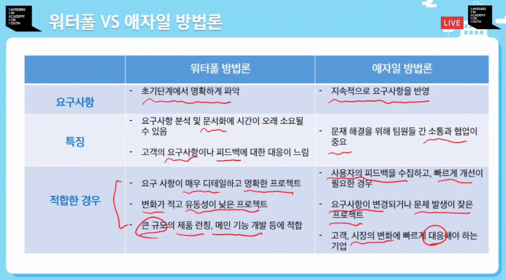

# Agile 개발방법론 적용해보기

# 목차
1. 애자일 개발이란?
2. 등장배경
3. 장단점
4. 에자일 프레임워크
5. 정리요약

## 1. 애자일 개발이란
> 신속한, 날렵한, 기민한 이라는 뜻
짧은 주기의 개발 단위를 반복하여 프로젝트를 완성해 가는 것

스프린트 단위로 디자인(기획) -> 개발 -> 테스트 반복

### 특징
- 고객과 개발자의 지속적인 소통
- 팀의 목적 우선시, 고객의 의견을 가장 높은 가치로 둠
- 잠재적인 버그 수정과 미흡한 기능 추가
- 고객으로부터 즉각적인 피드백을 통한 수정, 보완 가능
- 팀원들의 주도적이며 자발적인 개발 문화 -> 품질 향상

## 2. 둥장 배경
### 워터폴 개발론
- 가장 오래된 SW 개발론
- 요구사항이 바뀌거나 수정하려면 다시 맨 처음부터 수정해야하는 불편함

### 워터폴 VS 애자일 방법론

## 워터풀 VS 애자일 방법론

|                   | 워터풀 방법론                         | 애자일 방법론                              |
|-------------------|---------------------------------------|--------------------------------------------|
| **요구사항**      | 초기단계에서 명확하게 파악            | 지속적으로 요구사항을 반영                  |
| **특징**          | 요구사항 분석 및 문서화에 시간이 오래 소요될 수 있음 | 문제 해결을 위해 팀원들 간 소통과 협업이 중요  |
|                   | 고객의 요구사항이나 피드백에 대한 대응이 느림 | 사용자의 피드백을 수집하고, 빠르게 개선이 필요한 경우 |
| **적합한 경우**   | 요구 사항이 매우 디테일하고 명확한 프로젝트 | 요구사항이 변경되거나 문제 발생이 잦은 프로젝트 |
|                   | 변화가 적고 유동성이 낮은 프로젝트  | 고객, 시장의 변화에 빠르게 대응해야 하는 기업 |
|                   | 큰 규모의 제품 런칭, 메인 기능 개발 등에 적합 |                                            |

## 3. 장단점
### 장점
- 계획에 걸리는 시간을 최소화
- 반복적인 테스트 -> 버그를 쉽고 빠르게 개선 가능
- 계획 변경이나 기능 추가에 유연함
- 고객의 요구 사항에 대한 즉각적인 피드백에 유연하며 프로토타입 모델을 빠르게 출시
- 비교적 빠르게 제품 출시 가능

### 단점
- 반복적인 유지 보수 작업이 많음
- 요구 사항 및 계획이 크게 변경 될 경우 모델 자체가 무너질 수 있음
- 공통 작업의 리소스 투입이 많음 (회의, 로그 등)
- 번아웃 현상이 쉽게 올 수 있음
- 개발 진행에 대한 정확한 이해 부족 발생 가능

## 4. 에자일 프레임워크
### 최소 기능 제품 (Minimum Viable Product)

고객이 원하는 제품의 최소한의 기능을 정의

- 핵심 기능 만을 담은 제품
- 시간과 비용 절감
- 사업 리스크 최소화 -> 실패하더라도 괜찮아!

### 스프린트 (Sprint)
- 팀이 일정량의 작업을 완료하기 위해 정해진 짧은 기간(주기)
- 보통 2주 정도의 기간
- 스프린트 계획 회의 - 스프린트 기간 동안 해야할 일들을 정리하고 달성하기 위한 방법 회의

### 스크럼 (Scrum)
> 정해진 스프린트 내에 실제 행해져야 하는 개발 업무

- 제품 백로그 작성 : 고객 및 이해관계자들의 의견 취합, 업무의 우선순위를 매기는 작업
- 스프린트 백로그 작성 : 팀원들이 해야 할 업무의 리스크를 만드는 작업
- 데일리 스크럼 미팅 : 만들어진 리스크를 바탕으로 매일 진행한 업무를 보고하고 공유하는 작업
- 개발 및 테스트 : 팀원들이 실제 맡은 영역으로 개발, 테스트 하는 작업
- 스프린트 리뷰 및 회고 : 결과물을 통해 장,단점을 분석하고 더 나은 방향으로 개선

### 테스트 주도적 개발 (Test Driven Development)
> 모든 개발이 아닌 테스트 주도적 개발

- 모든 것을 만들고 예측하기에는 시간이 부족

- 실제 필요한 기능만 만들고 그 기능이 제대로 동작하는 지 코드 기반으로 테스트

- 잘 동작하면 코드 리펙토링 및 모듈화

### 테스트 주도적 개발에 도움이 되는 툴

> 생성형 AI를 이용한 특정 기능의 코드를 빠르게 구현 후 모듈화

- Copilot등의 코드 자동 생성 Tool을 이용하여 기능 구현 코드를 쉽게 학습

- OpenAi Codex의 홍보 영상 설명 예시 (텍스트 입력을 통해 간단한 게임을 구현)

### 데브옵스 (Dev + Ops)
> 개발과 운영을 동시에 하자!

- 개발 + 운영의 합성어

- 새로운 소프트웨어 기능 개선, 버그 수정 시 바로 배포함으로서 빠른 피드백 가능

- 지속적 통합 및 연속 배포 (CI/CD) 구축

## 5. 정리 및 요약

- 애자일 방법론은 **스프린트(sprint)** 단위로 **디자인 -> 개발 -> 테스트**를 반복하는 작업이다.
- **폭포수 개발론**과 **애자일 개발론**은 각자 **적용되는 프로젝트의 상황과 성격이 다를 수** 있으며 반드시 한 개발론의 **정답이 정해진 것은 아니다.**
- 애자일 방법론은 고객의 **피드백**에 효과적으로 유연하고 효율적으로 대응할 수 있지만, 반복적인 **유지 보수 작업 발생**과 **번아웃 현상**이 나타날 수 있다.
- 애자일 프레임 워크에는 **MVP, Sprint, Scrum, TDD, DevOps, CI/CD** 등이 있으며 이들을 바탕으로 애자일 작업이 이루어진다.
