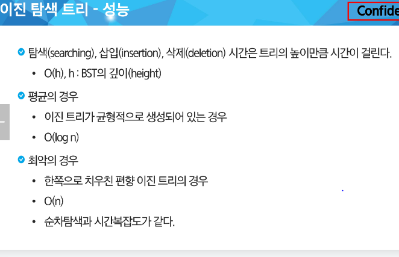

### 백트래킹
완전탐색 + 가지치기
가능성이 없는 (볼 필요 없는) 경우의 수를 제거하는 기법

1. 완전탐색 -> 재귀!

2. 조건 (볼 필요없는 조건)
    - 가지 치기

재귀함수 => 특정 시점으로 돌아오는 게 핵심!

1. 완.탐 경우의 수 확인

2. 가지치기 - 대략저인 감소. 예측.

<br>

중복된 순열 연습 문제
1~3까지 숫자 배열이 있을 때
111, 112, 113, 121, 122, ... 333

파라미터: 바로 작성 x
구조를 먼저 잡으면 자연스럽게 필요한 변수들이 보인다!

~~~~python
arr = [i for i in range(1, 4)]
path = [0] * 3

# 순열
#123, 132, 213, 231, 312, 321
# 조건 : 숫자는 한 번만 사용해라!


# 중복 순열
def dfs(level):
    # 기저 조건
    # 이 문제에서는 3개를 뽑았을 때 까지 반복
    if level == 3:
        return

    # 들어가기 전
    # 다음 재귀 호출
    #   - 다음에 갈 수 있는 곳들은 어디인가?
    #   - 이 문제에서는 1, 2, 3  세 가지(arr의 길이 만큼) 경우의 수가 존재
    
    # 기본 코드
    # path[level] = arr[0]
    # dfs(level + 1)

    # path[level] = arr[1]
    # dfs(level + 1)

    # path[level] = arr[2]
    # dfs(level + 1)

    # 갈 수 있는 후보군
    for i in range(len(arr)):
        # 여기는 못 가! (가지치기)
        # 갈 수 있을때만, 아래 코드를 실행해라
        # 백트래킹 코드 팁 : 갈 수 없는 경우를 활용
        # 아래 코드처럼 갈 수 없을 때 continue
        if arr[i] in path:
            continue

        path[level] = arr[i]
        dfs(level + 1)
        # 갔다와서 할 로직
        # 기존 방문을 초기화
        path[level] = 0

~~~~


### 연습문제 2
{1,2,3,4,5,6,7,8,9,10}의 부분집합 중 원소의 합이 10인 부분집합을 모두 출력하라

```python
def f(sum_1):
    if sum_1 == 10:
        return
    if sum_1 > 10:
        return

```

&nbsp;

### 트리
1. 싸이클
    - 방문했던 노드로 다시 돌아오는 다른 경로 있는 경우

2. 무향
    - 간선에 방향이 없다(양방향)

3. 연결 그래프
    - 모든 꼭지점이 서로 갈 수 있는 경로가 있다.


노드의 개수가 N 개 일 때, 이진 트리 높이의 h는 몇이 될까?

최악의 경우(편향 이진트리) : 높이 h = N    => 그럴바엔 리스트를 사용

최선의 경우(완전 이진트리) : 높이 h = logN  &nbsp;&nbsp;&nbsp; (logN <= h <= N)  

N = 1 + 2^1 + 2^2 + 2^h  
= 2^h+1 -1    

2^h <= N <= 2^h+1 -1
2^h <= N < 2^h+1    h <= logN < h+1>

&nbsp;

```python
# 연습문제 3
arr = [1, 2, 1, 3, 2, 4, 3, 5, 3, 6, 4, 7, 5, 8 ,5, 9, 6, 10, 6, 11, 7, 12, 11, 13]

# 정석 개발용 버전
class TreeNode:
    def __init__(self, value):
        self.value = value
        self.lefr = None
        self.right = None

    def insert(self, child):
        # 왼쪽에 삽입 시도
        if not self.left:
            self.left = child
            return
        
        # 오른쪽에 삽입 시도
        if not.right = child
            self.right = child
            return

        # 삽입 실패
        return

    def inorder(self):
        if self != None:
            # 왼쪽이 있으면 계속 탐색
            if self.left:
                self.left.inorder()
            
            print(self.value, end=' ')

            # 오른쪽이 있으면 계속 탐색
            if self.right:
                self.right.inorder()


# 이진 트리 만들기
# 1. 노드들을 생성
nodes = [TreeNode(i) for i in range(0, 14)]

# 2. 간선 연결
for i in range(0, len(arr), 2):
    parent_node = arr[i]
    child_node = arr[i+1]
    node[parent_node].insert(nodes[child_node])

nodes[1].inorder()

```

<br>

```python
arr = [1, 2, 1, 3, 2, 4, 3, 5, 3, 6, 4, 7, 5, 8 ,5, 9, 6, 10, 6, 11, 7, 12, 11, 13]

# 코딩테스트에서는 간단하게
nodes = [[] for _ in range(14)]
# 2. 간선 연결
for i in range(0, len(arr), 2):
    parent_node = arr[i]
    child_node = arr[i+1]
    nodes[parent_node.append(child_node)]

# 자식이 없다는 걸 표시하기 위해 None
for li in nodes:
    for _ in range(len(li), 2):
        li.append(None)


# 중위순회 구현
def inorder(nodeNum):
    if nodeNum == None:
        return
    
    # 왼쪽으로 갈 수 있다면 진행
    inorder(nodes[nodeNum][0])
    print(nodeNum, end=' ')
    # 오른쪽으로 갈 수 있다면 진행
    inorder(nodes[nodeNum][1])

inorder(1)

```

### 이진 탐색 트리의 연산
루트를 기준으로 작은건 왼쪽 큰 건 오른쪽으로 배치  

탐색 연산의 횟수는 = (트리의 높이)이다. 
트리의 높이 = 최악 N 최고는 logN  
  
- 삽입 연산에서 탐색에서 탐색 실패가 결정되는 위치가 삽입 위치가 된다.


- 삭제 연산 : 삭제할 노드 리프 노드인 경우: 차수가 0인 경우  
1. 탐색
2. 삭제
3. 후속처리 : 서브 트리 이동



&nbsp;

### 힙 트리 ( 우선순위 큐에 많이 사용됨)!!! 반드시 할 줄 알아야함
(A형과 B형에 굉장히 많이 나옴)
완전 이진 트리에 있는 노드 중에서 키 값이 가장 큰 노드나 키 값이 가장 작은 노드를 찾기 위해서 만든 자료구조  
  

형제 끼리는 정렬 x  

1. 23 삽입 : 일단 마지마겡 삽입

2. 자리를 찾아가자  
  