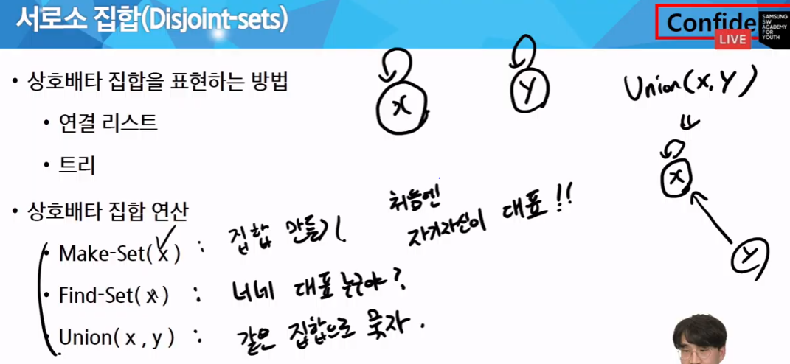
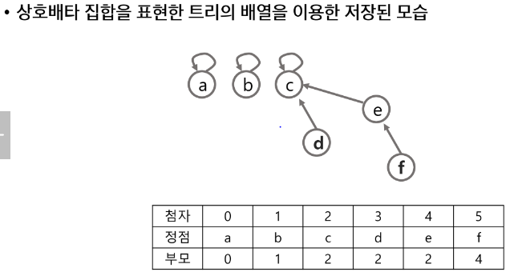
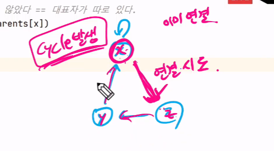
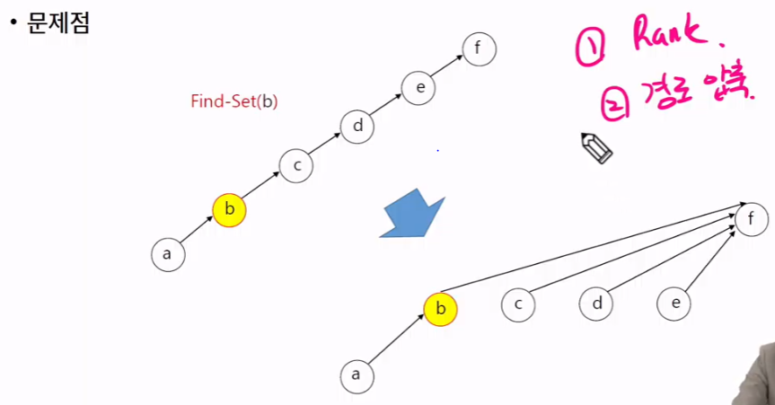

# 목차
1. 그래프 기본

2. DFS

3. BFS

4. Union-Find (Disjoint set)

&nbsp;


### 그래프
(데이터 간 관계를 표시하기 위해) 정점(Vertex)들의 집합과 + 간선(Edge)들의 집합으로 이루어진 자료구조
  

실생활에 복잡하게 얽힌 즉 선형 자료구조나 트리 자료구조로 표현하기 어려운 N:N 관계를 가지는 원소들을 표현하기에 용이 함.

  
#### 그래프 유형
- 무향 그래프(Undirected Graph)
  
- 유향 그래프(Directed Graph)

- 가중치 그래프(Weighted Graph)
    - 최소 비용 문제!
  
- 사이클 없는 방향 그래프(DAG, Directed Acylic Graph)

- 완전 그래프 & 부분 그래프
    - 완전 그래프 : 정점들에 대해 가능한 모든 간선들을 가진 그래프

    - 부분 그래프 : 원래 그래프에서 일부의 정점이나 간선을 제외한 그래프

<br>

### 인접 정점
- 인접 (Adjacency)
    - 두 개의 정점에 간선이 존재(연결됨)하면 서로 인접해 있다고 한다.

    - 완전 그래프에 속한 임의의 두 정점들은 모두 인접해 있다.

<br>

### 그래프 표현
- 간선의 정보를 저장하는 방식, 메모리나 성능을 고려해서 결정

- 인접 행렬 (Adjacent matrix)
    - |V| x |V| 크기의 2차원 배열을 이용해서 간선 정보를 저장

    - 배열의 배열(포인터 배열)

- 인접 리스트(Adjacent List)
    - 각 정점마다 헤딩 정점으로 나가는 간선의 정보를 저장

- 간선의 배열
    - 간선(시작 정점, 끝 정점)을 배열에 연속적으로 저장

#### 강의
1. 그래프를 코드로 표현

- 인접 행렬
```python
# V x V 배열을 활용해서 표현
# 갈 수 없다면 0, 있다면 1(가중치)을 저장
"""
장점 : 노드간의 연결 정보를 한 방에 확인 가능
      간선이 많을수록 유리
      행렬곱을 이용해서 탐색이 쉽게 가능

단점 : 노드 수가 커지면 메모리가 낭비된다
       연결이 안된 거도 저장 -> 메모리 낭비!
       노드 수 + 메모리 제한 반드시 확인할 것!!
"""


# 양방향 그래프의 특징 : 중앙 우하단 대각선 기준으로 대칭 됨
graph = [
    [0, 1, 0, 1, 0],     # 0번은 1, 3으로 갈 수 있다
    [1, 0, 1, 0, 1],
    [0, 1, 0, 0, 0],
    [1, 0, 0, 0, 1],
    [0, 1, 0, 1, 0],
]
```

- 인접 리스트
```python
# ***** 매우 중요!

# V개의 노드가 갈 수 있는 정보만 저장
"""
장점 : 메모리 사용량이 적다
       탐색할 때 갈 수 있는 곳만 확인하기 때문에 시간적으로 효율!

단점 : 특정 노드간 연결 여부를 확인하는 데 시간이 걸린다.
"""
graph = [
    [1, 3],
    [0, 2, 4],
    [1],
    [0, 4],
    [1, 3],
]
```

<br>

#### 덱(deque)을 꼭 공부해서 잘 활용하자!


<br>

## Union-Find (Disjoint set)
서로소 또는 상호배타 집합들은 서로 중복 포함된 원소가 없는 집합들이다.  

즉, 교집합이 없다.

우리편 - 너네편
  
집합에 속한 하나의 특정 멤버를 통해 각 집합들을 구분한다.  
이를 대표자 (representative)
  
데이터가  같은 집합에 속해있다 -> 관계가 있다.



<br>

### 상호 배타 집합 표현 - 연결리스트
- 같은 집합의 원소들은 하나의 연결리스트로 관리

- 연결리스트의 맨 앞의 원소를 집합의 대표 원소로 삼는다

- 각 원소는 집합의 대표원소를 가리키는 링크를 갖는다.


### 상호 배타 집합 표현 - 트리



<br>





> MST에서 union-find 사용 됨. 사이클을 막기 위해?