# 목차
1. 분할 정복

2. 대표적인 분할 정복 알고리즘
    - 병합 정렬

    - 퀵 정렬

    - 이진 검색 -> 코테 단골 문제! 매우 중요!!

&nbsp;

### 알고리즘 설계 기법의 종류

1. 전체를 그냥 다 보자. (Brute Forece - 완전 탐색)
    - 배열 : for 문, while 문

    - 그래프 (관계가 있는 데이터)
        - DFS, BFS

------ 완전 탐색을 구현하면, 시간 or 메모리 초과가 되더라 !

2. 상황마다 좋은 걸 고르자 (Greedy - 그리디)
    - 규칙 + 증명 -> 구현

<br>

3. 큰 문제를 작은 문제로 나누어 부분적으로 해결하자 (Dynamic Programming - DP)
    - 분할 정복과 다르게 작은 문제가 중복

    - 중복된 문제의 해답을 저장해놓고 재활용하자! (Memoization)

<br>

4. 큰 문제를 작은 문제로 나누어 부분적으로 해결하자 (분할 정복)

<br>

5. 전체 중 가능성 없는 것을 빼자 (Backtracking - 백트래킹)

<br>

> 이 기본들을 기반으로 더 고급 알고리즘들이 개발됨

&nbsp;

### 분할 정복 기법

#### 설계 전략
- 분할 (Divide) : 해결할 문제를 여러 개의 작은 부분으로 나눈다.

- 정복 (Conquer) : 나눈 작은 문제를 각각 해결한다.

- 통합 (Combine) : (필요하다면) 해결된 해답을 모은다.

- 특징
    > 하나라도 틀리면 전체 결과가 잘못 나온다!!

    > 비슷한 로직을 반복

    > 어떤 형식으로 구현? -> **재귀**

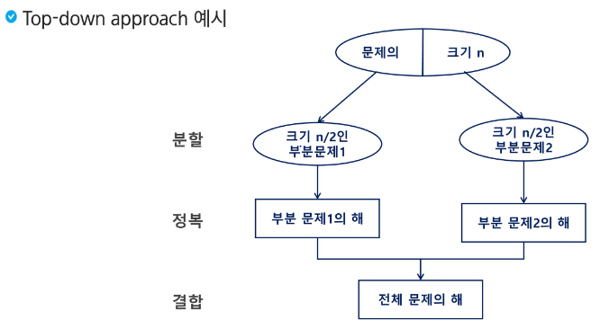

분할은 나눌 수 없을 때 까지 나눔.

제일 작은 부분 문제의 해를 하나하나씩 합치는 결합 과정


### 분할 정복 기법 예시
- 분할 정복 기법을 거듭 제곱 문제를 통해 이해해보자

- 자연수 C의 n 제곱 값을 구하는 함수를 구현해보자

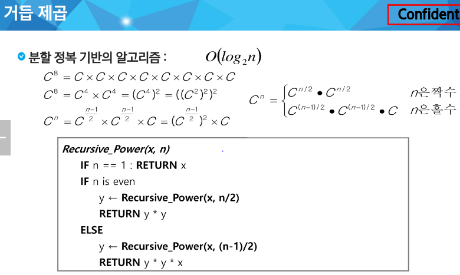

<br>

### 병합 정렬 (Merge Sort)
여러개의 정렬된 자료의 집합을 병합하여 한 개의 정렬된 집합으로 만드는 방식

- 활용
    - 자료를 최소 단위의 문제까지 나눈 후에 차례대로 정렬하여 최종 결과를 얻어냄

    - top-down 방식

- 시간 복잡도
    - O(n log n) -> 나눌때 비교연산 log n, 병합할 때 비교연산 log n 따라서 n log n이다.

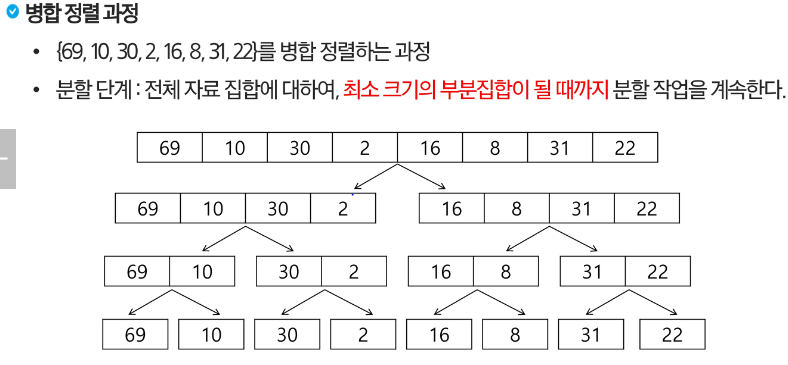
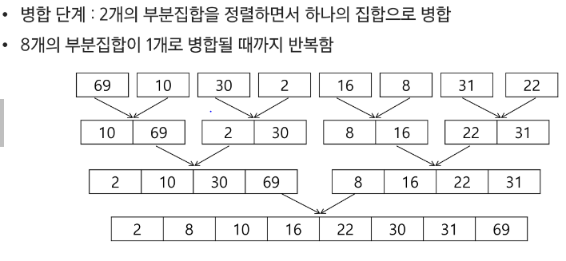

<br>

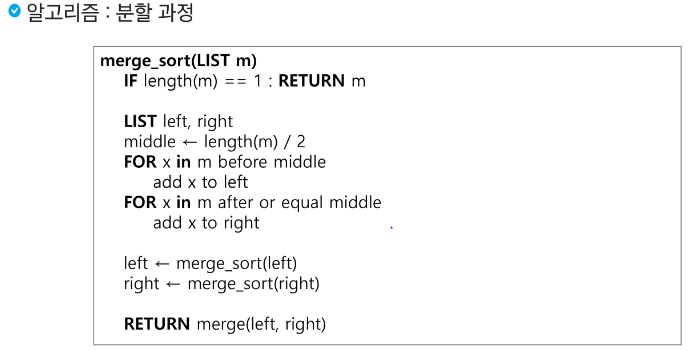
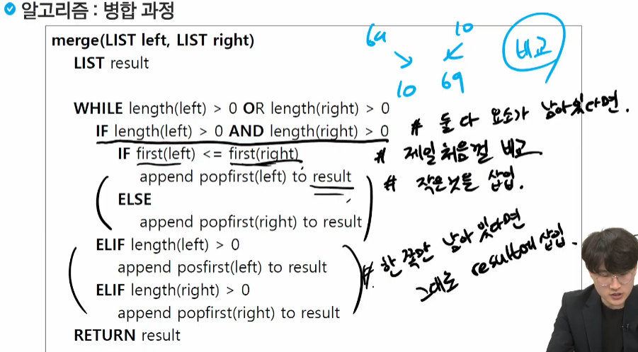

&nbsp;

### 퀵 정렬
평균적으로 효율이 굉장히 좋음!

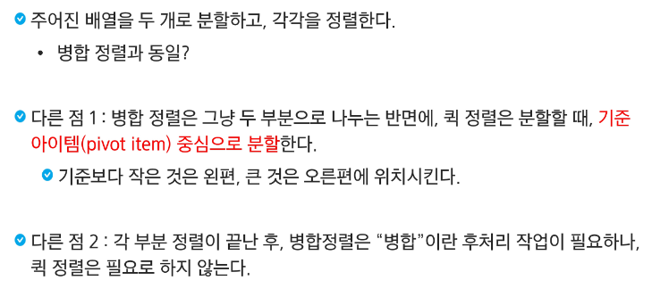

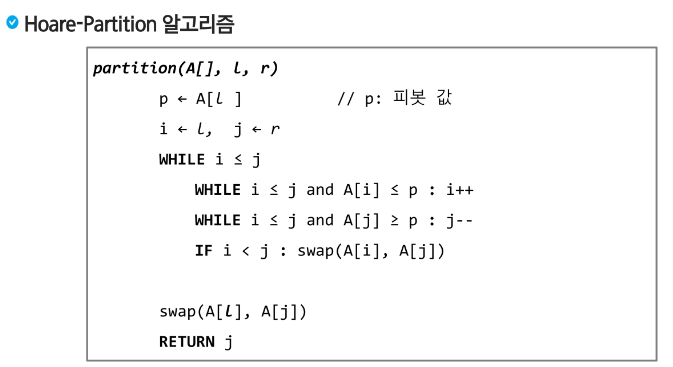

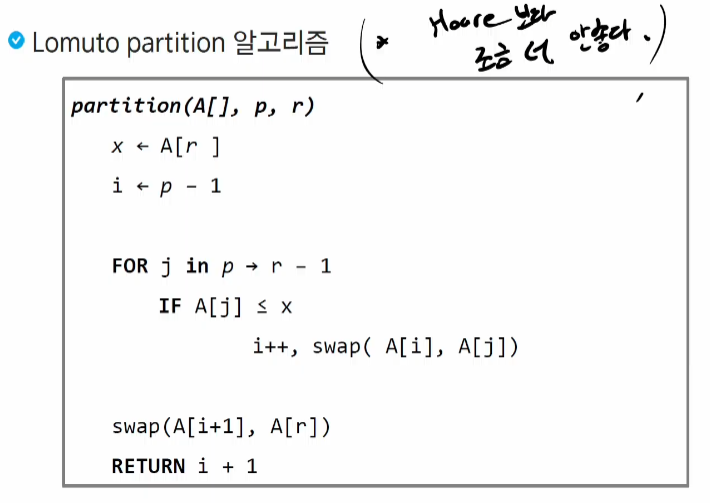
걍 이런게 있구나 하고 넘어가도 됨


<br>

### 이진 검색
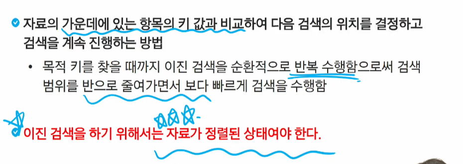
sort()를 하고나서 해야함!

~~~~python
# 이진 검색
arr = [324, 32, 22114, 16, 48, 93, 422, 21, 316]

# 1. 정렬된 상태의 데이터
arr.sort()
print(arr)

# 2. 이진 검색 - 반복문 버전
def binarysearch(target):
    # 제일 왼쪽, 오른쪽 인덱스 구하기
    low = 0
    high = len(arr) -1
    # 탐색횟수
    cnt = 0

    # 해당 숫자를 찾으면 종료
    # 더 이상 쪼갤 수 없을 때까지 반복
    while low <= high:
        mid = (low + high) // 2
        cnt += 1

        # 가운데 숫자가 정답이면 종료
        if arr[mid] == target:
            return mid, cnt
        elif arr[mid] > target:
            high = mid - 1
        elif arr[mid] < target:
            low = mid + 1
    
    # 못찾으면 -1 반환
    return -1, cnt

print(f'21 = {binarysearch(21)}')
print(f'324 = {binarysearch(324)}')
print(f'888 = {binarysearch(888)}')
~~~~

~~~~python
# 이진 검색
arr = [324, 32, 22114, 16, 48, 93, 422, 21, 316]

# 1. 정렬된 상태의 데이터
arr.sort()
print(arr)

# 3. 이진 검색 - 재귀 함수 버전
def binarySearch(target):
    # 기저조건 (언제까지 재귀가 반복되어야 할까?)
    if low > high:
        return -1

    # 다음 재귀 들어가기 전엔 무엇을 해야할까?
    # 정답 판별
    mid = (low + high) // 2
    if target == arr[mid]:
        return mid

    # 다음 재귀 함수 호출 (파라미터)
    if target < arr[mid]:
        return binarySearch(low, mid - 1, target)
     else:
        return binarySearch(mid + 1, high, target)

    # 재귀 함수에서 돌아왔을 때 어떤 작업을 해야할까?


print(f'21 = {binarySearch(0, len(arr) - 1, 21)}')
print(f'324 = {binarysearch(0, len(arr) - 1, 324)}')
print(f'888 = {binarysearch(0, len(arr) - 1, 888)}')
~~~~

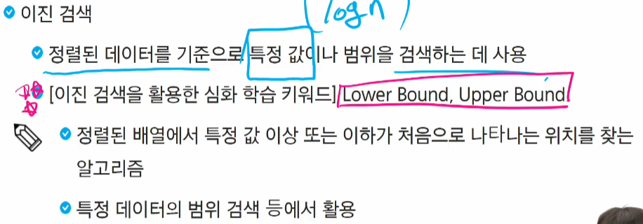

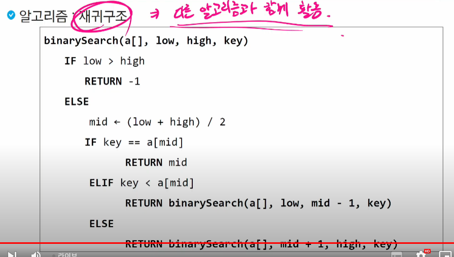

```python
# 선생님 강의 - 5204 병합 정렬

# 분할하는 함수
def msort(m):
    if len(m) == 1: # 원소가 하나만 남은 경우
        return m
    mid = len(m)//2
    left = m[:mid]
    right = m[mid:]

    left = msort(left)      # 왼쪽 절반 분할
    right = msort(right)    # 오른쪽 절반 분할

    return merge(left, right)   # 다시 합친 결과

# 병합하는 함수
def merge(left, right):
    result = [0] * (len(left) + len(right))
    i = j = 0       # i : 왼쪽 배열에서 비교할 위치, j: 오른쪽 배열에서 비교할 위치

    while i < len(left) and j < len(right):  # 양쪽에 비교할 원소가 있는 경우
        if left[i] < right[j]:
            result[i+j] = left[i]
            i += 1
        else:       # right[j] < left[i]
            result[i+j] = right[j]
            j += 1

    while i < len(left):    # left의 원소만 남은 경우
        result[i+j] = left[i]
        i += 1

    while j < len(right):   # right의 원소만 남은 경우
        result[i+j] = right[j]
        j += 1
    return result

arr = [69, 10, 30, 2, 16, 8, 31, 22]
arr = msort(arr)
print(arr)
```