### Frontend (프론트엔드)
- 사용자 인터페이스(UI)를 구성하고, 사용자가 애플리케이션과 상호작용을 할 수 있도록 함
-> HTML, CSS, JavaScript, 프론트엔드 프레임워크 등

### Backend(백엔드)
- 서버 측에서 동작하며, 클라이언트의 요청에 대한 처리와 데이터베이스와의 상호작용 등을 담당
-> 서버 언어(Python, Java 등) 및 백엔드 프레임워크, 데이터베이스, API, 보안 등

### django
> Python 기반의 대표적인 웹 프레임워크

- 다양성, 확장성, 보안, 커뮤니티 지원 등의 장점이 있음

### 가상 환경
> Python 애플리케이션과 그에 따른 패키지들을 격리하여 관리할 수 있는 '독립적인' 실행 환경

-필요한 이유 : 한 개발자가 2개의 프로젝트를 진행한다고 할 때, 각각 다른 버전이 필요하지만
            파이썬 환경에서 패키지는 1개의 버전만 존재할 수 있음. 따라서 각각 다른 패키지
            버전 사용을 위해 독립적인 개발 환경이 필요함

### 가상 환경 venv 생성
> git bash 명령어: python -m venv venv  (virtual environment)

- 패키지가 아무것도 설치되지 않은 환경

- on / off 는 파일을 들어가는게 아닌 스위치를 켜고 끄는 개념

- 절대로 폴더에 들어가서 한 자라도 추가하면 안됌. 걍 건드리지 말 것.

- 깃 배쉬에서 원하는 폴더의 앞에 하나만 치고 tab 누르면 자동완성

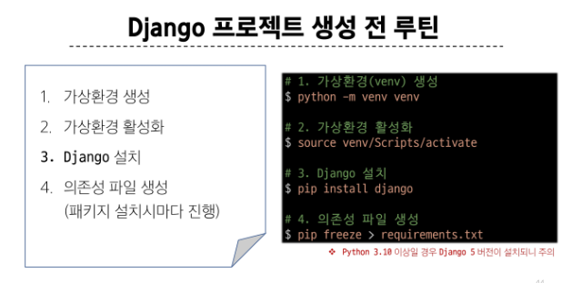

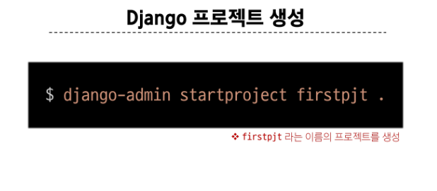

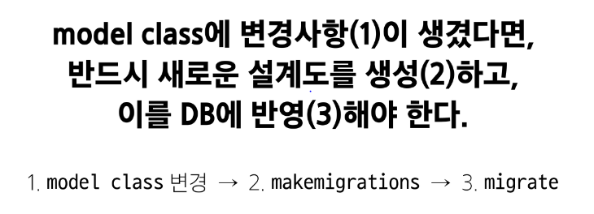

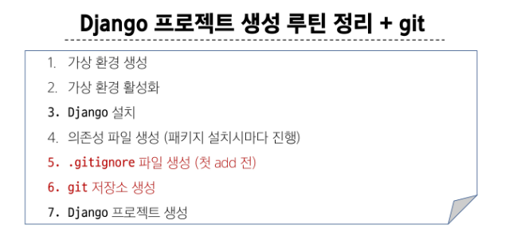

### 패키지 목록이 필요한 이유
> 협업중 프로젝트를 클론 받고 실행하려 했지만 실행이 안됐다.
    팀원이 이 프로젝트를 위해 어떤 패키지를 설치했고, 어떤 버전을 설치했는지
    팀원의 가상 환경 상황을 알 수 없다. 따라서 가상 환경에 대한 정보
    즉 '패키지 목록'이 공유되어야 함

- pip list

### 의존성 패키지
> 소프트웨어 패키지가 다른 패키지의 기능이나 코드를 사용하기 때문에 그 패키지가 
존재해야만 제대로 작동하는 관계. 

> 사용하려는 패키지가 설치되지 않았거나, 호환되는 버전이 아니면 오류가 발생 or 예상하지 못한 동작을 보일 수 있음

- 의존성 패키지 목록 생성
> pip freeze > requirements.txt

### 디자인 패턴
> 소프트웨어 설계에서 발생하는 문제를 해결하기 위한 일반적인 해결책

> "애플리케이션의 구조는 이렇게 구성하자" 라는 관행

#### MVC 디자인 패턴 (Model, View, Controller)
> 애플리케이션을 구조화하는 대표적인 패턴 (데이터 & 사용자 인터페이스 & 비즈니스 로직을 분리)

> 시작적 요소와 뒤에서 실행되는 로직을 서로 영향없이, 독립적이고 쉽게 유지 보수할 수 있는 애플리케이션을 만들기 위해

#### MTV 디자인 패턴 (Model, Template, View)
> Django 에서 애플리케이션을 구조화하는 패턴 (기존 MVC 패턴과 동일하나 단순히 명칭을 다르게 정의한 것)

> 다 앱에 존재해야함!

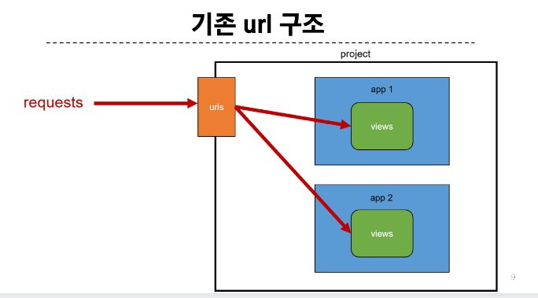

---

### Django project
> 애플리케이션의 집합 (DB 설정, URL 연결, 전체 앱 설정 등을 처리)
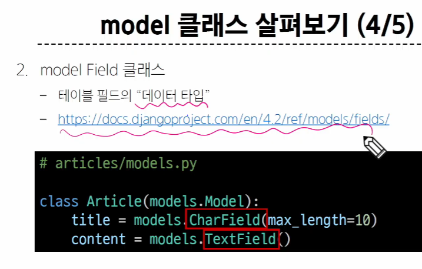

### Django application
> 독립적으로 작동하는 기능 단위 모듈 (각자 특정한 기능을 담당. 다른 앱들과 함께 하나의 프로젝트를 구성)

---

### 앱을 사용하기 위한 순서
#### 1. 앱 생성
: python manage.py startapp articles

#### 2. 앱 등록
: firstpjt -> settings -> 앱 등록 'articles'

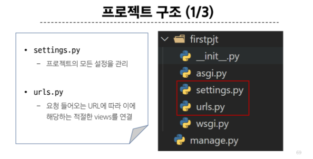
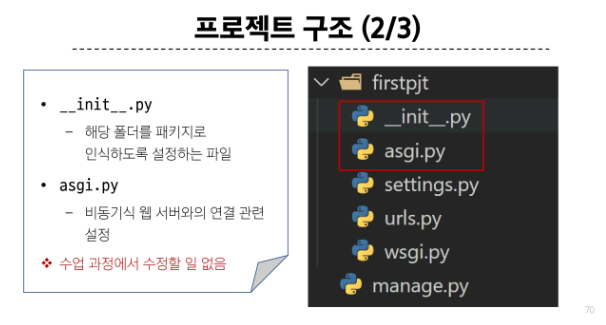
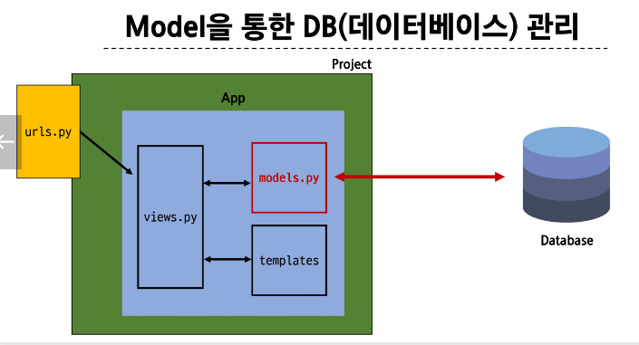

> settings.py랑 urls.py 만 수업에서 진행!! 
-----

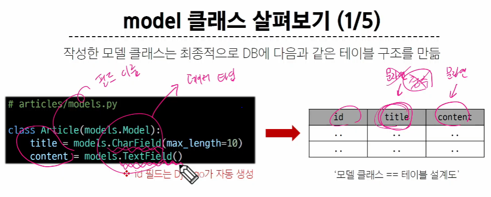
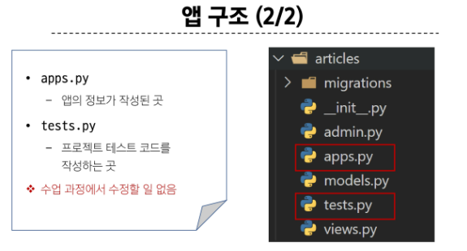

---

### 요청과 응답
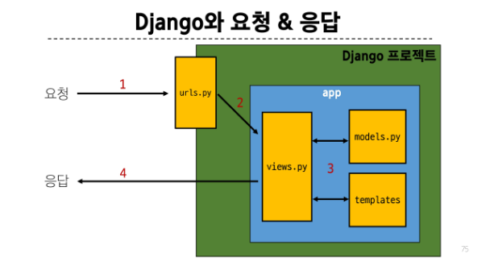

- views.py 가 가장 많은 역할을 함과 동시에 중요!
> view 함수 사용

> 1, 2, 3, 4 순서도 머리에 잘 넣기!

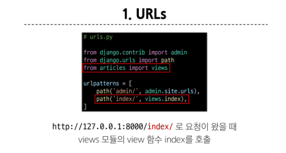

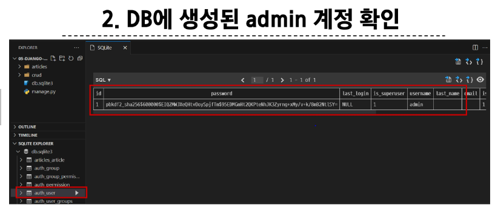

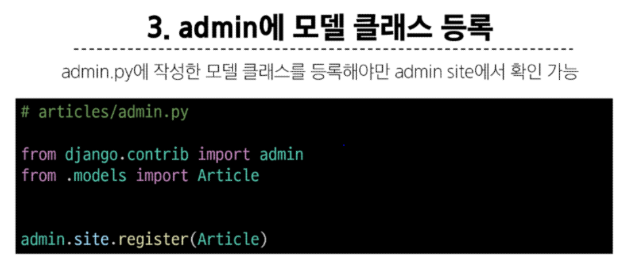

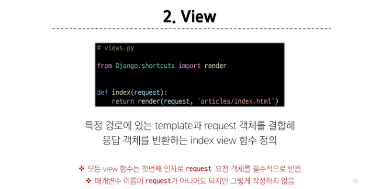

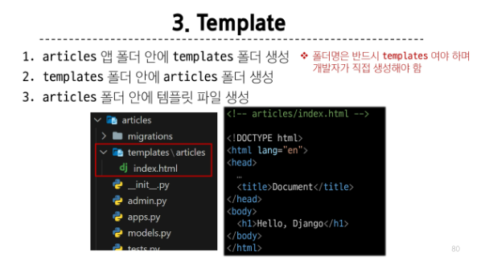

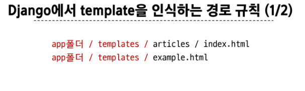

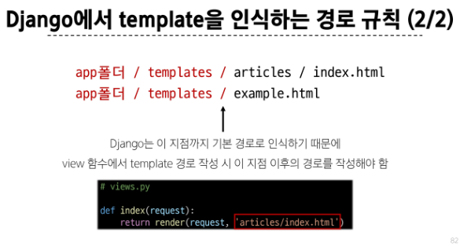

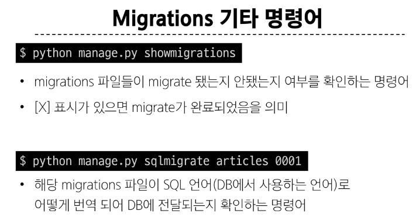

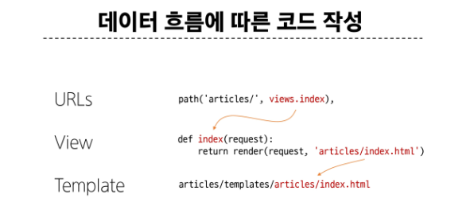

-----

장고 루틴
1. 가상환경 생성 (venv란? virtual environment 의 약자로 가상환경을 뜻함)
python -m venv venv
>> {python파일을} {만든다} {가상환경을} {이름은 venv로}

2. 가상환경 활성화
source venv/Scripts/activate
>> source 명령어는 스크립트 파일을 수정한 후에 수정된 값을 바로 적용하기 위해 사용. (리부팅 없이 즉시 적용하기 위해 사용)

3. Django 설치
pip install django
>> 여기서 pip이란 package installer of python으로 파이썬 패키지나 모듈의 패키지 매니저이다. 

4. 의존성 파일 생성
pip freeze > requirements.txt
>> pip freeze 명령어는 현재 작업 환경(가상 환경)에 설치되어있는 패키지의 리스트들을 모두 출력해준다
여기서 > requirements.txt 를 해주면 requirements.txt파일에 출력한 리스트들을 모두 저장해준다.
=====================
- Django 프로젝트 생성
django-admin startproject firstpjt .
>>firstpjt라는 이름의 프로젝트를 생성해준다.

- Django 서버 실행
python manage.py runserver
>>{python파일}인 {manage.py}를 실행시켜서 {서버를실행한다}
>>manage.py와 동일한 경로에서 진행해주어야 한다.

-git에 올릴거면 (첫 add 전) .gitignore파일을 만들어서 gitignore.io 에 들어가서 내용을 입력해준다.
그 이후 git 저장소 생성해준뒤 Django 프로젝트를 생성해준다.