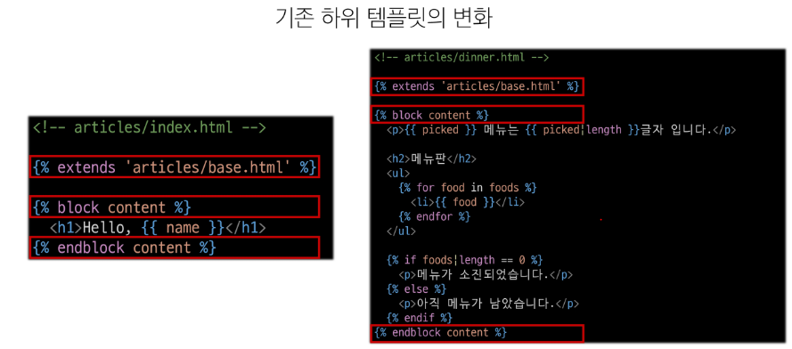
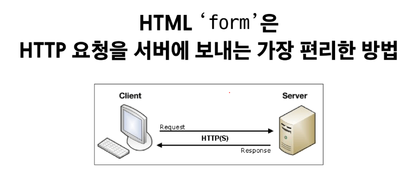
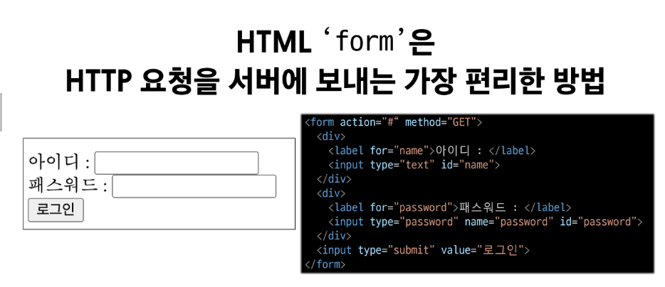
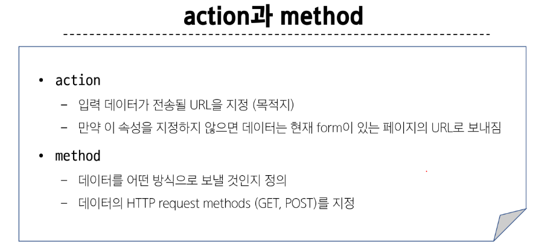
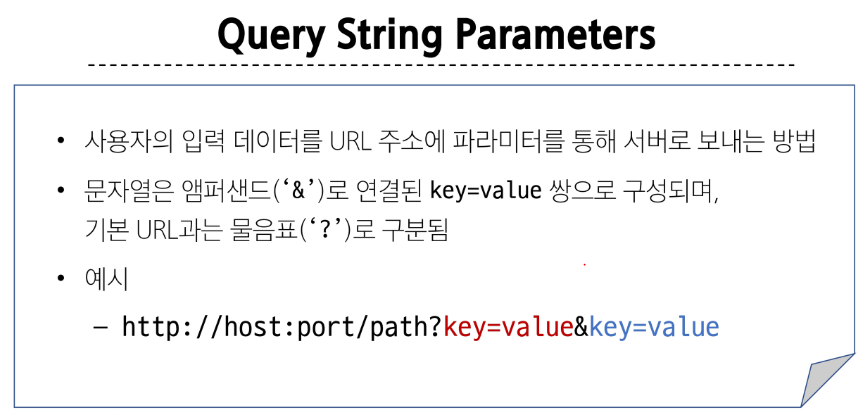
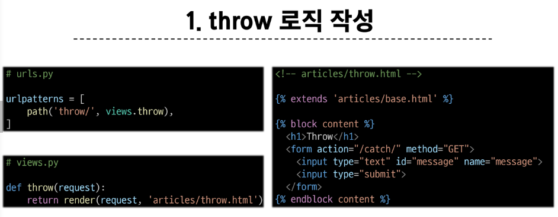
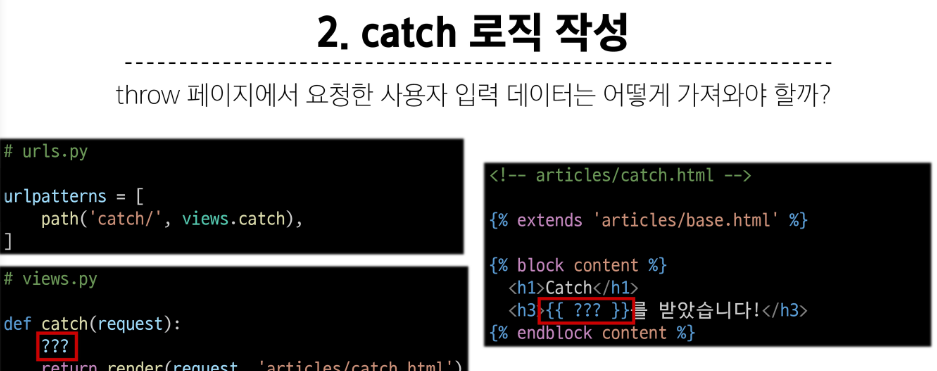
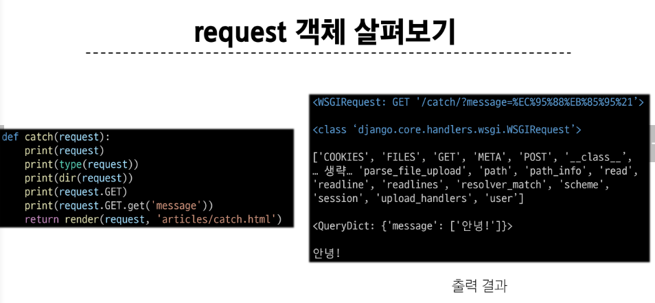

# 목차 INDEX

1. Template System
    - 템플릿 상속

2. HTML form (요청과 응답)
    - form 활용

3. Django URLs
    - 변수와 URL

## 1. Template System
> 데이터 **표현**을 제어하면서, **표현**과 관련된 부분을 담당

### Django Template Language -> DTL
> Template에서 조건, 반복, 변수 등의 프로그래밍적 기능을 제공하는 시스템

### requirements 파일 다운받는 방법
~~~~
    pip install -r requirements.txt
~~~~

### DTL Syntax

1. Variable

2. Filters

3. Tags

4. Comments

#### DTL-1. Variable

- render 함수의 세번째 인자로 딕셔너리 데이터를 사용

- 딕셔너리 key에 해당하는 문자열이 template에서 사용 가능한 변수명이 됨

- dot(.)를 사용하여 변수 속성에 접근할 수 있음

~~~~
    {{ variable }}
    {{ variable.attribute }}
~~~~

#### DTL-2. Filters

- 표시할 변수를 수정할 때 사용 (변수 | 필터)

- chained(연결)이 가능하며 일부 필터는 인자를 받기도 함

~~~~
    {{ variable|filter }}
    {{ name|truncatewords:30}}
~~~~

#### DTL-3. Tags

- 반복 또는 논리를 수행하여 제어 흐름을 만듦

- 일부 태그는 시작과 종료 태그가 필요

~~~~
    
     
~~~~

#### DTL-4. Comments

- DTL에서의 주석

~~~~
    
    ...
    
~~~~

## 2. 템플릿 상속

### 템플릿 상속 - Template inheritance
> **페이지의 공통요소를 포함** 하고, **하위 템플릿이 재정의 할 수 있는 공간** 을 정의하는 기본 스켈레톤 템플릿을 작성하여 상속 구조를 구축

### 'extend' **tag**

자식(하위)템플릿이 부모 템플릿을 확장한다는 것을 알림
> 반드시 자식 템플릿 **최상단**에 작성. **2개 이상 사용 불가**

### 'block' **tag**

하위 템플릿에서 재정의 할 수 있는 블록을 정의

이름이 필요

&nbsp;

## 3. HTML form (요청과 응답)

 

### 데이터를 보내고 가져오기

> HTML 'form' element를 통해 사용자와 애플리케이션 간의 상호작용 이해하기

url 이나 form을 통해 서버에 요청을 보낼 수 있음

get -> url 노출
post -> 로그인에서 많이 사용 -> 인증에서 사용됨

### 'form' element
사용자로부터 할당된 데이터를 서버로 전송
> 웹에서 사용자 정보를 입력하는 여러 방식 (text, password 등)을 제공

- 'action' & 'method' -> form의 핵심 속성 2가지
> 데이터를 어디(**action**)로 어떤 방식(**method**)으로 요청할지

 

### 'input' element

> 사용자의 데이터를 입력 받을 수 있는 데이터

### 'name' attribute -> input의 핵심 속성

> 입력한 데이터에 붙이는 이름(key)

> 데이터를 제출했을 때 서버는 name 속성에 설정된 값을 통해서만 사용자가 입력한 데이터에 접근할 수 있음

- 문자열은 앰퍼샌드 ('&')로 연결된 key=value 쌍으로 구성

- 기본 url 과는 ('?')로 구분 됨 

#### Query String Parameters
- 사용자의 입력 데이터를 URL 주소에 파라미터를 통해 서버로 보내는 방법

## 2-1. form 활용

### HTTP request 객체
form으로 전송한 데이터 뿐만 아니라 모든 요청 관련 데이터가 담겨 있음 (**view 함수의 첫 번째 인자**)

///여기부터 이어서 작성

## 참고
### BASE_DIR

'C://desktop/ssafy/aaaa/aaaa/....  -> 리눅스 계열의 OS

'C:\\desktop\\ -> 윈도우에서의 경로 표기

> OS 마다 객체 지향 파일 시스템 경로가 다르다!

### DTL 주의사항

- Python처럼 일부 프로그래밍 구조(if, for 등)를 사용할 수 있지만 명칭을 그렇게 설계 했을 뿐, **Python 코드로 실행되는 것이 아니며 Python과는 관련 없음**

- 프로그래밍적 로직이 아니라 표현을 위한 것임을 명심!

- 프로그래밍적 로직은 되도록 view 함수에서 작성 및 처리할 것

- 공식문서를 참고해 다양한 태그와 필터 사용해보기