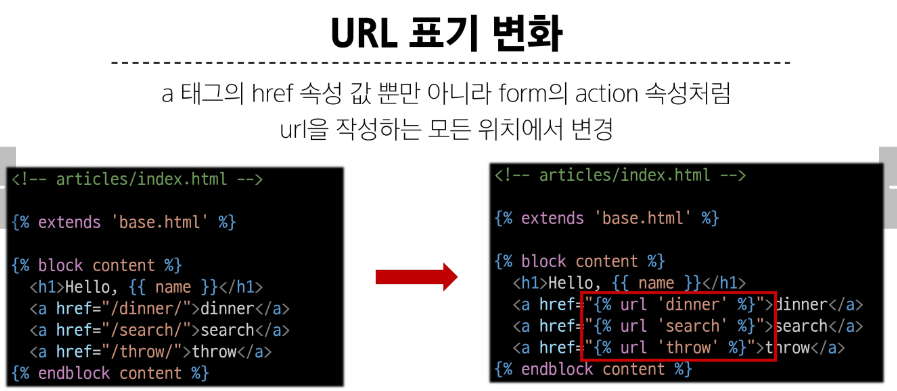
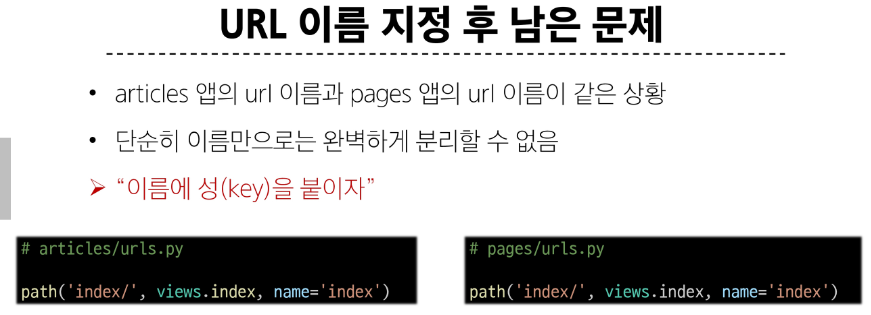
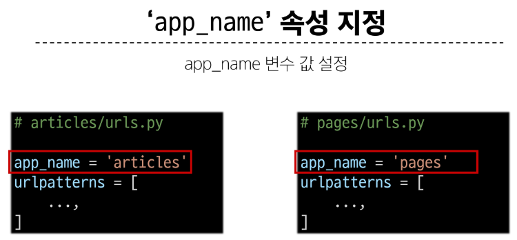
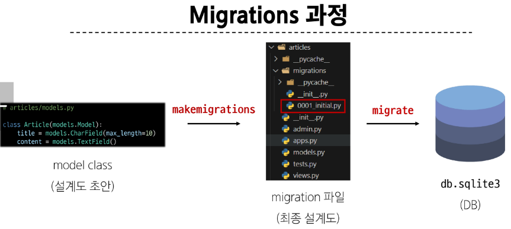
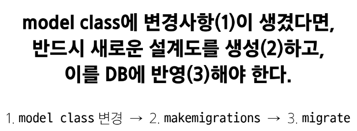
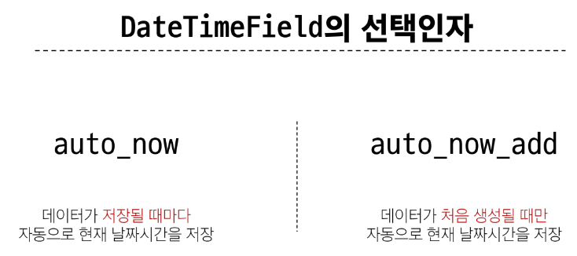

# 목차

1. Django URLs

- App과 URL

- URL 이름 지정

- URL 이름 공간

 

2. Django Model

- Model

- Migrations

- Admin site

 

# 1. Django URLs

### URL dispatcher

> URL 패턴을 정의하고 해당 패턴이 일치하는 요청을 처리할 view 함수를 연결(매핑)

## 1-1. App과 URL

### App URL mapping

각 앱에 URL을 정의하는 것  
> 프로젝트와 각 앱이 URL을 나누어 관리를 편하게 하기 위함

### 2번째 앱 page 생성 후 발생할 수 있는 문제

- view 함수 이름이 같거나 같은 패턴의 URL 주소를 사용하게 되는 경우

> URL을 각자 app에서 관리하자!!

 

### include()
>
> 프로젝트 내부 앱들의 URL을 참조할 수 있도록 매핑(연결)하는 함수

- URL의 일치하는 부분까지 잘라내고, 남은 문자열 부분은 후속 처리를 위해 include된 URL로 전달

 

## 1-2. URL 이름 지정

### url 구조 변경에 따른 문제점

- 기존 'articles/' 주소가 'articles/index/'로 변경됨에 따라 해당 주소를 사용하는 모든 위치를 찾아가 변경해야함ㅠ

> URL에 이름을 지어주면 이름만 기억하면 된다!

#### Naming URL patterns : URL에 이름을 지정하는 것

 

#### 'url' tag : 주어진 URL 패턴의 이름과 일치하는 절대 경로 주소를 반환

### 'app_name'

### URL tag의 최종 변화
>
> 마지막으로 url 태그가 사용하는 모든 곳의 표기 변경하기

 

 

# 2. Model
Model을 통한 DB 관리

### Django Model
>
> DB 테이블을 정의하고 데이터를 조작할 수 있는 기능들을 제공 -> **테이블 구조를 설계하는 '청사진(blueprint)'**

 

### model 클래스 작성

~~~~python
# articles/models.py

class Article(models.Model):
    title = models.CharField(max_length=10)
    content = models.TextField()
~~~~
  
Model은 model에 관련된 모든 코드가 이미 작성 되어있는 클래스
> 개발자가 가장 중요한 테이블 구조를 어떻게 설계할지에 대한 코드만 작성하도록 하기 위한것  (상속을 활용한 프레임워크의 기능 제공)

{클래스 변수명} = models.{model Field 클래스}({모델 필드 클래스의 키워드 인자})

#### 제약 조건 : 데이터가 올바르게 저장되고 관리되도록 하기 위한 규칙

#### id 필드는 장고가 자동 생성

### Model을 통한 DB 관리

oop 7, 8일차 class 개념 복습해보기..

&nbsp;

## 2-2. Migrations
>
> model 클래스의 변경사항(필드 생성, 수정 삭제 등)을 DB에 최종 반영하는 방법

### Migrations 과정

### Migration 핵심 명령어 2가지

- $ python manage.py makemigrations
    > model class를 기반으로 최종 설계도(migration) 작성

- $ python manage.py migrate
    > 최종 설계도를 DB에 전달하여 반영

### 추가 모델 필드 작성

데이터베이스는 빈 값으로 추가할 수 없음

이미 기존 테이블이 존재하기 때문에 필드를 추가 할 때 필드의 기본 값 설정이 필요

-> 1번 현재 대화를 유지하면서 기본 값을 입력하는 방법

-> 2번은 현재 대화에서 나간 후 models.py에 기본 값 관련 설정을 하는 방법

 

### Model Field
>
> DB 테이블의 **필드(열)**을 정의하며, 해당 필드에 저장되는 **데이터 타입**과 **제약조건**을 정의

 

### CharField()
>
> 길이의 제한이 있는 문자열을 넣을 때 사용 (**필드의 최대 길이를 결정하는 max_length는 필수 인자**)

 

### TextField()
>
> 글자의 수가 많을 때 사용

 

### DateTimeField()
>
> 날짜와 시간을 넣을 때 사용

> 시험에 나올 수 있음!

&nbsp;

## 2-3. Admin site

### Automatic admin interface
>
> 장고는 추가 설치 및 설정 없이 자동으로 관리자 인터페이스를 제공 -> 데이터 확인 및 테스트 등을 진행하는데 매우 유용

~~~~python
# admin 계정 생성

python manage.py createsuperuser 
~~~~

 

~~~~python
# admin에 모델 클래스 등록

from django.contrib import admin
from .models import Article

admin.site.register(Article)
~~~~

 

-----

## 참고

### 데이터베이스 초기화

1. migration 파일 삭제 -> 0001~

2. db.sqlite3 파일 삭제

**아래 파일과 폴더를 지우지 않도록 주의!!**

- **init**.py

- migrations 폴더

### 첫 migrate시 출력 내용이 많은 이유
>
> Django 프로젝트가 동작하기 위해 미리 작성 되어있는 기본 내장 app들에 대한 migration 파일들이 함께 migrate 되기 때문!

### SQLite
>
> 데이터베이스 관리 시스템 중 하나이며 Django의 기본 데이터베이스로 사용됨(파일로 존재하며 가볍고 호환성이 좋음)