# 목차

1. ORM

2. QuerySet API

3. QuerySet API 실습
    - Create

    - Read

    - Update

    - Delete

&nbsp;

## 1. ORM

Object - Relational - Mapping
  
객체 지향 프로그래밍 언어를 사용하여 호환되지 않는 유형의 시스템 간에 데이터를 변환하는 기술

<br>

### ORM의 역할

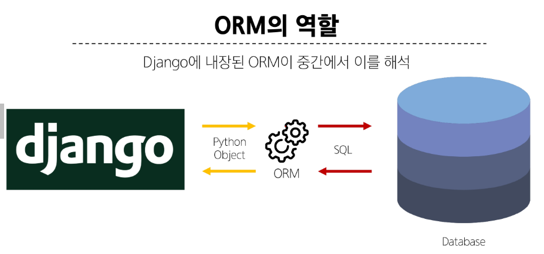

&nbsp;

## 2. QuerySet API

ORM에서 데이터를 검색, 필터링, 정렬 및 그룹화 하는데 사용하는 도구

- API를 사용하여 SQL이 아닌! Python 코드로 데이터를 처리

~~~~
python의 모델 클래스와 인스턴스를 활용해 DB에 데이터를 저장(create), 조회(read), 수정(update), 삭제(delete) 하는 것
~~~~

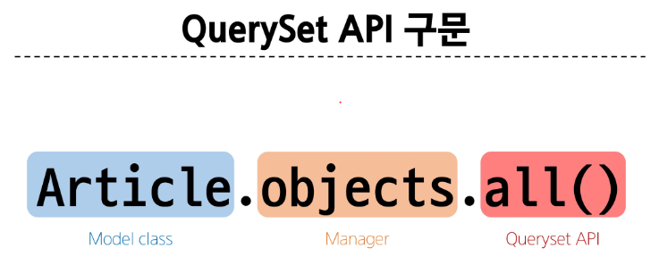

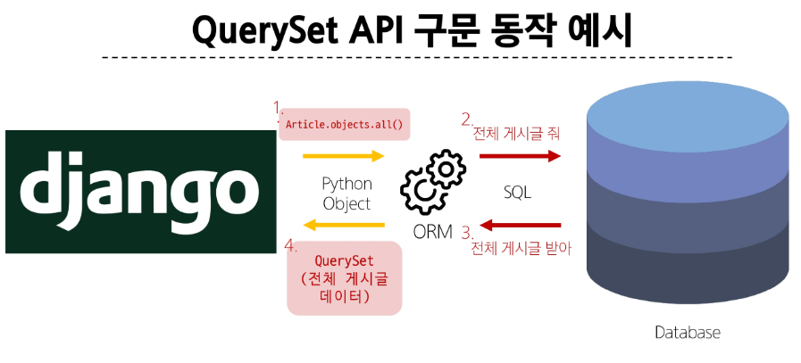

### Query

- 데이터 베이스에 특정한 데이터를 보여 달라는 요청

- "쿼리문을 작성한다." == sql 문을 작성한다.
    > 원하는 데이터를 얻기 위해 데이터베이스에 요청을 보낼 코드를 작성한다.

- 1) 파이썬으로 작성한 코드가 ORM에 의해 SQL로 변환되어 데이터베이스에 전달.  

- 2) 데이터 베이스의 응답 데이터를 ORM이 QuerySet이라는 자료 형태로 변환하여 우리에게 전달

<br>

### QuerySet

- 데이터 베이스에게서 전달 받은 객체 목록(데이터 모음)
  - 순회가 가능한 데이터로써 1개 이상의 데이터를 불러와 사용할 수 있음

- Django ORM을 통해 만들어진 자료형

- 단, 데이터베이스가 단일한 객체를 반환 할 때는 QuerySet이 아닌 모델(Class)의 인스턴스로 반환됨


&nbsp;

## 3. QuerySet API 실습

### 3-1. Create (저장)

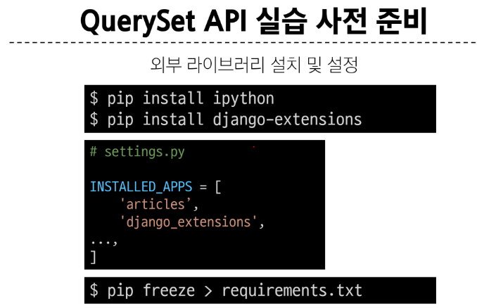  
  
#### Django shell

Django 환경 안에서 실행되는 python shell  
(입력하는 QuerySet API 구문이 Django 프로젝트에 영향을 미침)

#### Django shell 실행
>
> $ python manage.py shell_plus

### python shell을 통해 데이터 객체를 만드는 3가지 방법
첫 번째
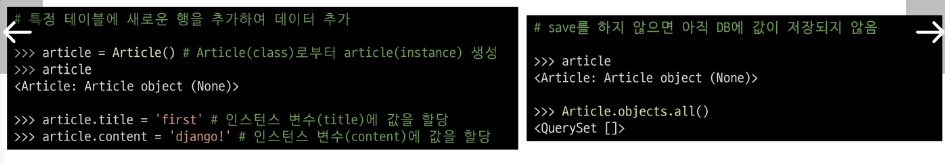

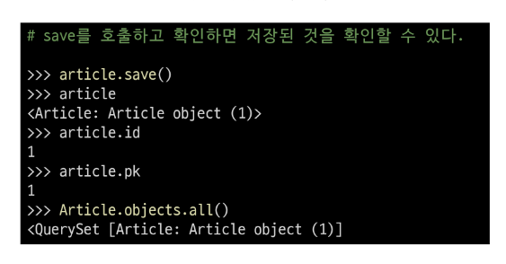

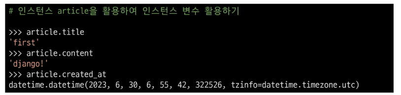

<br>

두 번째
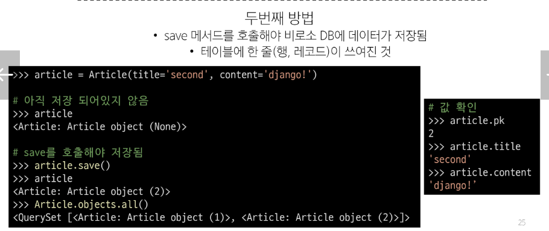

<br>

세 번째
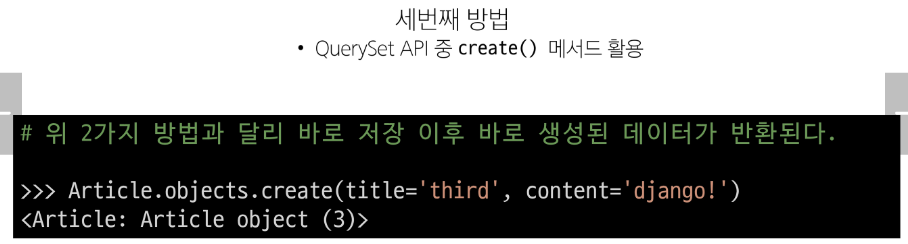

#### save() : 객체를 데이터베이스에 저장하는 메서드

<br>

## 3-2. Read (조회)

all() / filter() / get()

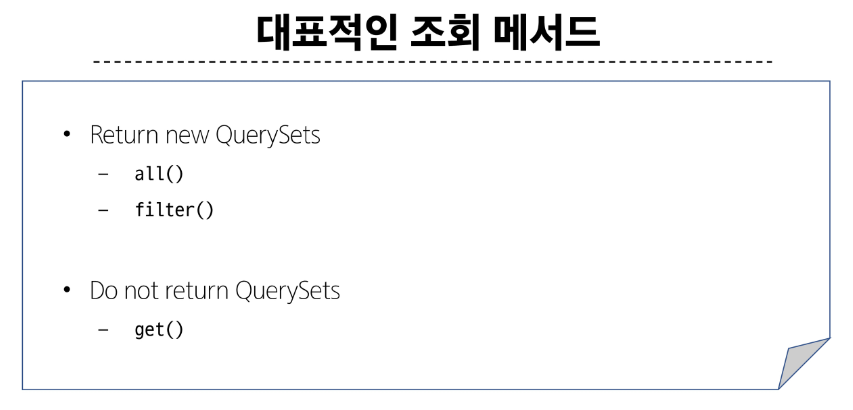


### all() : 전체 데이터 조회

### filter() : 특정 조건 데이터 조회

### get() : 단일 데이터 조회

-----

### get() 특징

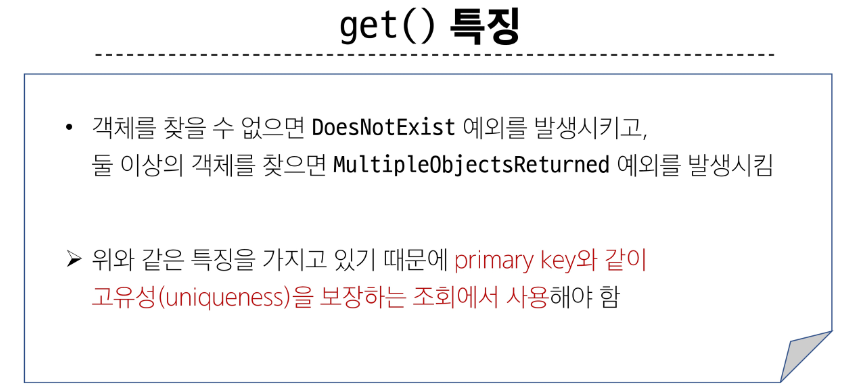

<br>

### 조회 방법

```
garage = Garage.objects.filter(is_parking_avaliable='True')
>>> for i in garage:
...     print(i.location)
```

<br>

## 3-3. Update (수정)

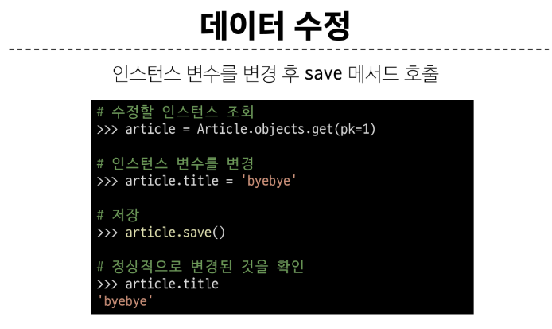

<br>

### 3-4. Delete (삭제)

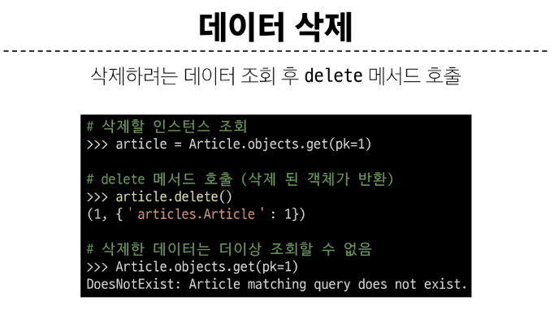

&nbsp;

## 참고

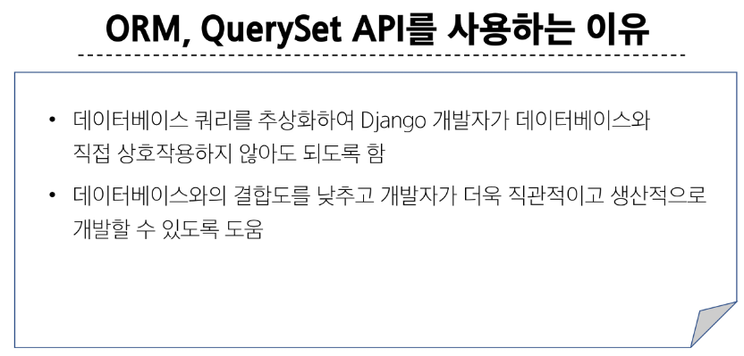

### QuerySet API 관련 문서

- https://docs.djangoproject.com/en/4.2/ref/models/querysets/

- https://docs.djangoproject.com/en/4.2/topics/db/queries/