# 목차

1. Read

2. Create

3. HTTP request methods

4. Delete

5. Update

 

#### Django shell 에서 연습했던 QuerySet API를 직접 view 함수에서 사용하기

# 1. Read

- (1) 전체 게시글 조회  

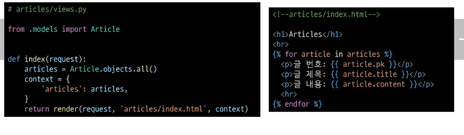

- (2) 단일 게시글 조회
  - detail

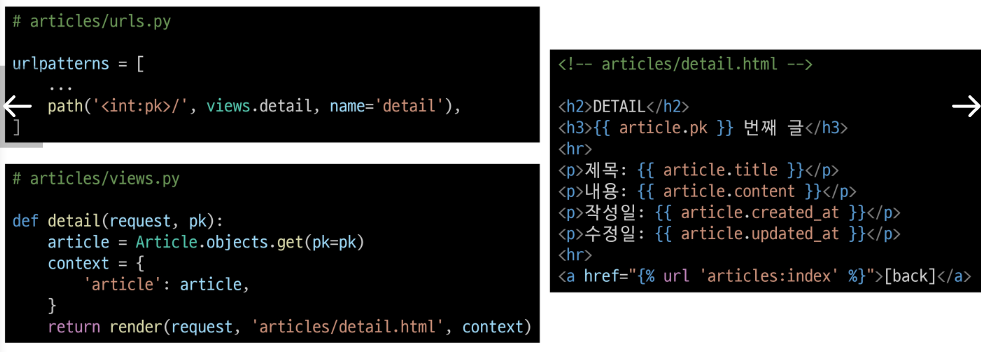
  
전체 게시글에서 조회에서 단일 게시글로 조회  

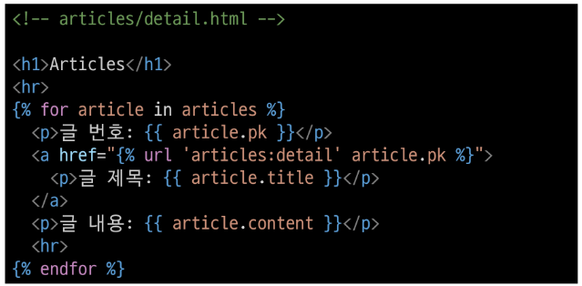

&nbsp;

# 2. Create

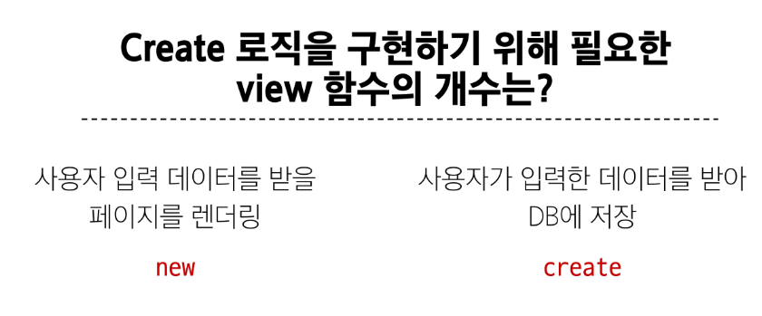

### new 기능 구현

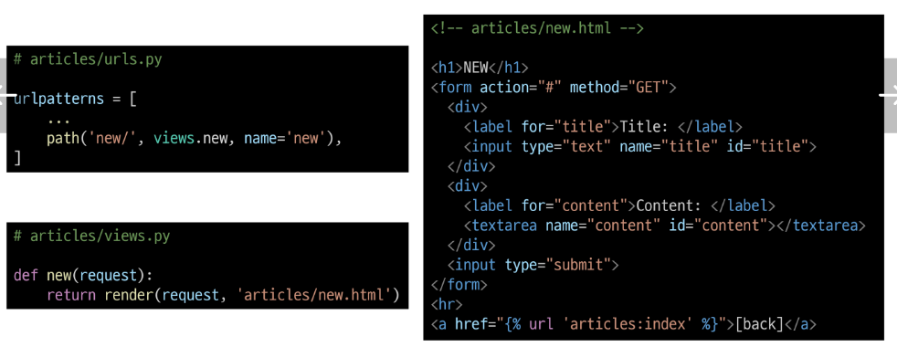

### create 기능 구현

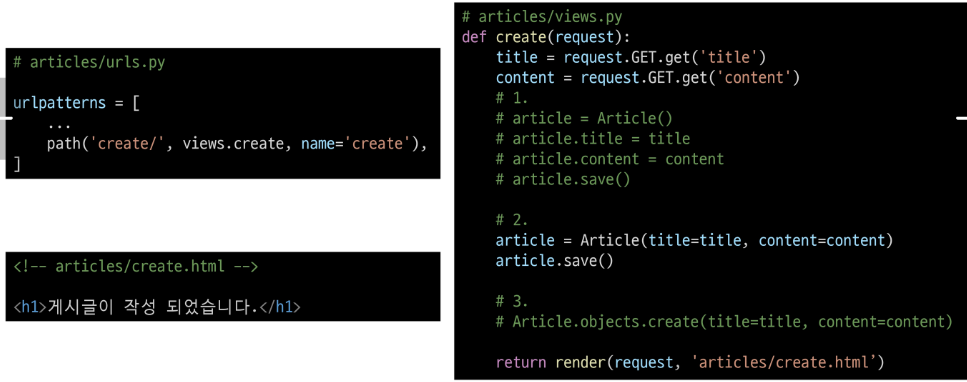

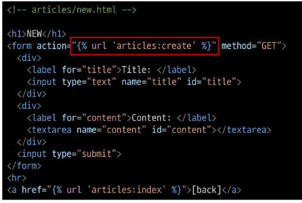

&nbsp;

# 3. HTTP request methods

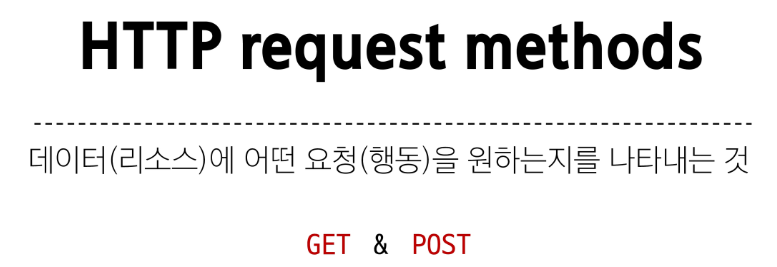

#### HTTP : 네트워크 상에서 데이터를 주고 받기 위한 약속

 

### 'GET' Method

- 특정 리소스를 **조회**하는 요청  
  - (데이터를 전달할 때 URL에서 Query String 형식으로 보내짐)
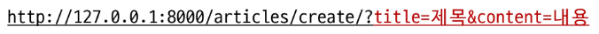

### 'POST' Method

- 특정 리소스에 **변경(생성, 수정, 삭제)을 요구하는** 요청  
  - (데이터를 전달할 때 HTTP Body에 담겨 보내짐)  
  
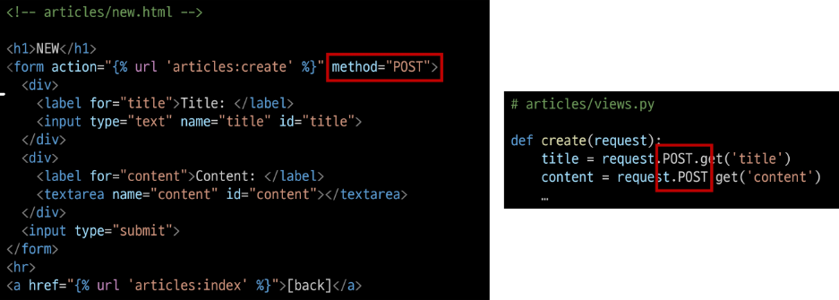

 

### HTTP response status code

- 특정 HTTP 요청이 성공적으로 완료되었는지를 3자리 숫자로 표현하기로 약속한 것  
  
### 403 Forbidden

- 서버에 요청이 전달되었지만, **권한** 때문에 거절되었다는 것을 의미
  
-> CSRF token이 누락되었다는 응답이 옴

### CSRF  Cross - Site - Request - Forgery

- 사이트 간 요청 위조

  - 사용자가 자신의 의지와 무관하게 공격자가 의도한 행동을 하여 특정 웹 페이지를 보안에 취약하게 하거나 수정, 삭제 등의 작업을 하게 만드는 공격 방법

- CSRF Token

    - DTL의 csrf_token 태그를 사용해 손쉽게 사용자에게 토큰 값 부여 가능

    - 요청 시 토큰 값도 함께 서버로 전송될 수 있도록 하는것

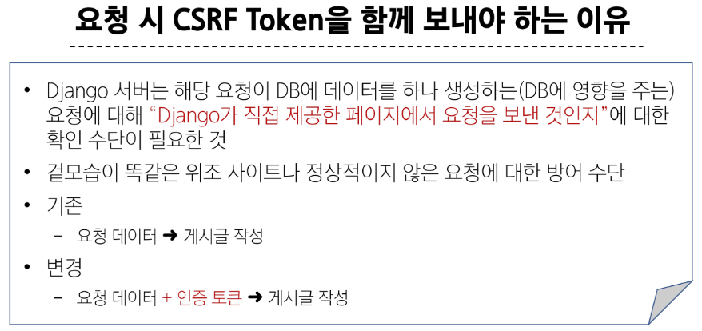
  
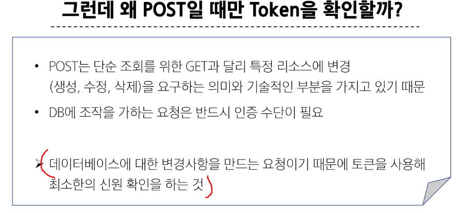
  
더 이상 URL에 Query String 형태로 보냈던 데이터가 표기되지 않음

 

### redirect

- 클라이언트가 인자에 작성된 주소로 다시 요청을 보내도록 하는 함수

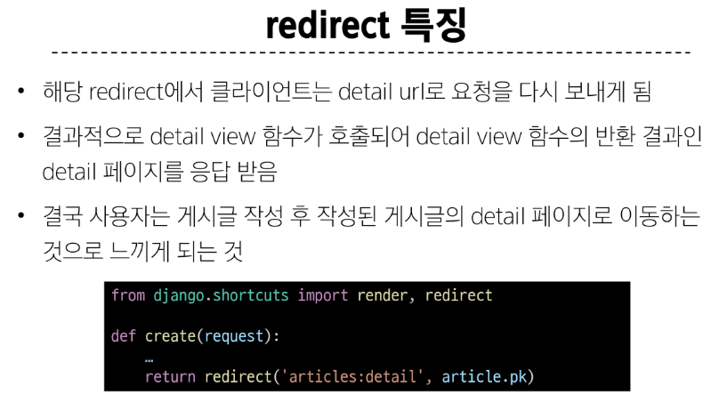

### render와 redirect 차이

render 는 템플릿을 불러오고, redirect 는 URL로 이동합니다. URL 로 이동한다는 건 그 URL 에 맞는 views 가 다시 실행될테고 여기서 render 를 할지 다시 redirect 할지 결정할 것 입니다. 이 점에 유의해서 사용하신다면 상황에 맞게 사용하실 수 있을 겁니다.

&nbsp;

# 4. Delete

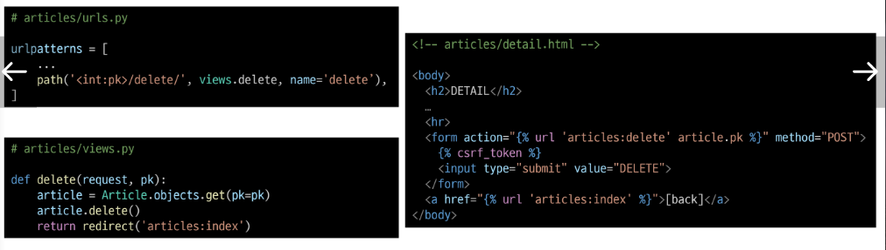

&nbsp;

# 5. Update

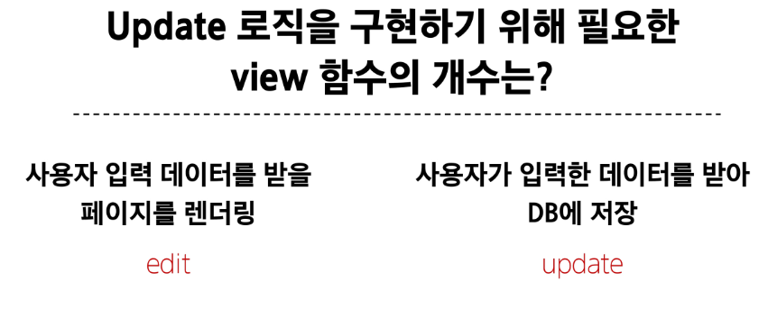

edit -> update  
수정 페이지에서 수정 후 update url로 보내 변경사항 update

### edit 기능 구현

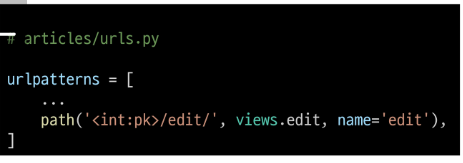
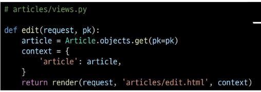

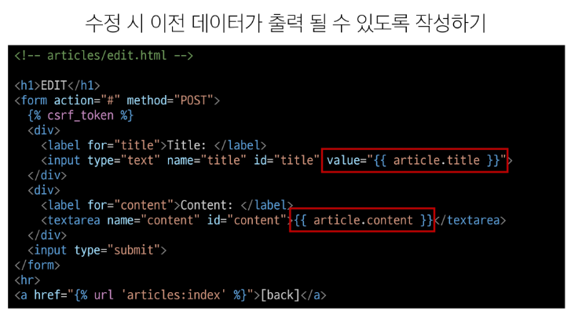

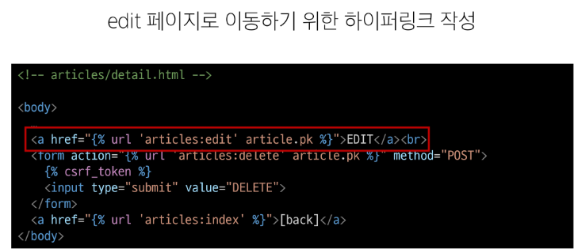

### update 기능 구현
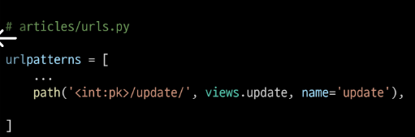
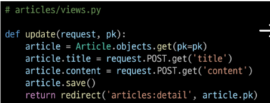

&nbsp;

## 참고
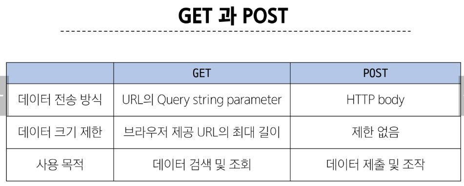