# 목차
1. Django Form
    - Form Class

    - Widgets

 

2. Django ModelForm

 

3. Handing HTTP requests
    - View 함수 구조 변화

&nbsp;

## 1. Django Form
지금까지 사용자로부터 데이터를 받기 위해 활용한 방법  
But, 비정상적 혹은 악의적인 요청을 필터링 할 수 없다!
> 유요한 데이터인지에 대한 확인이 필요

  
### 유효성 검사
수집한 데이터가 정확하고 유효한지 확인하는 과정
  
Django가 제공하는 Form을 사용하여 구현!

 

## 1-1. Form Class
### Django Form
사용자 입력 데이터를 수집하고, 처리 및 유효성 검사를 수행하기 위한 도구
> 유효성 검사를 단순화하고 자동화 할 수 있는 기능을 제공

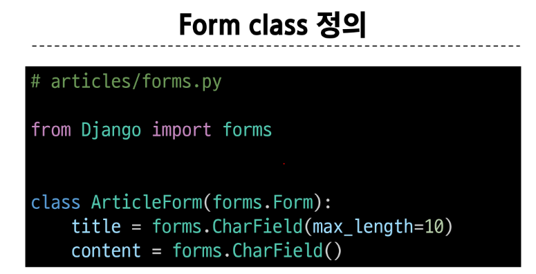

 

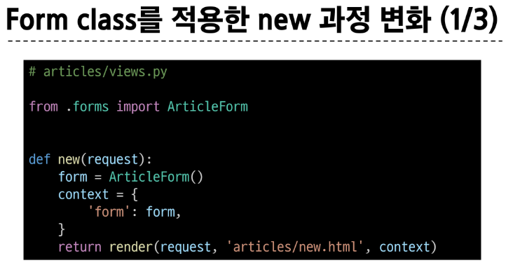

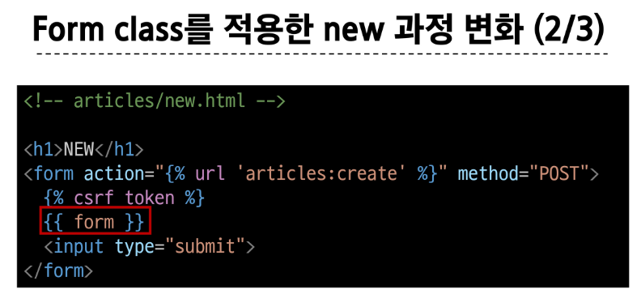

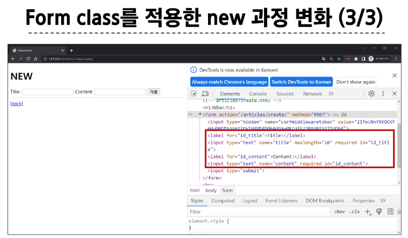

#### Form rendering options
label, input 쌍을 특정 HTML 태그로 감싸는 옵션

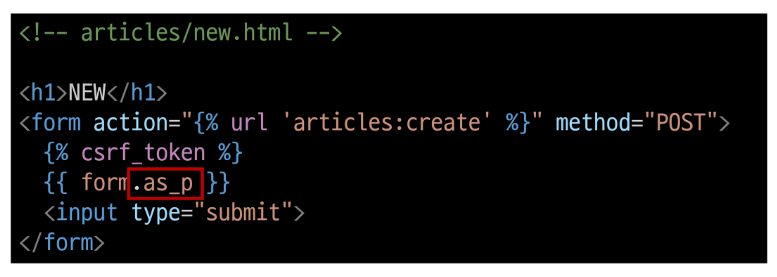

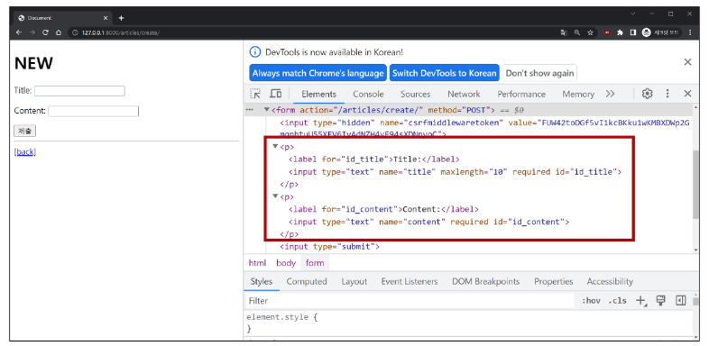

 

## 1-2. Widgets
HTML 'input' element의 '표현'을 담당

> 단순히 input 요소의 속성 및 출력되는 부분을 변경하는 것
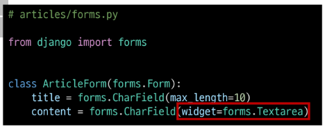

&nbsp;

## 2. Django ModelForm
- Form : 사용자 입력 데이터를 DB에 저장하지 않을 때 (ex. 로그인)

- ModelForm : 사용자 입력 데이터를 DB에 저장해야 할 때 (ex. 게시글 작성, 회원가입)

 

### ModelForm
Model과 연결된 Form을 자동으로 생성해주는 기능을 제공
> Form + Model 

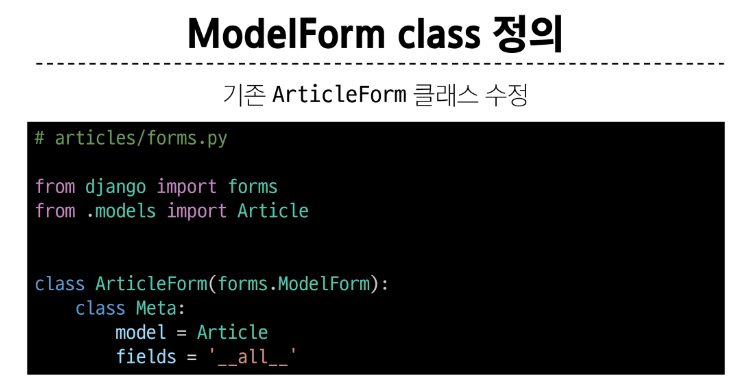

 
  
### Meta class
ModelForm의 정보를 작성하는 곳

 

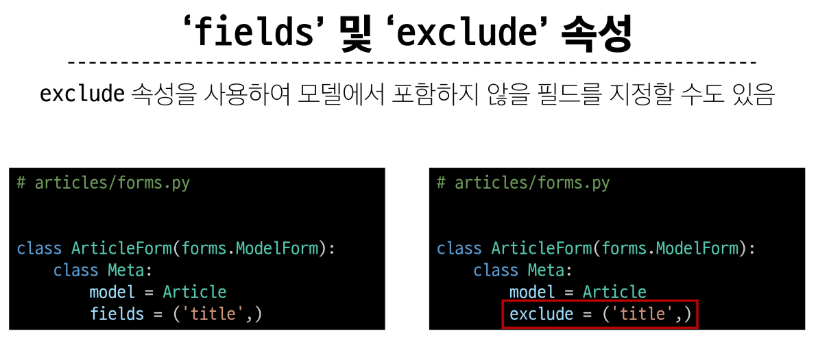

 

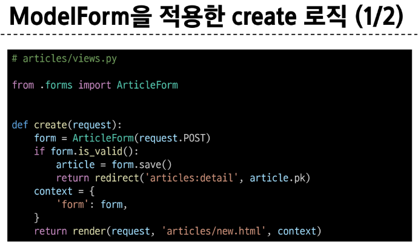
  
input에 공백이나 문자 길이를 제한 이상보다 넣을 시 "에러 메세지 출력"  
> 유효성 검사의 결과

 

### is_valid()
여러 유효성 검사를 실행하고, 데이터가 유효한지 여부를 Boolean으로 반환

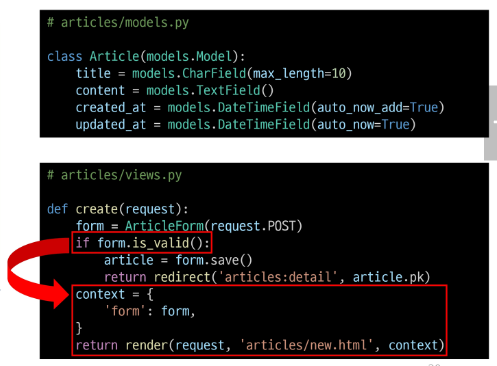

 

### ModelForm을 적용한 edit 로직

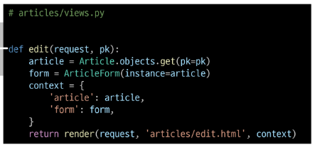

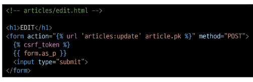

 

### ModelForm을 적용한 update 로직
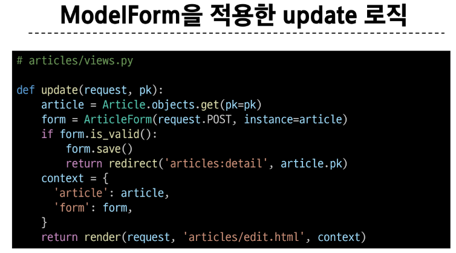

 

### save()
데이터베이스 객체를 만들고 저장
  
- 생성과 수정을 구분하는 법
    > 키워드 인자 **instance** 여부를 통해 생성할 지, 수정할 지를 결정

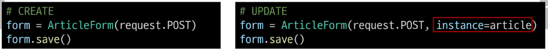

 

~~~~
- Django Form 정리 -

"사용자로부터 데이터를 수집하고 처리하기 위한 강력하고 유연한 도구"

HTML form의 생성, 데이터 유효성 검사 및 처리를 쉽게 할 수 있도록 도움
~~~~

&nbsp;

## 3. Handling HTTP requests
### view 함수 구조 변화
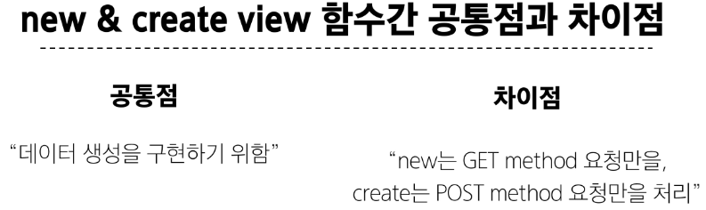

 

#### HTTP request  method 차이점을 활용해 동일한 목적을 가지는 2개의 view 함수를 하나로 구조화

 

### new & create 함수 결합

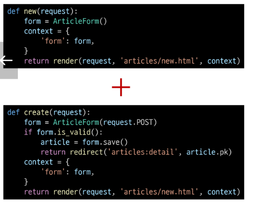

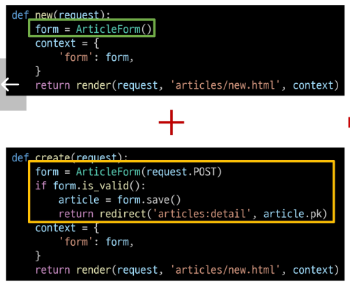

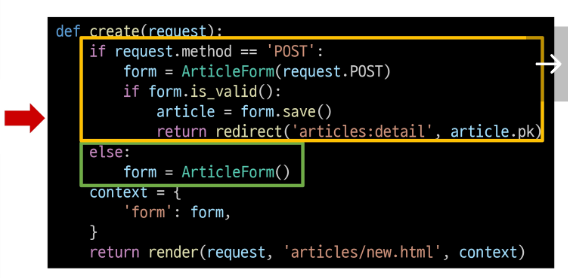

 

### 새로운 create view 함수
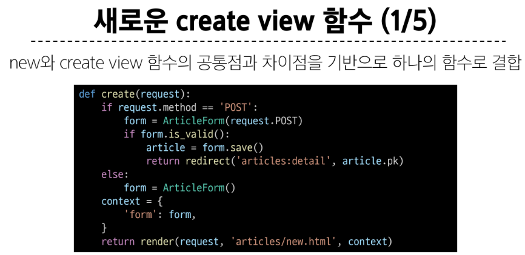

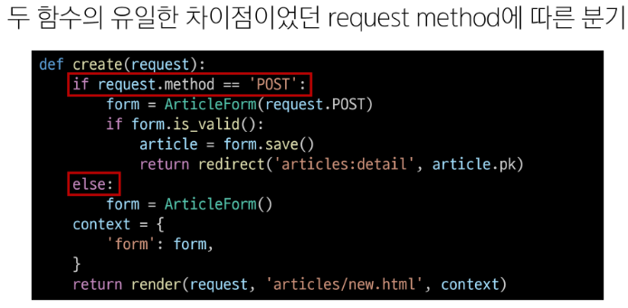

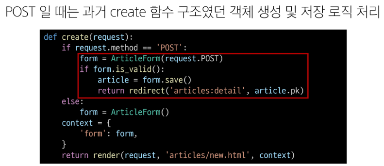

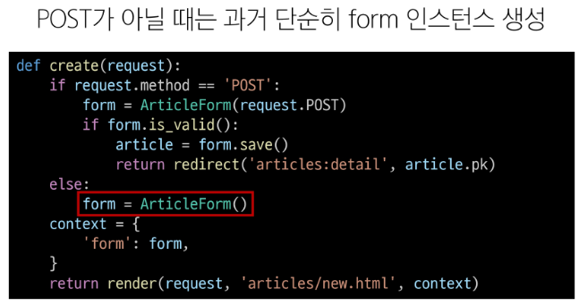

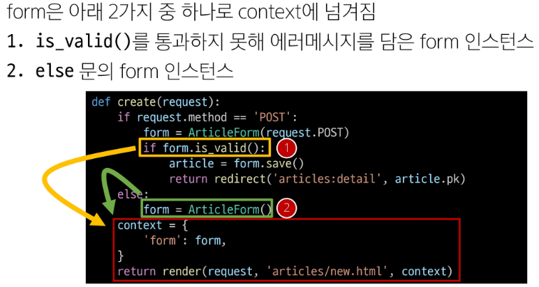

#### 기존 new 관련 코드 수정
1. views에서 new url 제거

2. new url을 create url로 변경  
index.html, create.html에서 new url을 create url로 변경

3. new 템플릿을 create 템플릿으로 변경
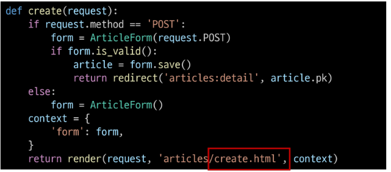

 

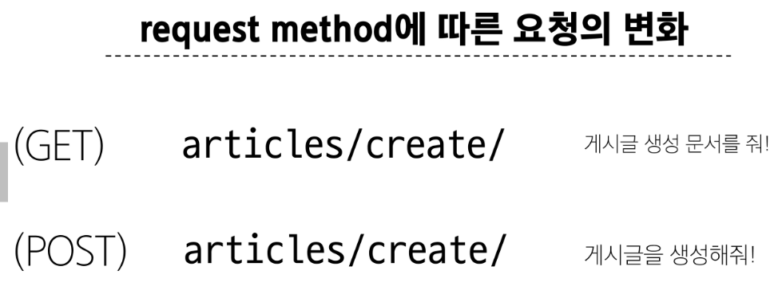

 

### 새로운 update view 함수
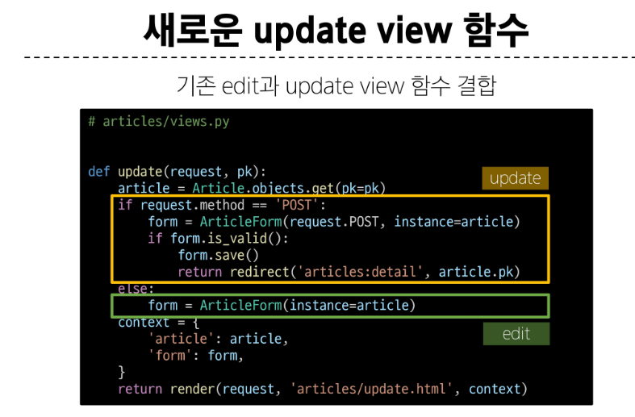

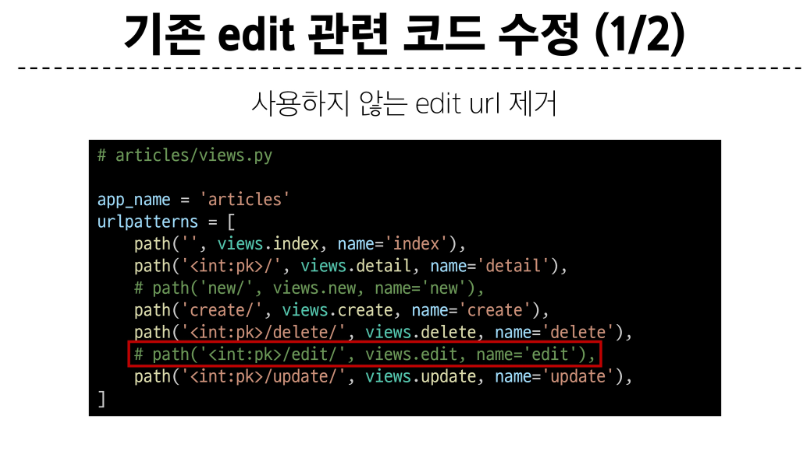

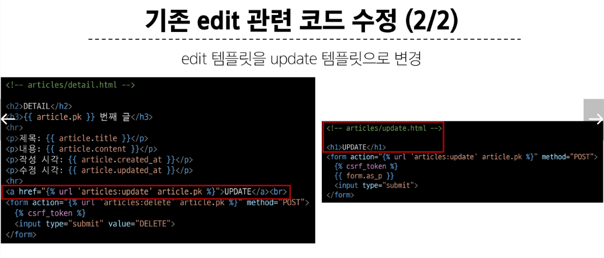

&nbsp;

### 참고 - forms.py
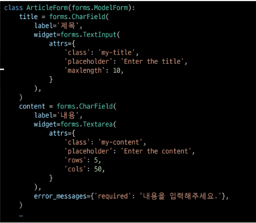
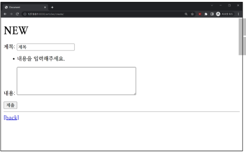