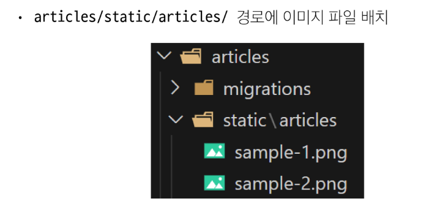
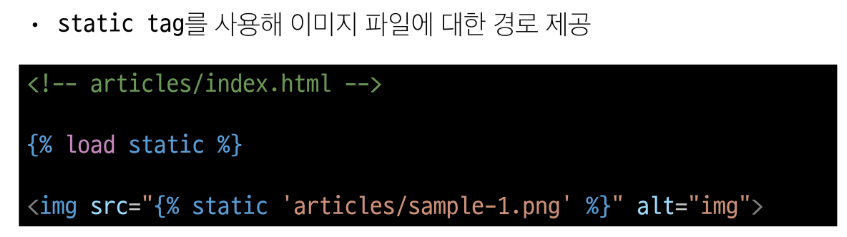
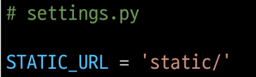
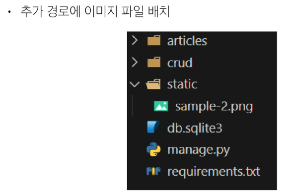
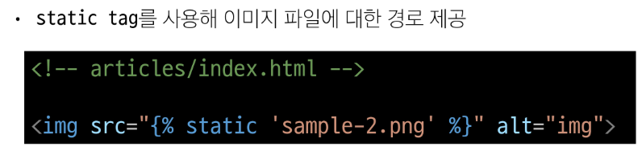
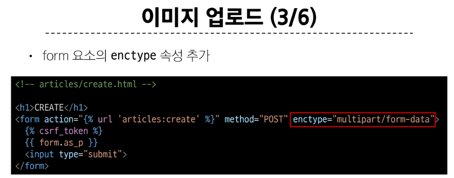
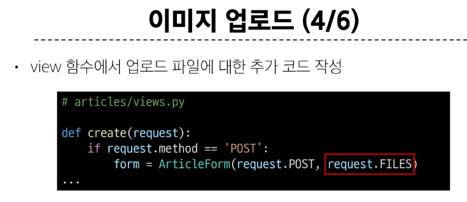
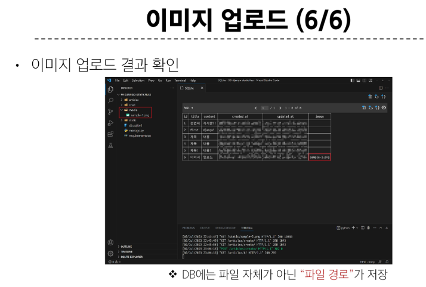
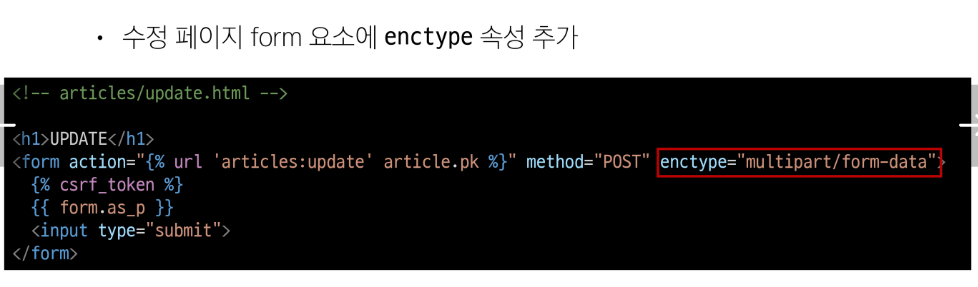
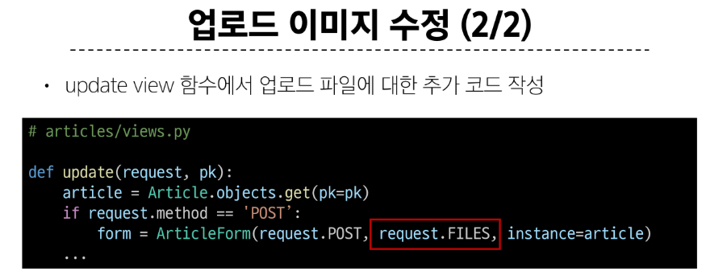

# 목차

1. Static files
    - Static files 제공하기

 

2. Media files
    - 이미지 업로드

    - 업로드 이미지 제공

&nbsp;

`   ## 1. Static Files - 정적 파일

서버 측에서 변경되지 않고 고정적으로 제공되는 파일 (이미지, JS, CSS 파일 등)

- 웹 서버의 기본 동작은 **특정 위치(URL)에 있는 자원**을 요청(HTTP request) 받아서 응답 (HTTP response)을 처리하고 제공하는 것

- **정적 파일을 제공하기 위한 경로 (URL)**이 있어야 함

 

## 1-1. Static files 제공하기

- 1. 기본 경로에서 제공
  - app폴더/static/app폴더

### STATIC_URL

- 기본 경로 및 추가 경로에 위치한 정적 파일을 참조하기 위한 URL

  - 실제 파일이나 디렉토리가 아니며, URL로만 존재

 

- 2. 추가 경로에서 제공

    - STATICFILES_DIRS에 문자열 값으로 추가 경로 설정

### STATICFILES_DIRS

- 정적 파일의 기본 경로 외에 추가적인 경로 목록을 정의하는 리스트

#### 정적 파일을 제공하려면 요청에 응답하기 위한 URL이 필요!!

extends 주의사항 2가지

1. 맨 위에 있어야함

2. 한 페이지에 한번만 가능.

load -> 부모에서 load 하면 자식들도 다 load 된다.

&nbsp;

## 2. Media files

사용자가 웹에서 업로드 하는 정적 파일 (user-uploaded)

### ImageField()

이미지 업로드에 사용하는 모델 필드
> 이미지 객체가 직접 저장되는 것이 아닌 **이미지 파일의 경로**가 문자열로 DB에 저장

 

### MEDIA_ROOT

실제 미디어 파일들이 위치하는 디렉토리의 절대 경로

~~~~python
# settings.py

MEDIA_ROOT = BASE_DIR / 'media'

~~~~
  
  

### MEDIA_URL

MEDIA_ROOT에서 제공되는 미디어 파일에 대한 주소를 생성  
(STATIC_URL과 동일한 역할)

~~~~python
# settings.py

MEDIA_URL = 'media/'

~~~~

### 이미지 업로드

 

form은 텍스트 형태만 가능 -> 속성을 추가해줘야함!

같은 이미지를 추가하더라도 장고가 알아서 바꿔서 충돌하지 않음

### 업로드 이미지 제공하기

 

### 업로드 이미지 수정

 

## 참고

