# 목차

1. Cookie & Session

    - 쿠키

2. Authentication System

3. Custom User model

    - User Model 대체하기

4. Login & Logout

5. Template with Authentication data

    - 템플릿과 인증 데이터

&nbsp;

## 1. Cookie & Session

- 우리가 서버로부터 받은 페이지를 둘러볼 때, 우리는 서버와 서로 연결되어 있는 상태가 아니다.

### HTTP

- HTML 문서와 같은 리소스들을 가져올 수 있도록 해주는 규약

  - 웹(www)에서 이루어지는 모든 데이터 교환의 기초

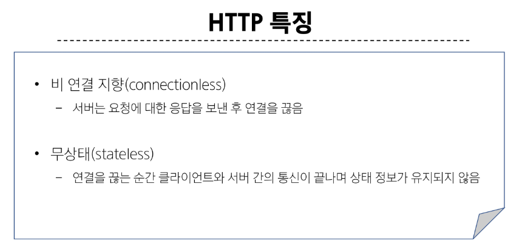

- 상태가 없다는 것은

  - 장바구니에 담은 상품 유지 불가능

  - 로그인 상태 유지 불가능

> 상태를 유지하기 위한 기술이 필요 -> 쿠키

&nbsp;

## 1-1. Cookie

- 서버가 사용자의 웹 브라우저에 전송하는 작은 데이터 조각

    - 클라이언트 측에서 저장되는 작은 데이터 파일이며, 사용자 인증, 추적, 상태 유지 등에 사용되는 데이터 저장 방식

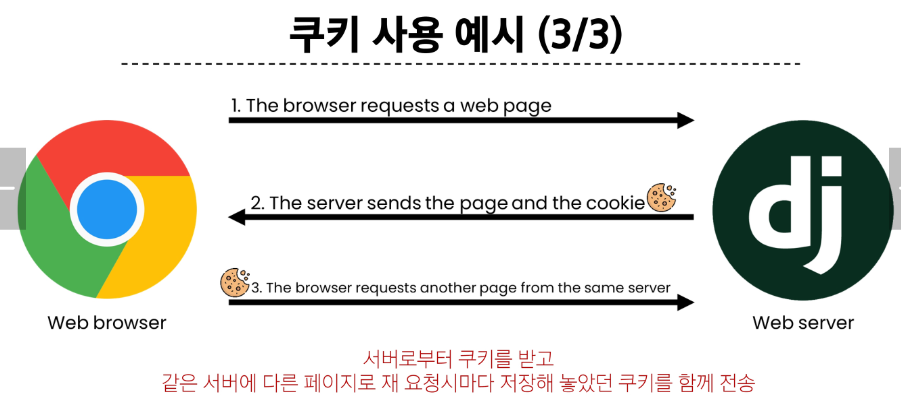

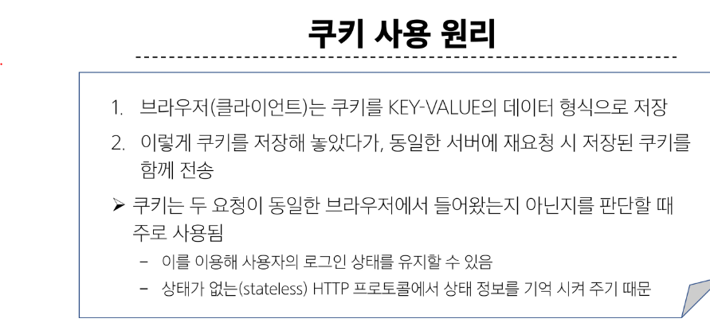

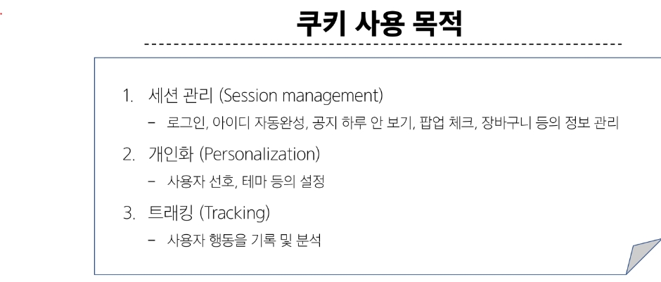

 

### Session

- 서버 측에서 생성되어 클라이언트와 서버 간의 상태를 유지.

- 상태 정보를 저장하는 데이터 저장 방식

    - 쿠키에 세션 데이터를 저장하여 매 요청시마다 세션 데이터를 함께 보냄

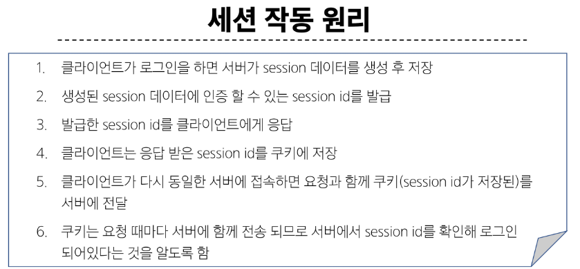
  
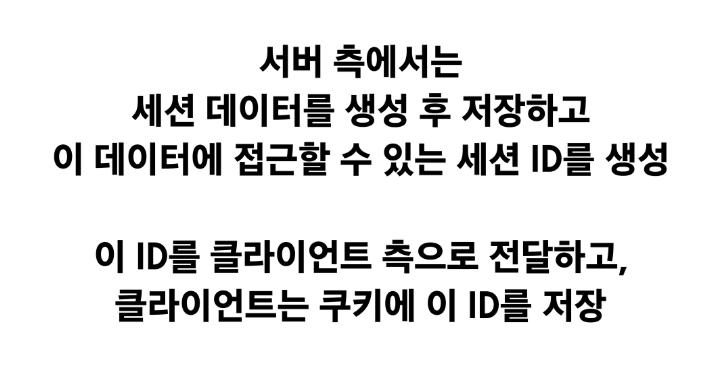
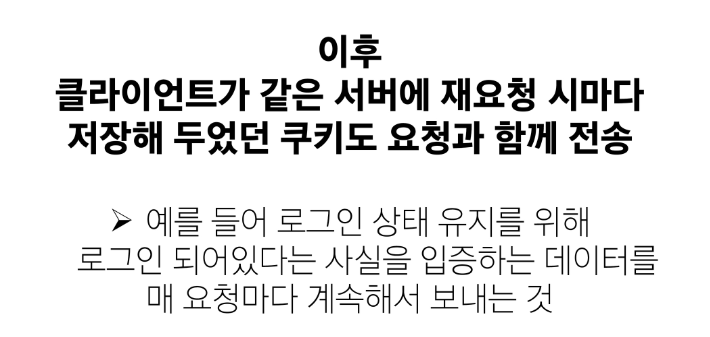

#### 쿠키와 세션의 목적 : 서버와 클라이언트 간의 '상태'를 유지

### 참고

1. Session cookie
    - 현재 세션이 종료되면 삭제됨

    - 브라우저 종료와 함께 세션이 삭제됨

2. Persistent cookies
    - Expires 속성에 지정된 날짜 혹은 Max-age 속성에 지정된 기간이 지나면 삭제됨

&nbsp;

## 2. Authentication System     (인증 시스템)

- 사용자 인증과 관련된 기능을 모아 놓은 시스템

### Authentication  (인증)

- 사용자가 자신이 누구인지 확인하는 것 (신원 확인)

### AuthenticationForm()

모델폼은 DB에 저장. form은 DB에 저장 x
하지만 로그인 인증에 사용할 데이터를 입력 받는 점은 같음.

view 1. 로그인 페이지 (GET)
view 2. 로그인 로직 진행 (POST)
-> 하나의 view 함수로 합칠 수 있음 (create 처럼)

쿠키와 세션을 통해 상태를 유지!

placeholder 속성을 통해 이름을 입력하라는 안내 메시지를 표시

&nbsp;

## 3. Custiom User model

### User model 대체하기

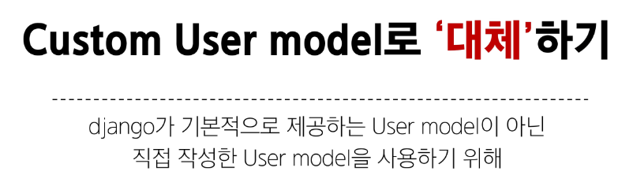

### User 클래스를 대체하는 이유

- 우리는 지금까지 별도의 User 클래스 정의 없이 내장된 auth 앱에 작성된 User 클래스를 사용했음

- 별도의 설정 없이 사용할 수 있어 간편하지만, 개발자가 **직접 수정할 수 없는 문제가 존재**

### 대체하기

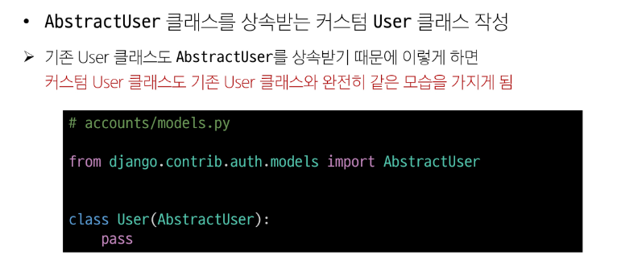

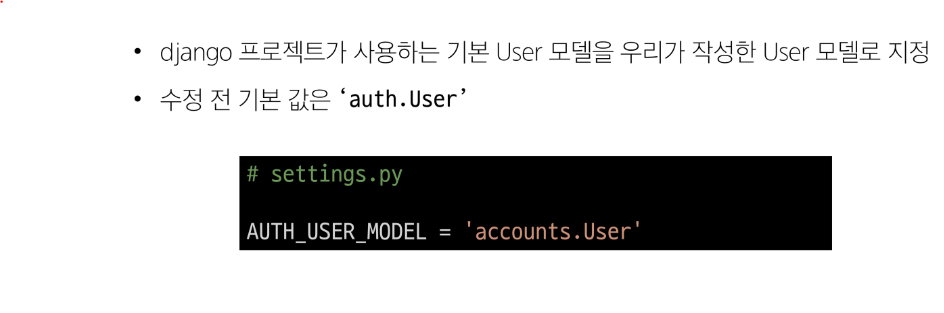

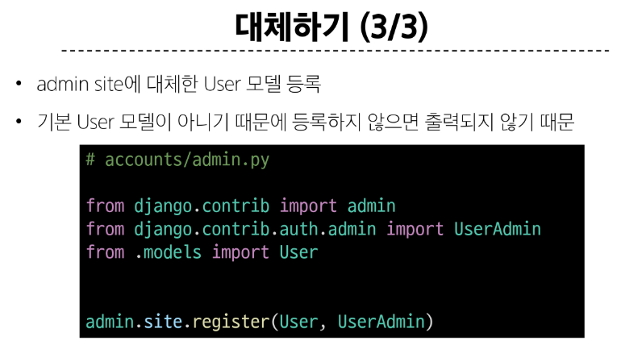

 

### AUTH_USER_MODEL

- Django 프로젝트의 User를 나타내는 데 사용하는 모델을 지정

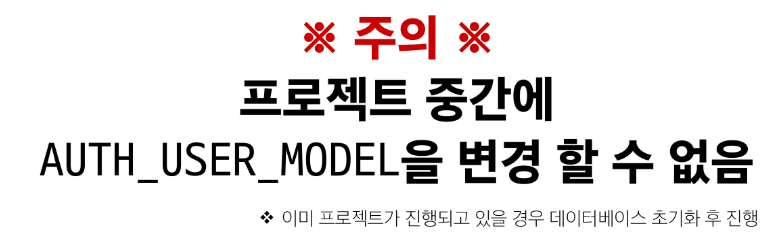
  
- Django는 새 프로젝트를 시작하는 경우 커스텀 User 모델을 설정하는 것을 강력하게 권장하고 있음

- 커스텀 User 모델은 기본 User 모델과 동일하게 작동 하면서도 **필요한 경우 나중에 맞춤 설정할 수 있기 때문**

    - 단, User 모델 대체 작업은 프로젝트의 모든 migration 혹은 첫 migrate를 실행하기 전에 이 작업을 마쳐야 함

&nbsp;

## 4. Login & Logout

- Login : Session을 Create하는 과정

- AuthenticationForm() : 로그인 인증에 사용할 데이터를 입력 받는 built-in form

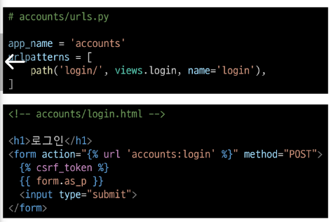

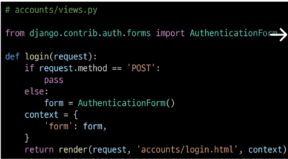
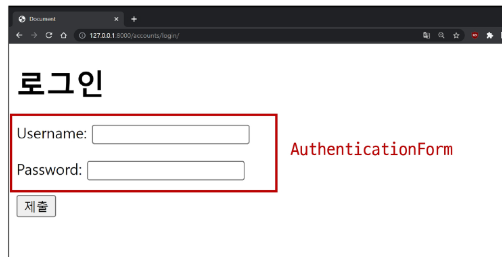

 

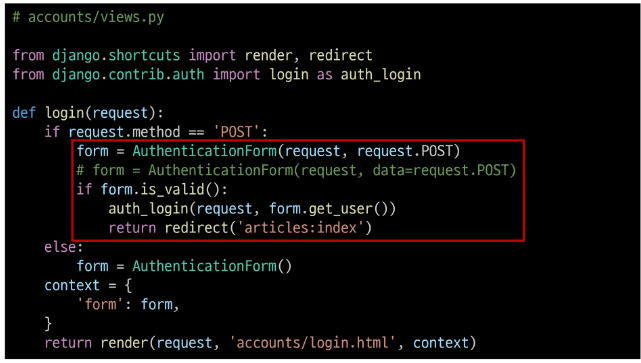

### login(request, user)

- AuthenticationForm을 통해 인증된 사용자를 로그인 하는 함수

### get_user()  -  AuthenticationForm의 인스턴스 메서드

- 유효성 검사를 통과했을 경우 로그인 한 사용자 객체를 반환

&nbsp;

- Logout : Session을 Delete하는 과정

- logout(request)

    - 현재 요청에 대한 Session Data를 DB에서 삭제. 클라이언트의 쿠키에서도 Session id를 삭제
  

### 로그아웃 로직 작성

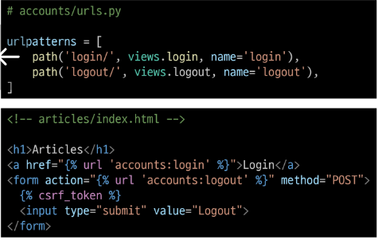

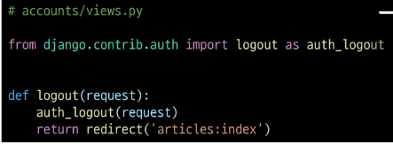

&nbsp;

## 5. Template with Authentication data

- 템플릿에서 인증 관련 데이터를 출력하는 방법

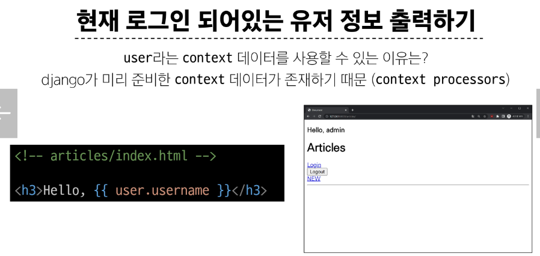

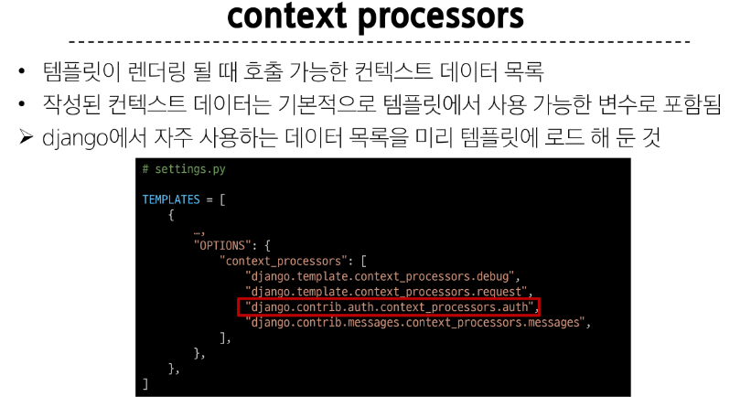

 

### 참고

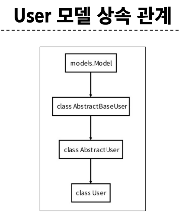

### 'AbstractUser' class

- 관리자 권한과 함께 완전한 기능을 가지고 있는 User model을 구현하는 추상 기본클래스

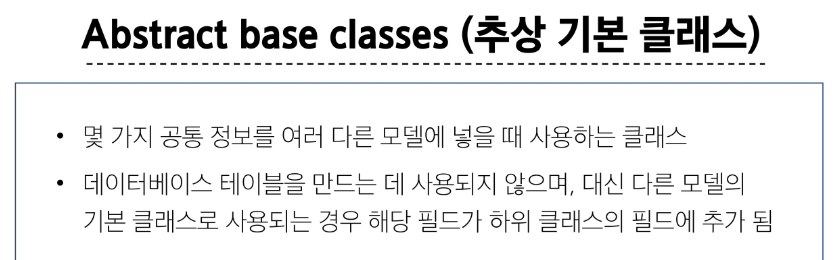