# 목차

1. 회원 가입

2. 회원 탈퇴

3. 회원정보 수정

4. 비밀번호 변경

5. 로그인 사용자에 대한 접근 제한

&nbsp;

### 강사님 수업
- 쿠키와 세션의 차이를 알아두기!! 면접에서 많이 물어봄

- Middleware : 반복되는거를 만들 때

- 데코레이터라는 개념은 장고에서 나온게 아닌 파이썬에서 나온 것

 

## 1. 회원 가입

- User 객체를 Create 하는 과정

 

### UserCreationForm()

- 회원 가입시 사용자 입력 데이터를 받는 built-in ModelForm

 

### 회원 가입 페이지 작성

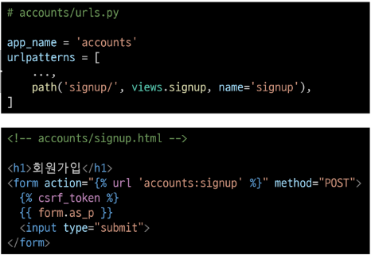
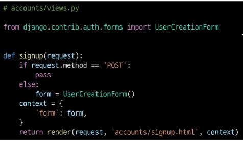
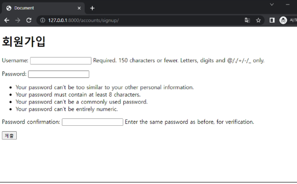

 

### 회원 가입 로직 작성
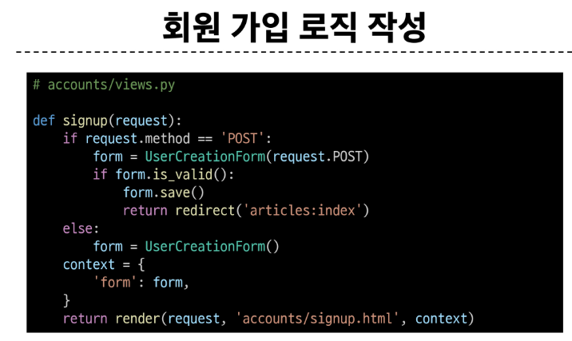
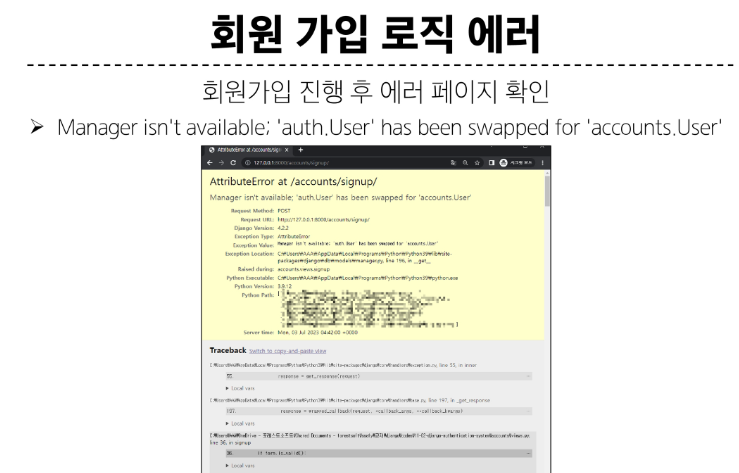
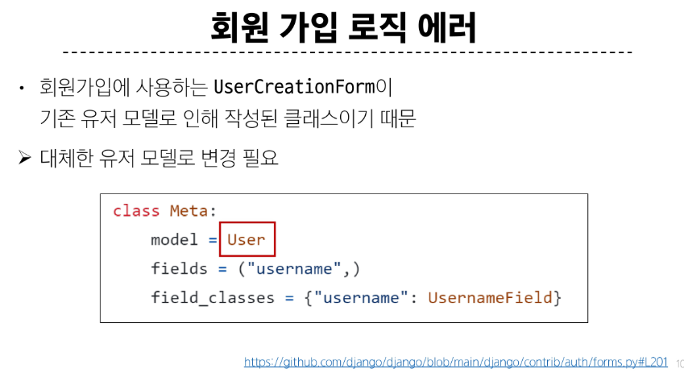

### 커스텀 유저 모델을 사용하려면 다시 작성해야 하는 Form

- UserCreationForm

- UserChangeForm

~~~~py
# 두 Form 모두

class Meta:
    model = User

# 가 작성된 Form
~~~~

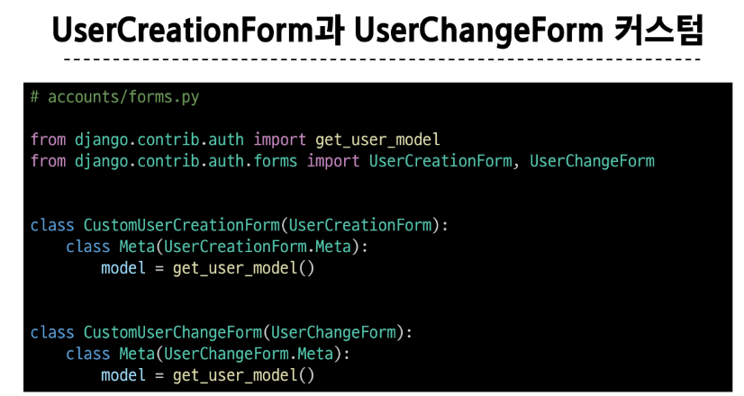

### get_user_model()

- "현재 프로젝트에서 활성화된 사용자 모델(active user model)" 을 반환하는 함수

 

### User 모델을 직접 참조하지 않는 이유

- get_user_model()을 사용해 User 모델을 참조하면 커스텀 User 모델을 자동으로 반환해주기 때문

- Django는 필수적으로 User 클래스를 직접 참조하는 대신 **get_user_model()**을 사용해 참조해야 한다고 강조하고 있음

 

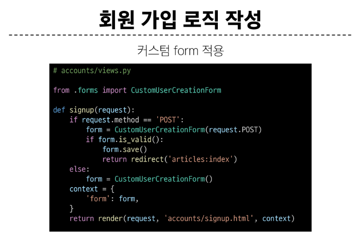

&nbsp;

## 2. 회원 탈퇴

- User 객체를 Delete 하는 과정

### 회원 탈퇴 로직 작성

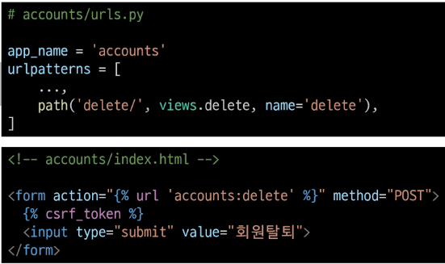

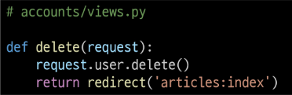

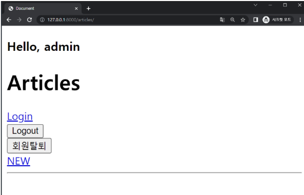

&nbsp;

## 3. 회원정보 수정

- User 객체를 Update 하는 과정

### UserChangeForm()

- 회원정보 수정 시 사용자 입력 데이터를 받는 built-in ModelForm

### 회원정보 수정 페이지 작성

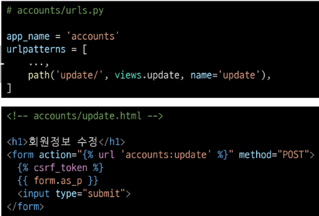

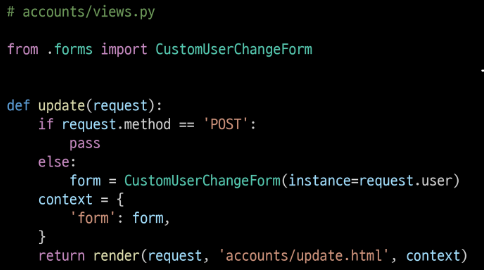

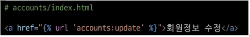

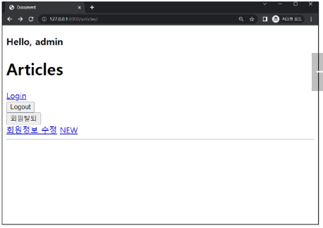

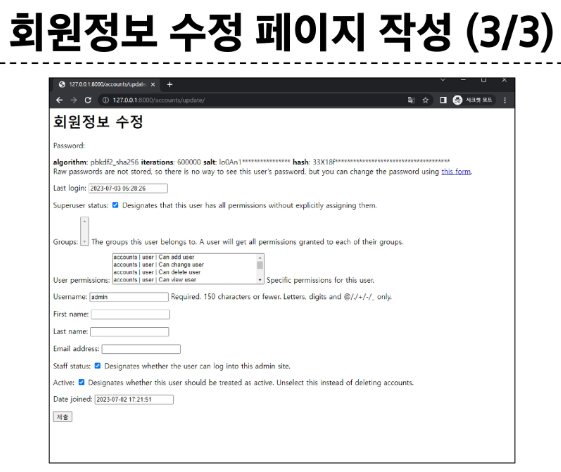

### UserChangeForm 사용 시 문제점

- User 모델의 모든 정보들(fields)까지 모두 출력되어 수정이 가능하기 때문에 일반 사용자들이 접근해서는 안되는 정보는 출력하지 않도록 해야 함

    - **CustomUserChangeForm** 에서 접근 가능한 필드를 다시 조정

### CustomUserChangeForm 출력 필드 재정의

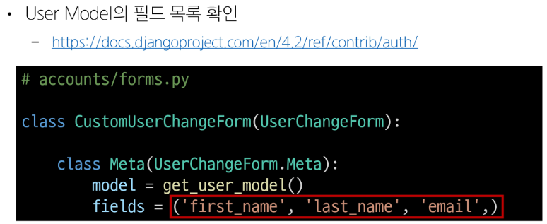

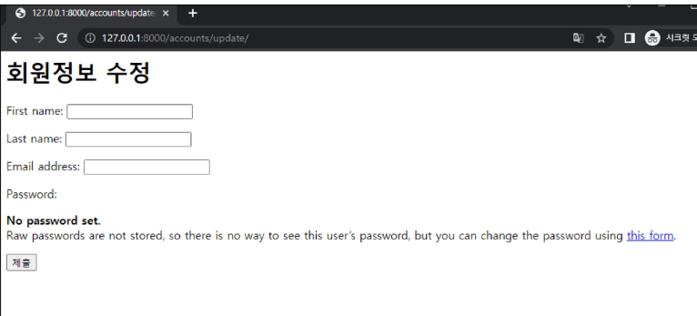

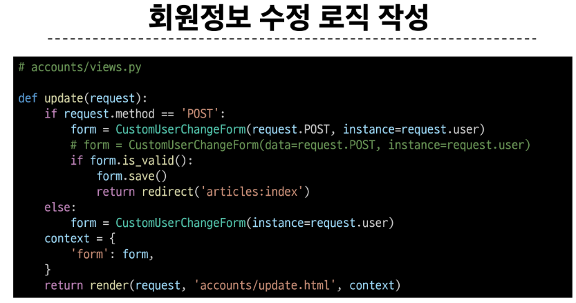

&nbsp;

## 4. 비밀번호 변경

- 인증된 사용자의 Session 데이터를 Update 하는 과정

 

### PasswordChangeForm()

- 비밀번호 변경 시 사용자 입력 데이터를 받는 built-in Form

 

### 비밀번호 변경
password 변경은 pjt url에서 작성해야함.
user id로 이동하기 때문

 

### 비밀번호 변경 페이지 작성

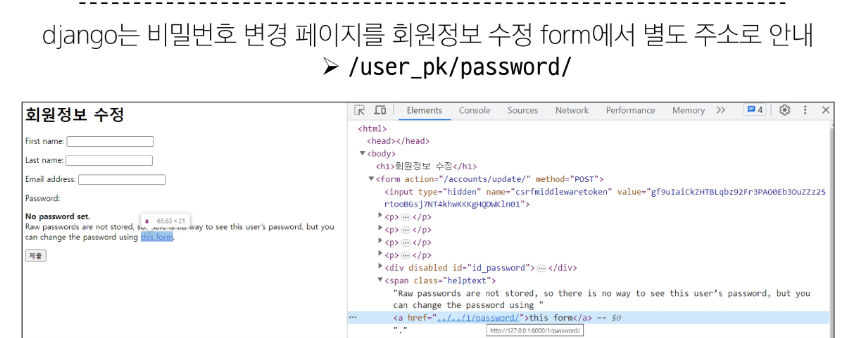

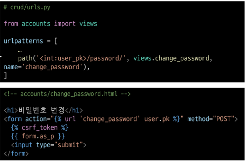

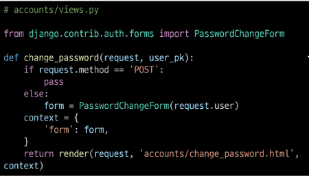

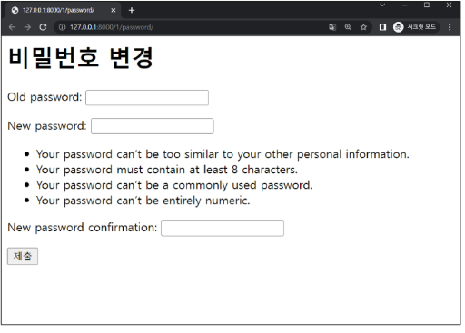

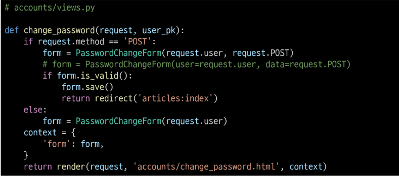

 

## 4-1. 세션 무효화 방지하기

### 암호 변경 시 세션 무효화

- 비밀번호가 변경되면 기존 세션과의 회원 인증 정보가 일치하지 않게 되어 버려 로그인 상태가 유지되지 못하고 로그아웃 처리됨

- 비밀번호가 변경되면서 기존 세션과의 회원 인증 정보가 일치하지 않기 때문

 

### update_session_auth_hash(request, user)

- 암호 변경 시 세션 무효화를 막아주는 함수

    - 암호가 변경되면 새로운 password의 Session Data로 기존 session을 자동으로 갱신

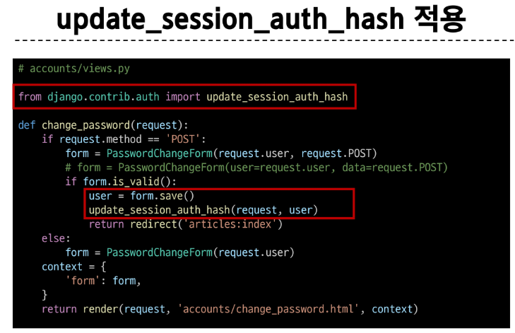

&nbsp;

## 5. 로그인(인증된) 사용자에 대한 접근 제한

### 로그인 사용자에 대해 접근을 제한하는 2가지 방법
1. is_authenticated  속성  (attribute)

2. login_required  데코레이터  (decorator)

 

### is_authenticated

- 사용자가 인증 되었는지 여부를 알 수 있는 User model의 속성

    - 모든 User 인스턴스에 대해 항상 True인 읽기 전용 속성이며, 비인증 사용자에 대해서는 항상 False

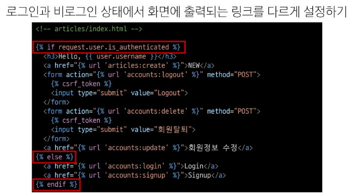

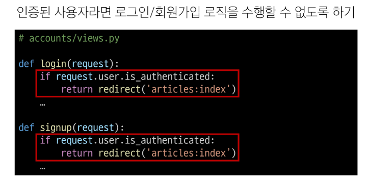

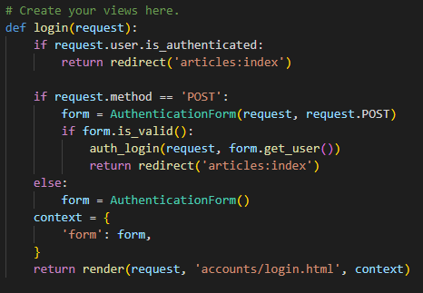

 

### login_required

- 인증된 사용자에 대해서만 view 함수를 실행시키는 데코레이터

    - 비인증 사용자의 경우 /accounts/login/ 주소로 redirect 시킴

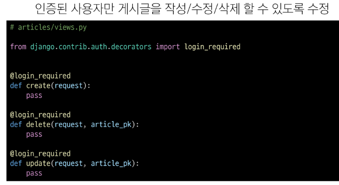

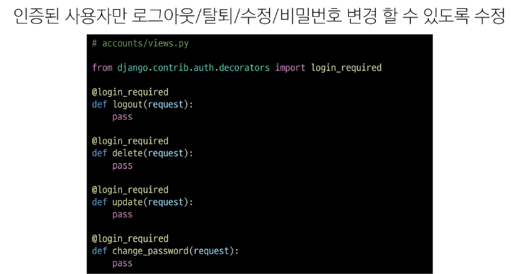

&nbsp;

## 참고
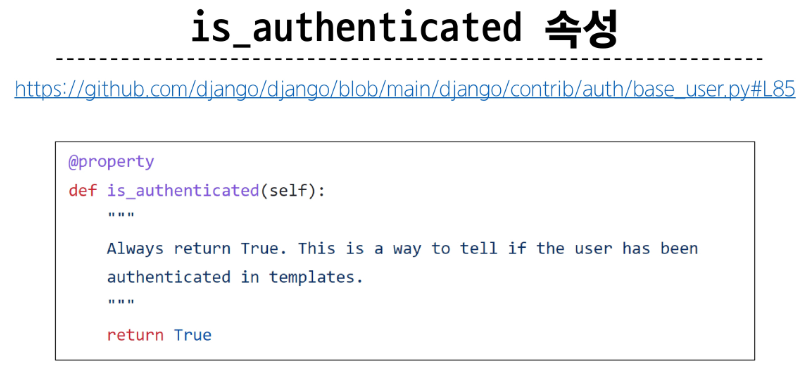

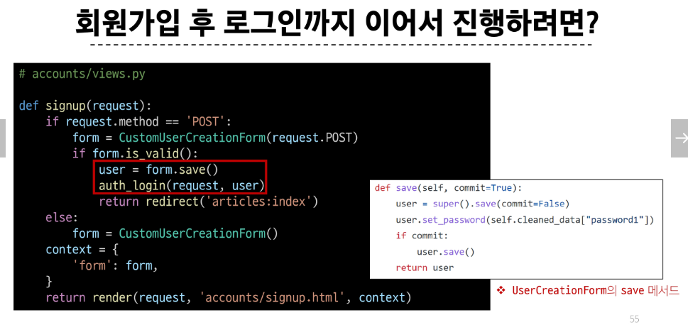

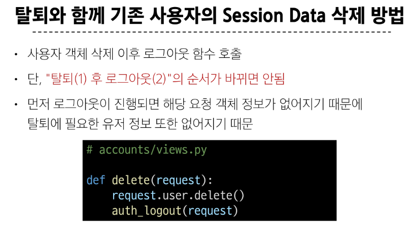

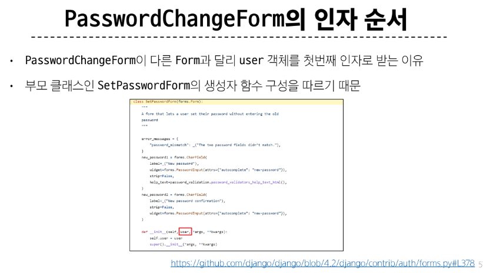

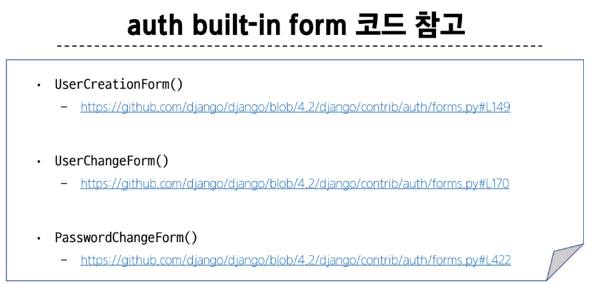