# 목차

- 1. History of JavaScript
    - 1-1. 웹 브라우저와 JavaScript
    - 1-2. ECMAScript

- 2. DOM
    - 2-1. document 객체

- 3. DOM 선택
    - 3-1. 선택 메서드

- 4. DOM 조작
    - 4-1. 속성 조작
    - 4-2. HTML 콘텐츠 조작
    - 4-3. DOM 요소 조작
    - 4-4. style 조작

&nbsp;

## 2. DOM - The Document Object Model

- 웹 페이지(Document)를 구조화된 객체로 제공하여 프로그래밍 언어가 페이지 구조에 접근할 수 있는 방법을 제공

    - 문서 구조, 스타일, 내용 등을 변경할 수 있도록 함!
 

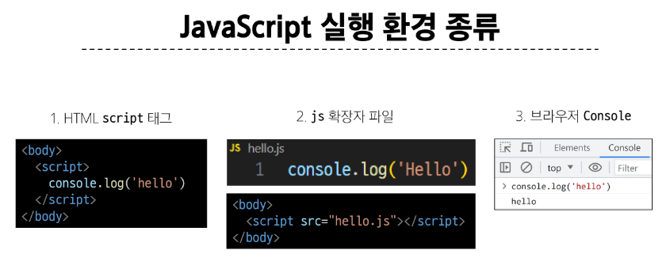

### DOM API

- 다른 프로그래밍 언어가 웹 페이지에 접근 및 조작 할 수 있도록 페이지 요소들을 객체 형태로 제공하며 이에 따른 메서드 또한 제공

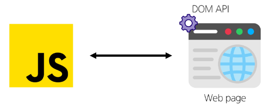

 

### DOM 특징

- DOM에서 모든 요소, 속성, 텍스트는 하나의 객체

- 모두 document 객체의 하위 객체로 구성됨
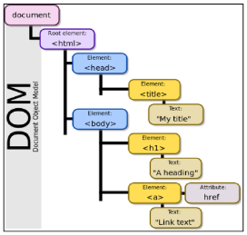

 

### DOM tree

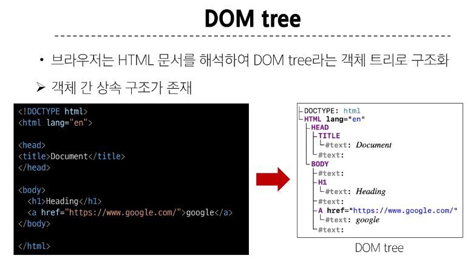

 

### DOM 핵심

- 문서의 요소들을 객체로 제공하여 다른 프로그래밍 언어에서 접근하고 조작할 수 있는 방법을 제공하는 API

&nbsp;

## 2-1. document 객체

- 웹 페이지 객체

- DOM Tree의 진입점

- 페이지를 구성하는 모든 객체 요소를 포함

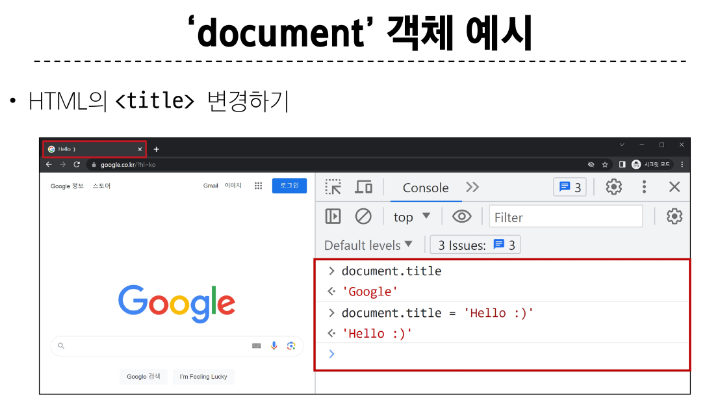

&nbsp;

## 3. DOM 선택

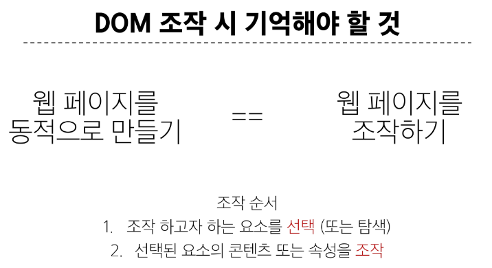

 

## 3-1. 선택 메서드

- document.querySelector()
    - 요소 한 개 선택

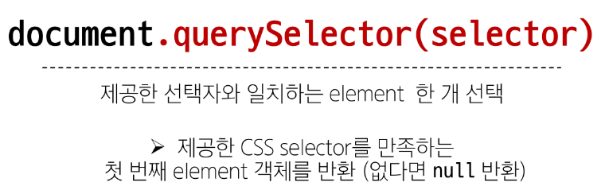

 

- document.querySelectorAll()
    - 요소 여러 개 선택

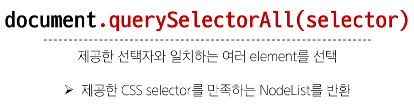

- Nodelist : 배열

&nbsp;

## 4. DOM 조작
- 1. 속성(attribute) 조작
    - 클래스 속성 조작
    - 일반 속성 조작

- 2. HTML 콘텐츠 조작

- 3. DOM 요소 조작

- 4. style 조작

 

## 4-1. 속성 조작
    
- 1. 클래스 속성 조작

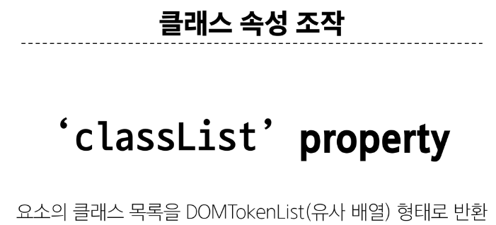
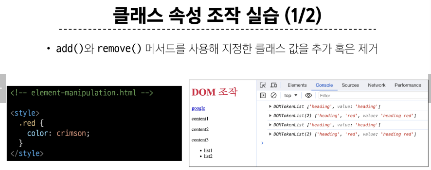
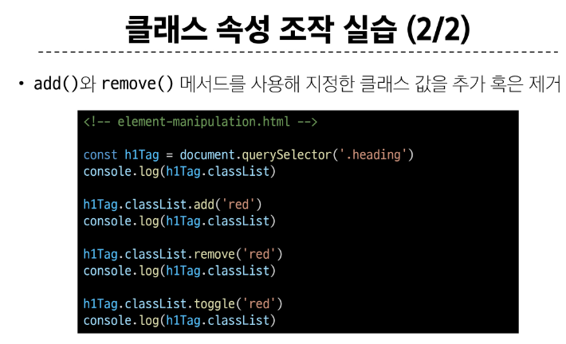

 

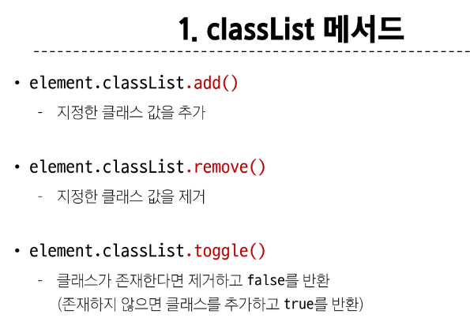

 

- 2. 일반 속성 조작

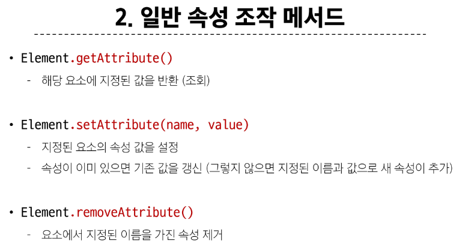
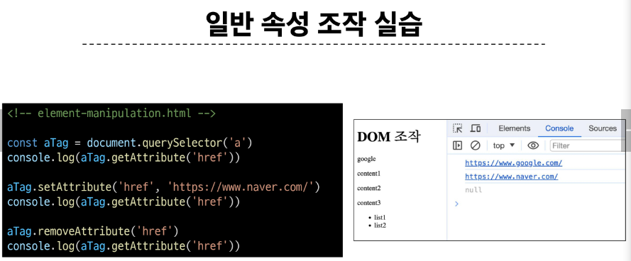

&nbsp;

## 4-2. HTML 콘텐츠 조작

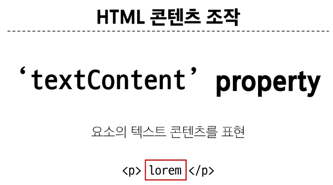
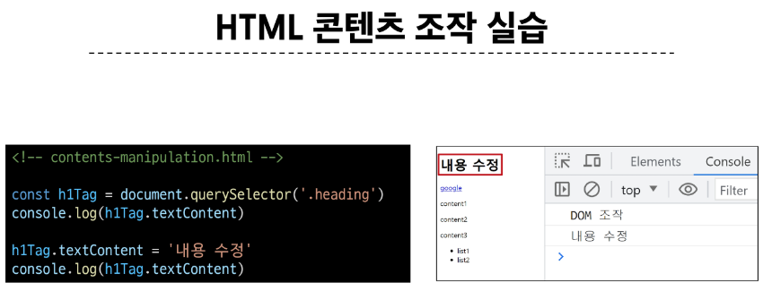

&nbsp;

## 4-3. DOM 요소 조작

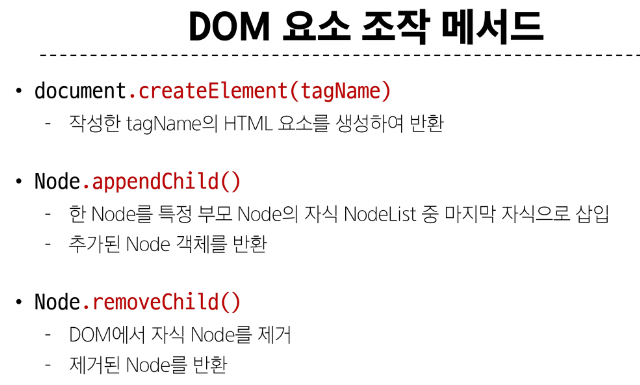
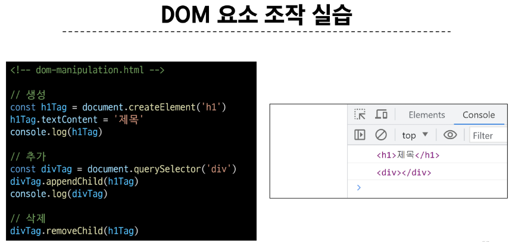

&nbsp;

## 4-4. style 조작

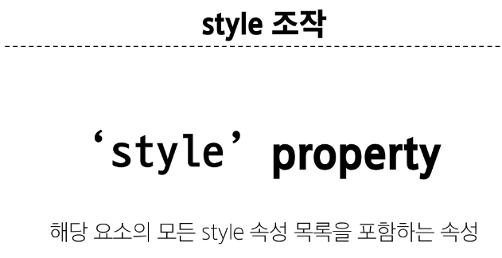
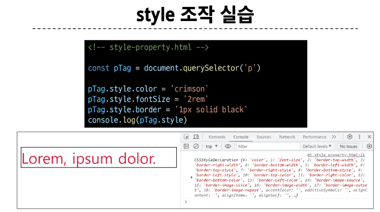

&nbsp;

### 참고

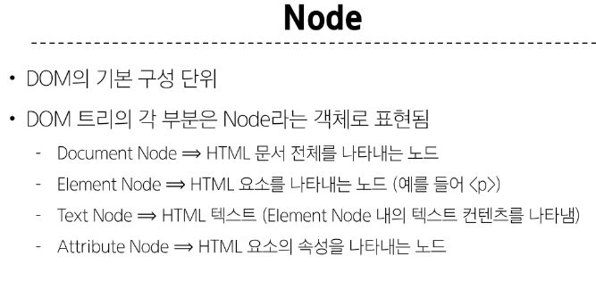
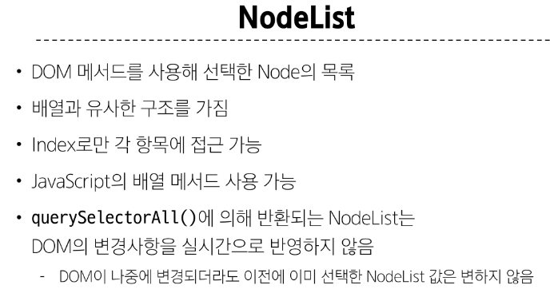
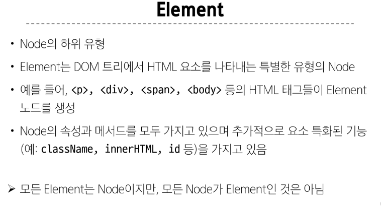
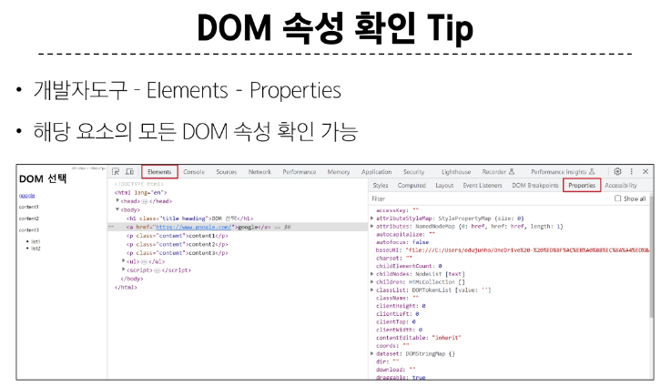
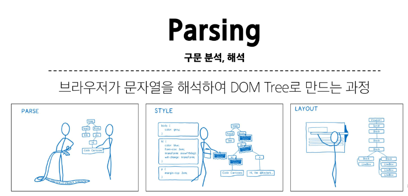

&nbsp;

CSS에서 선택자는 특정 요소를 선택하는 데 사용되는 패턴입니다. 여러 가지 종류의 선택자가 있으며, 각각의 종류는 다양한 방법으로 요소를 선택합니다. 일반적으로 사용되는 선택자 종류는 다음과 같습니다:

1. **요소 선택자 (Element Selector)**: HTML 요소의 이름을 사용하여 해당 요소를 선택합니다. 예를 들어, `p`는 모든 `
` 요소를 선택합니다.

2. **클래스 선택자 (Class Selector)**: CSS 클래스 이름을 사용하여 특정 클래스를 가진 요소를 선택합니다. 예를 들어, `.classname`은 `class="classname"`인 모든 요소를 선택합니다.

3. **ID 선택자 (ID Selector)**: HTML 요소의 고유한 ID를 사용하여 해당 요소를 선택합니다. 예를 들어, `#idname`은 `id="idname"`인 요소를 선택합니다.

4. **그룹 선택자 (Grouping Selector)**: 여러 선택자를 쉼표로 구분하여 하나의 선택자 그룹으로 묶어 해당하는 모든 요소를 선택합니다.

5. **자손 선택자 (Descendant Selector)**: 특정 요소의 하위 요소를 선택합니다. 예를 들어, `ancestor descendant`는 ancestor 요소의 하위 요소인 descendant를 선택합니다.

6. **자식 선택자 (Child Selector)**: 특정 요소의 직계 자식 요소를 선택합니다. 예를 들어, `parent > child`는 parent 요소의 직계 자식인 child를 선택합니다.

7. **인접 형제 선택자 (Adjacent Sibling Selector)**: 특정 요소의 다음에 바로 인접한 형제 요소를 선택합니다.

8. **일반 형제 선택자 (General Sibling Selector)**: 특정 요소의 다음에 오는 모든 형제 요소를 선택합니다.

이것들은 CSS에서 주요하게 사용되는 선택자의 일부입니다. 선택자를 조합하여 요소를 정확하게 선택할 수 있습니다.