# 목차

- 1. 함수
    - 1-1. 함수 정의
    
    - 1-2. 매개변수
    
    - 1-3. Spread syntax
    
    - 1-4. 화살표 함수

&nbsp;

## 1. 함수

### Function

- 참조 자료형에 속하며 모든 함수는 **Function** object
    - Objects (Object, Array, Function)

    - 객체의 주소가 저장되는 자료형 (가변, 주소가 복사)

 

## 1-1. 함수 정의

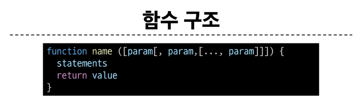

- **function** 키워드

- 함수의 이름

- 함수의 매개변수

- 함수의 body를 구성하는 statements

    - **return** 값이 없다면 **undefined**를 반환

 

### 함수 정의 2가지 방법

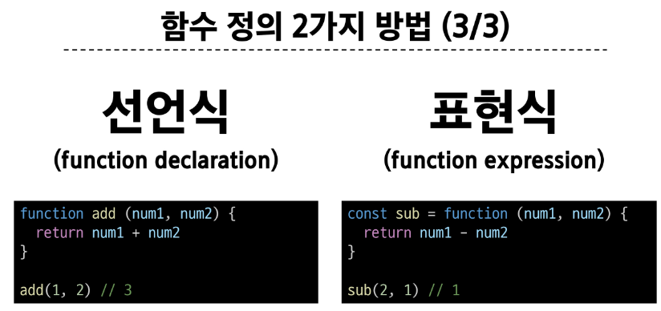

 

### 함수 표현식 특징

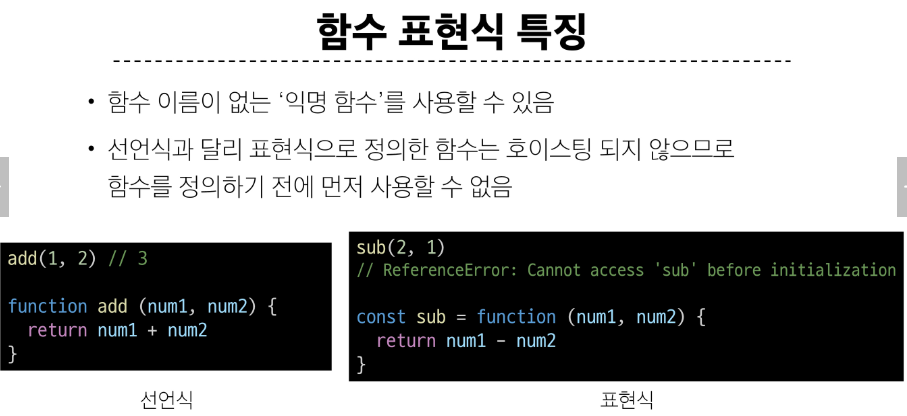

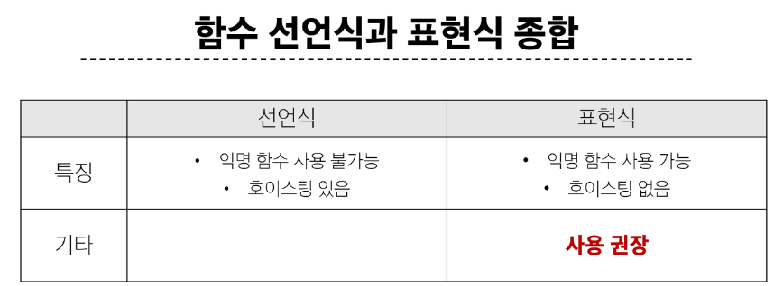

&nbsp;

## 1-2. 매개변수

### 매개변수 정의 방법

- 1. 기본 함수 매개변수

- 2. 나머지 매개변수

 

### 1. 기본 함수 매개변수 (Default function parameter)

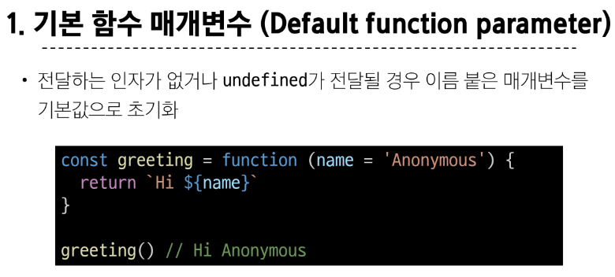

 

### 2. 나머지 매개변수 (Rest parameters)

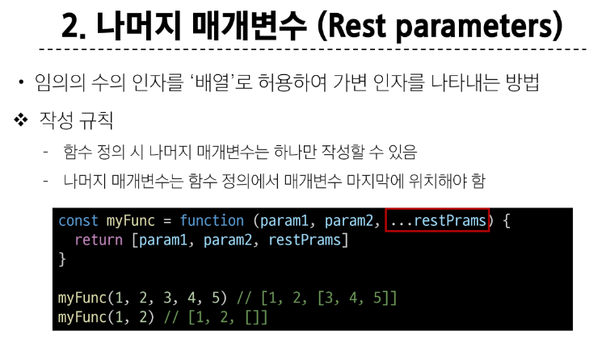

 

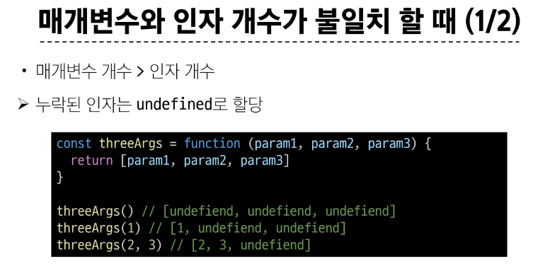
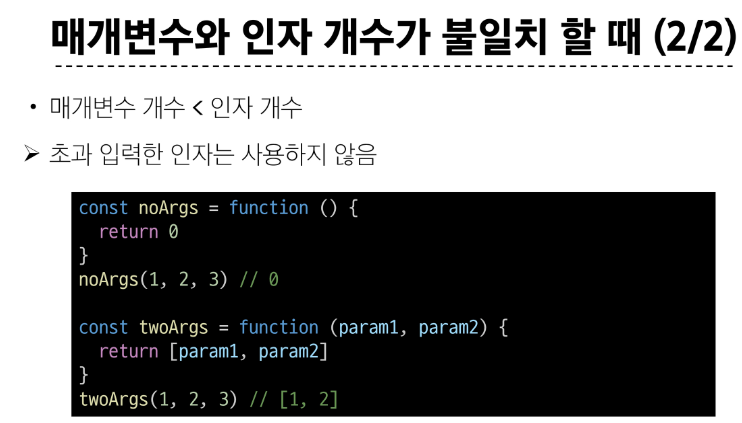

&nbsp;

## 1-3. Spread syntax

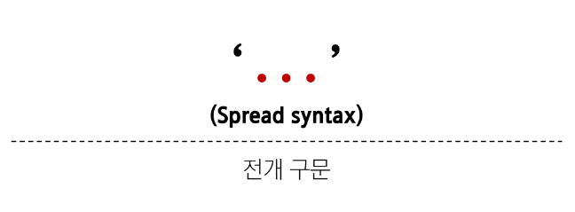

### 전개 구문

- 배열이나 문자열과 같이 반복 가능한 항목을 펼치는 것 (확장, 전개)

- 전개 대상에 따라 역할이 다름
    - 배열이나 객체의 요소를 개별적인 값으로 분리하거나 다른 배열이나 객체의 요소를 현재 배열이나 객체에 추가하는 등

 

### 전개 구문 활용처

- 1) 함수와의 사용
    - (1) 함수 호출 시 인자 확장

    - (2) 나머지 매개변수 (압축)

 

- 2) 객체와의 사용 (객체 파트에서 진행)

 

- 3) 배열과의 활용 (배열 파트에서 진행)

 

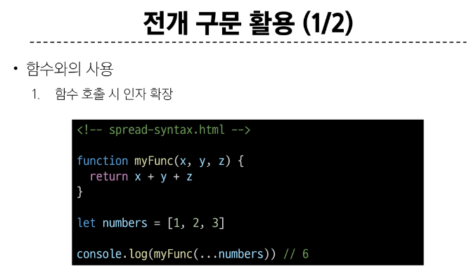
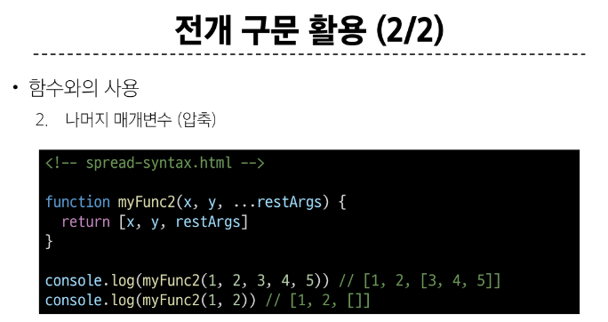

&nbsp;

## 1-4. 화살표 함수

### 화살표 함수 표현식 (Arrow function expressions)

- 함수 표현식의 간결한 표현법

- 모든 함수를 화살표 함수로 바꿀수는 없다. 예외가 있음

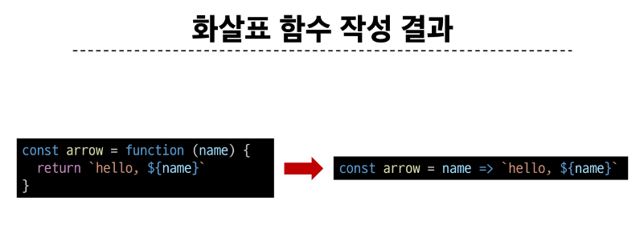

 

### 화살표 함수 작성 과정

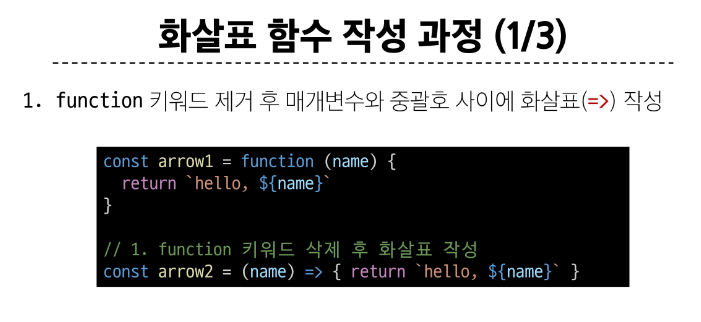
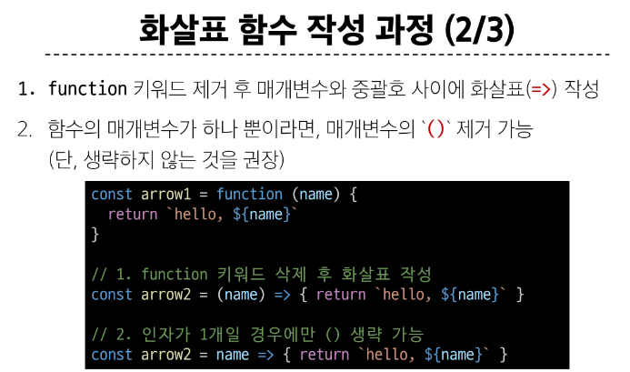
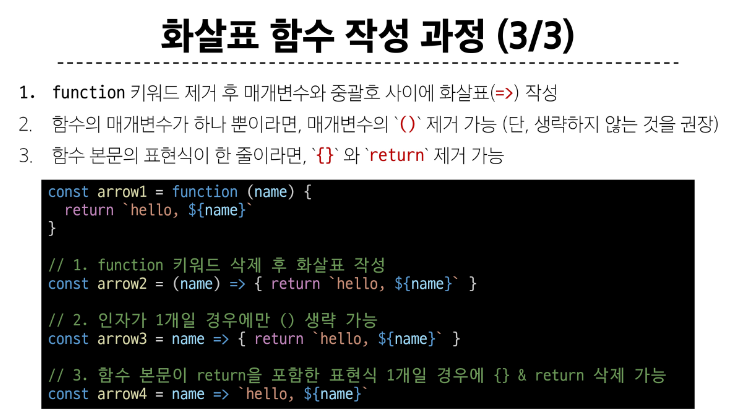

&nbsp;

### 참고

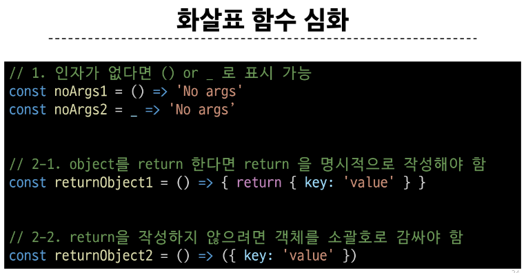
