# 목차

- 2. 객체
    - 2-1. 구조 및 속성
    
    - 2-2. 객체와 함수
    
    - 2-3. this
    
    - 2-4. 추가 객체 문법

&nbsp;

## 2. 객체

### Object

- 키로 구분된 데이터 집합(data collection)을 저장하는 자료형

&nbsp;

## 2-1. 구조 및 속성

### 객체 구조

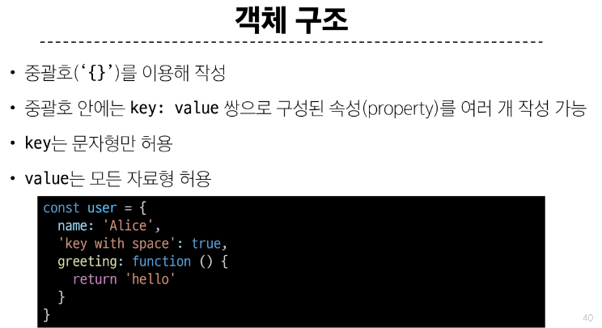

 

### 속성 참조

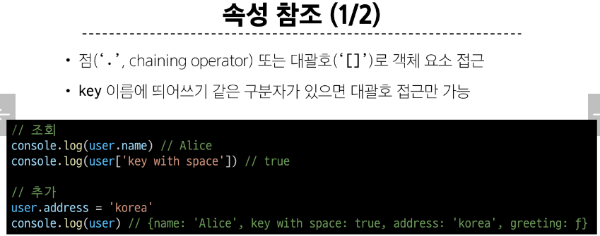
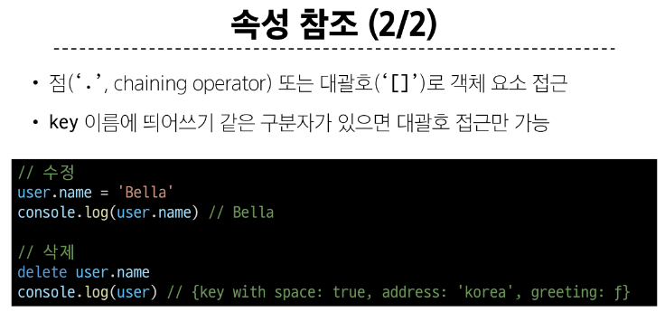

 

### 'in' 연산자

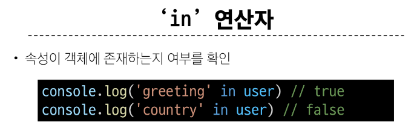

&nbsp;

## 2-2. 객체와 함수

### Method

- 객체 속성에 정의된 함수

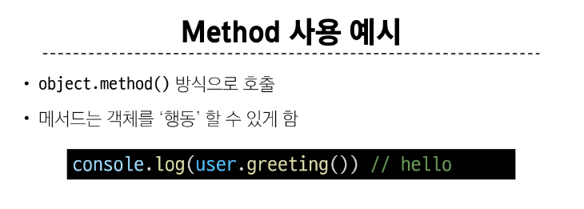

&nbsp;

## 2-3. this

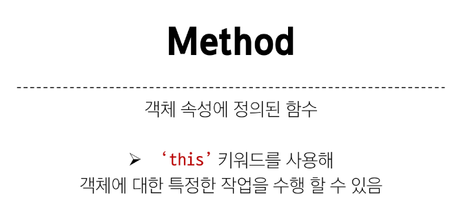

 

### 'this' keyword

- 함수나 메서드를 호출한 객체를 가리키는 키워드

    - 함수 내에서 객체의 속성 및 메서드에 접근하기 위해 사용

 

### Method & this 사용 예시

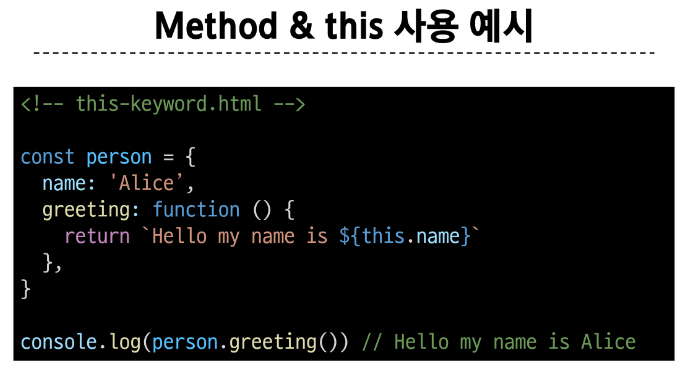

 

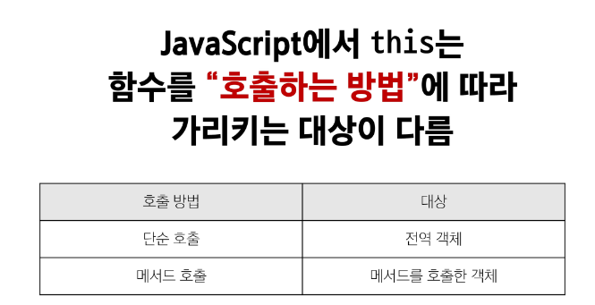

 

### 1. 단순 호출 시 this

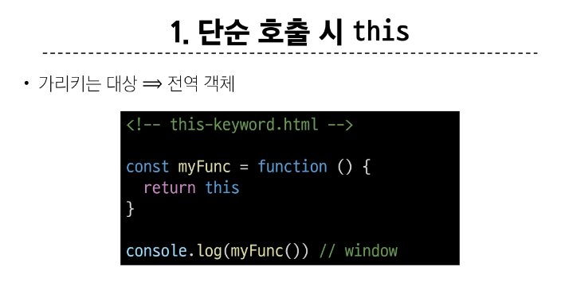

 

### 2. 메서드 호출 시 this

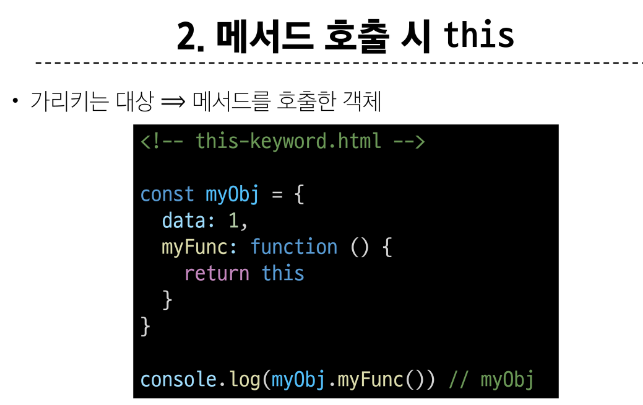

 

### 중첩된 함수에서의 this 문제점과 해결책

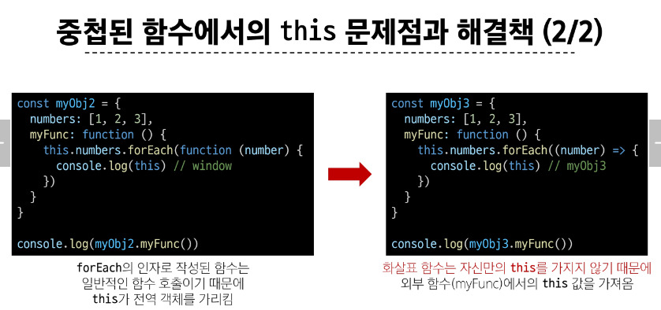

 

### javaScript 'this' 정리

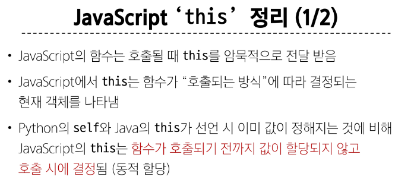
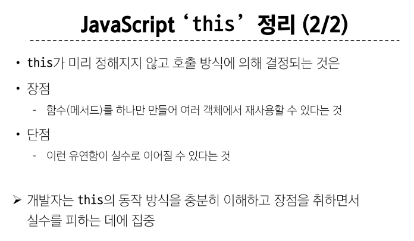

&nbsp;

## 2-4. 추가 객체 문법

### 1. 단축 속성

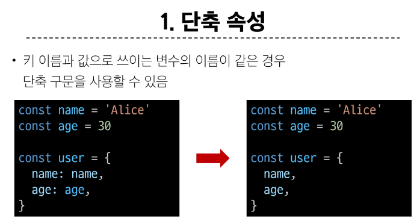

 

### 2. 단축 메서드

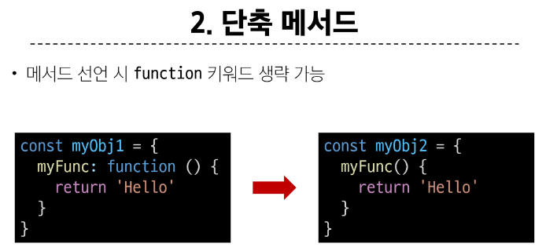

 

### 3. 계산된 속성 (computed property name)

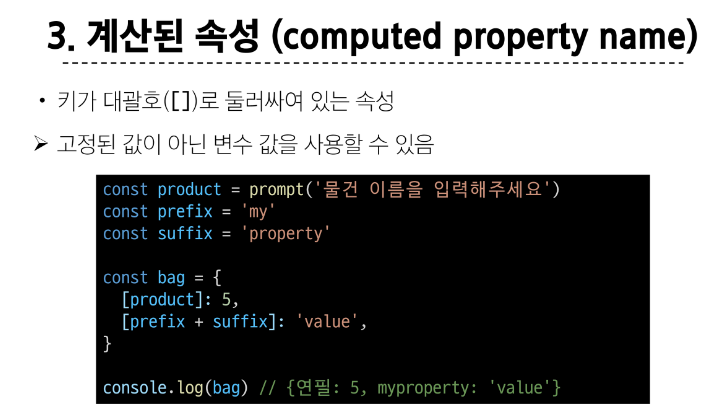

 

### 4. 구조 분해 할당 (destructing assignment)

- 배열 또는 객체를 분해하여 객체 속성을 변수에 쉽게 할당할 수 있는 문법

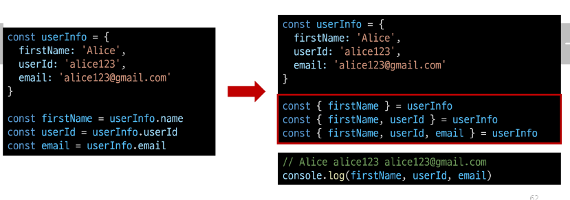

 

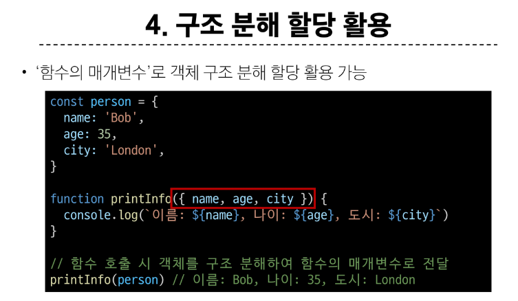

 

### 5. Object with '전개 구문'

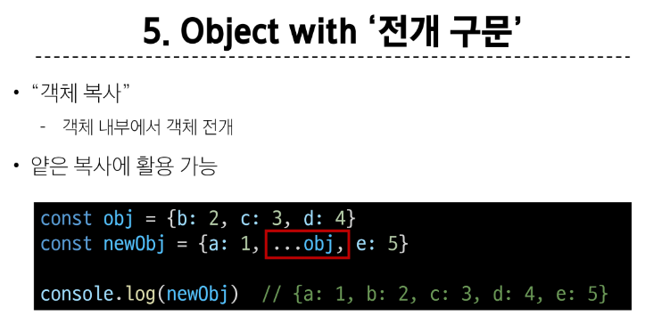

 

### 6. 유용한 객체 메서드

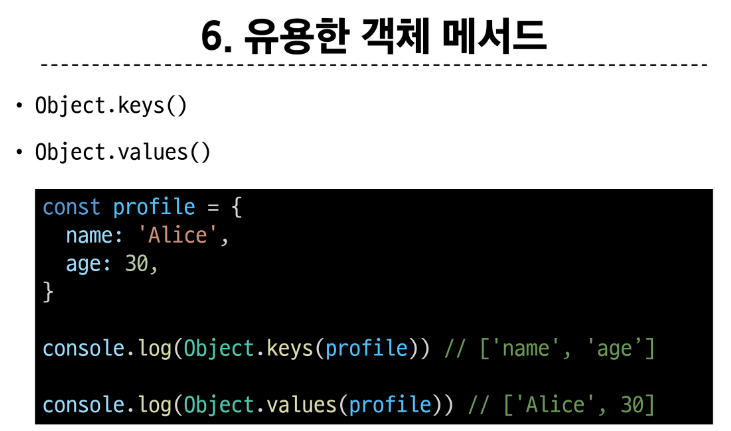

 

### 7. Optional chaining ('?.')

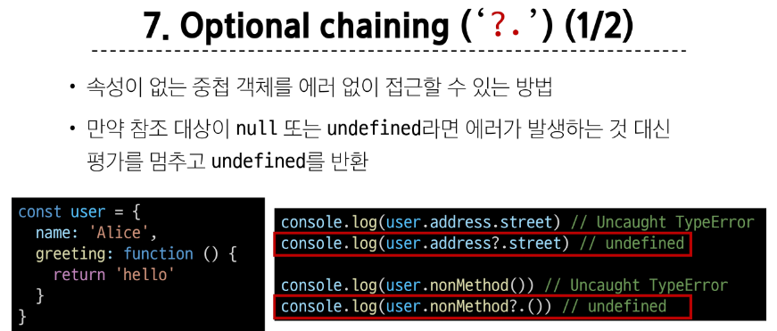
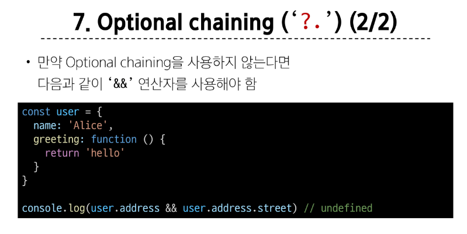

#### Optional chaining 장점

- 참조가 누락될 가능성이 있는 경우 연결된 속성으로 접근할 때 더 짧고 간단한 표현식을 작성할 수 있음

- 어떤 속성이 필요한지에 대한 보증이 확실하지 않는 경우에 객체의 내용을 보다 편리하게 탐색할 수 있음

 

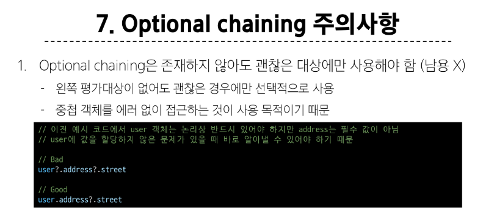
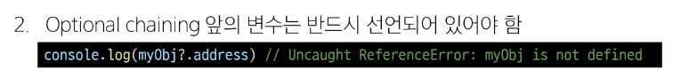

 

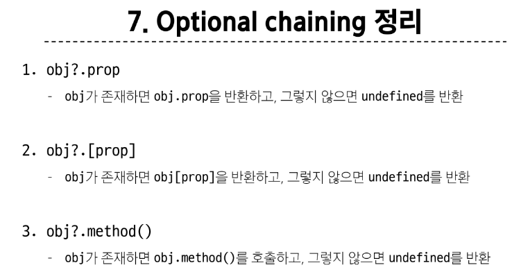

&nbsp;

### JSON

- 'JavaScript Object Notation'

- Key-Value 형태로 이루어진 자료 표기법

- JavaScript의 Object와 유사한 구조를 가지고 있지만 JSON은 형식이 있는 **'문자열'**

- JavaScript에서 JSON을 사용하기 위해서는 Object 자료형으로 변경해야 함

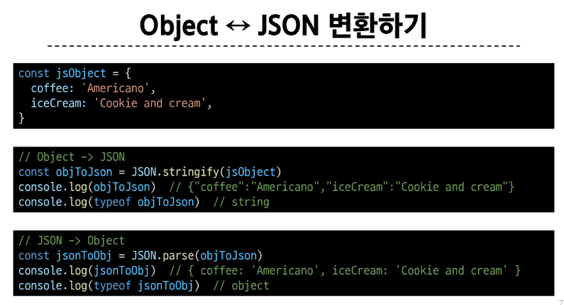

&nbsp;

### 참고

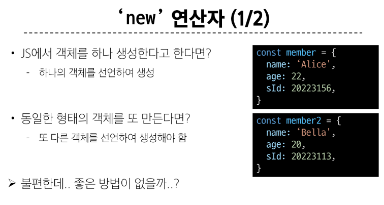
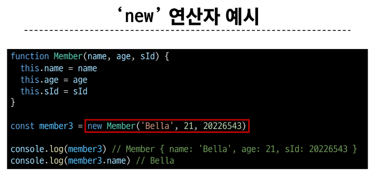
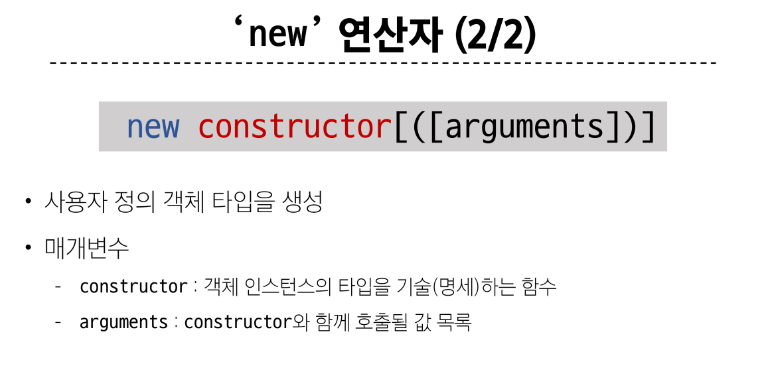