# 목차

- 3. 함수
    - 3-1. 배열 메서드
    
    - 3-2. Array helper method
    
    - 3-3. 추가 배열 문법
    

&nbsp;

## 3. 함수

### Object

- 이제는 **순서가 있는 collection**이 필요

### Array

- 순서가 있는 데이터 집합을 저장하는 자료구조

 

### 배열 구조

- 대괄호('[]')를 이용해 작성

- 요소 자료형 : 제약 없음

- length 속성을 사용해 배열에 담긴 요소가 몇 개인지 알 수 있음

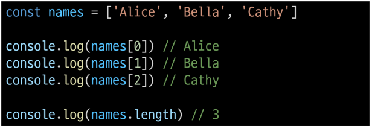

&nbsp;

## 3-1. 배열 메서드

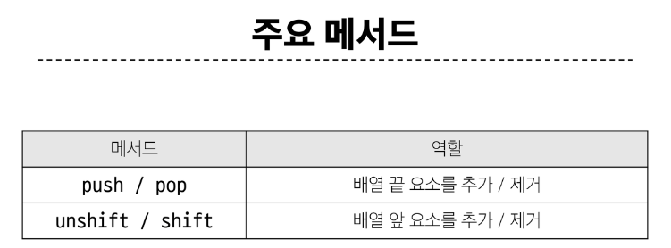

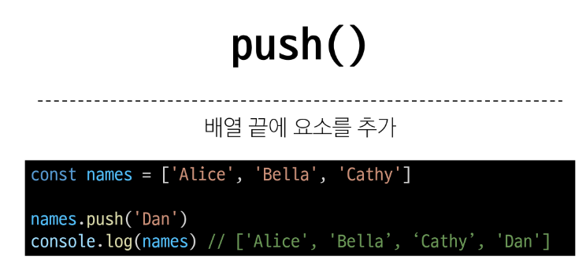
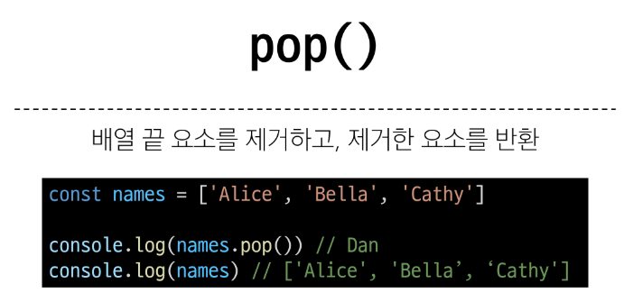
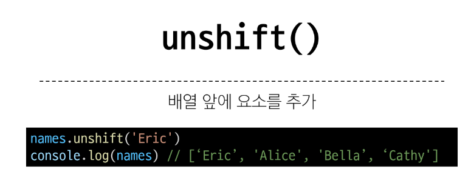
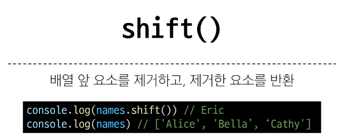

&nbsp;

## 3-2. Array helper method

### Array Helper Methods

- 배열 조작을 보다 쉽게 수행할 수 있는 특별한 메서드 모음

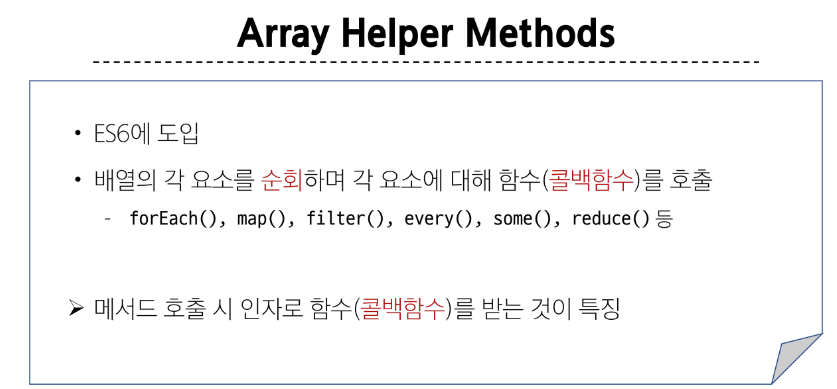

 

### 콜백 함수 (Callback function)

- 다른 함수에 인자로 전달되는 함수

    - 외부 함수 내에서 호출되어 일종의 루틴이나 특정 작업을 진행

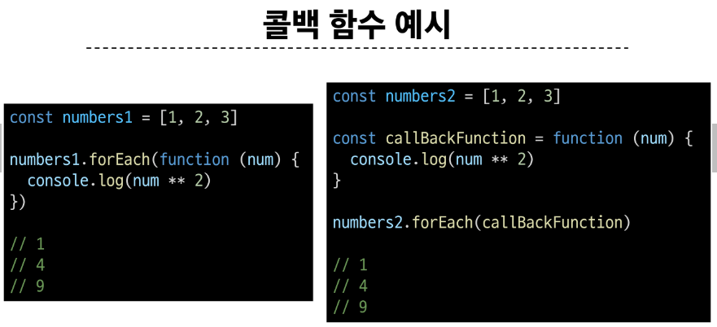

 

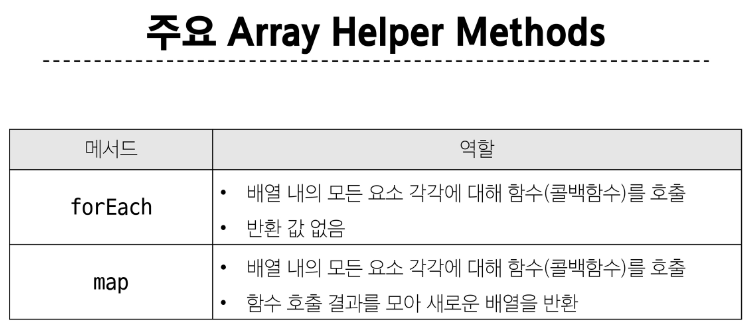

 

### forEach()

- 배열의 각 요소를 반복하며 모든 요소에 대해 함수(콜백 함수)를 호출

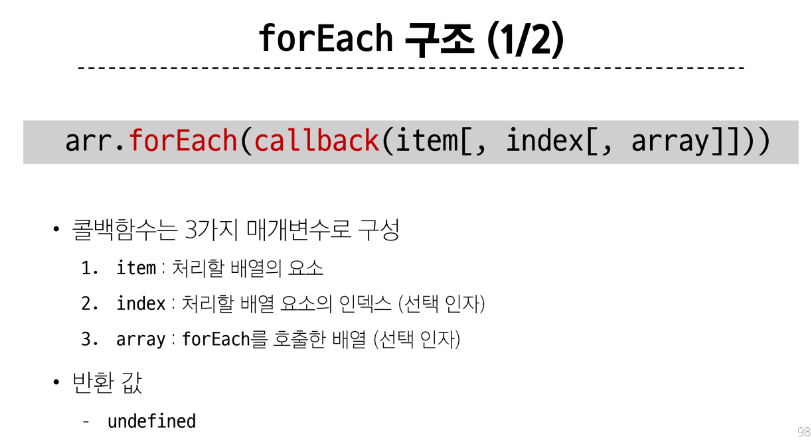
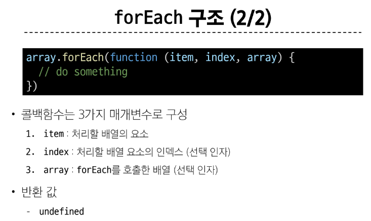

 

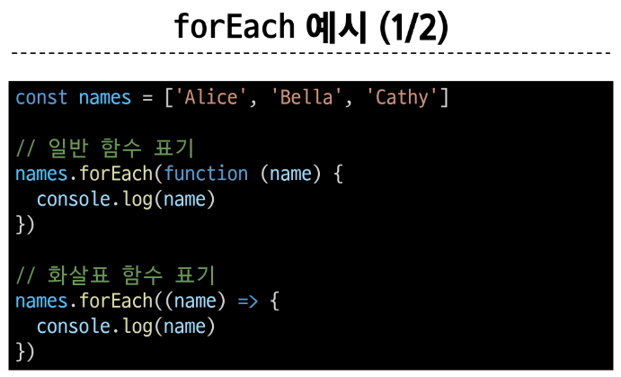
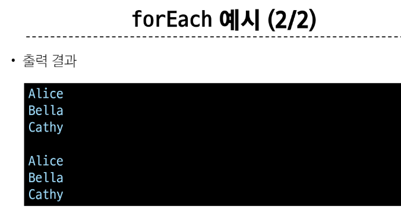

 

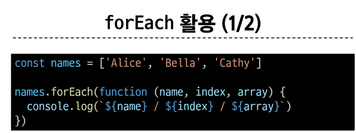
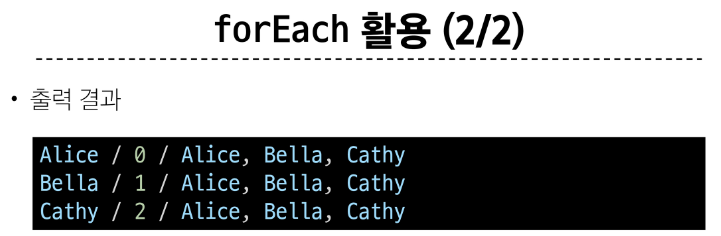

&nbsp;

### map()

- 배열의 모든 요소에 대해 함수(콜백 함수)를 호출하고, 반환 된 호출 결과 값을 모아 **새로운 배열을 반환**

 

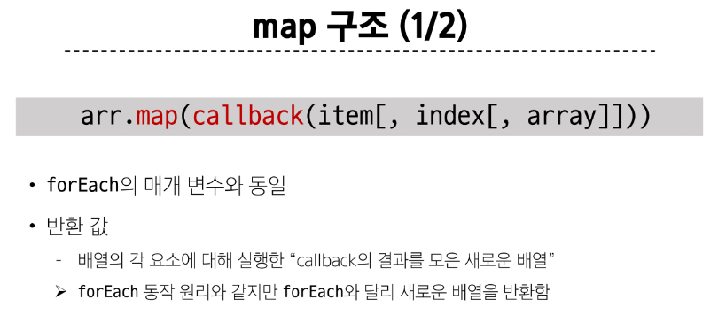
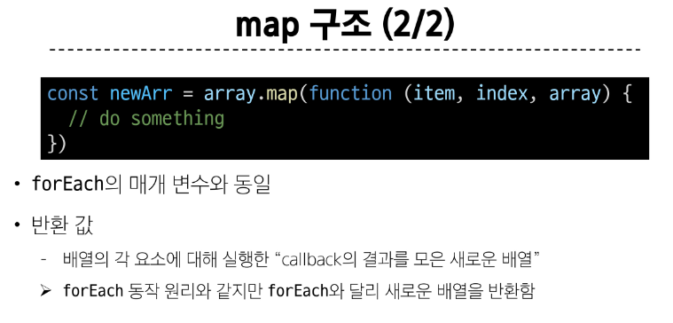

 

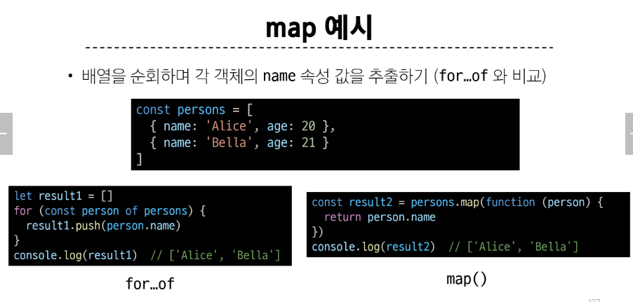

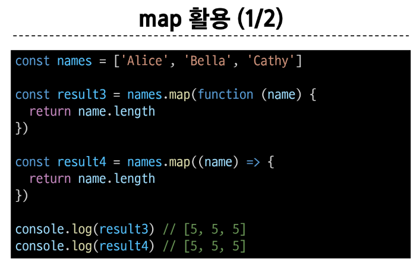
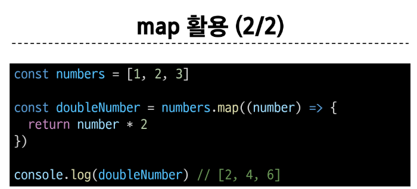

 

### python에서의 map 함수와 비교

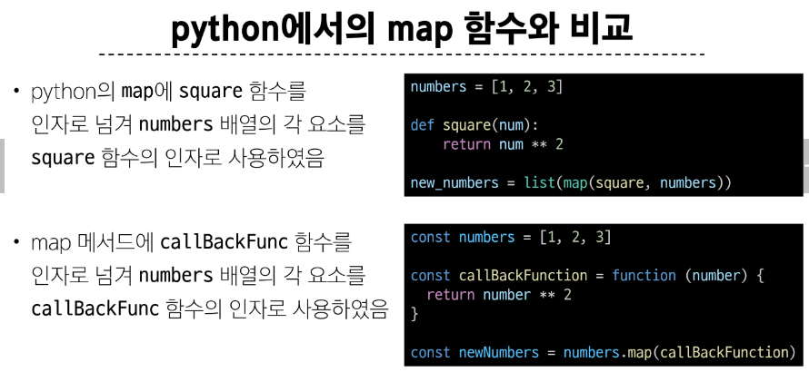

 

### 배열 순회 종합

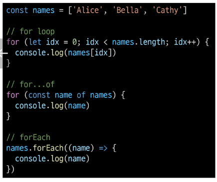
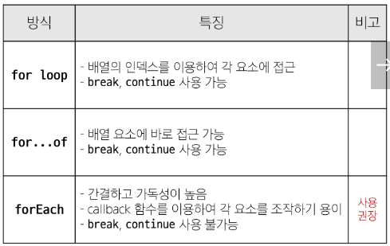

 

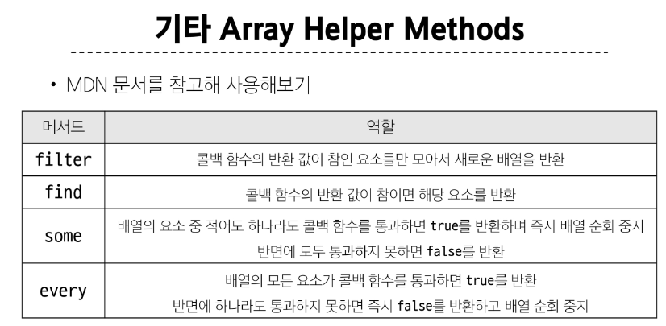

&nbsp;

## 3-3. 추가 배열 문법

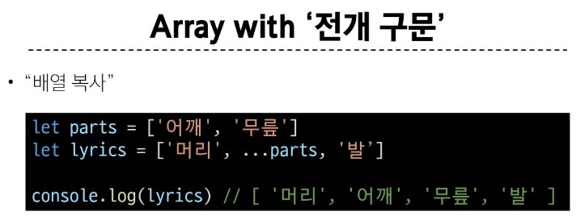

&nbsp;

## 참고

### 콜백함수 구조를 사용하는 이유

1. 함수의 재사용성 측면

2. 비동기적 처리 측면

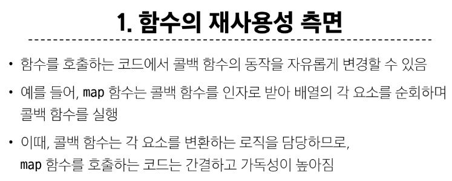
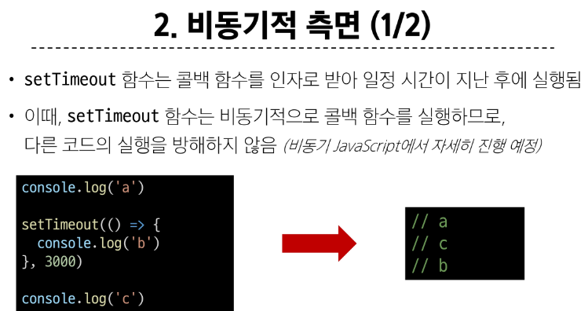

 

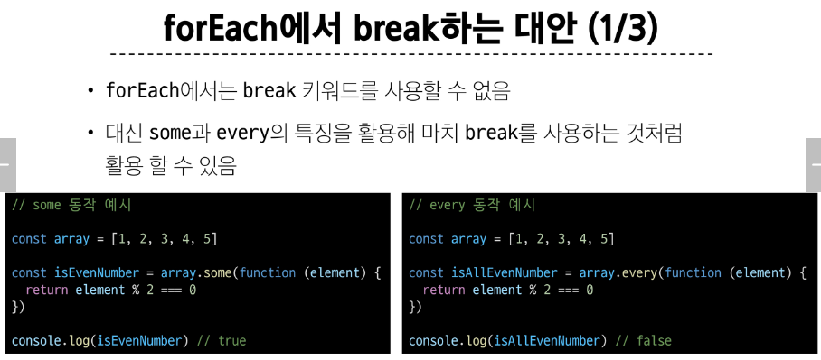
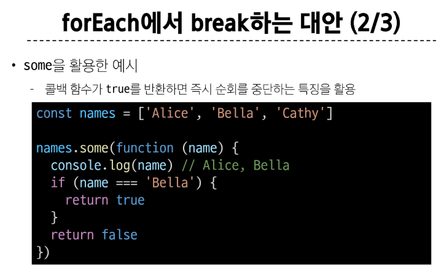
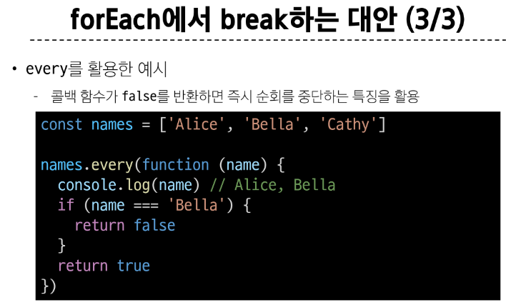
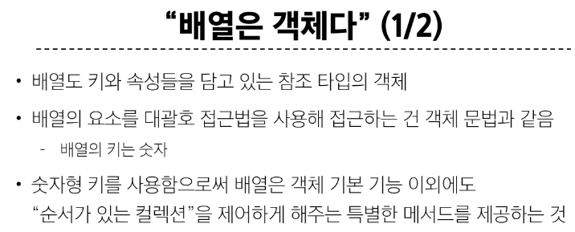
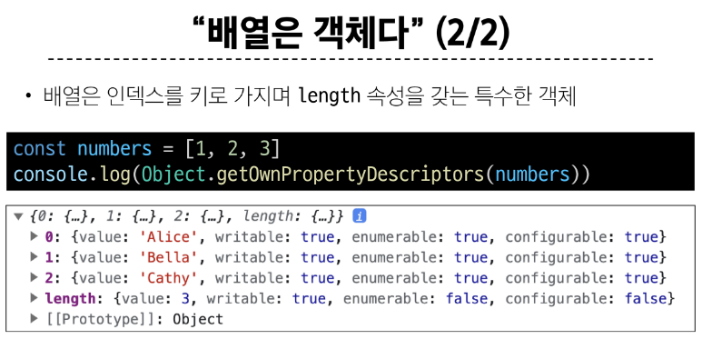