# 목차

1. 이벤트
   - event 객체
   - event handler
   - 버블링

2. event handler 활용
   - 이벤트 기본 동작 취소

&nbsp;

## 1. 이벤트

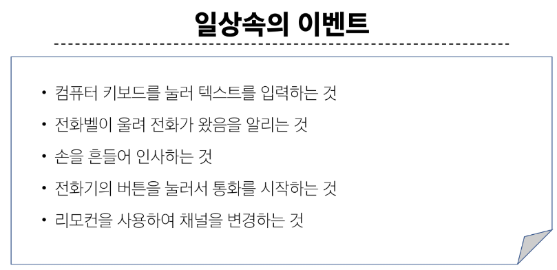
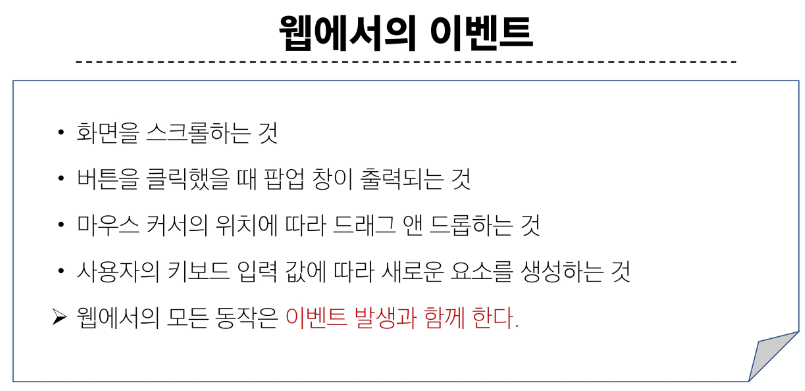

 

## 1-1. event 객체

### event

- 무언가 일어났다는 신호, 사건
  - 모든 DOM 요소는 이러한 event를 만들어 냄

 

### 'event' object

- DOM에서 이벤트가 발생했을 때 생성되는 객체

- 이벤트 종류
  - mouse, input, keyboard, touch ...
  - https://developer.mozilla.org/en-US/docs/Web/API/Event

 

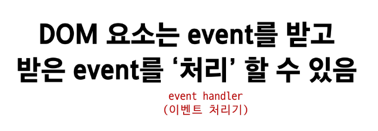

&nbsp;

## 2. event handler

- 이벤트가 발생했을 때 실행되는 함수
  - 사용자의 행동에 어떻게 반응할지를 JavaScript 코드로 표현한 것

 

### .addEventListener()

- 대표적인 이벤트 핸들러 중 하나
  - 특정 이벤트를 DOM 요소가 수신할 때마다 콜백 함수를 호출

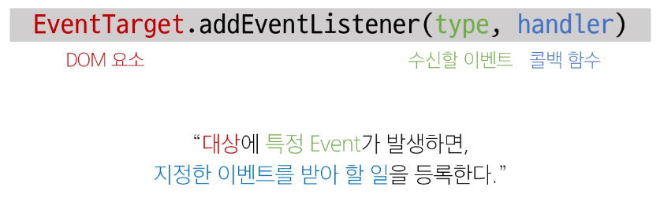

 

### .addEventListener의 인자

- type
  - 수신할 이벤트 이름
  - 문자열로 작성 (ex. 'click')

- handler
  - 발생한 이벤트 객체를 수신하는 콜백 함수
  - 콜백 함수는 발생한 event object를 유일한 매개변수로 받음

 

### addEventListener 활용

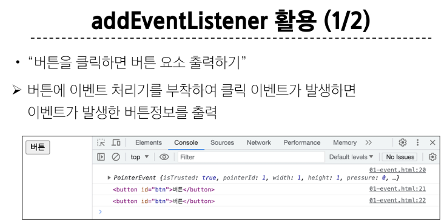
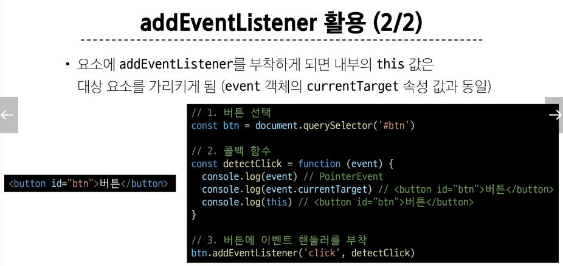

 

### addEventListener의 콜백 함수 특징

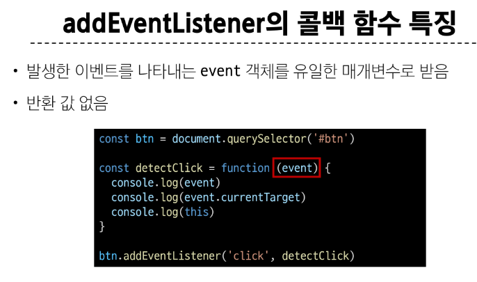

 

## 1-3. 버블링 (Bubbling)

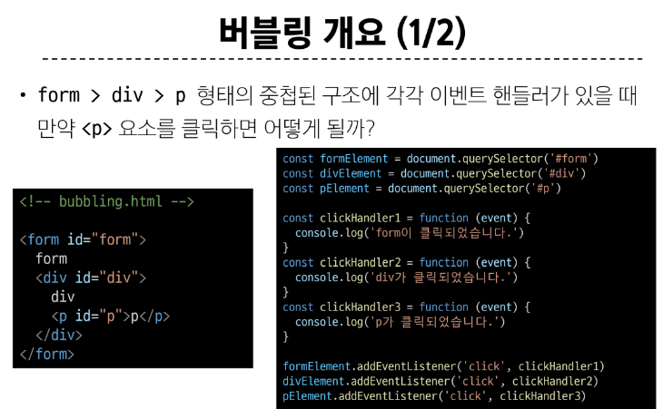
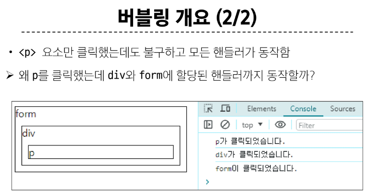

 

- 한 요소에 이벤트가 발생하면, 이 요소에 할당된 핸들러가 동작하고, 이어서 부모 요소의 핸들러가 동작하는 현상

- 가장 최상단의 조상 요소(document)를 만날 때까지 이 과정이 반복되면서 요소 각각에 할당된 핸들러가 동작

> - 이벤트가 제일 깊은 곳에 있는 요소에서 시작해 부모 요소를 거슬러 올라가며 발생하는 것이 마치 물속 거품과 닮았기 때문

> - 가장 안쪽의 p 요소를 클릭하면 p -> div -> form 순서로 3개의 이벤트 핸들러가 모두 동작했던 것

 

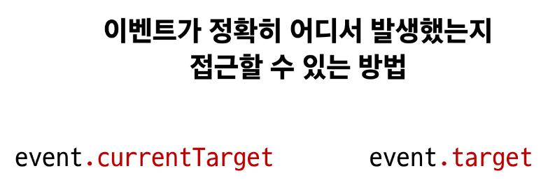

### 'currentTarget' & 'target' 속성

- 'currentTarget' 속성
    - '현재' 요소
    - 항상 이벤트 핸들러가 연결된 요소만을 참조하는 속성
    - 'this' 와 같음

- 'target' 속성
  - 이벤트가 발생한 가장 안쪽의 요소(target)를 참조하는 속성
  - 실제 이벤트가 시작된 요소
  - 버블링이 진행 되어도 변하지 않음 

 

### 'currentTarget' & 'target' 예시

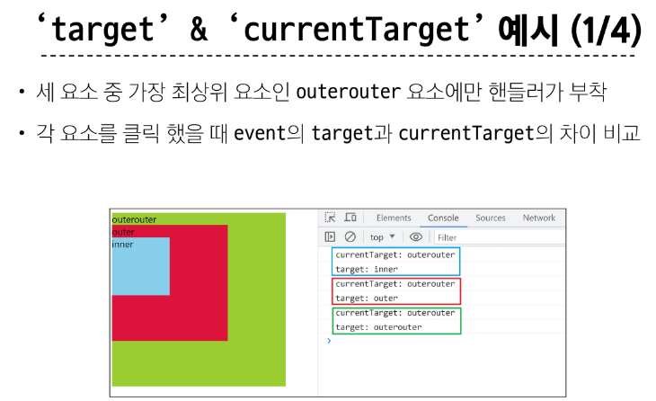
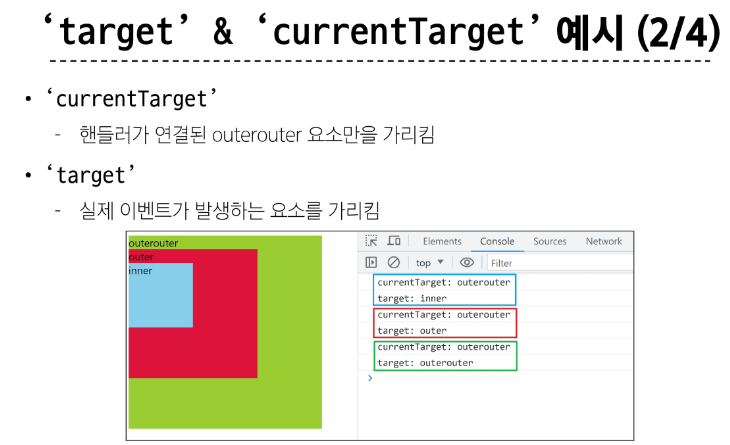
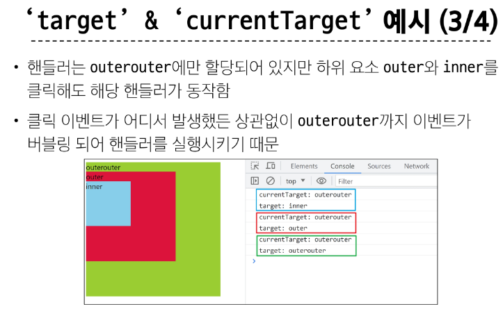
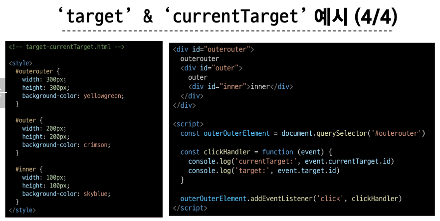

 

### 캡처링(capturing)

- 이벤트가 하위 요소로 전파되는 단계 (버블링과 반대)

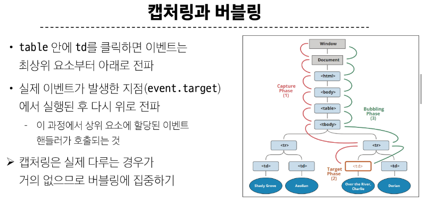

 

### 버블링이 필요한 이유

- 만약 다음과 같이 각자 다른 동작을 수행하는 버튼이 여러 개가 있다고 가정

- 그렇다면 각 버튼마다 서로 다른 이벤트 핸들러를 할당해야 할까?
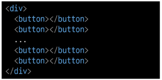

- 각 버튼의 **공통 조상인 div 요소에 이벤트 핸들러 단 하나만 할당** 하기

 

- 요소의 공통 조상에 이벤트 핸들러를 단 하나만 할당하면 여러 요소를 한꺼번에 다룰 수 있음

- 공통 조상에 할당한 핸들러에서 event.target을 이용하면 실제 어떤 버튼에서 이벤트가 발생했는지 알 수 있기 때문

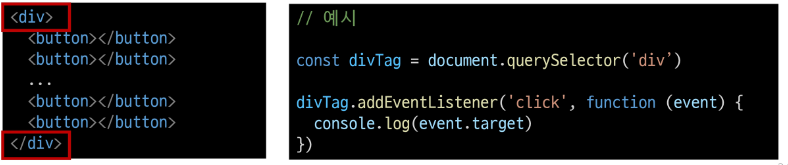

&nbsp;

## 2. event handler 활용

### 1. click 이벤트 실습

- 버튼을 클릭하면 숫자를 1씩 증가

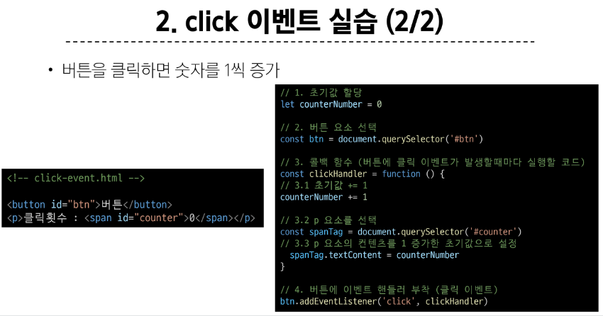

 

### 2. input 이벤트 실습

- 사용자의 입력 값을 실시간으로 출력하기

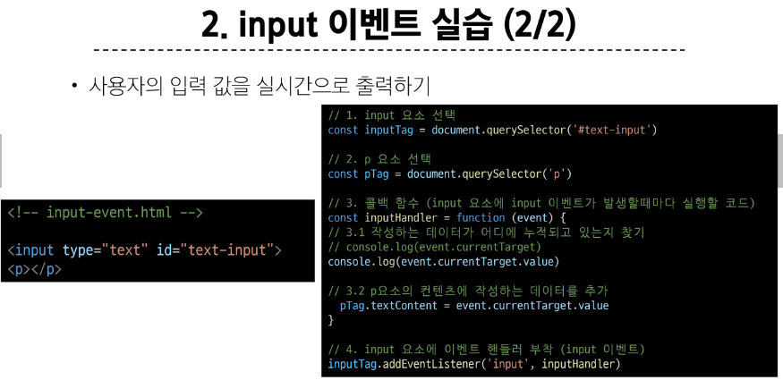

 

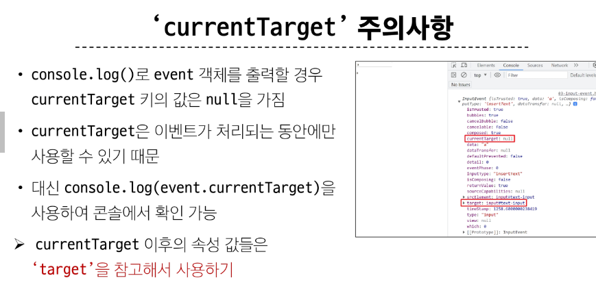
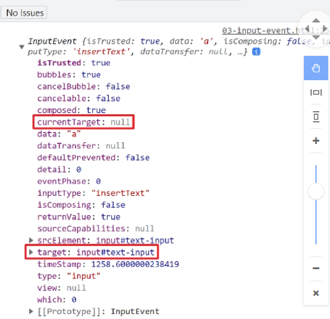

 

### 3. click & input 이벤트 실습

- 사용자의 입력 값을 실시간으로 출력
  - '+' 버튼을 클릭하면 출력한 값의 CSS 스타일을 변경하기

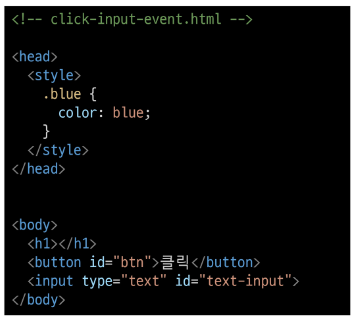
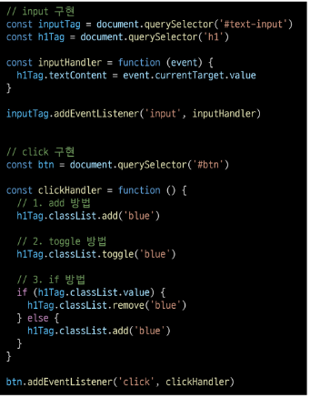

 

### 4. todo 실습

- 입력값을 li로 출력

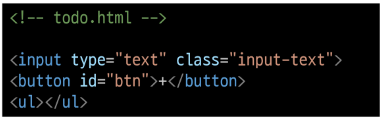
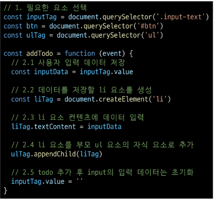
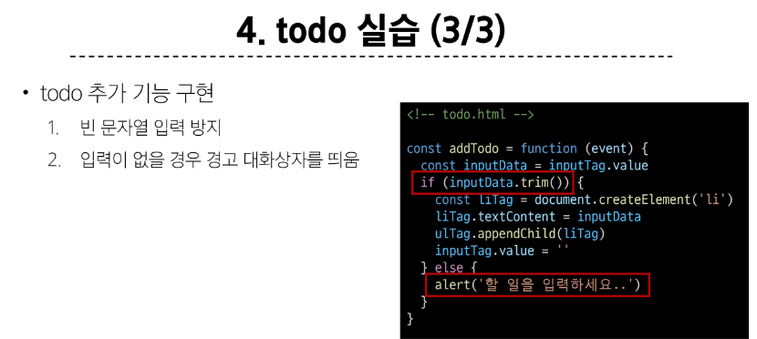

 

### 5. 로또 번호 생성기 실습

- cdn을 가져와 _.함수 사용

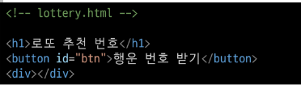
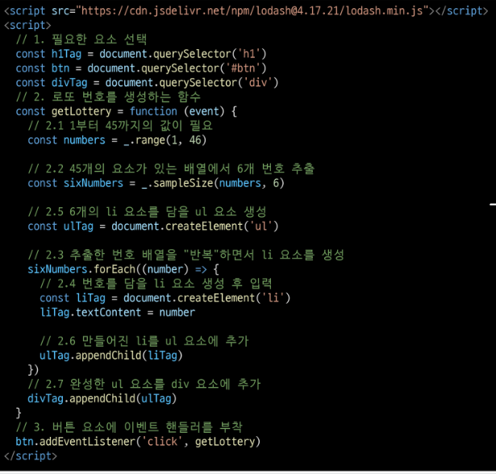

 

### lodash

- 모듈성, 성능, 및 추가 기능을 제공하는 JavaScript 유틸리티 라이브러리

- array, object 등 자료구조를 다룰 때 사용하는 유용하고 간편한 함수들을 제공

- https://lodash.com/

&nbsp;

## 2-1. 이벤트 기본 동작 취소

- HTML의 각 요소가 기본적으로 가지고 있는 이벤트가 때로는 방해가 되는 경우가 있어 이벤트의 기본 동작을 취소할 필요가 있음

- 예시
    - form 요소의 제출 이벤트를 취소하여 페이지 새로고침을 막을 수 있음
    - a 요소를 클릭 할 때 페이지 이동을 막고 추가 로직을 수행할 수 있음

 

### .preventDefault()

- 해당 이벤트에 대한 기본 동작을 실행하지 않도록 지정

 

### 이벤트 동작 취소 실습 

- copy 이벤트 동작 취소
  - 콘텐츠를 복사 하는 것을 방지

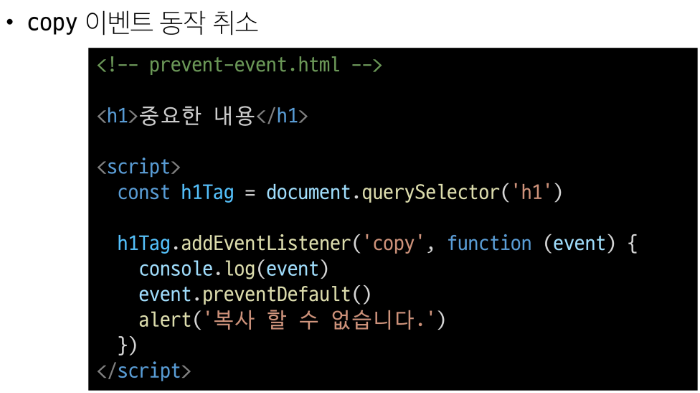
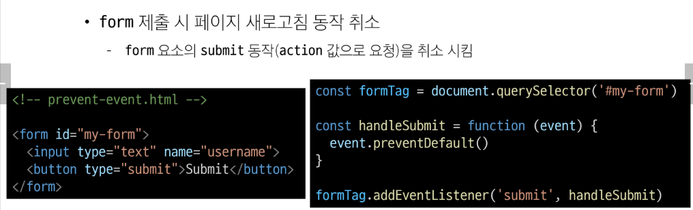

&nbsp;

### 참고

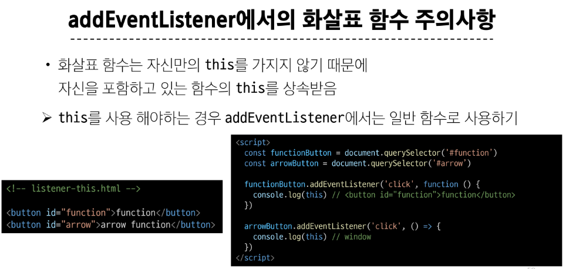