# 목차

1. 비동기

2. JavaScript와 비동기

3. Ajax
    - Axios

4. Callback과 Promise
   - 비동기 콜백
   - 프로미스


&nbsp;


## 1. 비동기

### Synchronous - 동기

- 프로그램의 실행 흐름이 순차적으로 진행

    - 하나의 작업이 완료된 후에 다음 작업이 실행되는 방식

### Synchronous 예시

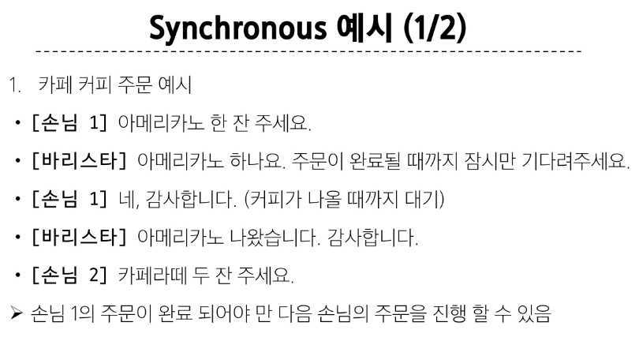
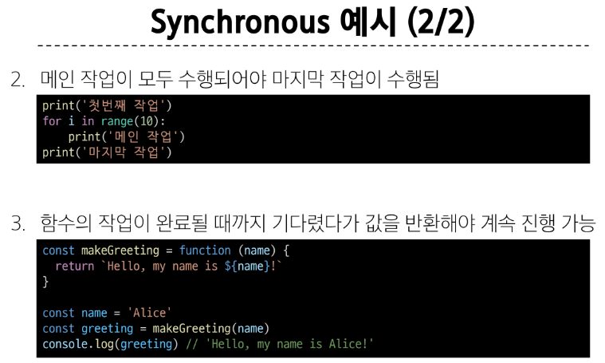


&nbsp;


### Asynchronous - 비동기

- 프로그램의 실행 흐름이 순차적이지 않으며, 작업이 완료되기를 기다리지 않고 다음 작업이 실행되는 방식

    - 작업의 완료 여부를 신경 쓰지 않고 **동시에 다른 작업들을 수행할 수 있음**


### Asynchronous 예시

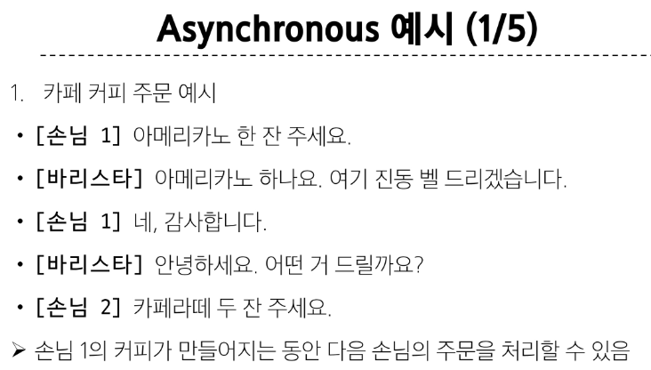
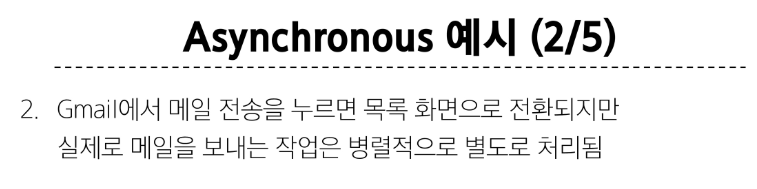
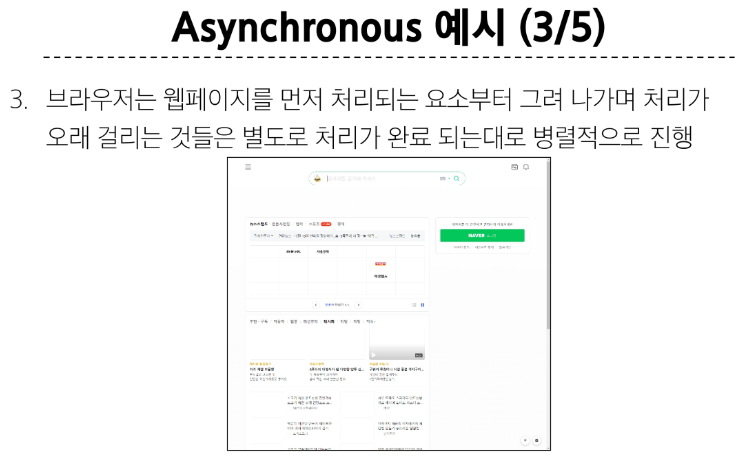
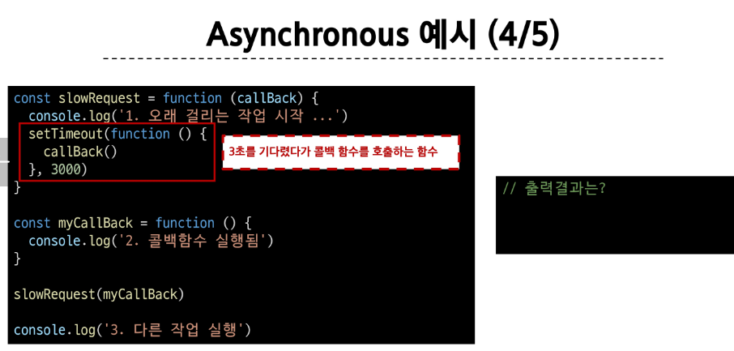
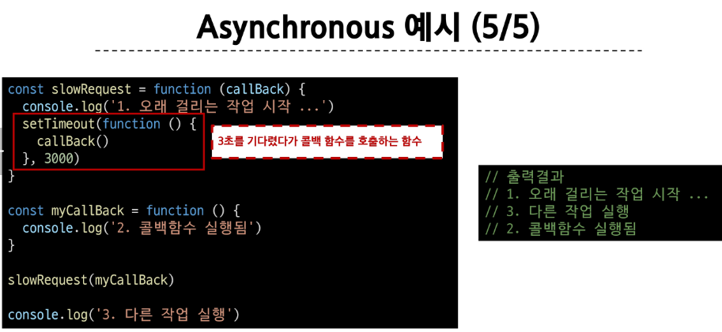

<br>

### Asynchronous 특징

- 병렬적 수행

- 당장 처리를 완료할 수 없고 시간이 필요한 작업들은 별도로 요청을 보낸 뒤 응답이 빨리 오는 작업부터 처리

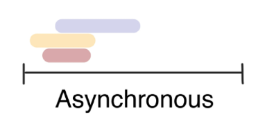


&nbsp;


## 2. JavaScript와 비동기

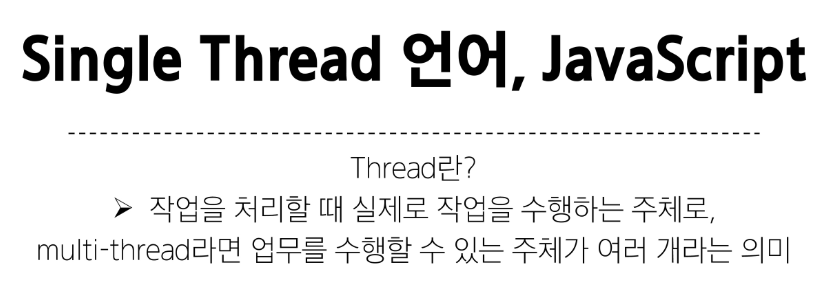

<br>

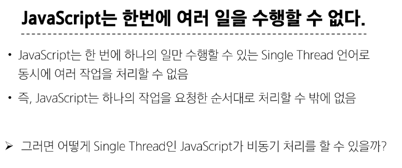

<br>

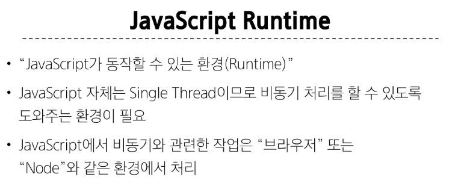

<br>

### 브라우저 환경에서의 JavaScript 비동기 처리 관련 요소

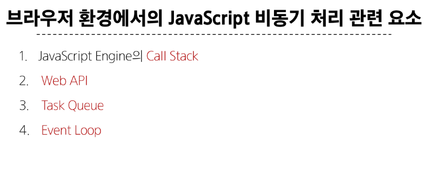

<br>

### 런타임의 시각적 표현

21 page 부터
...

<br>

### 브라우저 환경에서의 JavaScript 비동기 처리 동작 방식

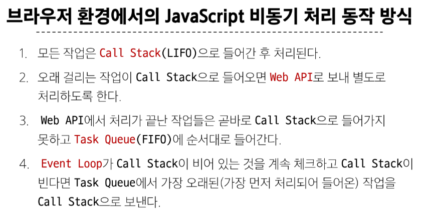

<br>

### 비동기 처리 동작 요소

1. Call Stack
   - 요청이 들어올 때 마다 순차적으로 처리하는 Stack(LIFO)
   
   - 기본적인 JavaScript의 Single Thread 작업 처리

2. Web API
    - JavaScript 엔진이 아닌 브라우저에서 제공하는 runtime 환경

    - 시간이 소요되는 작업을 처리 (setTimeout, DOM Event, 비동기 요청 등)

3. Task Queue (Callbaxk Queue)
    - 비동기 처리된 Callback 함수가 대기하는 Queue(FIFO)

4. Event Loop
    - 태스크 (작업)가 들어오길 기다렸다가 태스크가 들어오면 이를 처리하고, 처리할 태스크가 없는 경우엔 잠드는, 끊임없이 돌아가는 자바스크립트 내 루프

    - Call Stack과 Task Queue를 지속적으로 모니터링

    - Call Stack이 비어 있는지 확인 후 비어 있다면 Task Queue에서 대기중인 오래된 작업을 Call Stack으로 Push

<br>

### 정리

- JavaScript는 한 번에 하나의 작업을 수행하는 Single Thread 언어로 동기적 처리를 진행

- 하지만 브라우저 환경에서는 Web API에서 처리된 작업이 지속적으로 Task Queue를 거쳐 Event Loop에 의해 Call Stack에 들어와 순차적으로 실행됨으로써 비동기 작업이 가능한 환경이 됨


&nbsp;


## 3. Ajax

- Asynchronous JavaScript and XML

    - XMLHttpRequest 기술을 사용해 복잡하고 동적인 웹 페이지를 구성하는 프로그래밍 방식

<br>

### Ajax 정의

- 비동기적인 웹 애플리케이션 개발을 위한 기술

- 브라우저와 서버 간의 데이터를 비동기적으로 교환하는 기술

- Ajax를 사용하면 페이지 전체를 새로고침 하지 않고도 동적으로 데이터를 불러와 화면을 갱신할 수 있음

    - Ajax의 'x'는 XML 이라는 데이터 타입을 의미하긴 하지만, 요즘은 더 가벼운 용량과 JavaScript의 일부라는 장점 때문에 'JSON'을 많이 사용

<br>

### Ajax 목적

- 전체 페이지가 다시 로드되지 않고 HTML 페이지 일부 DOM만 업데이트

    - 웹 페이지 일부가 다시 로드되는 동안에도 코드가 계속 실행되어, 비동기식으로 작업 할 수 있음

<br>

### XMLHttpRequest 객체 - XHR

- 서버와 상호작용할 때 사용하는 객체

- 페이지의 새로고침 없이도 데이터를 가져올 수 있음

<br>

### XMLHttpRequest 특징

- JavaScript를 사용하여 서버에 HTTP 요청을 할 수 있는 객체

- 브라우저와 서버 간의 네트워크 요청을 전송할 수 있음

- 사용자의 작업을 방해하지 않고 페이지의 일부를 업데이트할 수 있음

    - 이름에 XML이라는 데이터 타입이 들어가긴 하지만 XML 뿐만 아니라 모든 종류의 데이터를 가져올 수 있음

<br>

### 기존 기술과의 차이

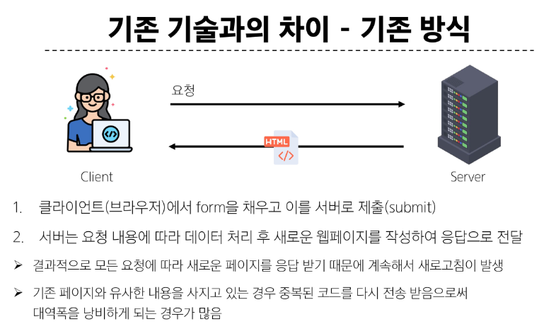

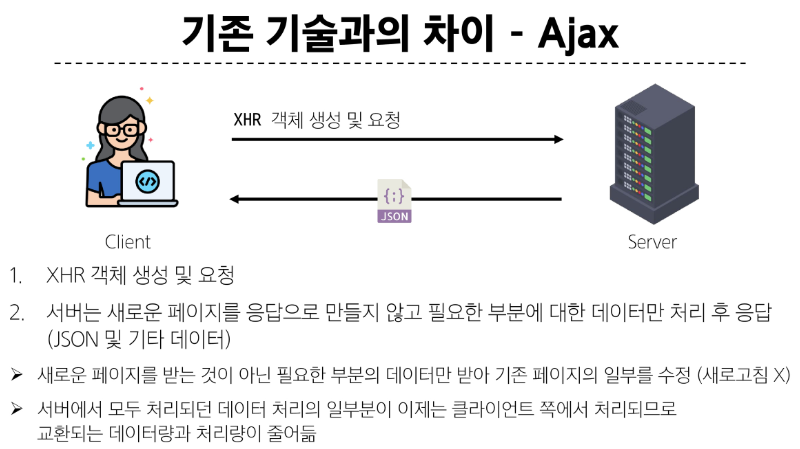


<br>

### 이벤트 핸들러는 비동기 프로그래밍의 한 형태

- 이벤트가 발생할 때마다 호출되는 함수(콜백 함수)를 제공하는 것

- HTTP 요청은 응답이 올때까지의 시간이 걸릴 수 있는 작업이라 비동기이며, 이벤트 핸들러를 XHR 객체에 연결해 요청의 진행 상태 및 최종 완료에 대한 응답을 받음


&nbsp;


## 3-1. Axios

- JavaScript에서 사용되는 HTTP 클라이언트 라이브러리

### Axios 정의

- 클라이언트 및 서버 사이에 HTTP 요청을 만들고 응답을 처리하는 데 사용되는 자바스크립트 라이브러리

- 서버와의 HTTP 요청과 응답을 간편하게 처리할 수 있도록 도와주는 도구

- 브라우저를 위한 XHR 객체 생성

- 간편한 API를 제공하며, **Promise** 기반의 비동기 요청을 처리

    - 주로 웹 애플리케이션에서 서버와 통신할 때 사용

<br>

### Ajax를 활용한 클라이언트 서버 간 동작

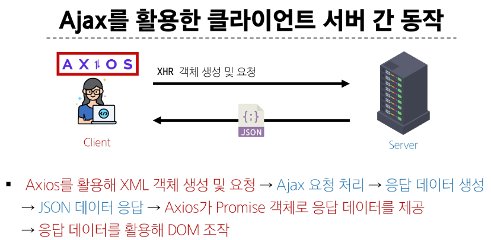

<br>

### Axios 설치 및 사용 방법

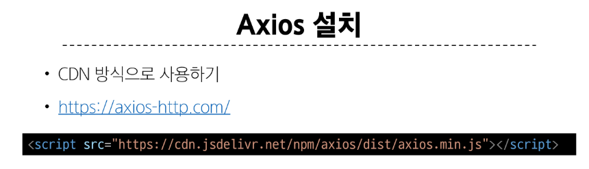

<br>

### Axios 구조

- axios 객체를 활용해 요청을 보낸 후 응답 데이터 promise 객체를 반환

- promise 객체는 then과 catch 메서드를 활용해 각각 필요한 로직을 수행
  
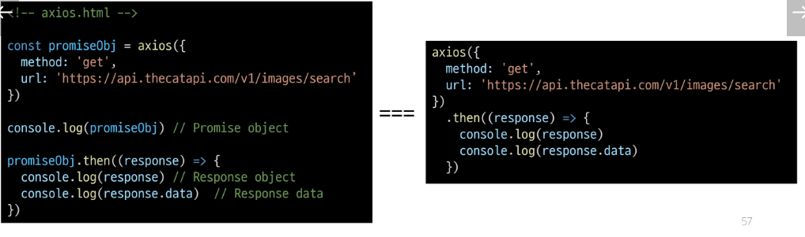
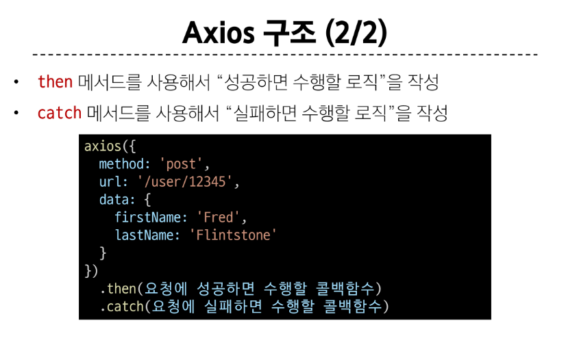

<br>

### "Promise" object

- 자바스크립트에서 비동기 작업을 처리하기 위한 객체

- 비동기 작업의 성공 또는 실패와 관련된 결과나 값을 나타냄

```javascript
const promiseObj = axios({
    ...
})

console.log(promiseObj) // Promise object
```

<br>

### then & catch

- then(callback)

    - 요청한 작업이 성공하면 callback 실행
    
    - callback은 이전 작업의 성공 결과를 인자로 전달 받음
  
<br>

- catch(callback)

    - then()이 하나라도 실패하면 callback 실행 (남은 then은 중단)

    - callback은 이전 작업의 실패 객체를 인자로 전달 받음

<br>

### 고양이 사진 가져오기 실습

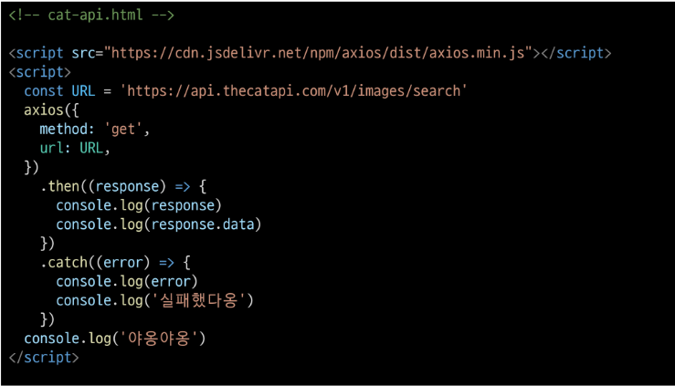
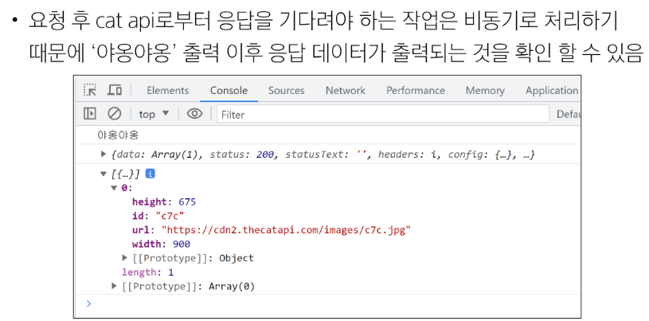

<br>

### 고양이 사진 가져오기 실습 심화

1. 버튼을 누르면  

2. 고양이 이미지를 요청하고  

3. 요청이 처리되어 응답이 오면  

4. 응답 데이터에 있는 이미지 주소 값을 활용해 이미지 출력하기

<br>

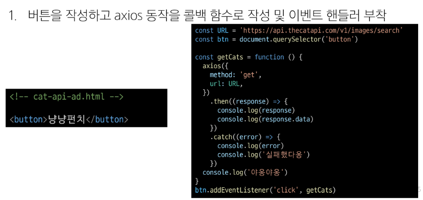
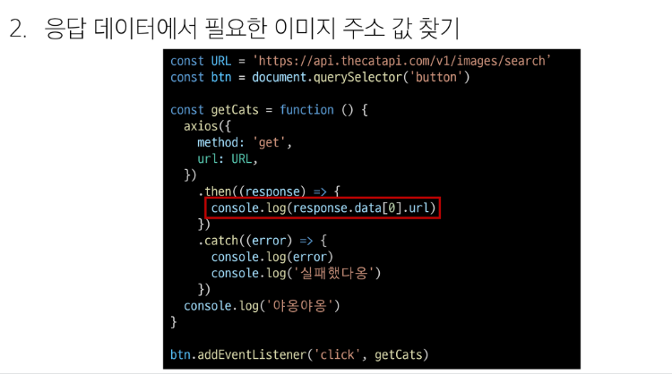
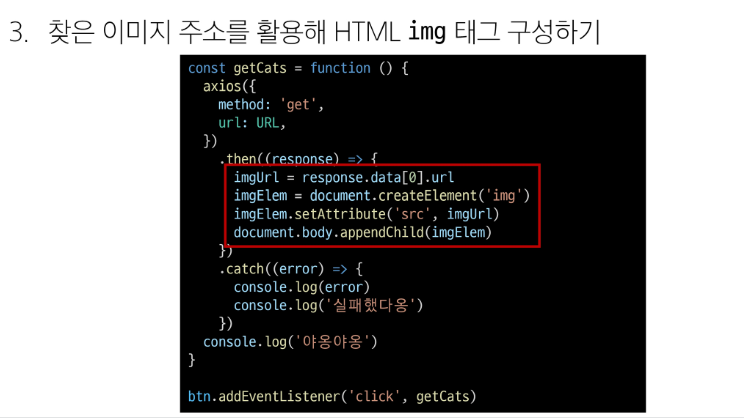

<br>

### 정리

- Ajax

    - 특정한 기술 하나를 의미하는 것이 아니며,  
    비동기적인 웹 애플리케이션 개발에 사용하는 기술들을 묶어서 지칭

<br>

- Axios

    - 클라이언트 및 서버 사이에 HTTP 요청을 만들고 응답을 처리하는 데 사용되는 자바스크립트 라이브러리 (Promise API 지원)

#### 프론트엔드에서 Axios를 활용해 DRF로 만든 API 서버로 요청을 보내서 데이터를 받아온 후 처리하는 로직을 작성하게 됨


&nbsp;


## 4. Callback과 Promise

## 4-1. 비동기 콜백

### 비동기 처리의 단점

- 비동기 처리의 핵심은 Web API로 들어오는 순서가 아니라 **작업이 완료되는 순서에 따라 처리**한다는것

- 그런데 이는 개발자 입장에서 **코드의 실행 순서가 불명확**하다는 단점 존재

- 이와 같은 단점은 실행 결과를 예상하면서 코드를 작성할 수 없게 함

    - 콜백 함수를 사용하자!!

<br>

### 비동기 콜백

- 비동기적으로 처리되는 작업이 완료되었을 때 실행되는 함수

- 연쇄적으로 발생하는 비동기 작업을 **순차적으로 동작**할 수 있게 함

    - 작업의 순서와 동작을 제어하거나 결과를 처리하는 데 사용

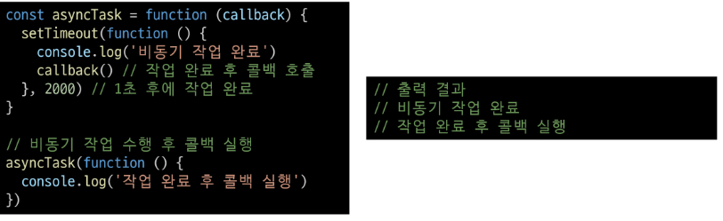

<br>

### 비동기 콜백의 한게

- 비동기 콜백 함수는 보통 어떤 기능의 실행 결과를 받아서 다른 기능을 수행하기 위해 많이 사용됨

- 이 과정을 작성하다 보면 비슷한 패턴이 계속 발생
    - A를 처리해서 결과가 나오면, 첫 번째 callback 함수를 실행하고
    첫 번째 callback 함수가 종료되면, 두 번째 callback 함수를 실행하고
    두 번째 callback 함수가 종료되면, 세 번째 callback 함수를 실행하고 ...

- "콜백 지옥" 발생

<br>

### 콜백 지옥 (Callbaxk Hell)

- 비동기 처리를 위한 콜백을 작성할 때 마주하는 문제

- 코드 작성 형태가 마치 '피라미드와 같다'고 해서 'Pyramid of doom(파멸의 피라미드)' 라고도 부름

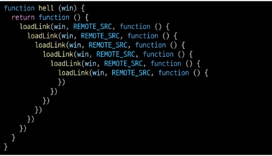

<br>

### 콜백 함수 정리

- 콜백 함수는 비동기 작업을 순차적으로 실행할 수 있게 하는 반드시 필요한 로직

- 비동기 코드를 작성하다 보면 콜백 함수로 인한 콜백 지옥은 빈번히 나타나는 문제이며 이는 코드의 가독성을 해치고 유지 보수가 어려워짐

    - 지옥에 빠지지 않는 다른 표기 형태가 필요하다!


&nbsp;


## 4-2. Promise - 프로미스

- JavaScript에서 비동기 작업의 결과를 나타내는 객체

    - 비동기 작업이 완료되었을 때 결과 값을 반환하거나, 실패 시 에러를 처리할 수 있는 기능을 제공

<br>

### "Promise" object

- 자바스크립트에서 비동기 작업을 처리하기 위한 객체

- 비동기 작업의 성공 또는 실패와 관련된 결과나 값을 나타냄

- 콜백 지옥 문제를 해결하기 위해 등장한 비동기 처리를 위한 객체

- "작업이 끝나면 실행 시켜 줄게" 라는 약속

    - > Promise 기반의 HTTP 클라이언트 라이브러리가 바로 Axios

        - 성공에 대한 약속 then()

        - 실패에 대한 약속 catch()

<br>

### Axios
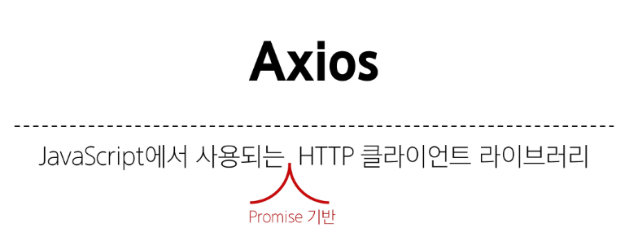

<br>

### 비동기 콜백 vs Promise
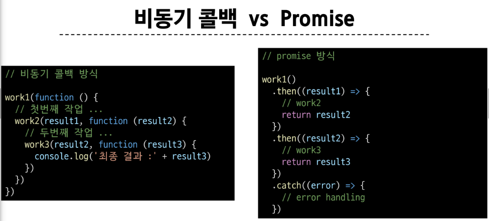

<br>

### then & catch의 chaining

- axios로 처리한 비동기 로직은 항상 promise 객체를 반환

- 즉, then과 catch는 모두 항상 promise 객체를 반환
  - 계속해서 **chaining**을 할 수 있음

- then을 계속 이어 나가면서 작성할 수 있게 됨

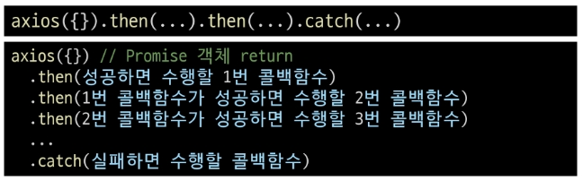

<br>

### then 메서드 chaining의 목적

- 비동기 작업의 **순차적인** 처리 가능

- 코드를 보다 직관적이고 가독성 좋게 작성할 수 있도록 도움

<br>

### then 메서드 chaining의 장점

1. 가독성
    - 비동기 작업의 순서와 의존 관계를 명확히 표현할 수 있어 코드의 가독성이 향상
<br>

2. 에러 처리
    - 각각의 비동기 작업 단계에서 발생하는 에러를 분할에서 처리 가능
<br>

3. 유연성
    - 각 단계마다 필요한 데이터를 가공하거나 다른 비동기 작업을 수행할 수 있어서 더 복잡한 비동기 흐름을 구성할 수 있음
<br>

4. 코드 관리
    - 비동기 작업을 분리하여 구성하면 코드를 관리하기 용이

<br>

### then 메서드 chaining 적용

- chaining을 활용해 cat api 실습 코드 변경하기

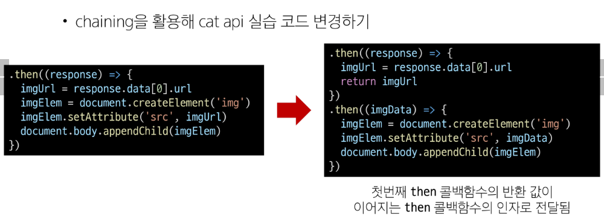

<br>

### Promise가 보장하는 것 (vs 비동기 콜백)

1. 콜백 함수는 JavaScript의 Event Loop가
현재 실행중인 Call Stack을 완료하기 이전에는 절대 호출되지 않음
    - 반면 Promise callback 함수는 Event Queue에 배치되는 엄격한 순서로 호출됨

<br>

2. 비동기 작업이 성공하거나 실패한 뒤에 then 메서드를 이용하여 추가한 경우에도 **호출 순서를 보장**하며 동작

<br>

3. then을 여러 번 사용하여 여러 개의 callback 함수를 추가할 수 있음

    - 각각의 callback은 주어진 순서대로 하나하나 실행하게 됨

    - Chaining은 Promise의 가장 뛰어난 장점


&nbsp;


## 참고

### 비동기를 사용하는 이유 - '사용자 경험'

- 예를 들어 아주 큰 데이터를 불러온 뒤 실행되는 앱이 있을 때, 동기식으로 처리한다면 데이터를 모두 불러온 뒤에서야 앱의 실행 로직이 수행되므로 사용자들은 마치 앱이 멈춘 것과 같은 경험을 겪게 됨

<br>

- 즉, 동기식 처리는 특정 로직이 실행되는 동안 다른 로직 실행을 차단하기 때문에 마치 프로그램이 응답하지 않는 듯한 사용자 경험을 만듦
  
<br>

- 비동기로 처리한다면 먼저 처리되는 부분부터 보여줄 수 있으므로, 사용자 경험에 긍정적인 효과를 볼 수 있음

<br>

- 이와 같은 이유로 많은 웹 기능은 비동기 로직을 사용해서 구현됨