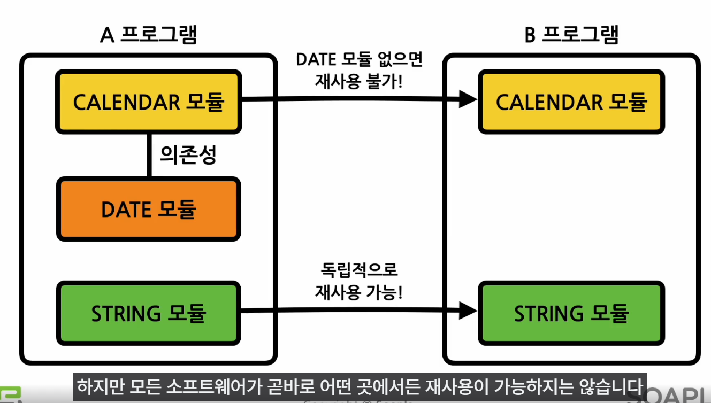

# 리액트 소개

## 리액트는 무엇인가?

### 라이브러리
- 자주 사용되는 기능들을 정리해 모아 놓은 것

### 사용자 인터페이스 - UI
- 사용자와 컴퓨터 프로그램이 서로 상호작용하기 위해 중간에서 입력과 출력을 제어해 주는 것

### UI 프로그램들
- NGULARJS -> google 
    - 프레임워크

- React -> Meta
    - 라이브러리

- Vue.js -> 에반유 라는 중국인 개발자가 시작
    - 프레임워크

### 프레임워크 vs 라이브러리
- 프레임워크는 흐름의 제어 권한을 개발자가 아닌 프레임워크가 갖고 있는 반면에 라이브러리는 흐름에 대한 제어를 하지 않고, 개발자가 필요한 부분만 필요할 때 가져다 사용하는 형태

- 결국 라이브러리는 제어 권한이 개발자에게 있으며 프레임워크는 제어 권한이 프레임워크 자신에게 있다.

#### 웹사이트의 작동 원리와 흐름을 함께 이해하는 것이 중요!

 

## 리액트의 장점과 단점
> 빠른 업데이트(화면에 나타나는 내용이 바뀌는것 ) & 렌더링 속도

### Virtual DOM
- 가상의 DOM

- DOM : Document Object Model -> 웹페이지를 정의하는 하나의 객체 (하나의 웹사이트에 대한 정보를 모두 담고있는 큰 그릇)

> 버츄얼 돔은 웹페이지와 실제 DOM 사이에서 중간 매개체 역할을 하는 것

- 리액트는 DOM을 직접 수정하는 것이 아니라 업데이트해야 할 최소한의 부분만을 찾아서 업데이트함. -> 업데이트 속도 빠름

    - State Change -> Compute Diff -> Re-render

    - 어떤 상태의 변경, 스테이트 체인지가 일어나면 -> 버츄얼 돔에서는 업데이트해야 될 최소한의 부분을 검색, 컴퓨트 딥 -> 검색된 부분만을 업데이트하고 다시 렌더링하면서 변경된 내용을 빠르게 사용자에게 보여줄 수 있음

### Component-Based
- 컴포넌트는 구성 요소라는 뜻

> 재사용성 (Reusability)

- 의존성이 없다면 독립적으로 재사용 가능

- 의존성 외에도 호환성 문제로 재사용이 불가능할 수 있음

- 재사용성이 높아지면 **개발 기간이 단축됨**

- 재사용성이 높아지면 **유지 보수가 용이 함**

    - 재사용성이 높다는 것은 결국 여러 모듈 간의 의존성이 낮다는 뜻

### React Native
> 모바일 환경 UI 프레임웍을 사용해 모바일 앱 개발 가능

- 안드로이드 앱과 ios 앱을 동시에 만들 수 있음
    - 간단한 수준의 앱은 사용자가 차이점을 느끼지 못할 정도로 개발 가능

### 리액트의 단점
- 방대한 학습량

- 높은 상태관리 복잡도

    - state : 리액트 컴포넌트의 상태를 의미

    - 성능 최적화를 위해 이 state를 잘 관리하는 것이 중요!

    - 큰 규모의 프로젝트의 경우 상태 관리를 위해 리덕스, 보백스, 리코일 같은 외부 상태관리 라이브러리를 사용함