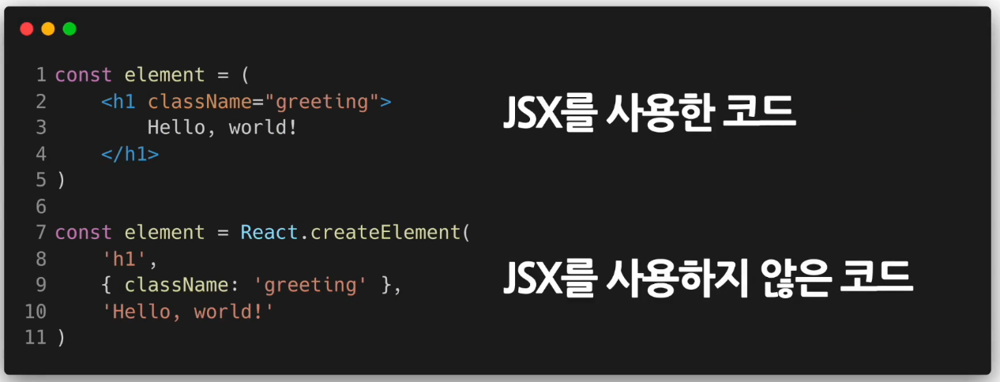
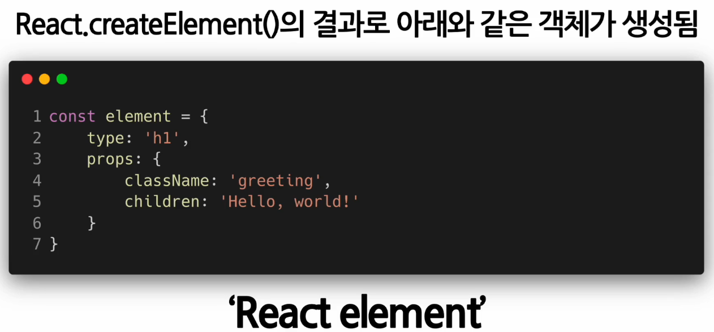
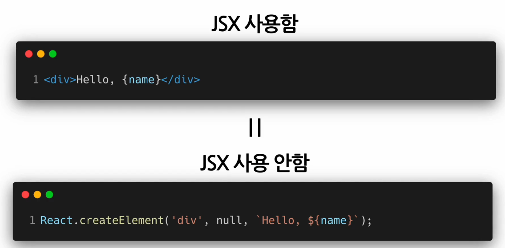
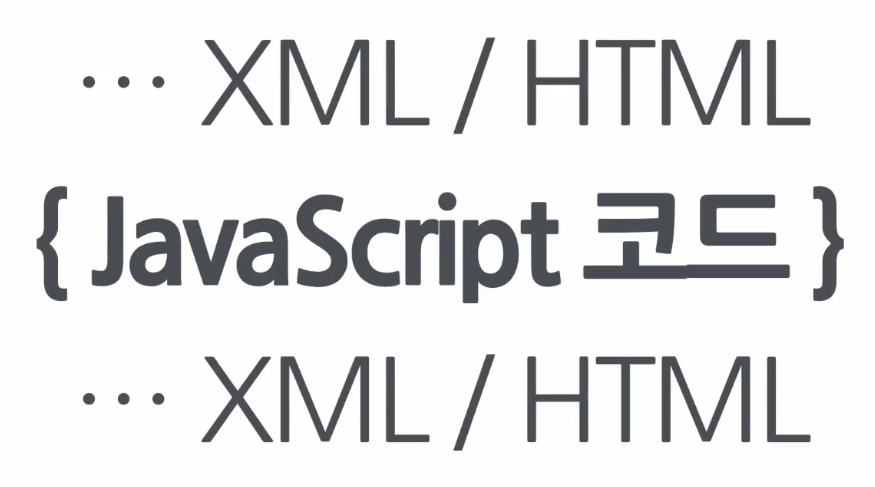
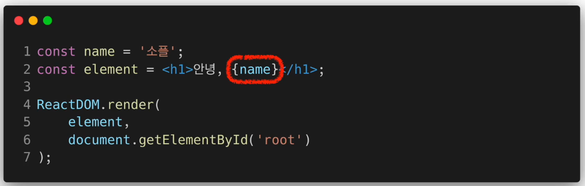
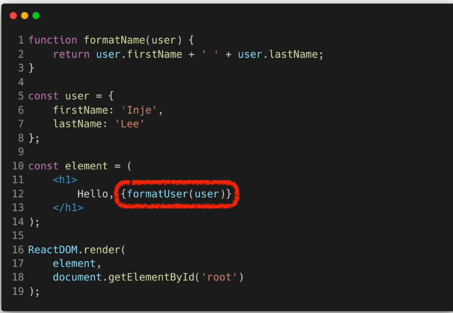
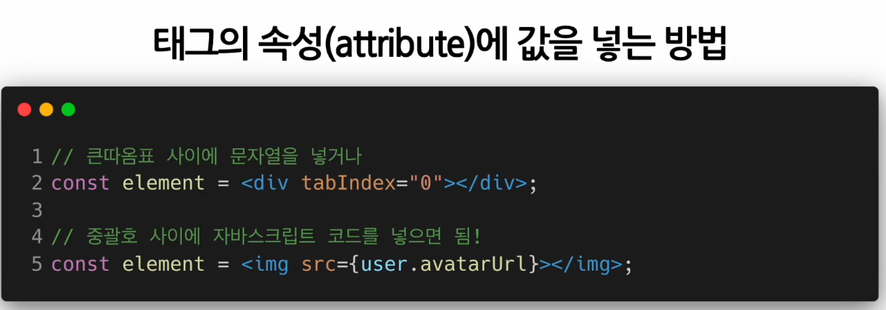

# JSX
> A syntax extension to JavaScript
> 자바스크립트의 확장 문법

- JavaScript + XML / HTML

## JSX의 정의와 역할

### JSX의 역할
- 내부적으로 XML, HTML 코드를 JavaScript로 변환하는 과정을 거침

### createElement 함수

```javascript
React.createElement(
    type,
    [props],
    [...children]
)
```

- JSX 코드를 JavaScript 코드로 변환하는 역할을 하는것

### JSX를 사용한 코드

```javascript
class Hello extends React.Component {
    render() {
        return <div>Hello {this.props.toWhat}</div>
    }
}

ReactDOM.render(
    <Hello toWhat="World" />,
    document.getElementById('root')
)
```

### JSX를 사용하지 않은 코드

```javascript
class Hello extends React.Component {
    render() {
        return React.createElement('div', null, 'Hello ${this.props.toWhat}')
    }
}

ReactDOM.render(
    React.createElement(Hello, { toWhat: 'World' }, null),
    document.getElementById('rood')
)
```
- 순수한 javascript 코드만 사용하여 JSX를 사용했던 코드와 완전히 동일한 역할을 하게 만든 코드



- 모두 동일한 역할



- React는 이 객체들을 읽어서 DOM을 만드는 데 사용하고 항상 최신 상태로 유지함
    
    - react element라 부름

```javascript
React.createElement(
    type,
    [props],
    [...children]
)
```

- 이 코드는 createElement 함수의 파라미터를 나타낸 것

- [...children] : 엘리먼트가 포함하고 있는 자식 엘리먼트

### 리액트에서 JSX를 쓰는 것이 필수는 아님!
- 직접 모든 코드를 createElement 함수를 사용해서 개발 가능

- But! JSX를 사용하면 장점들이 많기 때문에 편리함 -> 코드가 더욱 간결해지고 생산성과 가독성이 올라감


<br>


## JSX의 장점 및 사용법

### 장점

1. 간결한 코드


- JSX를 사용하지 않은 코드는 type props children 이라는 createElement의 파라미터들을 사용하고 있는 것을 볼 수 있음

- 따라서 JSX를 사용한 코드가 더 간결하다!

2. 가독성 향상
- JSX를 사용한 코드가 그렇지 않은 코드에 비해 코드의 의미가 훨씬 더 빠르게 와닿음

- 유지보수 관점에서도 좋음 -> 버그를 발견하기 쉬움!

3. Injection Attacks 방어
- 인젝션 어택이라 불리는 해킹 방법을 방어함으로써 보안성 오름

- 인젝션 어택 : 입력창에 문자나 숫자 같은 일반적인 값이 아닌 소스 코드를 입력하여 해당 코드가 실행되도록 만드는 해킹 방법

```javascript
const title = response.potentiallyMaliciousInput

// 이 코드는 안전합니다.
const element = <h1>{title}</h1>
```

- 기본적으로 React DOM은 렌더링하기 전에 인베딩된 값을 모두 문자열로 변환함. 따라서 명시적으로 선언되지 않은 값은 괄호 사이에 들어갈 수 없음

    - 결과적으로 XSS라 불리는 크로스 사이트 스크립팅 어택을 방어할 수 있음


### JSX 사용법
- 중간에 자바스크립트 코드를 넣고 싶을 때






- 사용자 이름에 따라 다른 인삿말을 표시하도록 만든 컴포넌트

- jsx를 사용할 때 xml, html 코드 사이의 중괄호를 사용해서 자바스크립트 변수나 함수를 사용하면 됨

<br>

HTML 태크 중간이 아닌 태그의 속성에 값을 넣고 싶을 때


- 큰 따옴표 사이에 문자열을 넣거나 중괄호 사이에 자바스크립트 코드를 넣으면 됌

- JSX에서는 중괄호를 사용하면 **무조건** 자바스크립트 코드가 들어간다고 외워두는게 좋다!!


<br>

### JSX를 사용해서 자식(children)을 정의하는 방법

```javascript
const element = (
    <div>
        <h1>안녕하세요</h1>
        <h2>열심히 리액트를 공부해 봅시다!</h2>
    </div>
)
```

- 우리가 평소에 HTML을 사용하듯이 상위 태그가 하위 태그를 둘러싸도록 하면 자연스럽게 칠드런이 정의 됌

> 이처럼 가독성도 높으며 간결하고 직관적으로 코드를 작성할 수 있게 해주는 것이 바로 **JSX 의 역할**