# 목차

1. Frontend Development
   - 1-1. Client-side frameworks
   - 1-2. SPA
  
 

2. Vue
   - 2-1. What is Vue

 

3. Vue Tutorial

&nbsp;

## 1. Frontend Development

## 1-1. Client-side frameworks

### Frontend Development
- 웹사이트와 웹 애플리케이션의 사용자 인터페이스(UI)와 사용자 경험(UX)을 만들고 디자인하는 것

> HTML, CSS, JavaScript 등을 활용하여 사용자가 직접 상호작용하는 부분을 개발

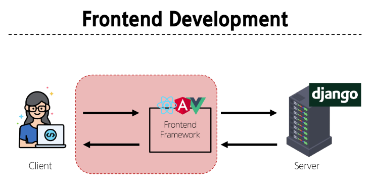

 

### Client-side frameworks
- 클라이언트 측에서 UI와 상호작용을 개발하기 위해 사용되는 JavaScript 기반 프레임워크

 

### Client-side frameworks가 필요한 이유 - 1
- 웹에서 하는 일이 많아졌다

- 단순히 무언가를 읽는 곳 -> 무언가를 하는 곳

- 사용자는 이제 웹에서 문서만을 읽는 것이 아닌 음악을 스트리밍하고, 영화를 보고, 지구 반대편 사람들과 텍스트 및 영상 채팅을 통해 즉시 통신하고 있음

> 이처럼 현대적이고 복잡한 대화형 웹 사이트를
> 웹 애플리케이션 - web application 이라 부름

- JavaScript 기반의 Client-side frameworks가 등장하면서 매우 동적인 대화형 애플리케이션을 훨씬 더 쉽게 구축할 수 있게 됨

 

### Client-side frameworks가 필요한 이유 - 2
- 다루는 데이터가 많아졌다

- 만약 인스타에서 친구가 이름을 변경했다면?
  
- 친구 목록, 피드, 스토리 등 친구 이름이 출력되는 모든 곳이 함께 변경되어야 함

- 애플리케이션의 기본 데이터를 안정적으로 추적하고 업데이트 (렌더링, 추가, 삭제 등) 하는 도구가 필요

> 애플리케이션의 상태를 변경할 때마다 일치하도록 UI를 업데이트해야 함

 

### 바닐라 자바스크립트 만으로는 쉽지 않다
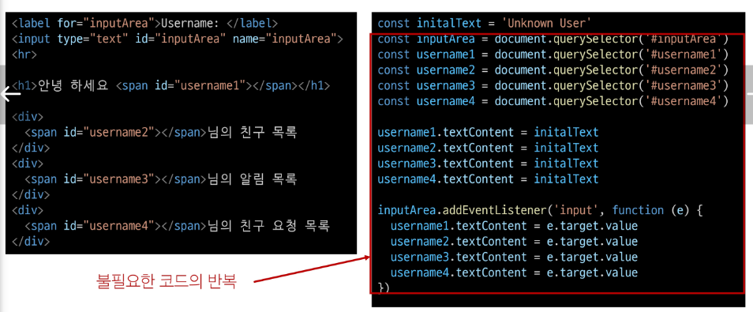

&nbsp;

## 1-2. SPA

### Single Page Appllication - SPA
- 단일 페이지로 구성된 애플리케이션

- 하나의 HTML 파일로 시작하여, 사용자가 상호작용할 때마다 페이지 전체를 새로 로드하지 않고 화면의 필요한 부분만 동적으로 갱신

- 대부분 JavaScript 프레임워크를 사용하여 클라이언트 측에서 UI와 렌더링을 관리

> CSR 방식 사용

 

### Client-side Rendering - CSR
- 클라이언트에서 화면을 렌더링 하는 방식

 

### CSR 동작 과정
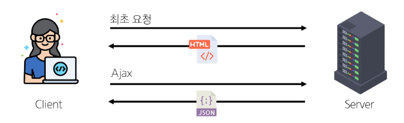
 

1. 브라우저는 서버로부터 최소한의 HTML 페이지와 해당 페이지에 필요한 JavaScript 응답 받음

2. 그런 다음 클라이언트 측에서 JavaScript를 사용하여 DOM을 업데이트하고 페이지를 렌더링

3. 이후 서버는 더 이상 HTML을 제공하지 않고 요청에 필요한 데이터만 응답

> Google Maps, Facebook, Instagram 등의 서비스에서 페이지 갱신 시 새로고침이 없는 이유

 

### CSR 장점

1. 빠른 페이지 전환
   - 페이지가 처음 로드된 후에는 필요한 데이터만 가져오면 되고 JavaScript는 전체 페이지를 새로 고칠 필요 없이 페이지의 일부를 다시 렌더링할 수 있기 때문

   - 서버로 전송되는 데이터의 양을 최소화 (서버 부하 방지)

 

2. 사용자 경험
   - 새로고침이 발생하지 않아 네이티브 앱과 유사한 사용자 경험을 제공

 

3. Frontend와 Backend의 명확한 분리
   - Frontend는 UI 렌더링 및 사용자 상호 작용 처리를 담당 & Backend는 데이터 및 API 제공을 담당

   - 대규모 애플리케이션을 더 쉽게 개발하고 유지 관리 가능

 

### CSR 단점

1. 느린 초기 로드 속도
   - 전체 페이지를 보기 전에 약간의 지연을 느낄 수 있음
   
   - JavaScript가 다운로드, 구문 분석 및 실행될 때까지 페이지가 완전히 렌더링 되지 않기 때문

 

2. SEO(검색 엔진 최적화) 문제
   - 페이지를 나중에 그려 나가는 것이기 때문에 검색에 잘 노출되지 않을 수 있음

   - 검색엔진 입장에서 HTML을 읽어서 분석해야 하는데 아직 콘텐츠가 모두 존재하지 않기 때문

 

### SPA vs MPA  /  CSR vs SSR
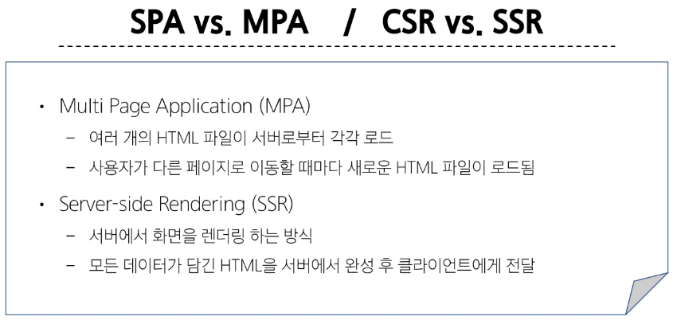

&nbsp;

## Vue
- 사용자 인터페이스를 구축하기 위한 JavaScript 프레임워크

 

### Vue를 학습하는 이유

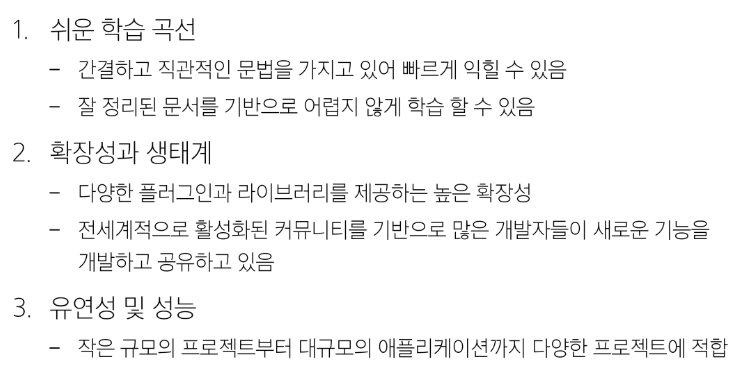
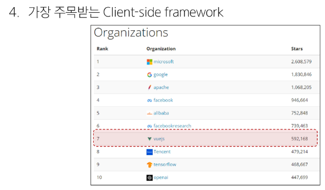

 

### Vue의 2가지 핵심 기능

1. 선언적 렌더링 (Declarative Rendering)
   - 표준 HTML을 확장하는 "템플릿 구문"을 사용하여 JavaScript 상태(데이터)를 기반으로 화면에 출력될 HTML을 선언적으로 작성

 

2. 반응성 (Reactivity)
   - JavaScript 상태(데이터) 변경을 추적하고, 변경사항이 발생하면 자동으로 DOM을 업데이트

&nbsp;

## 3. Vue Tutorial

### Vue를 사용하는 방법
1. CDN 방식
2. NPM 설치 방식

 

### 첫번째 Vue 작성하기
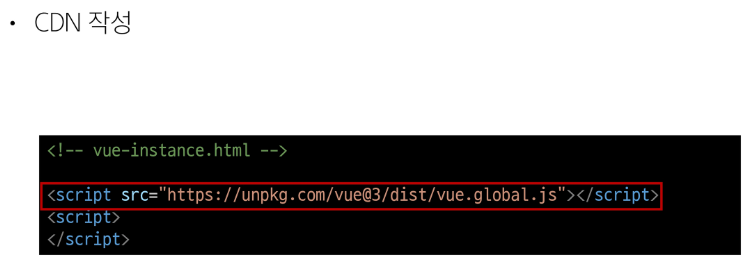
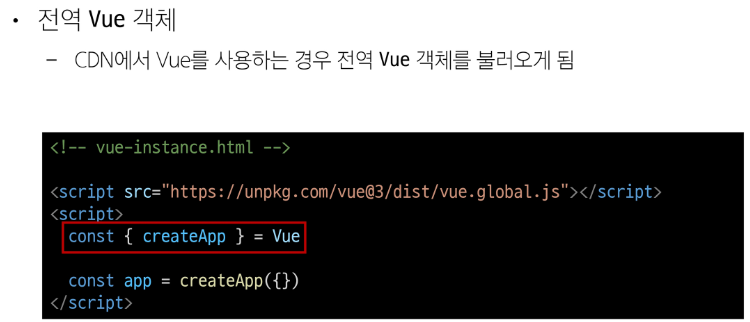
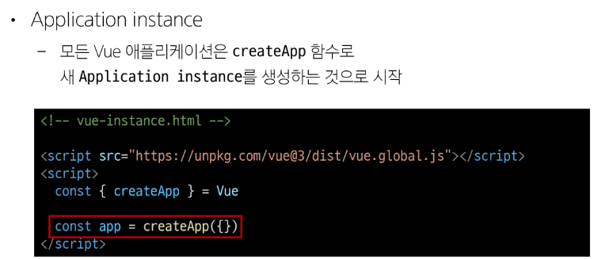
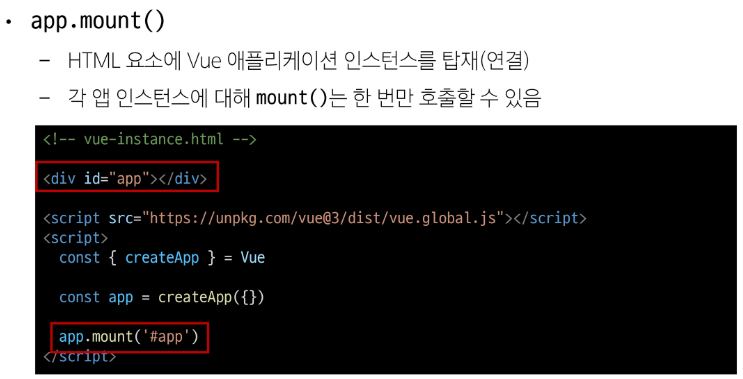

 

### ref()
- 반응형 상태(데이터)를 선언하는 함수

 

### ref 함수

- .value 속성이 있는 ref 객체로 래핑(wrapping)하여 반환하는 함수

- ref로 선언된 변수의 값이 변경되면, 해당 값을 사용하는 템플릿에서 자동으로 업데이트

- 인자는 어떠한 타입도 가능

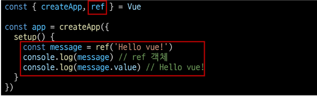

 

- 템플릿의 참조에 접근하려면 setup 함수에서 선언 및 반환 필요

- 편의상 템플릿에서 ref를 사용할 때는 .value를 작성할 필요 없음 (automatically unwrapped)

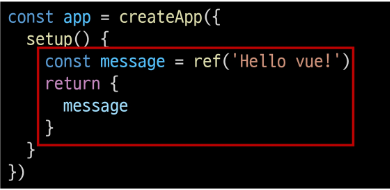

 

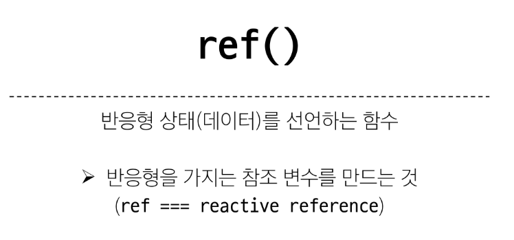

 

### Vue 기본 구조

- createApp()에 전달되는 객체는 Vue 컴포넌트(Component)

- 컴포넌트의 상태는 setup() 함수 내에서 선언되어야 하며 **객체를 반환해야 함**

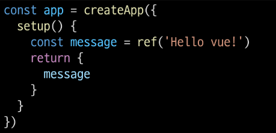

 

### 템플릿 렌더링

- 반환된 객체의 속성은 템플릿에서 사용할 수 있음

- Mustache syntax(콧수염 구문)를 사용하여 메시지 값을 기반으로 동적 텍스트를 렌더링

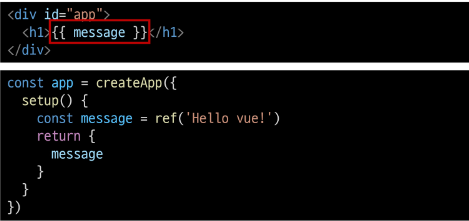

 

- 콘텐츠는 식별자나 경로에만 국한되지 않으며 유효한 JavaScript 표현식을 사용할 수 있음

 

### Event Listeners in Vue

- 'v-on' directive를 사용하여 DOM 이벤트를 수신할 수 있음

- 함수 내에서 반응형 변수를 변경하여 구성 요소 상태를 업데이트

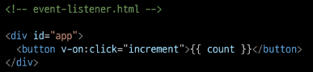
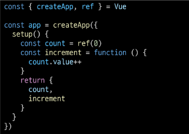

&nbsp;

## 참고

### Ref Unwrap 주의사항

- 템플릿에서의 unwrap은 ref가 최상위 속성인 경우에만 적용 가능

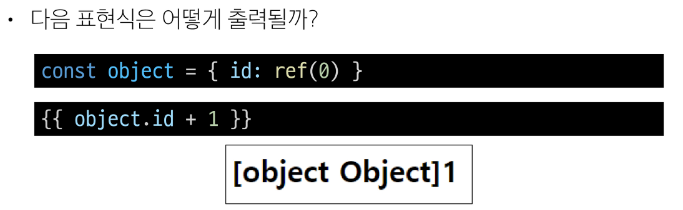

> object는 최상위 속성이지만 object.id는 그렇지 않음
> 표현식을 평가할 때 object.id가 unwrap 되지 않고 ref 객체로 남아 있기 때문

 

- 이 문제를 해결하기 위해서는 "id를 최상위 속성으로 분해"해야 함

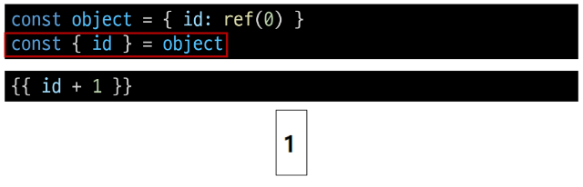

 

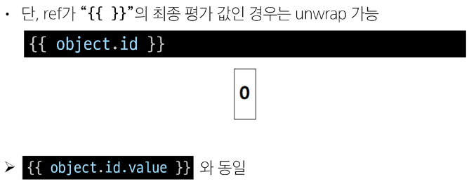

 

### ref 객체가 필요한 이유

- 일반적인 변수가 아닌 객체 데이터 타입으로 사용하는 이유는?

- Vue는 템플릿에서 ref를 사용하고 나중에 ref의 값을 변경하면 자동으로 변경 사항을 감지하고 그에 따라 DOM을 업데이트 함 (의존성 추적 기반의 반응형 시스템)

- Vue는 렌더링 중에 사용된 모든 ref를 추적하며, 나중에 ref가 변경되면 이를 추적하는 구성 요소에 대해 다시 렌더링

- 이를 위해서 참조 자료형의 객체 타입으로 구현한 것

> JavaScript에서는 일반 변수의 접근 또는 변형을 감지할 방법이 없기 때문

 

### 반응형 변수 vs 일반 변수

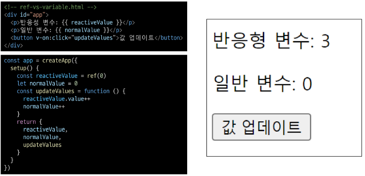

 

### SEO (Search Engine Optimization)

- google, bing과 같은 검색 엔진 등에 내 서비스나 제품 등이 효율적으로 검색 엔진에 노출되도록 개선하는 과정을 일컫는 작업

- 정보의 대상은 주로 HTML에 작성된 내용

- 검색
   - 각 사이트가 운용하는 검색 엔진에 의해 이루어지는 작업

- 검색 엔진
   - 웹 상에 존재하는 가능한 모든 정보들을 긁어 모으는 방식으로 동작

- SPA 서비스도 검색 대상으로 넓히기 위해 JS를 지원하는 방식으로 발전하는 중

 

### CSR & SSR

- CSR과 SSR은 흑과 백이 아님

- 애플리케이션의 목적, 규모, 성능 및 SEO 요구 사항에 따라 달라질 수 있음
   - 내 서비스에 작힙힌 렌더링 방식을 적절하게 활용할 수 있어야 함

- SPA 서비스에도 SSR을 지원하는 Framework가 발전하고 있음
   - Vue의 Next.js
   - React의 Next.js