# 목차
1. Single-File Components
   - 1-1. Component
   - 1-2. SFC 문법

<br>

2. SFC build tool
   - 2-1. Vite
   - 2-2. NPM
   - 2-3. 모듈과 번들러

<br>

3. Vue 프로젝트
    - 3-1. 프로젝트 구조

<br>

4. Vue Component 활용

<br>

5. 추가 주제


&nbsp;


## 1. Single-File Components

## 1-1. Component

- 재사용 가능한 코드 블록

<br>

### Component 특징

- UI를 독립적이고 재사용 가능한 일부분으로 분할하고 각 부분을 개별적으로 다룰 수 있음

    - 자연스럽게 애플리케이션은 중첩된 Component의 트리 형태로 구성됨

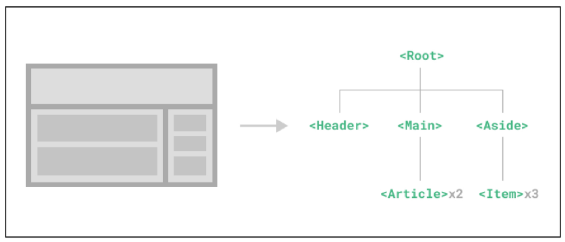

<br>

### Component 예시
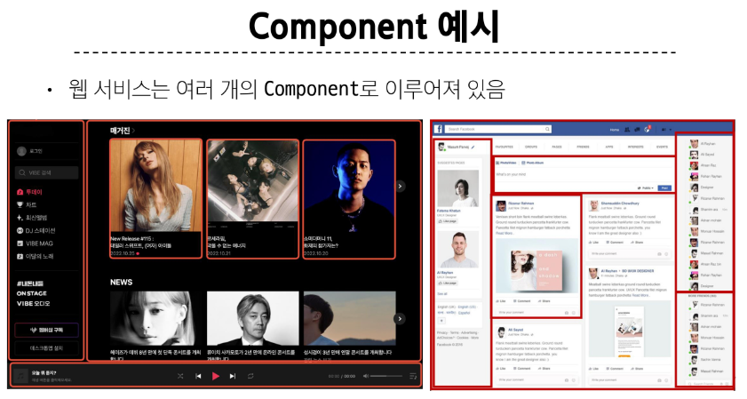

<br>

### Single-File Components - SFC

- 컴포넌트의 템플릿, 로직 및 스타일을 하나의 파일로 묶어낸 특수한 파일 형식  
**(*.vue 파일)**

<br>

### SFC 파일 예시

```
- Vue SFC는 HTML, CSS 및 JavaScript를 단일 파일로 합친 것

- <template>, <script> 및 <style> 블록은 하나의 파일에서 컴포넌트의 뷰, 로직 및 스타일을 독립적으로 배치

```
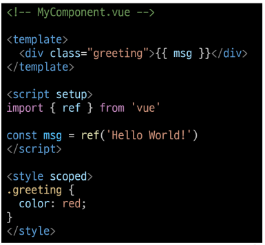

&nbsp;

## 1-2. SFC 문법

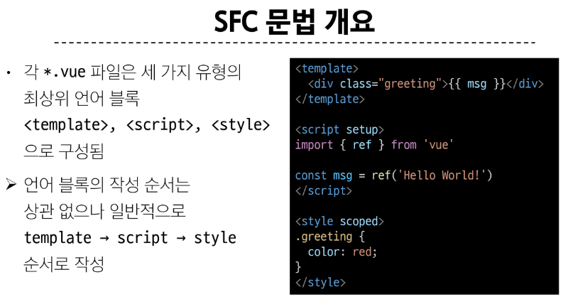
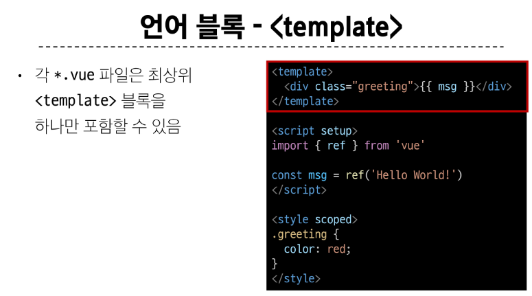
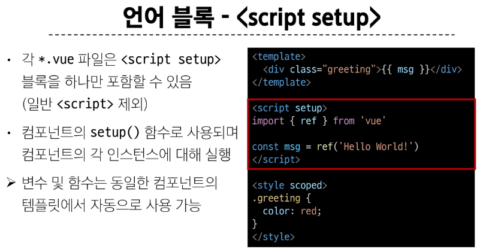
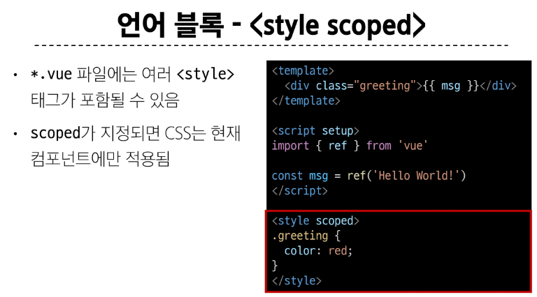
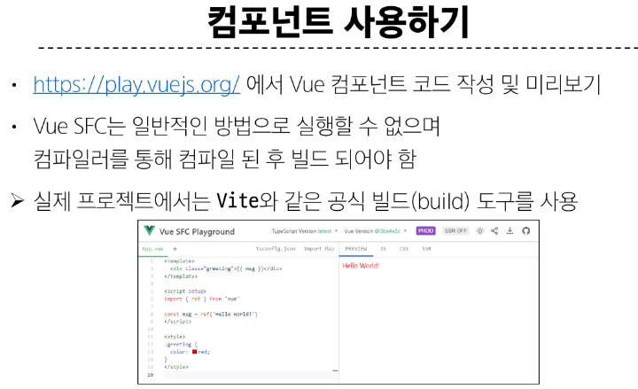


&nbsp;


## 2. SFC build tool

## 2-1. Vite

- 프론트 엔드 개발 도구
    - 빠른 개발 환경을 위한 빌드 도구와 개발 서버를 제공
    - https://vitejs.dev/
  
<br>

### Build

- 프로젝트의 소스 코드를 최적화하고 번들링하여 배포할 수 있는 형식으로 변환하는 과정

- 개발 중에 사용되는 여러 소스 파일 및 리소스(JavaScript, CSS, 이미지 등)를 최적화된 형태로 조합하여 최종 소프트웨어 제품을 생성하는 것

> Vite는 이러한 빌드 프로세스를 수행하는 데 사용되는 도구

<br>

### Vite 튜토리얼

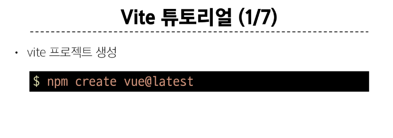
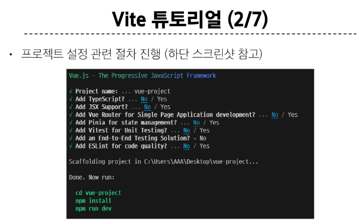
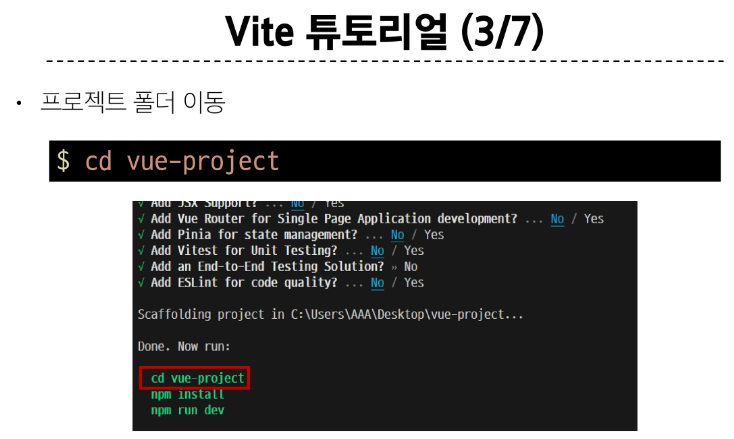
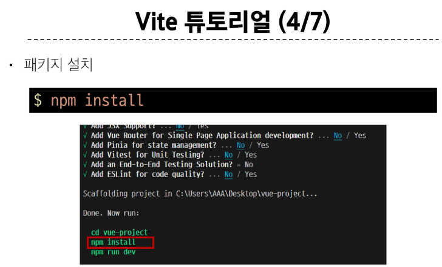
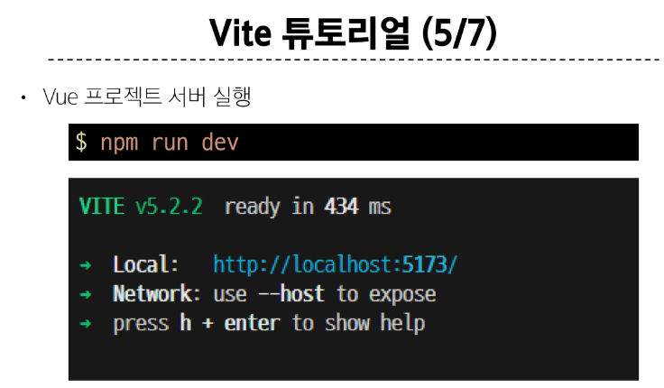
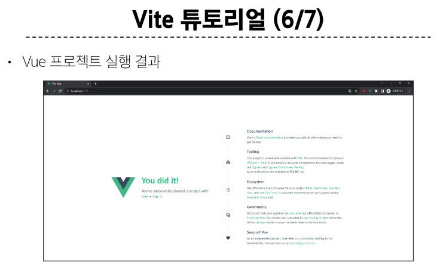
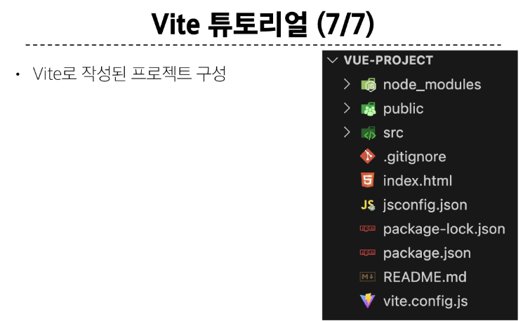

&nbsp;

## 2-2. Node Package Manager - NPM

- Node.js의 기본 패키지 관리자

<br>


<br>

### Node.js의 영향

- 기존에 브라우저 안에서만 동작할 수 있었던 JavaScript를 브라우저가 아닌 서버 측에서도 실행할 수 있게 함

    - 프론트엔드와 백엔드에서 동일한 언어로 개발할 수 있게 됨

- NPM을 활용해 수많은 오픈 소스 패키지와 라이브러리를 제공하여 개발자들이 손쉽게 코드를 공유하고 재사용할 수 있게 함

&nbsp;

## 2-3. 모듈과 번들러

### Module

- 프로그램을 구성하는 독립적인 코드 블록  
  **(*.js 파일)**

<br>

### Module의 필요성

- 개발하는 애플리케이션의 크기가 커지고 복잡해지면서 파일 하나에 모든 기능을 담기가 어려워 짐

- 따라서 자연스럽게 파일을 여러 개로 분리하여 관리를 하게 되었고, 이때 분리된 각 파일이 바로 모듈(module)

> *.js 파일 하나가 하나의 모듈!

<br>

### Module의 한계

- 하지만 애플리케이션이 점점 더 발전함에 따라 처리해야 하는 JavaScript 모듈의 개수도 극적으로 증가

- 이러한 상황에서 성능 병목 현상이 발생하고 모듈 간의 의존성(연결성)이 깊어지면서 특정한 곳에서 발생한 문제가 어떤 모듈 간의 문제인지 파악하기 어려워 짐

- 복잡하고 깊은 모듈 간 의존성 문제를 해결하기 위한 도구가 필요
  - Bundler

<br>

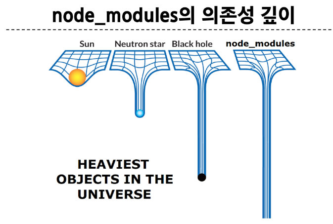

<br>

### Bundler

- 여러 모듈과 파일을 하나(혹은 여러 개)의 번들로 묶어 최적화하여 애플리케이션에서 사용할 수 있게 만들어주는 도구

<br>

### Bundler의 역할

- 의존성 관리, 코드 최적화, 리소스 관리 등

- Bundler가 하는 작업을 Bundling이라 함

> [참고] Vite는 Rollup이라는 Bundler를 사용하며 개발자가 별도로 기타 환경설정에 신경 쓰지 않도록 모두 설정해두고 있음


&nbsp;


## 3. Vue 프로젝트

## 3-1. 프로젝트 구조

### node_modules

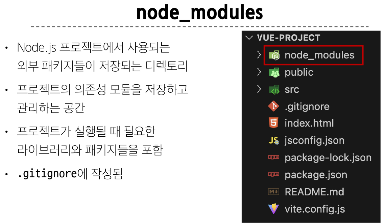

<br>

### package-lock.json

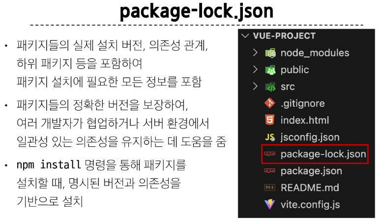

<br>

### package.json

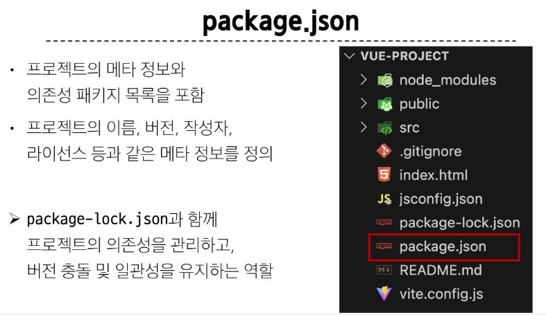

<br>

### public 디렉토리

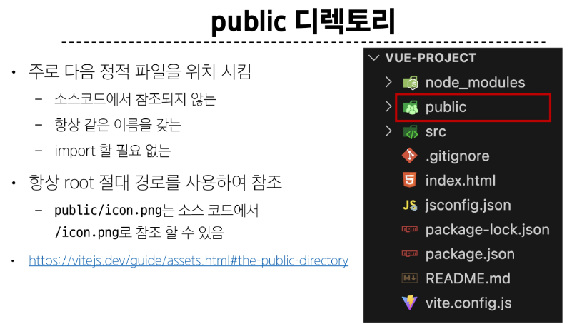

<br>

### src 디렉토리

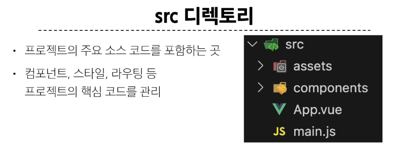

<br>

### src/assets

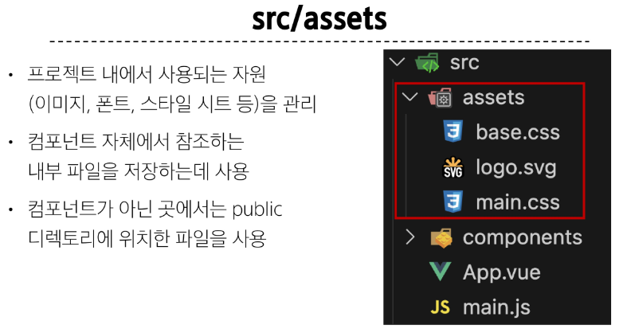

<br>

### src / components

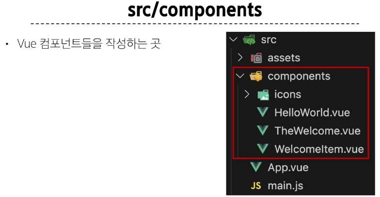

<br>

### src/App.vue

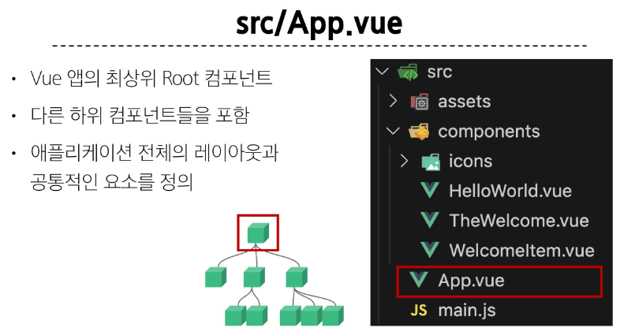

<br>

### src/main.js

- 장고의 settings 역할

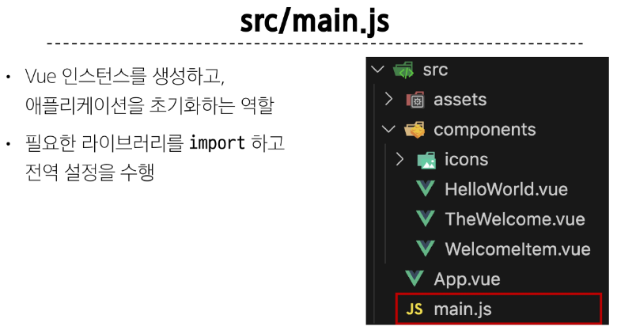

<br>

### index.html

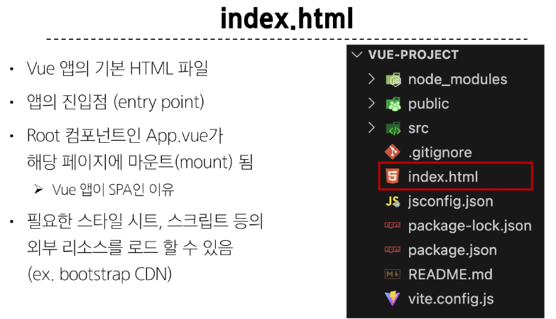

<br>

### 기타 설정 파일

- 별도로 수정할 필요 없음

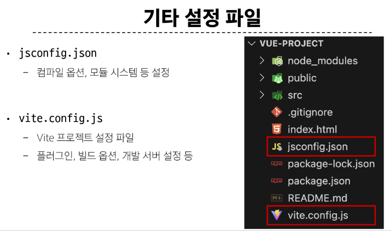


&nbsp;


## 4. Vue Component 활용

### 컴포넌트 사용 2단계

1. 컴포넌트 파일 생성
2. 컴포넌트 등록 (import)

<br>

### 사전 준비

1. 초기에 생성된 모든 컴포넌트 삭제 (App.vue 제외)
2. App.vue 코드 초기화


<br>

57p