# 목차

1. Passing Props
  - 1-1. Props
  - 1-2. Props 선언
  - 1-3. Props 세부사항
  - 1-4. Props 활용

<br>

2. Component Events
  - 2-1. Emit
  - 2-2. 이벤트 발신 및 수신
  - 2-3. emit 이벤트 선언
  - 2-4. 이벤트 전달
  - 2-5. 이벤트 세부사항
  - 2-6. emit 이벤트 활용


&nbsp;


## 1. Passing Props

## 1-1. Props

### 같은 데이터 하지만 다른 컴포넌트

- 동일한 사진 데이터가 한 화면에 다양한 위치에서 여러 번 출력됨

- 하지만 해당 페이지를 구성하는 컴포넌트가 여러 개라면 각 컴포넌트가 개별적으로 동일한 데이터를 관리해야 할까?

- 그렇다면 사진을 변경 해야 할 때 모든 컴포넌트에 대해 변경 요청을 해야 함

> 공통된 부모 컴포넌트에서 관리하자!

<br>

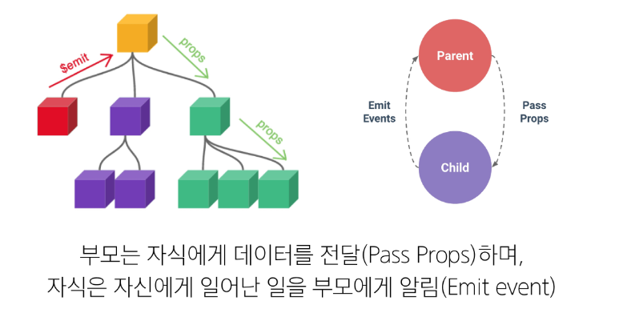

<br>

### Props

- 부모 컴포넌트로부터 자식 컴포넌트로 데이터를 전달하는데 사용되는 속성

### Props 특징

- 부모 속성이 업데이트되면 자식으로 전달 되지만 그 반대는 안됨

- 즉, 자식 컴포넌트 내부에서 props를 변경하려고 시도해서는 안되며 불가능

- 또한 부모 컴포넌트가 업데이트될 때마다 이를 사용하는 자식 컴포넌트의 모든 props가 최신 값으로 업데이트 됨

> 부모 컴포넌트에서만 변경하고 이를 내려 받는 자식 컴포넌트는 자연스럽게 갱신

<br>

### One-Way Data Flow

- 모든 props는 자식 속성과 부모 속성 사이에 **하향식 단방향 바인딩**을 형성 (one-way-down binding)

### 단방향인 이유

- 하위 컴포넌트가 실수로 상위 컴포넌트의 상태를 변경하여 앱에서의 데이터 흐름을 이해하기 어렵게 만드는 것을 방지하기 위함

> 데이터 흐름의 "일관성" 및 "단순화"


&nbsp;


## 1-2. Props 선언

### 사전 준비

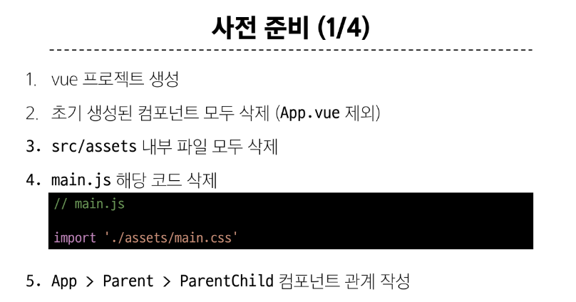
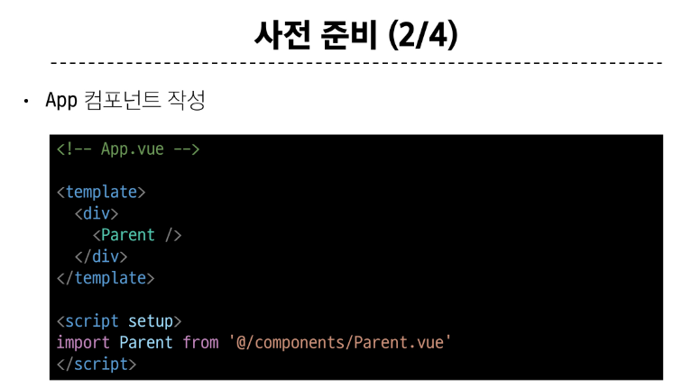
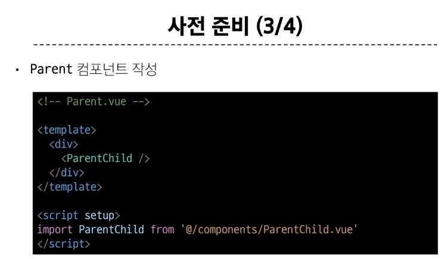
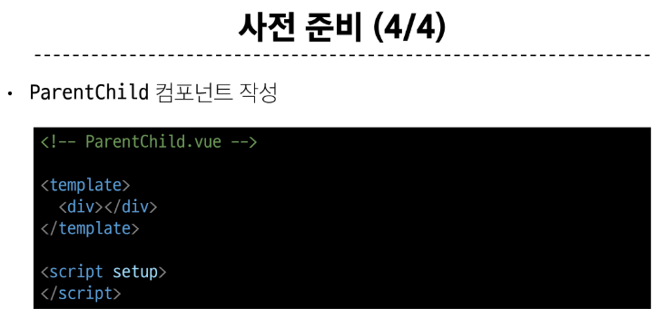

<br>

### Props 선언

- 부모 컴포넌트에서 내려 보낸 props를 사용하기 위해서는 자식 컴포넌트에서 명시적인 props 선언이 필요

### Props 작성

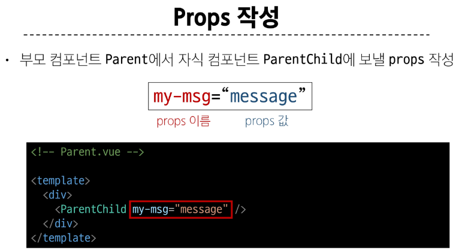

### Props 선언

- defineProps()를 사용하여 props를 선언

- defineProps()에 작성하는 인자의 데이터 타입에 따라 선언 방식이 나뉨

```javascript
<script setup>
defineProps()
</script>
```

### Props 선언 2가지 방식

1. "문자열 배열"을 사용한 선언

2. "객체"를 사용한 선언

<br>

### 1. 문자열 배열을 사용한 선언

- 배열의 문자열 요소로 props 선언

- 문자열 요소의 이름은 전달된 props의 이름

```javascript
// ParentChild.vue

<script>
defineProps(['myMsg'])
</script>
```

<br>

### 2. 객체를 사용한 선언

- 각 객체 속성의 키가 전달받은 props 이름이 되며, 객체 속성의 값은 값이 될 데이터의 타입에 해당하는 생성자 함수 (Number, String...)여야 함

> 객체 선언 문법 사용 권장

```javascript
// ParentChild.vue

<script setup>
defineProps({
  myMsg: String  
})
<script>

```

<br>

### props 데이터 사용

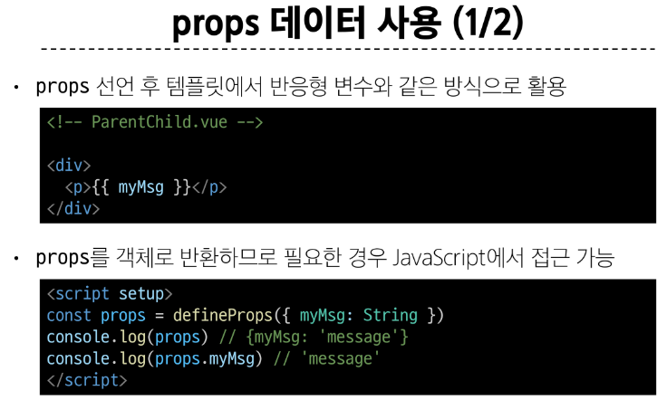
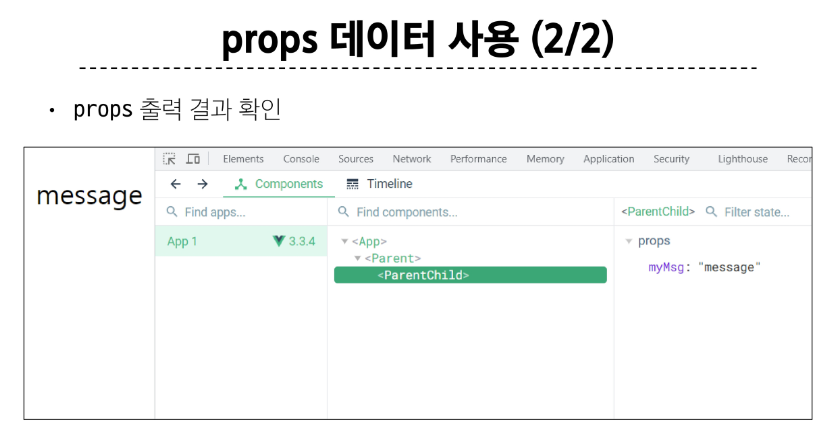

<br>

### 한 단계 더 props 내려 보내기

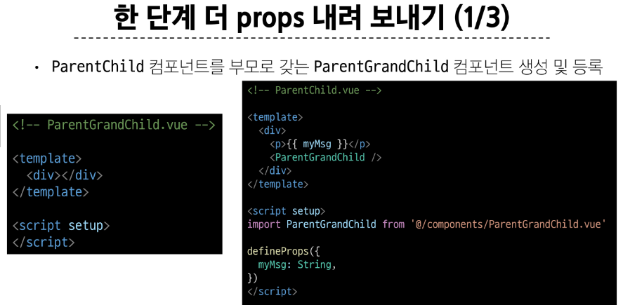
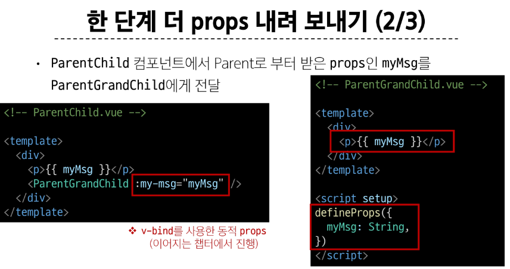
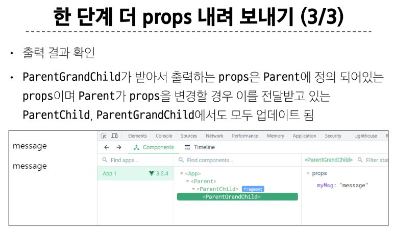


&nbsp;


## 1-3. Props 세부사항

1. Props Name Casing (Props 이름 컨벤션)

2. Static Props 와 Dynamic Props

<br>

### 1. Props Name Casing

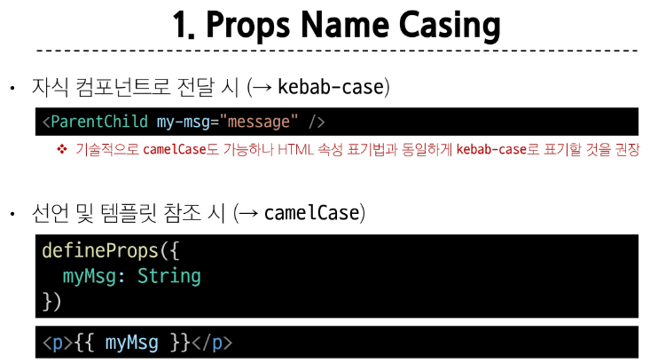

<br>

### 2. Static props & Dynamic props

- 지금까지 작성한 것은 Static(정적) props

- v-bind를 사용하여 **동적으로 할당된 props**를 사용할 수 있음

1. Dynamic props 정의

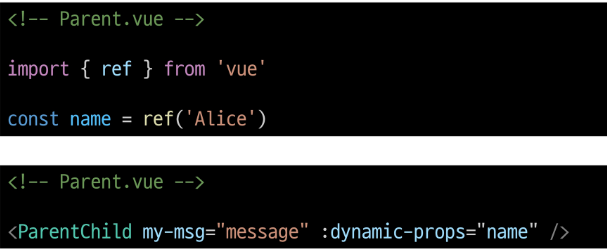

<br>

2. Dynamic props 선언 및 출력

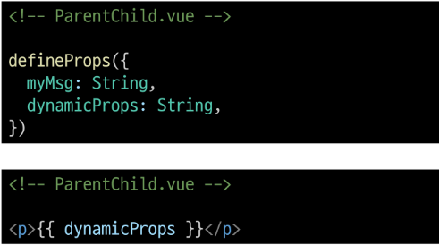

<br>

3. Dynamic props 출력 확인

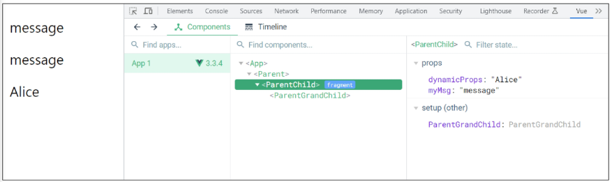


&nbsp;


## 1-4. Props 활용

### 다른 디렉티브와 함께 사용

- v-for와 함께 사용하여 반복되는 요소를 props로 전달하기

- ParentItem 컴포넌트 생성 및 Parent의 하위 컴포넌트로 등록

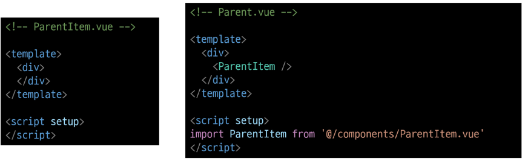

<br>

- 데이터 정의 및 v-for 디렉티브의 반복 요소로 활용

- 각 반복 요소를 props로 내려 보내기

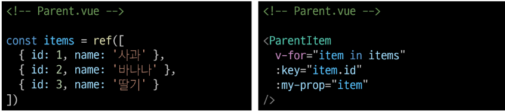

<br>

- props 선언 및 출력 결과 확인

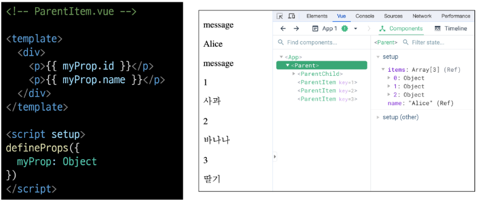


&nbsp;


## 2. Component Events

## 2-1. Emit

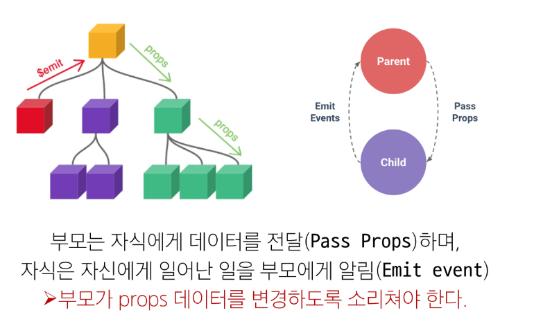

<br>

### $emit()

- 자식 컴포넌트가 이벤트를 발생시켜 부모 컴포넌트로 데이터를 전달하는 역할의 메서드

  - '$' 표기는 Vue 인스턴스의 내부 변수들을 가리킴

  - Life cycle hooks, 인스턴스 메서드 등 내부 특정 속성에 접근할 때 사용

<br>

### emit 메서드 구조

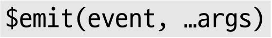

- event
  - 커스텀 이벤트 이름

- args
  - 추가 인자


&nbsp;


## 2-2. 이벤트 발신 및 수신

- Emitting and Listening to Events

- $emit을 사용하여 템플릿 표현식에서 직접 사용자 정의 이벤트를 발신

```javascript
<button @click="$emit('someEvent')">클릭</button>
```

- 그런 다음 부모는 v-on을 사용하여 수신할 수 있음

```javascript
<ParentComp @some-event="someCallback"/>
```

<br>

### 이벤트 발신 및 수신하기

- ParentChild에서 someEvent라는 이름의 사용자 정의 이벤트를 발신

```javascript
// ParentChild.vue

<button @click="$emit('someEvent')">클릭</button>
```

<br>

- ParentChild의 부모 Parent는 v-on을 사용하여 발신된 이벤트를 수신

- 수신 후 처리할 로직 및 콜백함수 호출

```javascript
// Parent.vue

<ParentChild @some-event="someCallback" my-msg="message" :dynamic-props="name">
```

```javascript
// Parent.vue

const someCallback = function () {
  console.log('ParentChild가 발신한 이벤트를 수신했어요.')
}
```

<br>

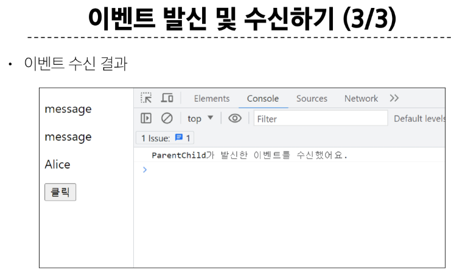


&nbsp;


## 2-3. emit 이벤트 선언

- defineEmits()를 사용하여 발신할 이벤트를 선언

- props와 마찬가지로 defineEmits()에 작성하는 인자의 데이터 타입에 따라 선언 방식이 나뉨 (배열, 객체)

- defineEmits()는 $emit 대신 사용할 수 있는 동등한 함수를 반환 (script에서는 $emit 메서드를 접근할 수 없기 때문)

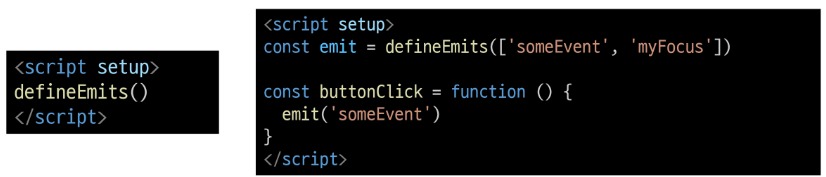

<br>

### 이벤트 선언 활용

- 이벤트 선언 방식으로 추가 버튼 작성 및 결과 확인

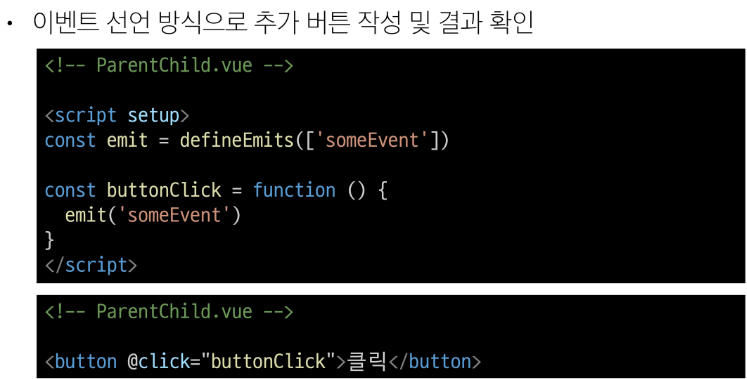


&nbsp;


## 2-4. 이벤트 전달

### 이벤트 인자 (Event Arguments)

- 이벤트 발신 시 추가 인자를 전달하여 값을 제공할 수 있음

### 이벤트 인자 전달 활용

- ParentChild에서 이벤트를 발신하여 Parent로 추가 인자 전달하기

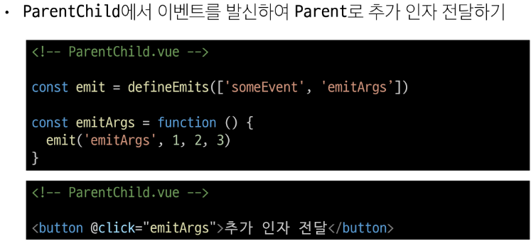

<br>

- ParentChild에서 발신한 이벤트를 Parent에서 수신

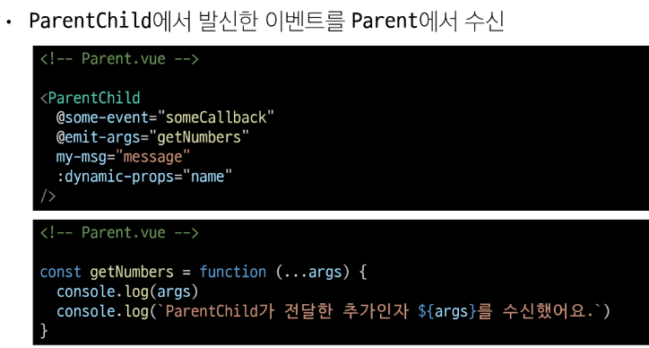

<br>

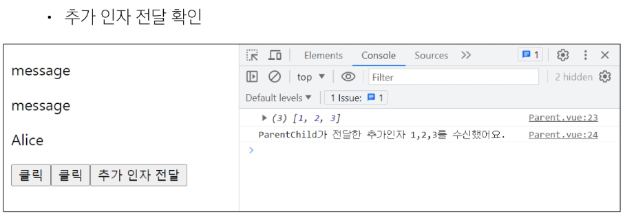


&nbsp;


## 2-5. 이벤트 세부사항

### Event Name Casing

- 선언 및 발신 시 -> camelCase

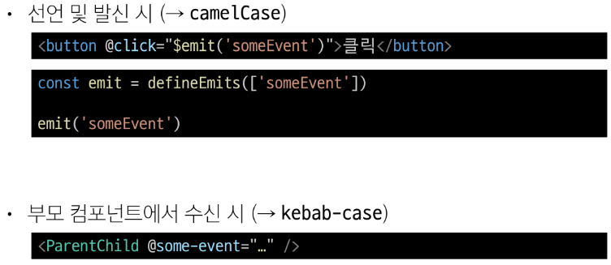

&nbsp;

## 2-6. emit 이벤트 활용

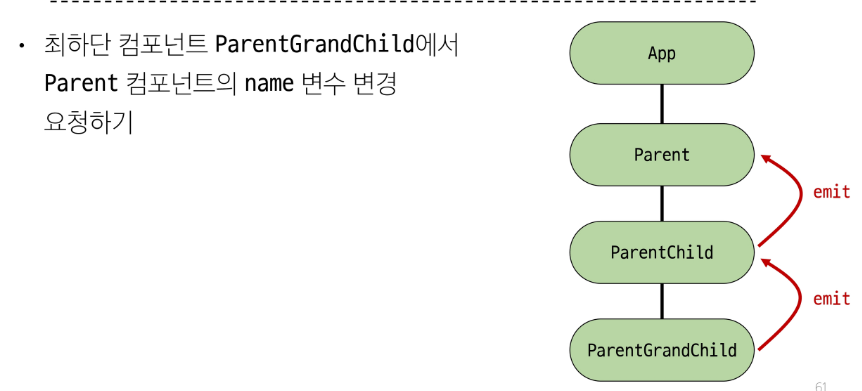

<br>

### emit 이벤트 실습 구현

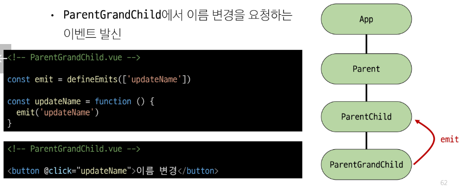
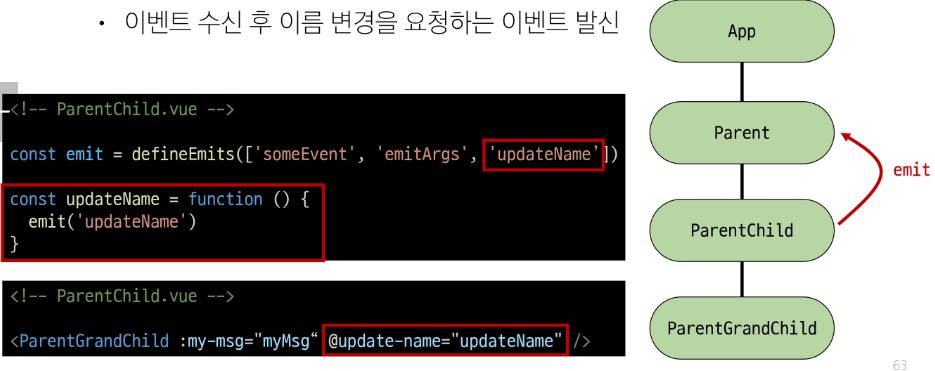
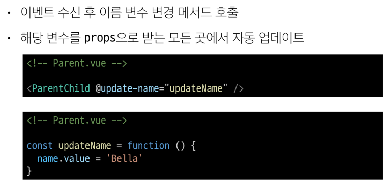
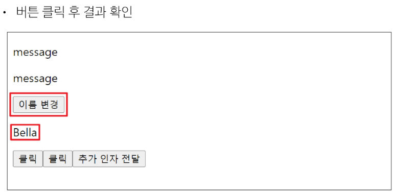


&nbsp;


## 참고

### 주위!!!  -  정적 & 동적 props

- 첫 번째는 정적 props로 문자열 "1"을 전달

- 두 번째는 동적 props로 숫자 1을 전달

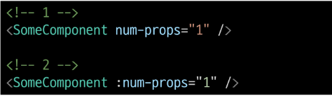

<br>

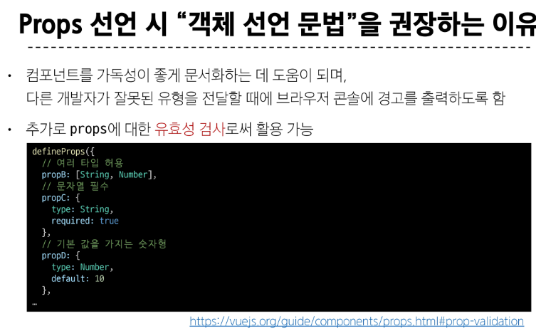

<br>

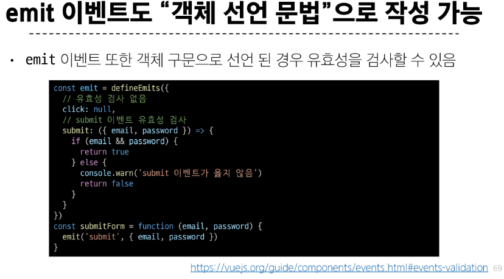