# 목차

1. State Management

<br>

2. State Management library (Pinia)
  - 2-1. Pinia
  - 2-2. Pinia 구조
  - 2-3. Pinia 구성 요소 활용

<br>

3. Pinia 실습
  - 3-1. Read Todo
  - 3-2. Create Todo
  - 3-3. Delete Todo
  - 3-4. Update Todo
  - 3-5. Counting Todo
  - 3-6. Local Storage


&nbsp;


## 1. State Management - 상태 관리
- Vue 컴포넌트는 이미 반응형 상태를 관리하고 있음

> 상태 === 데이터

<br>

### 컴포넌트 구조의 단순화

- 상태 (State)
  - 앱 구동에 필요한 기본 데이터

- 뷰 (View)
  - 상태를 선언적으로 매핑하여 시각화

- 기능 (Actions)
  - 뷰에서 사용자 입력에 대해 반응적으로 상태를 변경 할 수 있게 정의된 동작

> "단방향 데이터 흐름"의 간단한 표현

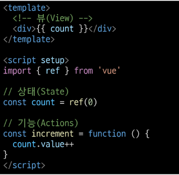

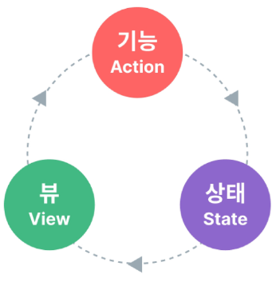

<br>

### 상태 관리의 단순성이 무너지는 시점

- 여러 컴포넌트가 상태를 공유할 때
1. 여러 뷰가 동일한 상태에 종속되는 경우
2. 서로 다른 뷰의 기능이 동일한 상태를 변경시켜야 하는 경우

<br>

1. 여러 뷰가 동일한 상태에 종속되는 경우
- 공유 상태를 공통 조상 컴포넌트로 "끌어올린" 다음 props로 전달하는 것

- 하지만 계층 구조가 깊어질 경우 비효율적, 관리가 어려워 짐

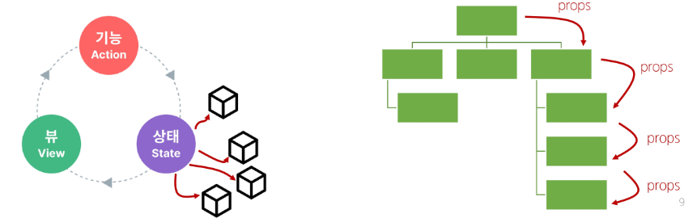

<br>

2. 서로 다른 뷰의 기능이 동일한 상태를 변경시켜야 하는 경우
- 발신(emit)된 이벤트를 통해 상태의 여러 복사본을 변경 및 동기화 하는 것

- 마찬가지로 관리의 패턴이 깨지기 쉽고 유지 관리할 수 없는 코드가 됨


<br>

### 해결책
- 각 컴포넌트의 공유 상태를 추출하여, 전역에서 참조할 수 있는 저장소에서 관리

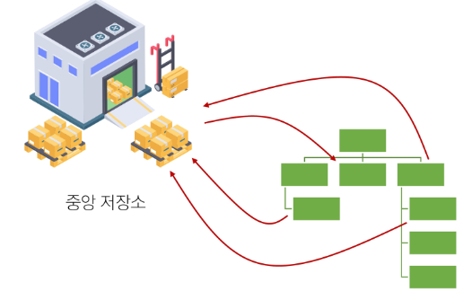

<br>

- 각 컴포넌트의 공유 상태를 추출하여, 전역에서 참조할 수 있는 저장소에서 관리

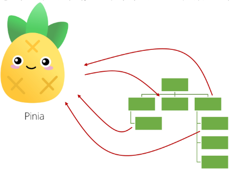

<br>

- 컴포넌트 트리는 하나의 큰 View가 되고 모든 컴포넌트는 트리 계층 구조에 관계없이 상태에 접근하거나 기능을 사용할 수 있음

> Vue의 공식 상태 관리 라이브러리 === 'Pinia'

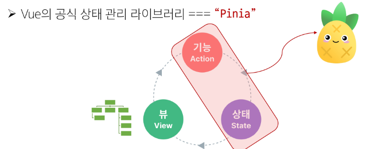


&nbsp;


## 2. State Management library (Pinia)

## 2-1. Pinia
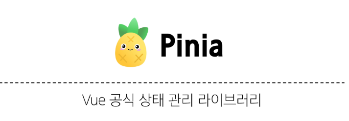

<br>

### Pinia 설치
- Vite 프로젝트 빌드 시 Pinia 라이브러리 추가

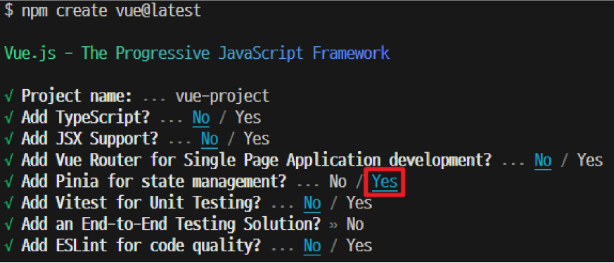

<br>

### Vue 프로젝트 구조 변화

- stores 폴더 신규 생성


&nbsp;


## 2-1. Pinia 구조
### Pinia 구성 요소
1. store

2. state

3. getters

4. actions

5. plugin

<br>

### 1. Pinia 구성 요소 - 'store'
- 중앙 저장소

- 모든 컴포넌트가 공유하는 상태, 기능 등이 작성됨

> defineStore()의 반환 값의 이름은 use와 store를 사용하는 것을 권장

> defineStore()의 첫번째 인자는 애플리케이션 전체에 걸쳐 사용하는 store의 고유 ID

```javascript
// stores/counter.js

import {ref, computed} from 'vue'
import {defineStore} from 'pinia'

export const useCounterStore = defineStore('counter', () => {

  const count = ref(0)

  const doubleCount = computed(() => count.value * 2)

  const increment = function() {
    count.value++
  }

  return { count, doubleCount, increment}
})
```

<br>

### 2. Pinia 구성 요소 - 'state'

- 반응형 상태(데이터)

- ref() === state

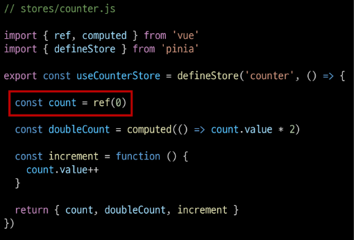

<br>

### 3. Pinia 구성 요소 - 'getters'
- 계산된 값

- computed() === getters

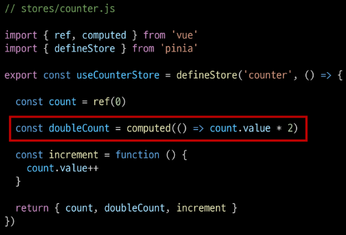

<br>

### 4. Pinia 구성 요소 - 'actions'
- 메서드

- function() === actions

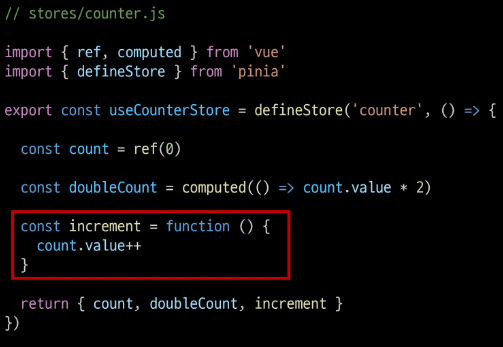

<br>

### Setup Stores의 반환 값
- Pinia의 상태들을 사용하려면 반드시 반환해야 함

> store에서는 공유 하지 않는 private한 상태 속성을 가지지 않음

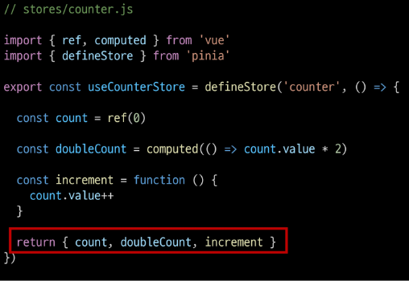

<br>

### 5. Pinia 구성 요소 - 'plugin'
- 애플리케이션의 상태 관리에 필요한 추가 기능을 제공하거나 확장하는 도구나 모듈

- 애플리케이션의 상태 관리를 더욱 간편하고 유연하게 만들어주며 패키지 매니저로 설치 이후 별도 설정을 통해 추가 됨

<br>

### Pinia 구성 요소 정리
- Pinia는 store라는 저장소를 가짐

- store는 state, getters, actions으로 이루어지며 각각 ref(), computed(), function()과 동일함