# 목차

1. Bootstrap

- Reset CSS

 

2. Bootstrap 활용

- Typography

- Colors

- Component

 

3. Semantic Web

- Semantic in HTML

- Semantic in CSS

&nbsp;

# 1. Bootstrap

CSS 프론트엔드 프레임워크 (Toollkit)

> 미리 만들어진 다양한 디자인 요소들을 제공하여 웹 사이트를 빠르고 쉽게 개발할 수 있도록 함

### CDN - Content Delivery Network

지리적 제약 없이 빠르고 안전하게 콘텐츠를 전송할 수 있는 전송 기술

- 서버와 사용자 사이의 물리적인 거리를 줄여 콘텐츠 로딩에 소요되는 시간을 최소화 (웹 페이지 로드 속도를 높임)

- 지리적으로 사용자와 가까운 CDN 서버에 콘텐츠를 저장해서 사용자에게 전달

- Bootstrap CDN : 온라인 CDN 서버에 업로드 된 CSS 및 js 파일을 불러와서 사용하는 것

 

### Bootstrap 기본 사용법

**mt-5**

~~~~

Hello, world!

~~~~

{property}{sides}-{size}

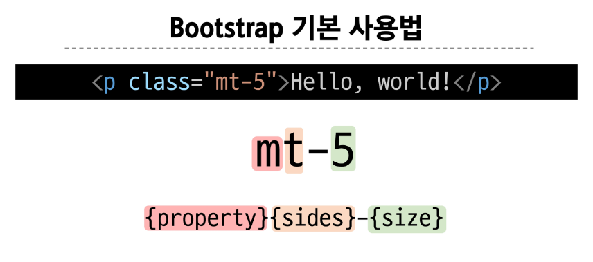

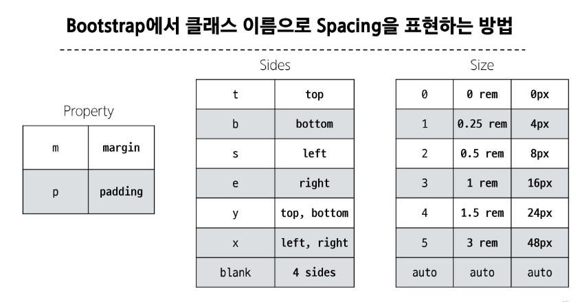

> 부트스트랩에는 특정한 규칙이 있는 클래스 이름으로 스타일 및 레이아웃이 미리 작성되어 있음

## 1-1. Reset CSS

모든 HTML 요소 스타일을 일관된 기준으로 재설정하는 간결하고 압축된 규칙 세트

-> HTML Element, Table, List 등의 요소들에 일관성 있게 스타일을 적용 시키는 기본 단계

### Reset CSS 사용 배경

- 모든 브라우저는 각자의 'user agent stylesheet'를 가지고 있음
  - 웹사이트를 보다 읽기 편하게 하기 위해

- 문제는 이 설정이 브라우저마다 상이하다는 것

- 모든 브라우저에서 웹사이트를 동일하게 보이게 만들어야 하는 개발자에겐 매우 골치 아픈 일

> 모두 똑같은 스타일 상태로 만들고 스타일 개발을 시작하자 !

 

### Normalize CSS

- Reset CSS 방법 중 대표적인 방법

- 웹 표준 기준으롤 브라우저 중 하나가 불일치 한다면 차이가 있는 브라우저를 수정하는 방법
  - 경우에 따라 IE 또는 EDGE 브라우저는 표준에 따라 수정할 수 없는 경우도 있는데, 이 경우 IE 또는 EDGE의 스타일을 나머지 브라우저에 적용시킴

### Bootstrap에서의 Reset CSS

- 부트스트랩은 bootstrap-reboot.css 라는 파일명으로 normalize.css를 자체적으로 커스텀해서 사용하고 있음

&nbsp;

# 2. Bootstrap 활용

## 2-1. Typography

제목, 본문 텍스트, 목록 등

1. Display headings
기존 Heading 보다 더 눈에 띄는 제목이 필요할 경우 (더 크고 약간 다른 스타일)

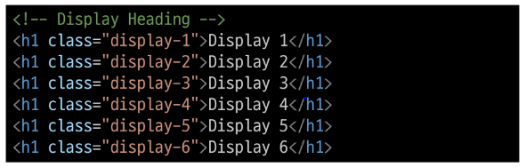

2. Inline text elements
HTML inline 요소에 대한 스타일

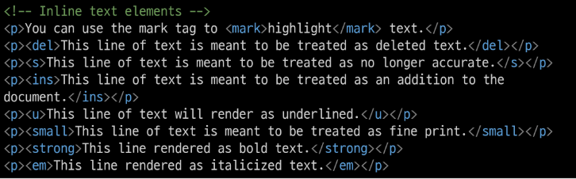

3. Lists
HTML list 요소에 대한 스타일

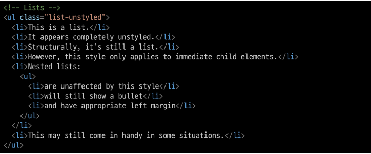

 

## 2-2. Colors

- Bootstrap Color system : Bootstrap이 지정하고 제공하는 색상 시스템

- Colors : Text, Border, Background 및 다양한 요소에 사용하는 Bootstrap의 색상 키워드

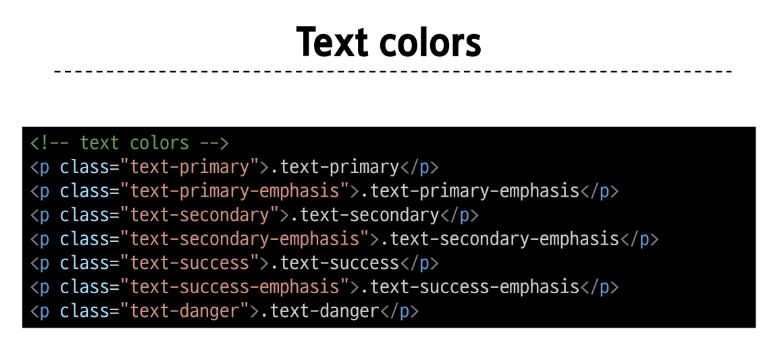

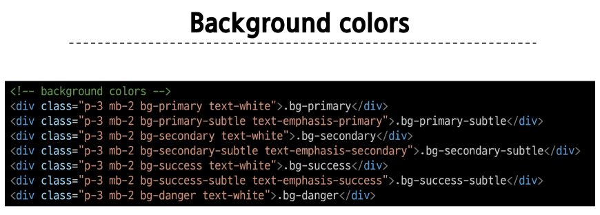

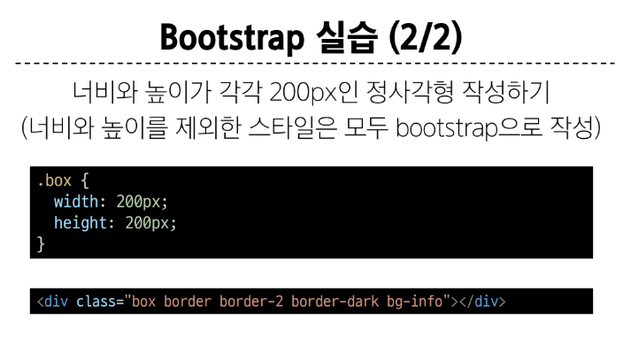

 

## 2-3. Component

- Bootstrap Component : Bootstrap에서 제공하는 **UI 관련 요소**
  - 버튼, 네비게이션 바, 카드, 폼, 드롭다운 등

  > 일관된 디자인을 제공하여 웹사이트 구성 요소를 구축하는데 유용하게 활용

### 대표 Component

- Alerts

- Badges

- Buttons

- Cards

- Navbar

 

### 참고

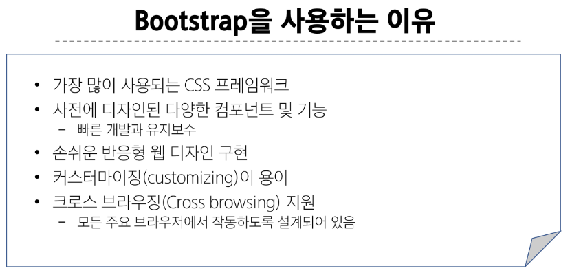

&nbsp;

# 3. Semantic Web

웹 데이터를 의미론적으로 구조화된 형태로 표현하는 방식  

이 요소가 시각적으로 어떻게 보여질까? -> 이 요소가 가진 목적과 역할은 무엇일까?

## 3-1. Semantic in HTML

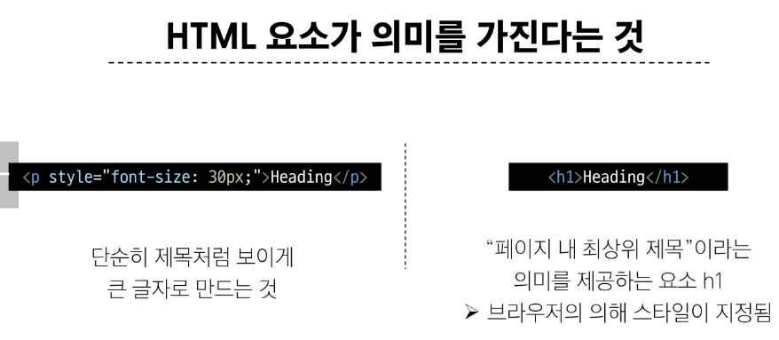

 

### HTML Semantic Element

기본적인 모양과 기능 이외에 의미를 가지는 HTML 요소

> 검색엔진 및 개발자가 웹 페이지 콘텐츠를 이해하기 쉽도록

- 대표적인 Semantic Element
  - header

  - nav

  - main

  - article

  - section

  - aside

  - footer

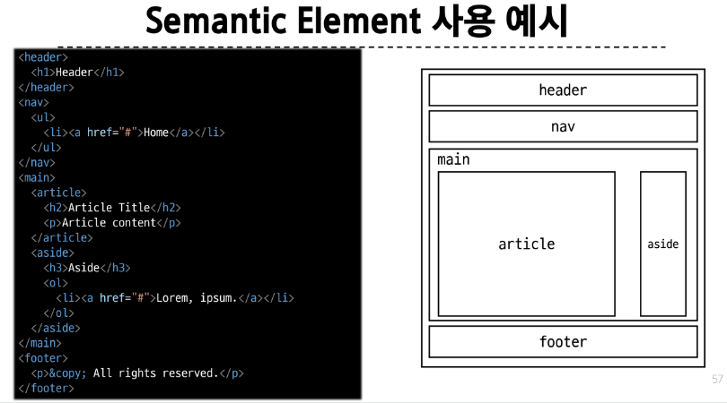

 

## 3-2. Semantic in CSS

- CSS 방법론 : CSS를 효율적이고 유지 보수가 용이하게 작성하기 위한 일련의 가이드라인

### OOCSS (Object Oriented CSS)

객체 지향적 접근법을 적용하여 CSS를 구성하는 방법론

- OOCSS 기본 원칙
    1. 구조와 스킨을 분리
        - 구조와 스킨을 분리함으로써 재사용 가능성을 높임
        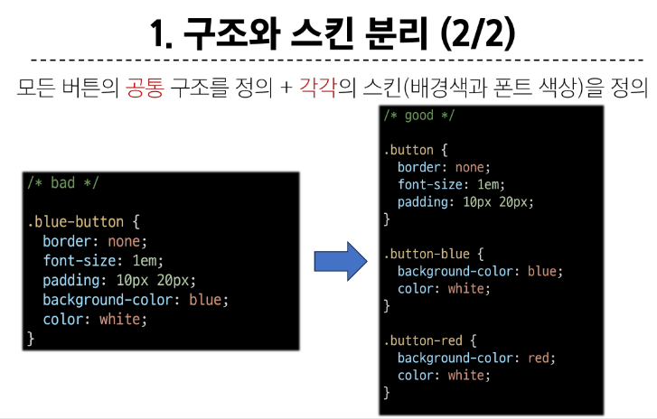

    2. 컨테이너와 콘텐츠를 분리
        - 객체에 직접 적용하는 대신 객체를 둘러싸는 컨테이너에 스타일을 적용

        - 스타일을 정의할 때 위치에 의존적인 스타일을 사용하지 않도록 함

        - 콘텐츠를 다른 컨테이너로 이동시키거나 재배치할 때 스타일이 깨지는것을 방지
        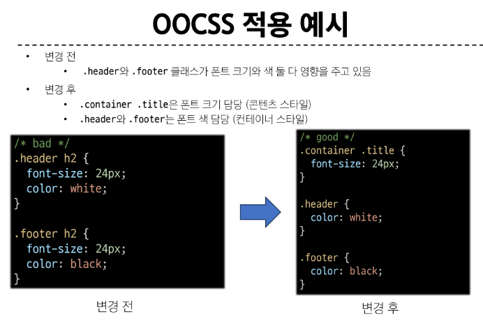

 

### 참고

책임과 역할

- HTML : 콘텐츠의 구조와 의미

- CSS : 레이아웃과 디자인

 

의미론적인 마크업이 필요한 이유

- 검색엔진 최적화 (SEO)
  - 검색 엔진이 해당 웹 사이트를 분석하기 쉽게 만들어 검색 순위에 영향을 줌

  - 웹 접근성 (Web Accessibility)
    - 웹 사이트, 도구, 기술이 고령자나 장애를 가진 사용자들이 사용할 수 있도록 설계 및 개발하는 것

    - ex) 스크린 리더를 통해 전맹 시각장애 사용자에게 웹의 글씨를 읽어줌
