# 목차

1. Bootstrap Grid system
    - Grid system 구조

2. Grid system for responsive web
    - grid system Breakpoints

3. CSS Layout 종합 정리

 

# 1. Bootstrap Grid system

웹 페이지의 레이아웃을 조정하는 데 사용되는 **12개의 컬럼**으로 구성된 시스템

- Grid system의 목적 : 반응형 디자인을 지원해 웹 페이지를 모바일, 태블릿, 데스크탑 등 다양한 기기에서 적절하게 표시할 수 있도록 도움

- 반응형 웹 디자인 (Responsive Web Design) : 디바이스 종류나 화면 크기에 상관없이, 어디서든 일관된 레이아웃 및 사용자 경험을 제공하는 디자인 기술

### Grid system 기본 요소

1. Container
    - Column들을 담고 있는 공간

2. Column
    - 실제 컨텐츠를 포함하는 부분

3. Gutter
    - 컬럼과 컬럼 사이의 여백 영역

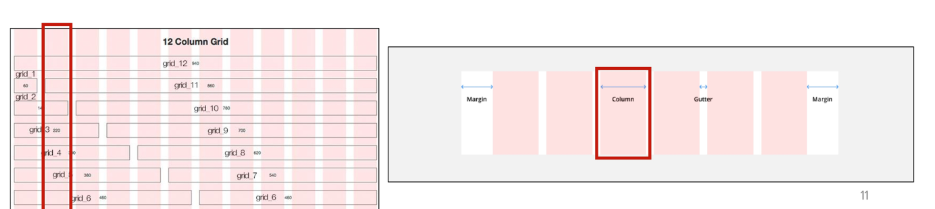

4. 1개의 row안에 12개의 column 영역이 구성
    - 각 요소는 12개중 몇 개를 차지할 것인지 지정됨

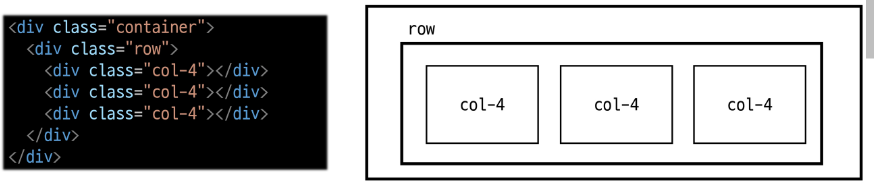

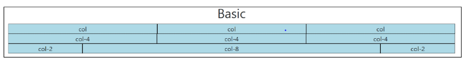

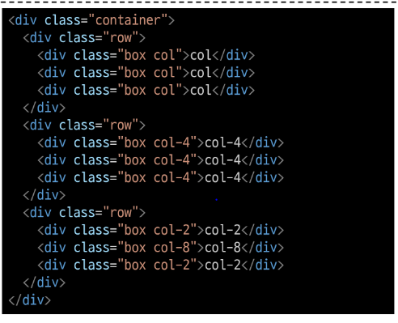

### 중첩 (Nesting)

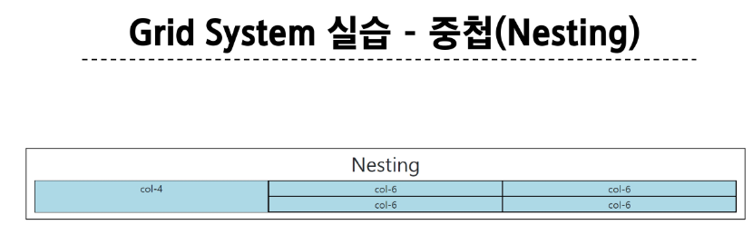

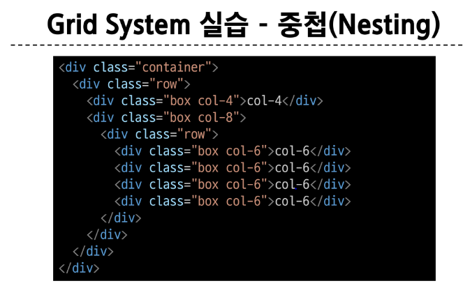

 

### 상쇄 (Offset)

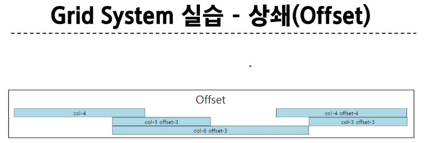

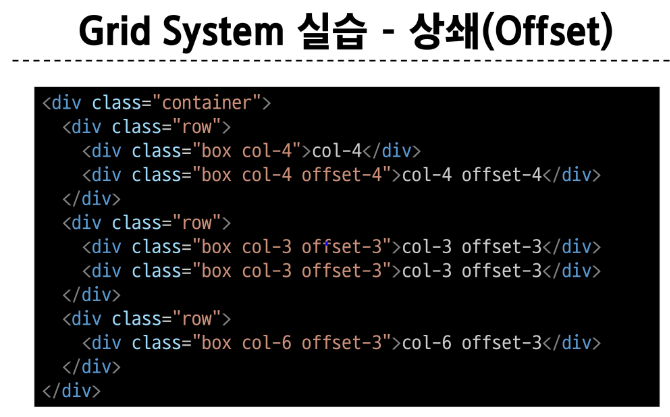

 

### Gutters

Grid system에서 column 사이에 여백 영역 x축은 padding, y축은 margin으로 여백 생성

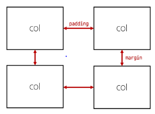

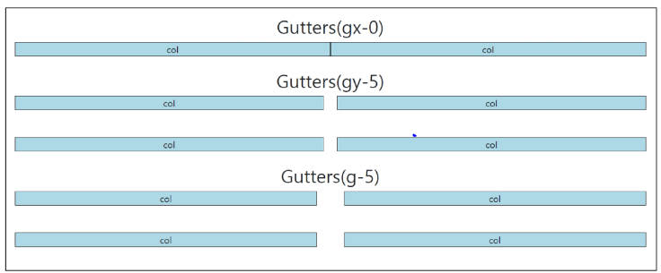

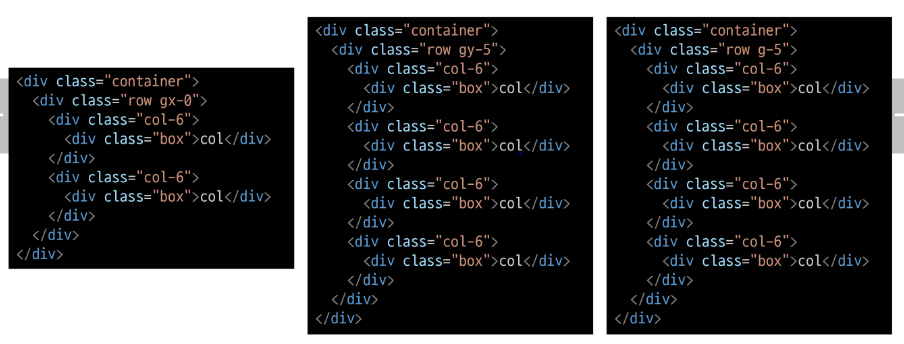

 

### 참고 - The Grid System

- CSS가 아닌 편집 디자인에서 나온 개념으로 구성 요소를 잘 배치해서 시각적으로 좋은 결과물을 만들기 위함

- 기본적으로 안쪽에 있는 요소들의 오와 열을 맞추는 것에서 기인

- 정보 구조와 배열을 체계적으로 작성하여 정보의 질서를 부여하는 시스템

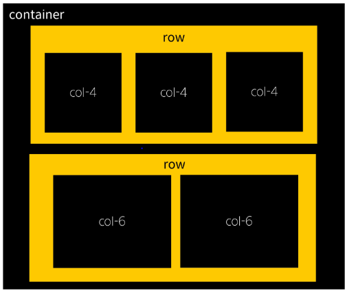

&nbsp;

# 2. Grid system for responsive web

디바이스 종류나 화면 크기에 상관없이, 어디서든 일관된 레이아웃 및 사용자 경험을 제공하는 디자인 기술

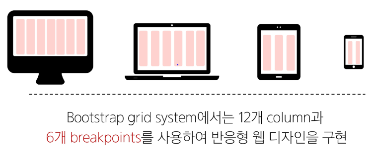

## 2-1. Grid system Breakpoints

웹 페이지를 다양한 화면 크기에서 적절하게 배치하기 위한 분기점

> 화면 너비에 따라 6개의 분기점 제공 (xs, sm, md, lg, xl, xxl)

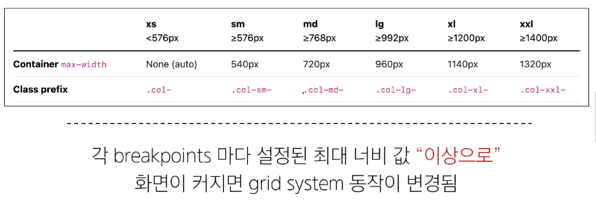

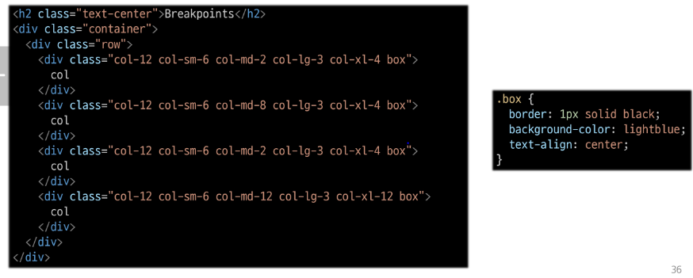

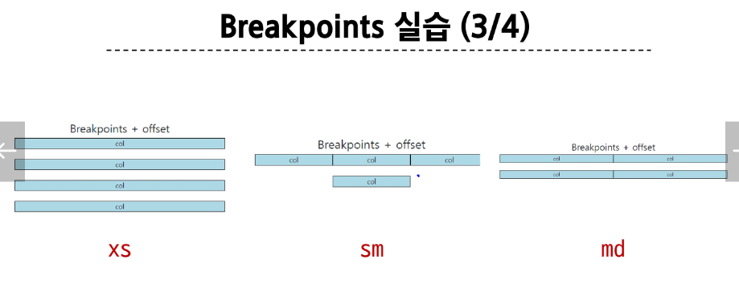

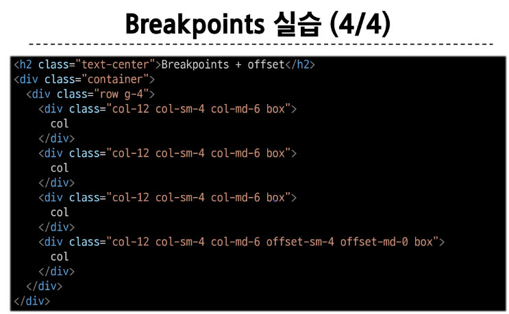

 

Grid System은 화면 크기에 따라 12개의 칸을 각 요소에 나누어 주는 것

&nbsp;

# 3. CSS Layout 종합 정리

1. 어떤 레이아웃 기술이 사용됐는지 생각해보기
    - Grid system, Flexbox, position

각각의 기술은 용도와 장단점이 있다.  

각 기술은 독립적인 용도를 가지지 않으며, 어떤 기술이 적합한 도구가 될지는 특정 상황에 따라 다름  

이를 파악하기 위해서는 충분한 개발 경험이 필요

 

### 참고 - Grid cards

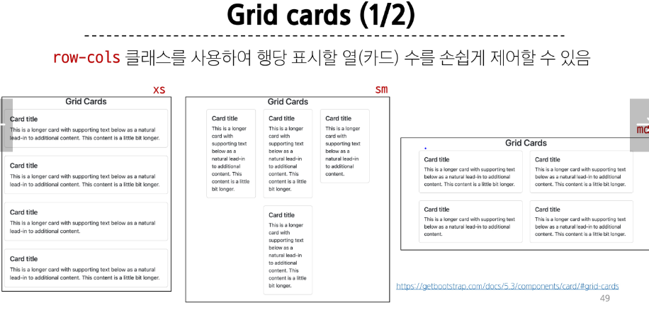

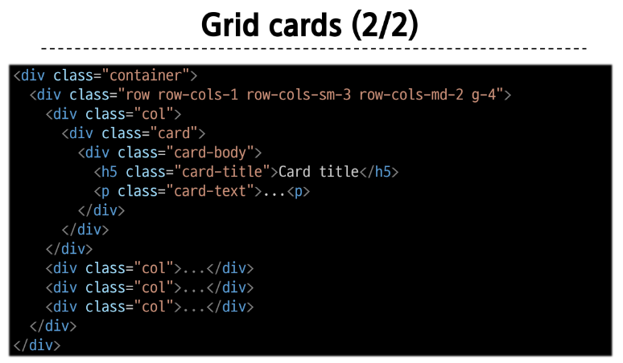