# 목차
1. CSS Box Model
    - 구성 요소

    - 박스 타입

    - 기타 display 속성

 

2. CSS Position

 

3. CSS Flexbox
    - 구성 요소

    - 레이아웃 구성

    - flex-wrap

    -  정리

&nbsp;

# 1. CSS Box Model
- 모든 HTML 요소를 사각형 박스로 표현하는 개념

> **내용(content), 안쪽 여백(padding), 테두리(border), 외부 간격(margin)**으로 구성되는 개념 
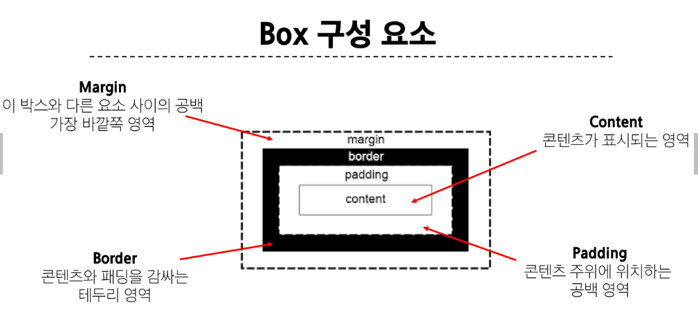

### Box 구성의 방향 별 명칭
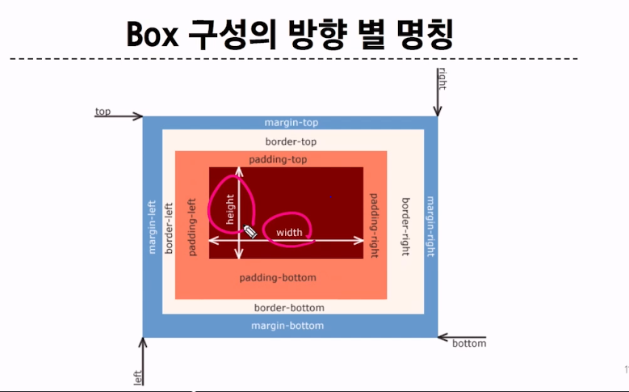

- 상하 좌우의 예시 : padding: 25px 50px;

### width & height 속성
요소의 너비와 높이를 지정.  
이때 지정되는 요소의 너비와 높이는 콘텐츠(**content**) 영역을 대상으로 함
- CSS는 border가 아닌 content의 크기를 width 값으로 지정

 

### box-sizing 속성
~~~~
    * {
        box-sizing: content-box;
    }

    * {
        box-sizing: border-box;
    }
~~~~

content box는 width를 100px로 줘도 양쪽 padding 10 , 10에 border 2px, 2px 해서 총 124의 넓이가 됨! -> margin은 너비에 안들어감

그래서 전체 **box-sizing** 을 할때 **border-box**로 함. -> 이게 더 편하고 정확하게 표현 할 수 있음

## 1-2. 박스 타입
Block & Inline
~~~~
    .index {
        display: block;
    }

    .index {
        display: inline;
    }
~~~~
block은 무언갈 막는 박스  
inline은 어딘가에 들어갈 수 있는 박스

&nbsp;

html의 모든 요소는 웹페이지 상으로 좌측상단 시작. 예외 없음.  

inline 방향은 좌측 상단에서 우측으로 향함  
-> 인라인 박스를 여러개 만들면 아래로 나오는게 아니라 오른쪽으로 나옴  

- 대표적인 inline tag : a, span, img  
    - 본인의 위치만 자리를 차지함

block은 아래로 나옴  
아래로 떨어지는 태그들은 다 block 요소임 

### block 타입 특징
- 항상 새로운 행으로 나뉨

- width와 height 속성을 사용하여 너비와 높이를 지정할 수 있음

- 기본적으로 width 속성을 지정하지 않으면 박스는 inline 방향으로 사용 가능한 공간을 모두 차지함
    - 너비를 사용가능한 공간의 100%로 채움

- 대표적인 block 타입 태그
    - h1~6, p, div

### inline 타입 특징
- 새로운 행으로 나뉘지 않음

- width와 height 속성을 사용할 수 없음

- 수직 방향
    - padding, margins, borders가 적용되지만 다른 요소를 밀어낼 수는 없음

- 수평 방향
    - padding, margins, borders가 적용되어 다른 요소를 밀어낼 수 있음!!

- 대표적인 inline 타입 태그
    - a, img, span

- img만 예외로 너비와 높이를 지정할 수 있다.

### 속성에 따른 수평 정렬
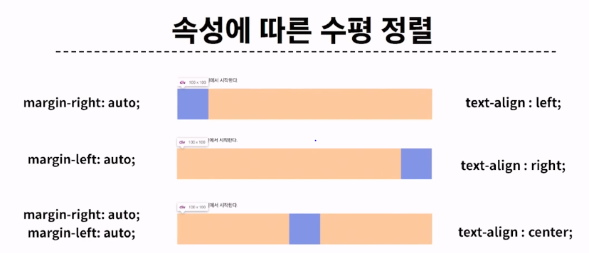

   

## 1-3. 기타 display 속성
1. inline-block
- inline과 block 요소 사이의 중간 지점을 제공하는 display 값

- block 요소의 특징을 가짐
    - width 및 height 속성 사용 가능

    - padding, margin 및 border 로 인해 다른 요소가 밀려남

    > 요소가 줄 바꿈 되는 것을 원하지 않으면서 너비와 높이를 적용하고 싶은 경우에 사용!

 

2. none
- 요소를 화면에 표시하지 않고, 공간조차 부여되지 않음 - 반응형 rayout

&nbsp;

### 참고 - shorthand 속성 - 'border'
- border-width, border-style, border-color 를 한번에 설정하기 위한 속성

    - 작성 순서는 영향을 주지 않음

### 참고 - shorthand 속성 - 'margin' & 'padding'
- 4방향의 속성을 각각 지정하지 않고 한 번에 지정할 수 있는 속성

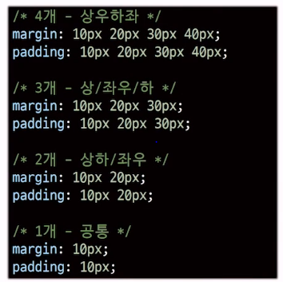

 

### margin collapsing (마진 상쇄)
- 두 block 타입 요소의 margi top과 bottom이 만나 **더 큰 margin으로 결합되는 현상**

- 웹 개발자가 레이아웃을 더욱 쉽게 관리할 수 있도록 함

> 각 요소에 대한 상/하 margin을 각각 설정하지 않고 한 요소에 대해서만 설정하기 위함

&nbsp;

# 2. CSS Position
### CSS Layout
각 요소의 **위치**와 **크기를 조정**하여 웹 페이지의 디자인을 결정하는 것
- Display, Position, Float, Flexbox 등

 

### CSS Position
요소를 Normal Flow에서 제거하여 다른 위치로 배치하는 것
- 다른 요소 위에 올리기, 화면의 특정 위치에 고정시키기 등

- Position 이동 방향
    - top, bottom, left, right, Z Axis

 

### Position 유형
1. static
- 기본값

- 요소를 Normal Flow에 따라 배치

 

2. relative
- 요소를 Normal Flow에 따라 배치

- 자기 자신을 기준으로 이동

- 요소가 차지하는 공간은 static일 때와 같음

 

3. absolute
- 요소를 Normal Flow에서 제거

- 가장 가까운 relative **부모 요소를 기준**으로 이동

- 문서에서 요소가 차지하는 공간이 없어짐

 

4. fixed
- 요소를 Normal Flow에서 제거

- 현재 **화면영역(viewport)을 기준**으로 이동

- 문서에서 요소가 차지하는 공간이 없어짐

 

5. sticky
- 요소를 Normal Flow에 따라 배치

- 요소가 일반적인 문서 흐름에 따라 배치되다가 스크롤이 **특정 임계점에 도달하면 그 위치에서 고정**됨 (fixed)

- 만약 다음 sticky 요소가 나오면 다음 sticky 요소가 이전 sticky 요소의 자리를 대체
    > 이전 sticky 요소가 고정되어 있던 위치와 다음 sticky 요소가 고정되어야 할 위치가 겹치게 되기 때문

 

### z-index
요소가 겹쳤을 때 어떤 요소 순으로 위에 나타낼 지 결정

특징
- 정수 값을 사용해 Z축 순서를 지정

- 더 큰 값을 가진 요소가 작은 값의 요소를 덮음

&nbsp;

### 참고 - Position의 역할
전체 페이지에 대한 레이아웃을 구성하는 것이 아닌 **페이지 특정 항목의 위치를 조정**하는 것

&nbsp;

# 3. CSS Flexbox
요소를 행과 열 형태로 배치하는 **1차원** 레이아웃 방식
- '공간 배열' & '정렬'

## 3-1. Flexbox 구성 요소
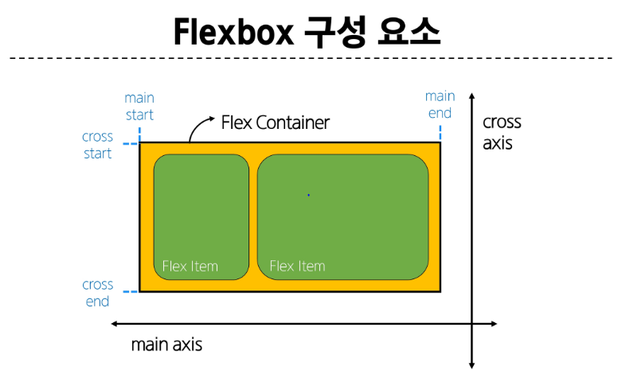

#### **main axis (주 축)**
- flex item들이 배치되는 기본 축

- main start에서 시작하여 main end 방향으로 배치 (기본 값)

#### **cross axis (교차 축)**
- main axis에 수직인 축

- cross start에서 시작하여 crosss end 방향으로 배치 (기본 값)

#### **Flex Container**
- **display**: flex; 혹은 display: inline-flex; 가 설정된 부모 요소

- 이 컨테이너의 1차 자식 요소들이 Flex Item이 됨

- flexbox 속성 값들을 사용하여 자식 요소 Flex Item들을 배치하는 주체

#### **Flex Item**
- Flex Container 내부에 레이아웃 되는 항목

&nbsp;

## 3-2. 레이아웃 구성
### (1) Flex Container 지정
- flex item은 기본적으로 행 (주 축의 기본값인 가로 방향)으로 나열

- flex item은 주 축의 시작 선에서 시작

- flex item은 교차 축의 크기를 채우기 위해 늘어남

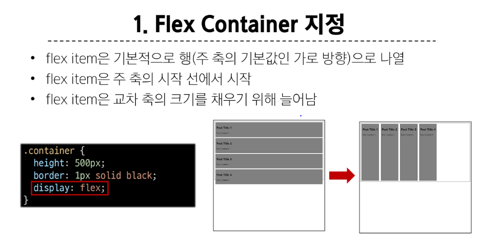

 

### (2) flex-direction
- flex item이 나열되는 방향을 지정

- column으로 지정할 경우 주 축이 변경됨

- "-reverse"로 지정하면 flex item 배치의 시작 선과 끝 선이 서로 바뀜

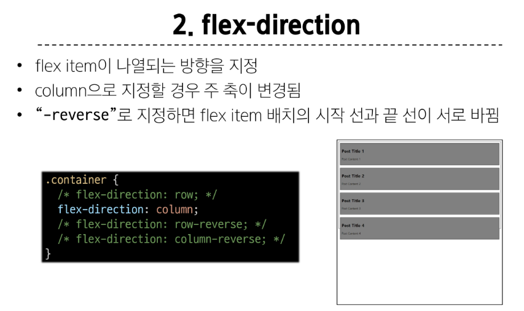

 

### (3) flex-wrap
- flex item 목록이 flex container의 한 행에 들어가지 않을 경우 다른 행에 배치할지 여부 설정

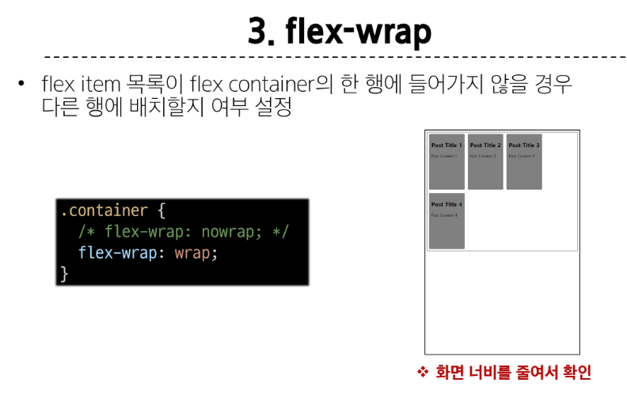

 

### (4) justify-content
- 주 축을 따라 flex item과 주위에 공간을 분배

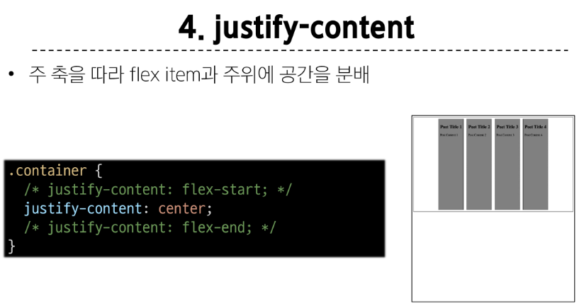

 

### (5) align-content
- 교차 축을 따라 flex item과 주위에 공간을 분배
    > flex-wrap이 wrap 또는 wrap-reverse로 설정된 여러 행에만 적용됨

    > 한 줄 짜리 행에는 효과 없음 (flex-wrap이 nowrap으로 설정된 경우)

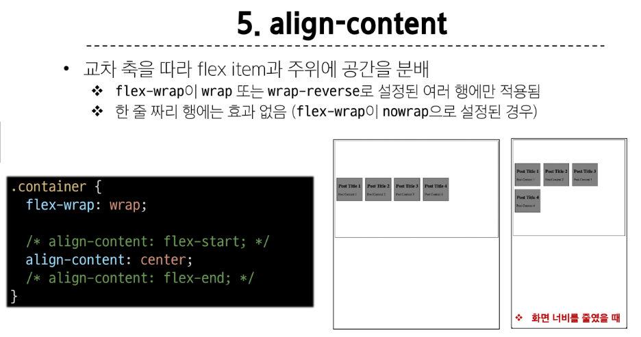

 

### (6) align-items
- 교차 축을 따라 flex item 행을 정렬

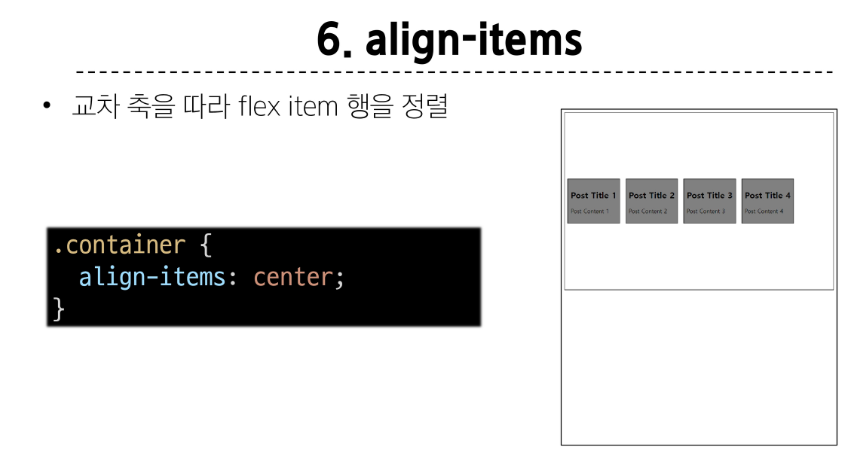

 

### (7) align-self
- 교차 축을 따라 개별 flex item을 정렬

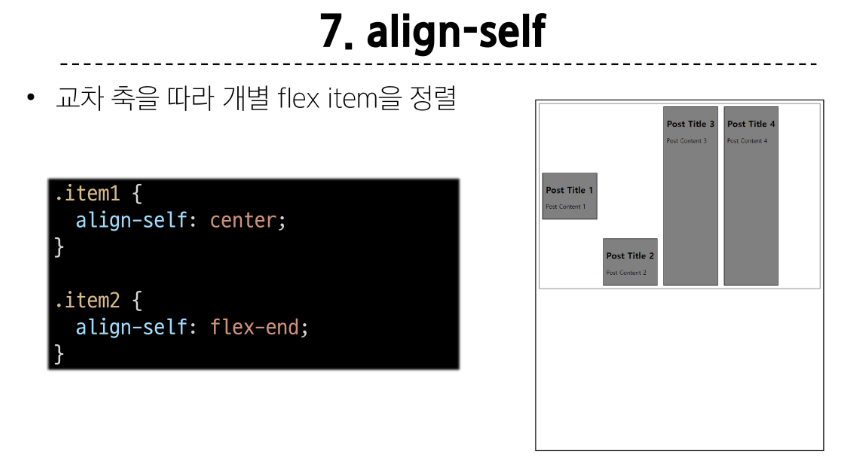

 

### **Flexbox 속성**
- Flex Container 관련 속성
    - display, flex-direction, flex-wrap, justify-content, align-items, align-content

- Flex Item 관련 속성
    - align-self, flex-grow, flex-basis, order

 

### 목적에 따른 속성 분류
배치 : flex-direction, flex-wrap  

 

공간 분배 : justify-content, align-content

 

정렬 : align-items, align-self

 

### 속성명 Tip
- **justify : 주축**  

- **align : 교차 축**

 

### (8) flex-grow
남는 행 여백을 비율에 따라 각 flex item에 분배
- 아이템이 컨테이너 내에서 확장하는 비율을 지정
    > flex-grow의 반대는 flex-shrink

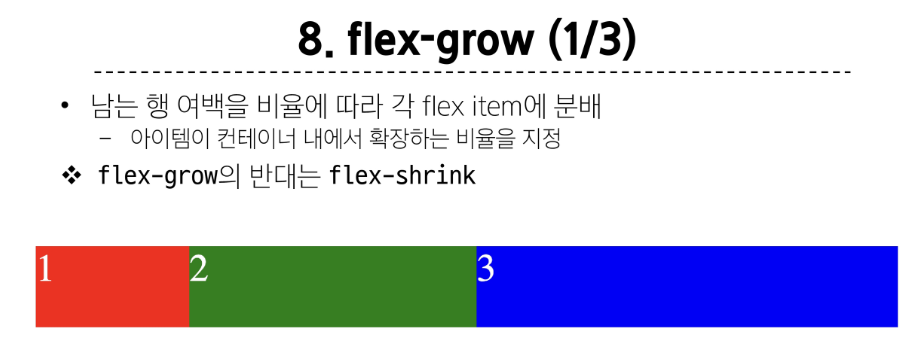

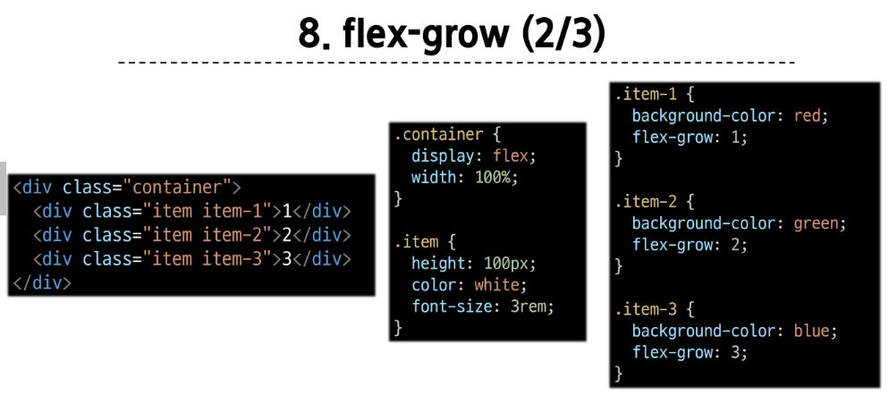

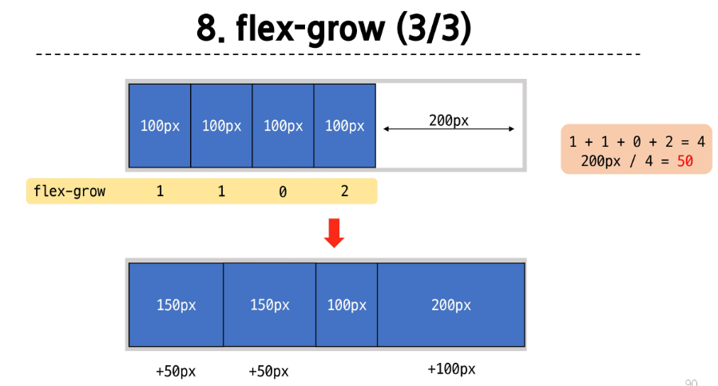

 

### (9) flex-basis
- flex item의 초기 크기 값을 지정

- **flex-basis**와 width 값을 동시에 적용한 경우 **flex-basis**가 우선

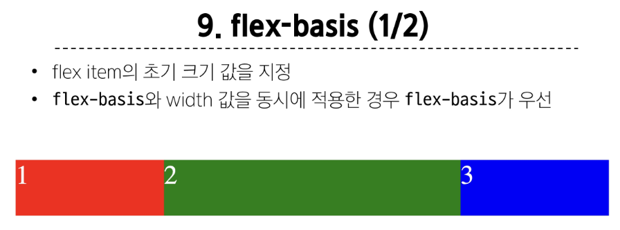

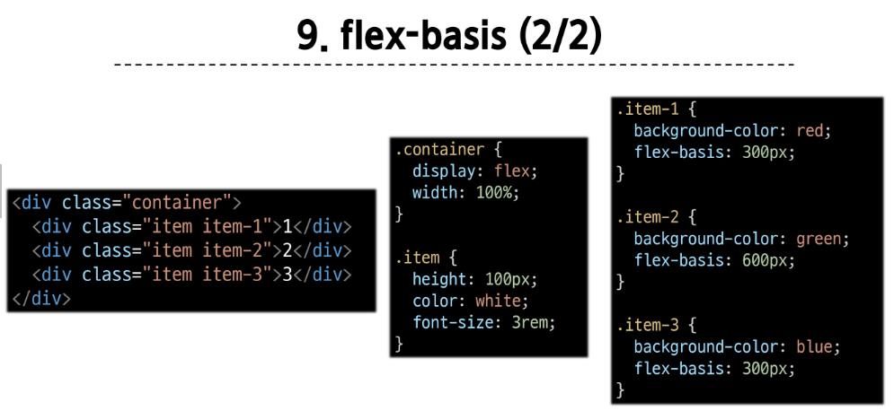

&nbsp;

## 3-3. flex-wrap 응용
### 반응형 레이아웃
다양한 디바이스와 화면 크기에 자동으로 적응하여 콘텐츠를 최적으로 표시하는 웹 레이아웃 방식

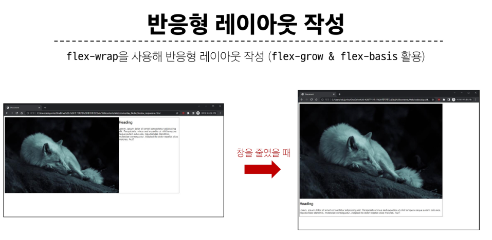

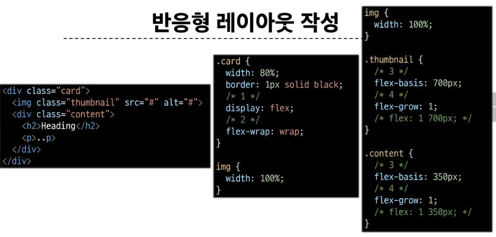

&nbsp;

# 4. 정리
### flex-direction

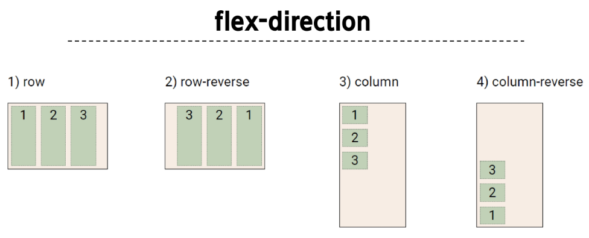

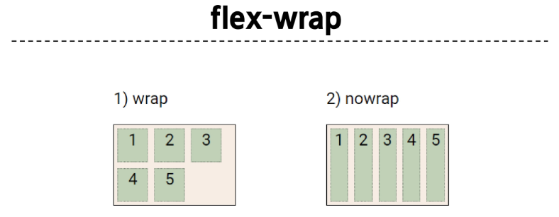

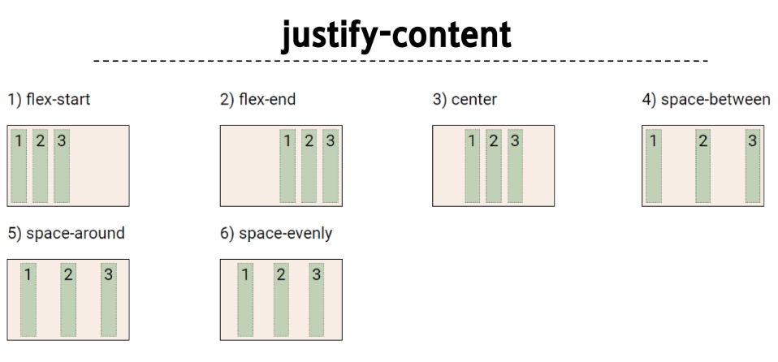

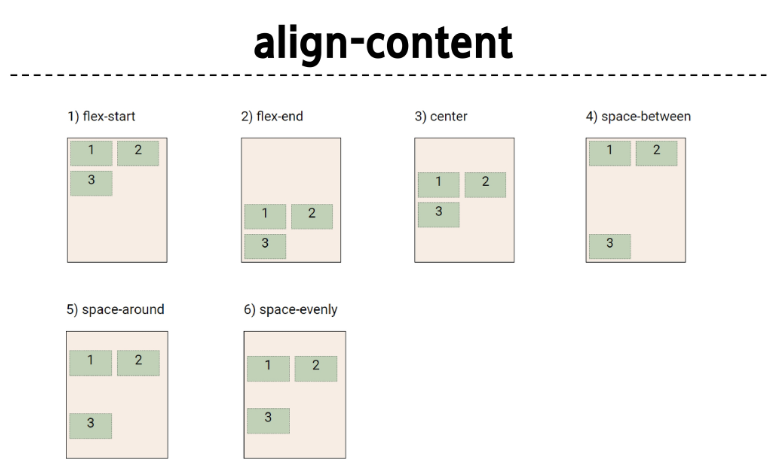

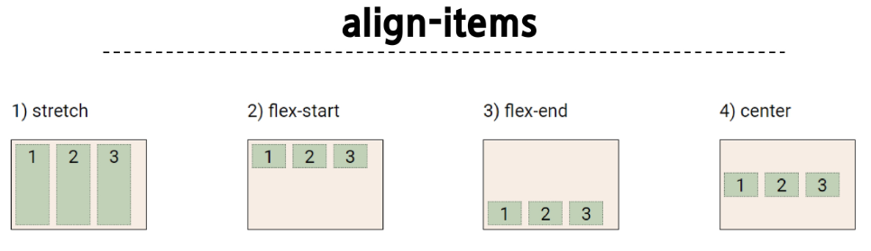

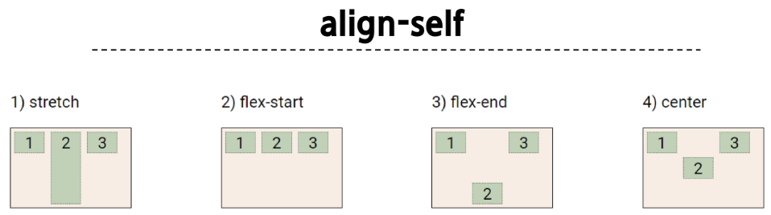

&nbsp;

### 참고 - justify-items 및 jusify-self 속성이 없는 이유
**"필요 없기 때문"**

> **margin auto**를 통해 정렬 및 배치가 가능

### 참고 Shorthand - "flex-flow"
~~~~
    .container {
        flex-flow: flex-direction flex wrap;
    }
~~~~

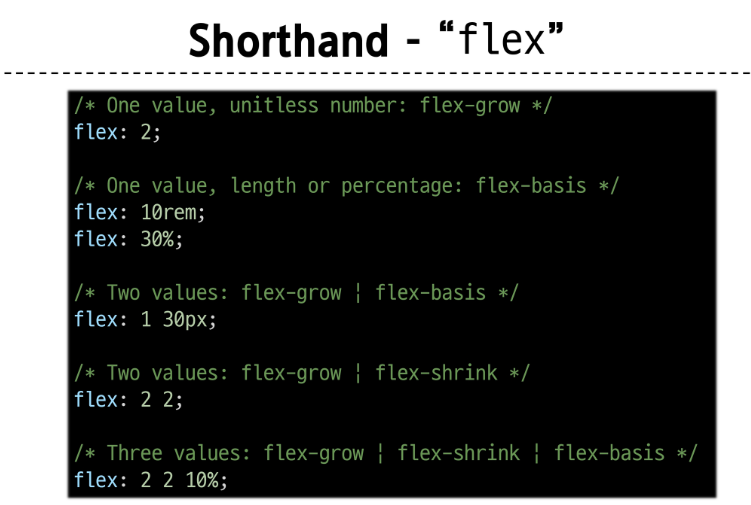