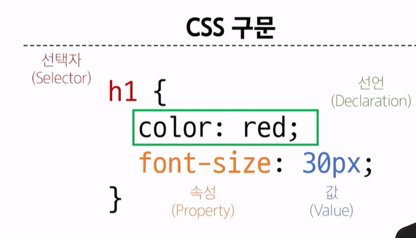
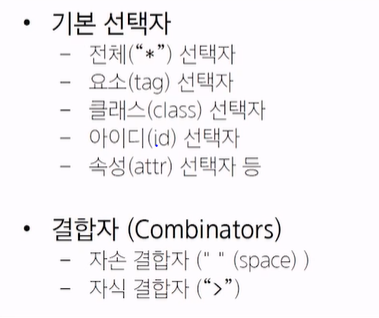
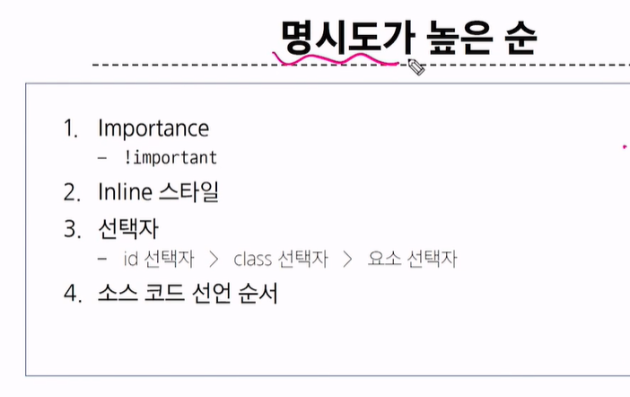
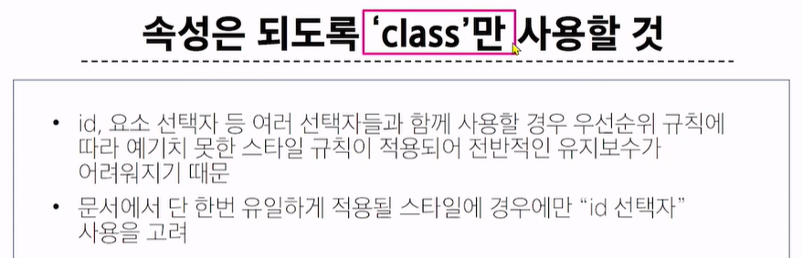
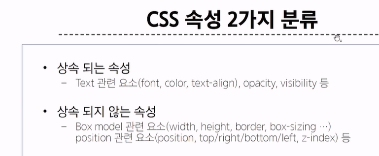
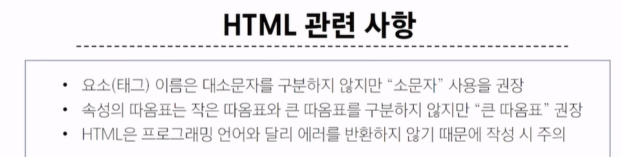
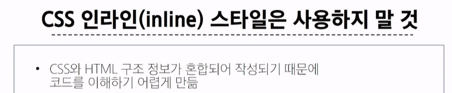

# 목차

1. 웹

2. 웹 구조화
    - HTML

    - HTML의 구조

    - 텍스트 구조

3. 웹 스타일링
    - CSS

    - CSS 선택자

    - 명시도

# 1. 웹

> Web site, Web application 등을 통해 사용자들이 정보를 검색하고 상호 작용하는 기술

### Web site

> 인터넷에서 여러 개의 Web page가 모인 것으로, 사용자들에게 정보나 서비스를 제공하는 공간

### Web page

> HTML, CSS 등의 웹 기술을 이용하여 만들어진, "Web site"를 구성하는 하나의 요소

- 구성요소

> HTML : Structure

> CSS : Styling

> Javascript : Behavior

 

# 2. 웹 구조화

## 2-1. HTML
> HyperText Markup Language : 웹 페이지의 의미와 구조를 정의하는 언어

### Hypertext
> 웹 페이지를 다른 페이지로 연결하는 링크. 기존의 선형적인 텍스트가 아닌 비선형적으로 이루어진 텍스트를 의미

### Markup Language
> 태그 등을 이용하여 문서나 데이터의 구조를 명시하는 언어  ex) HTML, Markdown

## 2-2. HTML 구조

    - <!DOCTYPE html> : 해당 문서가 html 문서라는 것을 나타냄

    - <html></html> : 전체 페이지의 콘텐츠를 포함

    - <title></title> : 브라우저 탭 및 즐겨찾기 시 표시되는 제목으로 사용

    - <body></body> : 페이지에 표시되는 모든 콘텐츠

    <!DOCTYPE html>
    <html lang="en">
    <head>
        <meta charset="UTF-8">
        <title>MY page<title>
    <head>
    <body>
        
This is my page

    <body>
    </html>

### HTML Elements (요소)

여는 태그
    
    
My cat is very grumpy

닫는 태그

> 하나의 요소는 여는 태그와 닫는 태그 그리고 그 안의 내용으로 구성됨.

> 닫는 태그는 태그 이름 앞에 슬래시가 포함되며, 닫는 태그가 없는 태그도 존재!

### HTML Attributes (속성)

    
My cat is very grumpy

##### 규칙
- 속성은 요소 이름과 속성 사이에 공백이 있어야 함

- 하나 이상의 속성들이 있는 경우엔 속성 사이에 공백으로 구분함

- 속성 값은 열고 닫는 쌍따옴표로 감싸야함

##### 목적
- 나타내고 싶지 않지만 추가적인 기능, 내용을 담고 싶을 때 사용

- CSS에서 해당 요소를 선택하기 위한 값으로 활용됨

~~~
     : 주소창 바로가기 만들기
     : 닫는 태그가 없다!
~~~

 

## 2-3. 텍스트 구조

### HTML Text structure

> 주요 목적중 하나는 텍스트 구조와 의미를 제공하는 것

    <h1>Heading</h1>

> 예를 들어 h1 요소는 단순히 텍스트를 크게 만드는 것이 아닌 현재 '문서의 최상위 제목' 이라는 의미를 부여

- Heading & Paragraphs
    - h1~6, p

- Lists
    - ol, ul, li

- Emphasis & Importance
    - em, strong

 

 

# 3. 웹 스타일링

## 3-1. CSS

> Cascading Style Sheet : 웹 페이지의 '**디자인**'과 '**레이아웃**'을 구성하는 언어

### Cascade 계단식
- 한 요소에 동일한 가중치를 가진 선택자가 적용될 때 CSS에서 마지막에 나오는 선언이 사용됨

    h1 {
        color: blue;
        font-size: 30px;
    }

### CSS 적용 방법

1. 인라인(Inline) 스타일 : 요소 안에 style 속성 값으로 작성 - 거의 사용 안함

2. 내부(Internal) 스타일 시트 : head 태그 안에 style 태그에 작성

3. 외부(External) 스타일 시트 : 별도의 CSS 파일 생성 후 **<link** 태그를 사용해 불러오기

 

## 3-2. CSS Selectors (CSS 선택자)
> HTML 요소를 선택하여 스타일을 적용할 수 있도록 하는 선택자

1. 전체 선택자 및 요소(tag) 선택자

~~~~
    * {
        color: red;
    }

    h2 {
        color: orange;
    }

    h3,
    h4 {
        color: blue;
    }
~~~~

2. class 선택자

- 주어진 클래스 속성을 가진 **모든 요소를 선택**

~~~~
    .green {
        color: green;
    }
~~~~

3. id 선택자

- 주어진 아이디 속성을 가진 요소 선택. 문서에는 주어진 아이디를 가진 요소가 **하나만 있어야 함** 여러번 써도 상관은 없으나 걍 한곳에만 사용하셈

~~~~
    #purple {
        color: purplr;
    }
~~~~

4. 자손 결합자

~~~~
    .green li {
        color: brown;
    }
    
자손 결합자는 그냥 공백임
~~~~

5. 자식 결합자

~~~~
    .green > span {
            font-size: 50px;
        }

~~~~

 

## 3-3. 명시도 Specificity

> 결과적으로 요소에 적용할 CSS 선언을 결정하기 위한 알고리즘
>> 동일한 요소를 가리키는 2개 이상의 CSS 규칙이 있는 경우 가장 높은 명시도를 가진 Selector가 승리하여 스타일이 적용 됨

### Cascade 계단식

- 한 요소에 동일한 가중치를 가진 선택자가 적용될 때 **CSS에서 마지막**에 나오는 선언이 사용됨

### 명시도 적용 예시

> 동일한 h1 태그에 다른 스타일이 작성된다면 h1 태그 내용의 색은 명시도로 인해 red가 적용됨

~~~~
    .make-red {
        color: red;
    }

    h1 {
        color: purple;
    }
~~~~

### !important

> 다른 우선순위 규칙보다 우선하여 적용하는 키워드

**Cascade의 구조를 무시하고 강제로 스타일을 적용하는 방식이므로 사용을 권장 안함**

### CSS 상속

> 기본적으로 CSS는 상속을 통해 부모 요소의 속성을 자식에게 상속해 재사용성을 높임

> CSS 상속 여부는 MDN 문서에서 MDN 각 속성별 문서 하단에서 상속 여부를 확인 가능

