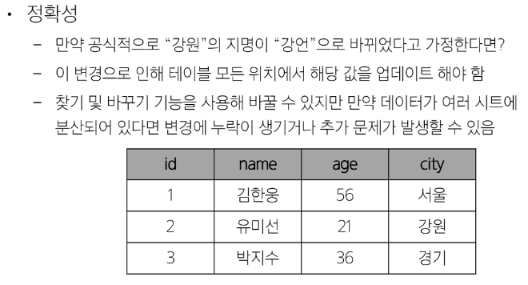
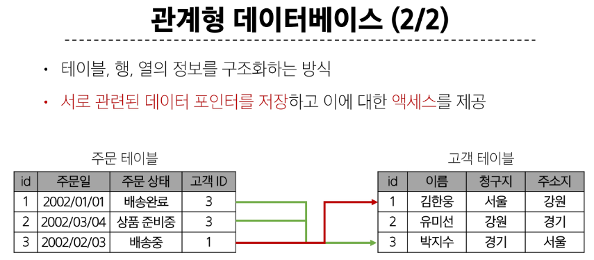
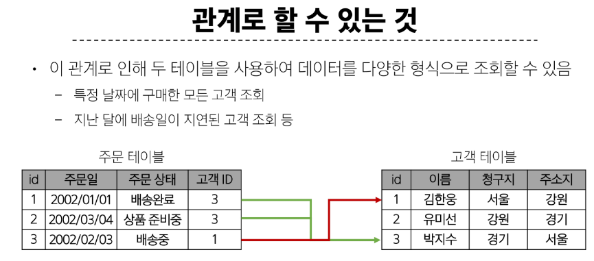
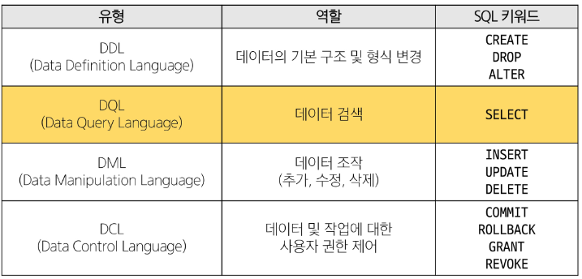
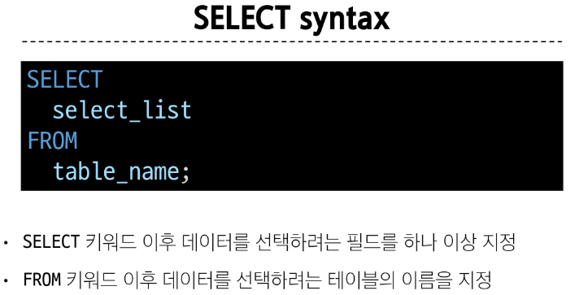

# 목차
1. Database

2. Realational Database

3. SQL

4. Single Table Queries
    - Querying data

    - Sorting data

    - Filtering data

    - Grouping data

## 1. Database
- 체계적인 데이터 모음

### 데이터
- 저장이나 처리에 효율적인 형태로 변환된 정보

 

데이터 사용량이 증가하고 데이터 센터의 성장에 따라  
**데이터를 저장하고 잘 관리하여 활용할 수 있는 기술이 중요해짐**

 

### 기존의 데이터 저장 방식
1. 파일(File) 이용

   - 어디에서나 쉽게 사용 가능

   - 데이터를 구조적으로 관리하기 어려움

 

1. 스프레드 시트(Spreadsheet) 이용

    - 테이블의 열과 행을 사용해 데이터를 구조적으로 관리 가능

- 스프레드 시트의 한계
  - 크기 : 일반적으로 약 100만 행까지만 저장 가능
  
  - 보안 : 단순히 파일이나 링크 소유 여부에 따른 단순한 접근 권한 기능 제공 

  - 정확성
  

 

### 데이터베이스 역할

- 데이터를 저장하고 조작 = CRUD

&nbsp;

## 2. Realational Database

### 관계형 데이터베이스
- 데이터 간에 **관계**가 있는 데이터 항목들의 모음

    - 관계 : 여러 테이블 간의 (논리적) 연결
    

 

- 고객 데이터 간 비교를 위해서는 각 데이터에 고유한 식별 값을 부여한다.
    
    - 기본 키(id), Primary Key

 

- 누가 어떤 주문을 했는지 어떻게 식별?

    - 외래 키, Foreign Key(고객 ID)
  
 

 

### 관계형 데이터베이스 관련 키워드
1. Table (aka Realation) 
    - 데이터를 기록하는 곳

2. Field (aka Column, Attribute)
    - 각 필드에는 고유한 데이터 형식(타입)이 지정됨

3. Record (aka Row, Tuple)
   - 각 레코드에는 구체적인 데이터 값이 저장됨

4. 

5.  
////32 page

### DBMS
- 데이터 저장 및 관리를 용이하게 하는 시스템

### RDBMS
- 관계형

    - 종류 : SQLite, MySQL

&nbsp;

## 3. SQL
- 데이터베이스에 정보를 저장하고 처리하기 위한 프로그래밍 언어

- 테이블의 형태로 **구조화**된 관계형 데이터베이스에게 요청을 질의(요청)

 

### SQL Syntax
~~~~sql
SELECT colums_name FROM table_name;
~~~~

- SELECT statement라고 부름

- 이 statement는 SELECT, FROM 2개의 keyword로 구성 됨

 

### SQL Statements
- SQL을 구성하는 가장 기본적인 코드 블록 

 

- DCL은 잘 사용하지 않고 DQL(데이터 검색)이 가장 중요!!

 

#### 단순히 SQL 문법을 암기하고 상황에 따라 실행만 하는 것이 아닌 SQL을 통해 관계형 데이터베이스를 잘 이해하고 다루는 방법을 학습

 

### 참고 - Query
- 데이터베이스로부터 정보를 요청 하는 것

- 일반적으로 SQL로 작성하는 코드를 쿼리문(SQL문)이라 함

&nbsp;

## 4. Single Table Queries

### SQL Statements 유형

## 4-1. Querying data

### 1. SELECT
- 테이블에서 데이터를 조회

- 정리
    - 테이블의 데이터를 조회 및 반환

    - '*' (asterisk)를 사용하여 모든 필드 선택