# 목차
1. Many to one relationships 2

2. Article & User
    - 모델 관계 설정
    - 게시글 CREATE
    - 게시글 READ
    - 게시글 UPDATE
    - 게시글 DELETE

3. Comment & User
    - 모델 관계 설정
    - 댓글 CREATE
    - 댓글 READ
    - 댓글 DELETE

&nbsp;

## 1. Many to one relationships 2

### User와 다른 모델 간의 모델 관계 설정
1. User & Article

2. User & Comment

- Article(N) - User(1)
    - 0개 이상의 게시글은 1명의 회원에 의해 작성 될 수 있다.

- Comment(N) - User(1)
    - 0개 이상의 댓글은 1명의 회원에 의해 작성 될 수 있다.

외래키는 N 쪽에 작성된다.

&nbsp;

## 2. Article & User

## 2-1. 모델 관계 설정
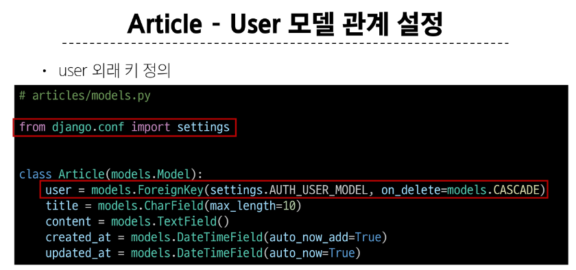

### User 모델을 참조하는 2가지 방법
1. get_user_model()

2. settings.AUTH_USER_MODEL

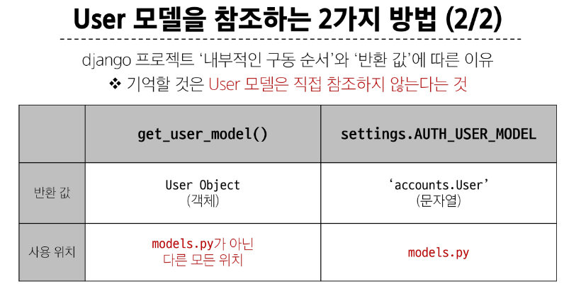

 

### Migration
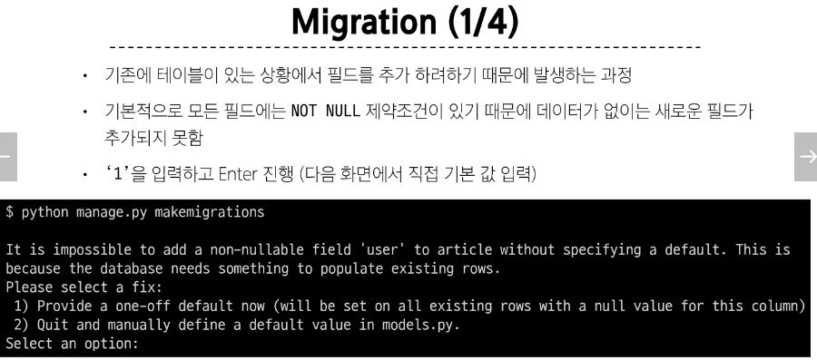

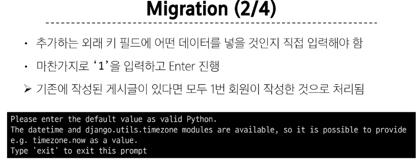

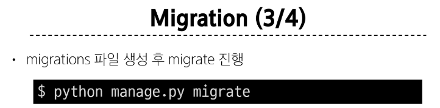

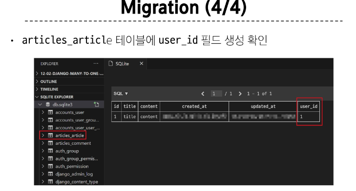

 

## 2-2. 게시글 CREATE

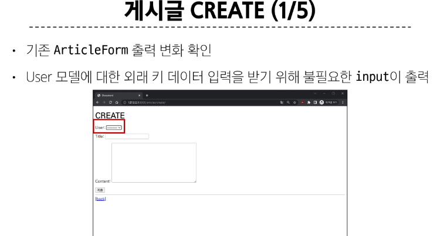

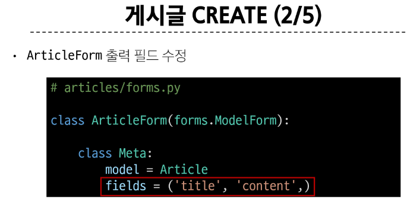

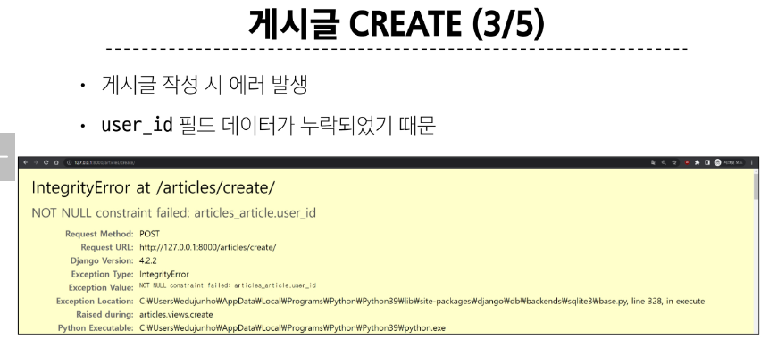

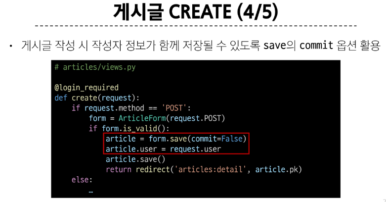

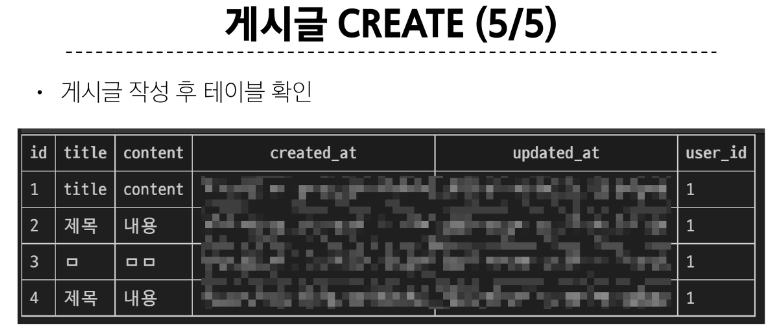

 

## 2-3. 게시글 READ
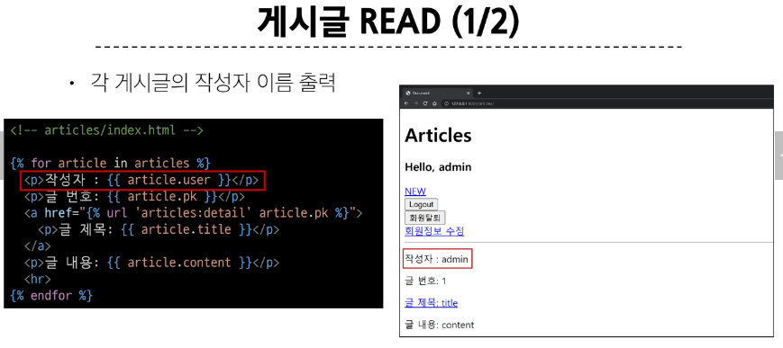

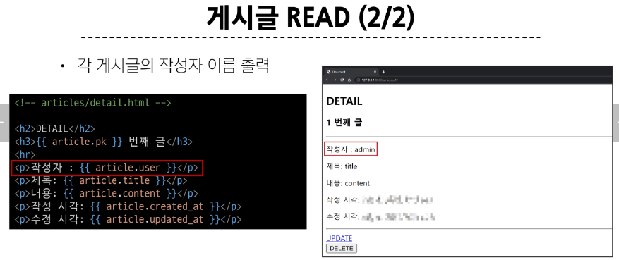

### 참조와 역참조
Article -> User (참조)  
==> article.user
  
User -> Article (역참조)  
user.article_set.all()

 

## 2-4. 게시글 UPDATE
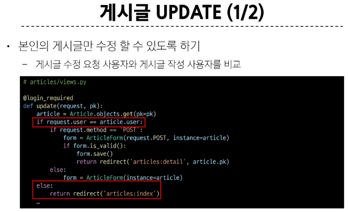

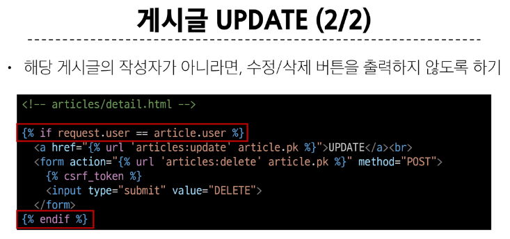

 

## 2-5. 게시글 DELETE
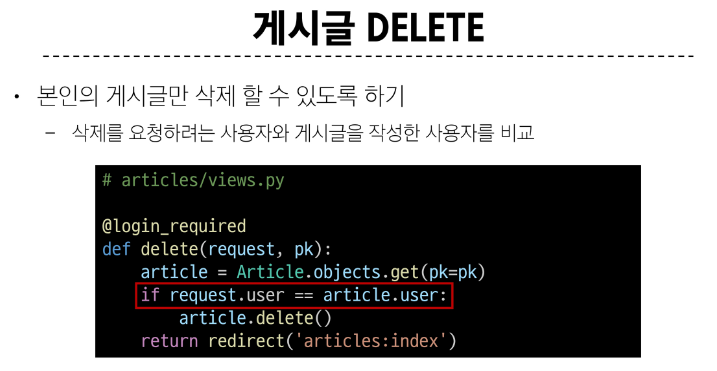

&nbsp;

## Comment & User

## 3-1. 모델 관계 설정
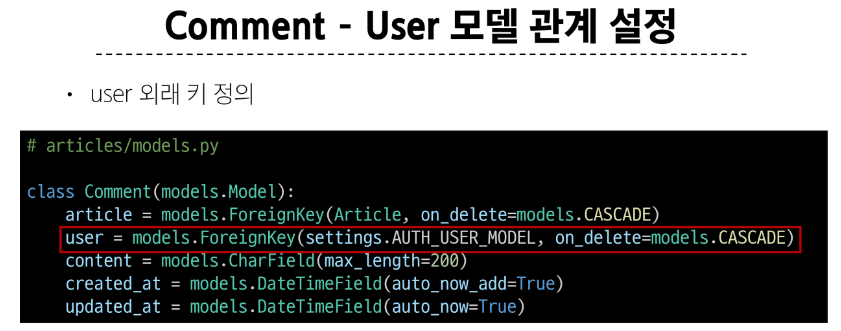

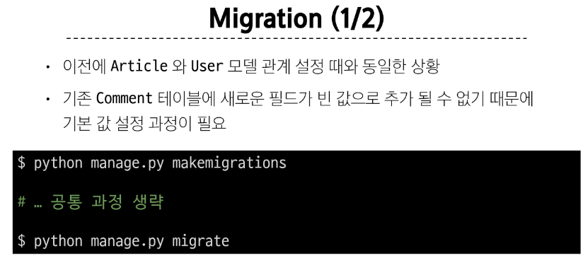

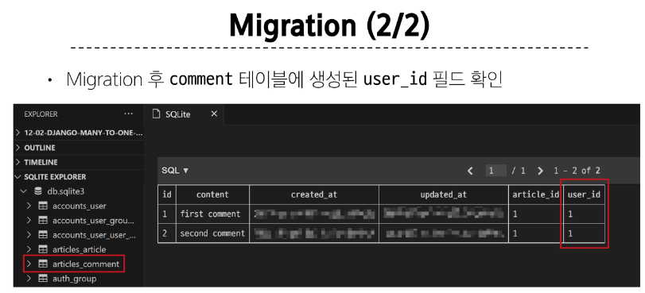

 

## 3-2. 댓글 CREATE
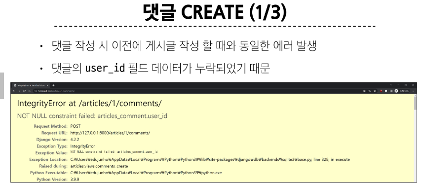

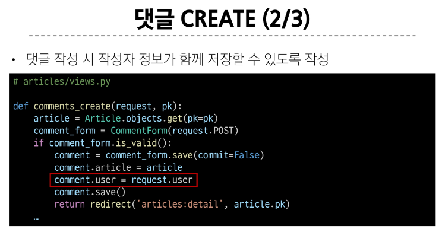

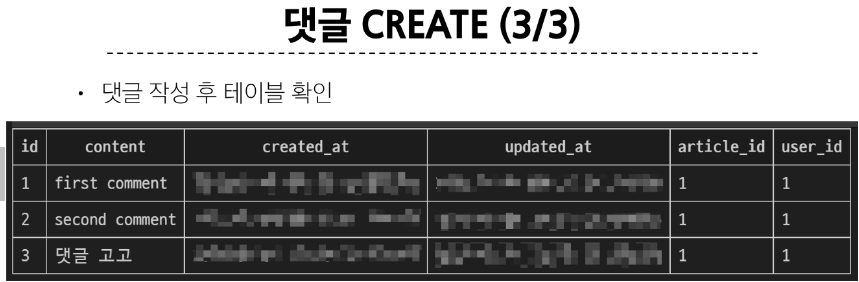

 

## 3-3. 댓글 READ
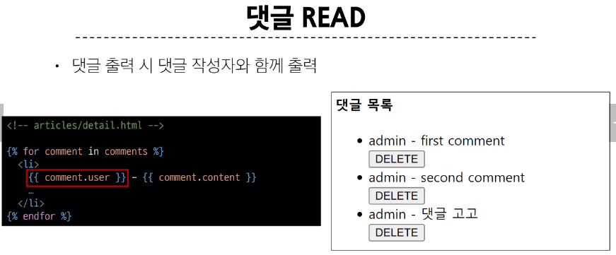

### 댓글 부분 참조
Comment -> User (참조)  
==> comment.user
  
User -> Comment (역참조)
==> user.comment_set.all()