# 목차

- 1. Many to many relationships
    - 1-1. N:1의 한계

    - 1-2. 중개 모델

    - 1-3. ManyToManyField

    - 1-4. 'through' argument

- 2. ManyToManyField

- 3. 좋아요 기능 구현
    - 3-1. 모델 관계 설정

    - 3-2. 기능 구현

&nbsp;

## 1. Many to many relationships
- 한 테이블의 0개 이상의 레코드가 다른 테이블의 0개 이상의 레코드와 관련된 경우 **양쪽 모두에서 N:1 관계를 가짐**

 

## 1-1.N:1의 한계
- 환자 테이블에 1번 환자 데이터가 중복으로 입력 됨 -> 외래 키 컬럼에 1,2로 표현 불가능(DB 타입 문제로 불가능)

    - 예약 테이블을 따로 만들자!

 

## 1-2. 중개 모델
### 1. 예약 모델 생성
- 환자 모델의 외래 키를 삭제하고 별도의 예약 모델을 생성

- 예약 모델은 의사와 환자에 각각 N:1 관계를 가짐
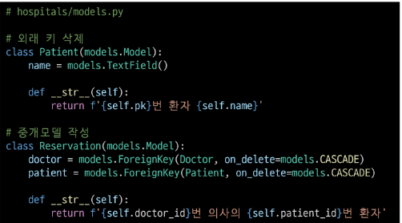

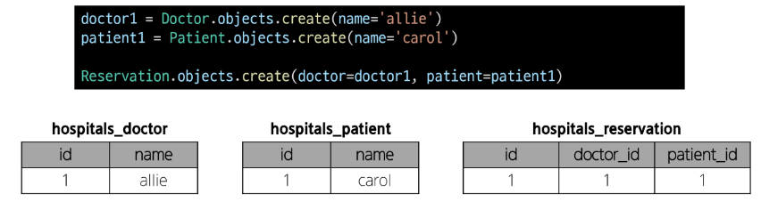

### 2. 예약 데이터 생성
- 데이터베이스 초기화 후 Migration 진행 및 shell_plus 실행

- 의사와 환자 생성 후 예약 만들기

### 3. 예약 정보 조회
- 의사와 환자가 예약 모델을 통해 각각 본인의 진료 내역 확인

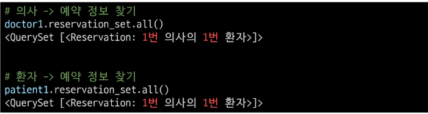

### 4. 추가 예약 생성
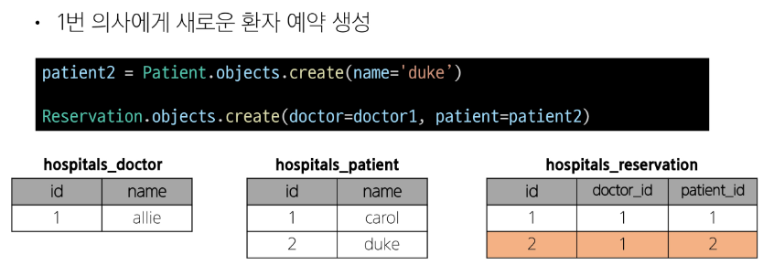

 

&nbsp;

## 1-3. ManyToManyField
- M:N 관계 설정 모델 필드
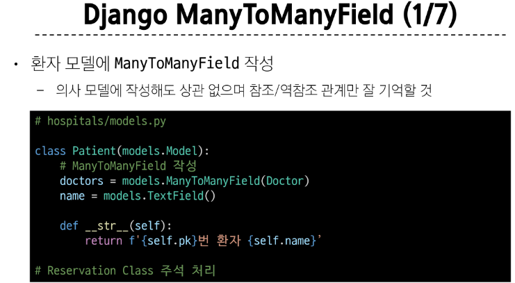

- 데이터베이스 초기화 후 Migration 진행 및 shell_plus 실행

- 생성된 중개 테이블 hospitals_patient_doctors 확인

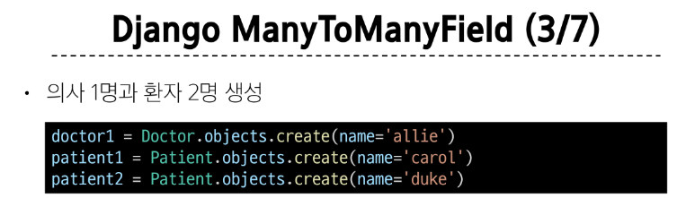
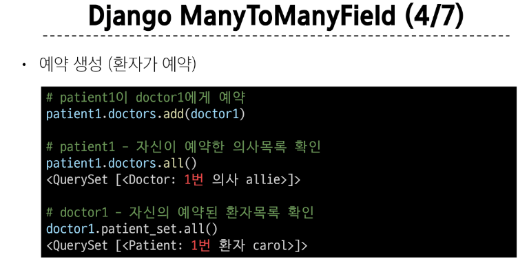
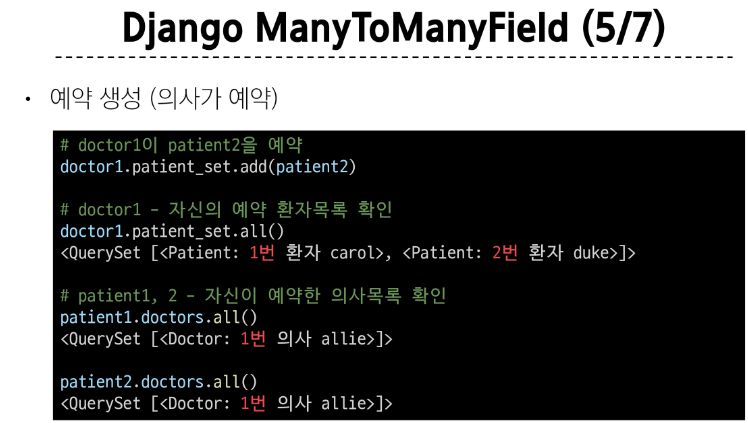
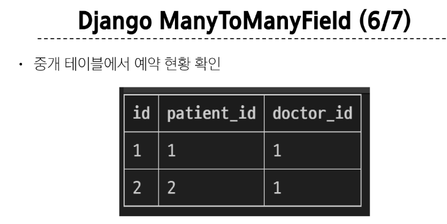
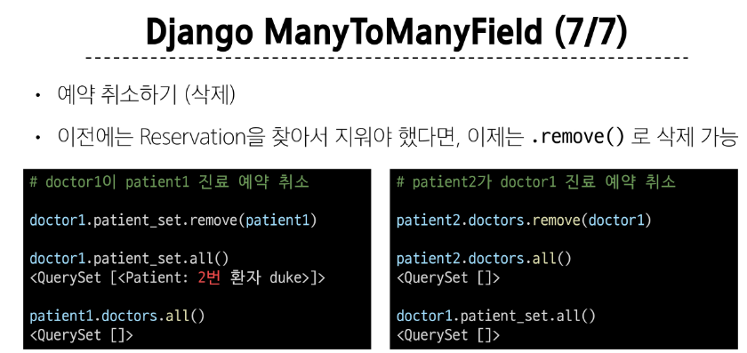

 

&nbsp;

## 1-4. 'through' argument
- 중개 테이블에 **'추가 데이터'**를 사용해 M:N 관계를 형성하려는 경우에 사용

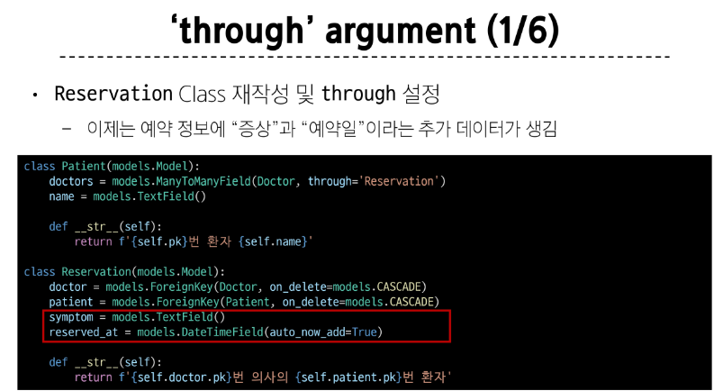
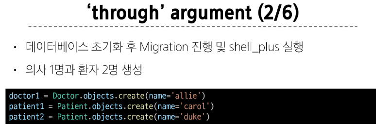
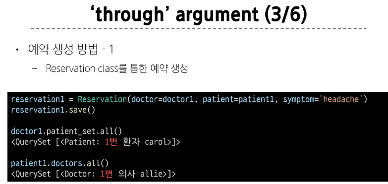
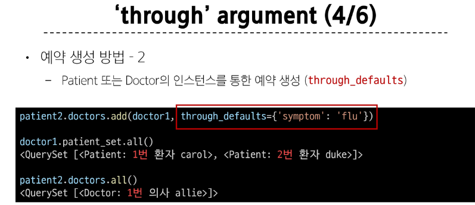
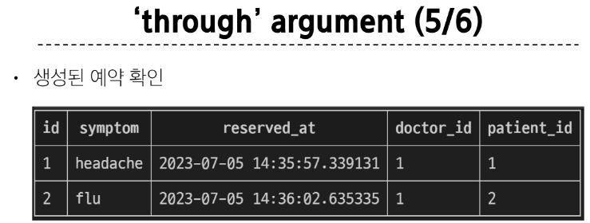
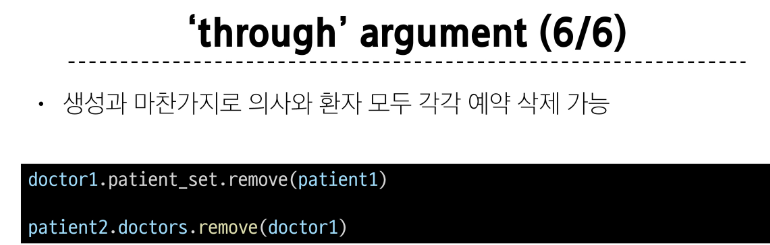

 

### M:N 관게 주요 사항
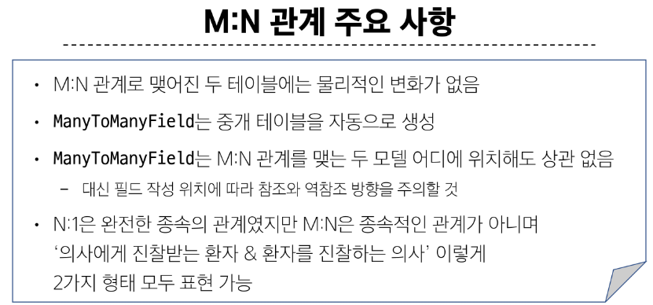

#### manttomany 필드는 두는 위치는 상관 없다. 하지만 두는 위치에 따라 참조와 역참조로 볼 수 있다.

&nbsp;

## 2. ManyToManyField
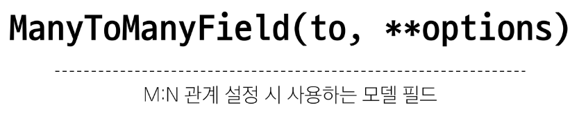

### ManyToManyField의 대표 인자 3가지
1. related_name
    - 역참조시 사용하는 manager name을 변경
    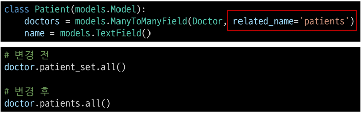

 

2. symmetrical
    - 관계 설정 시 대칭 유무 설정

    - ManyToManyField가 동일한 모델을 가리키는 정의에서만 사용

    - 기본 값 : True
    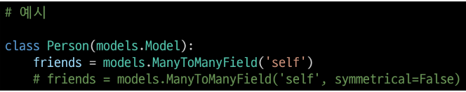

    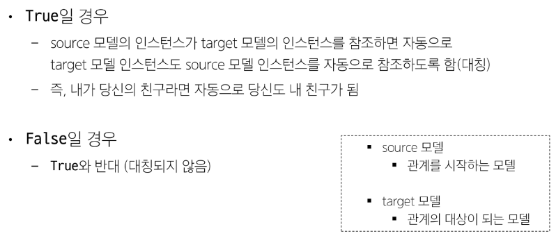

 

3. through
    - 사용하고자 하는 중개모델을 지정

    - 일반적으로 추가 데이터를 M:N 관계와 연결하려는 경우에 활용
    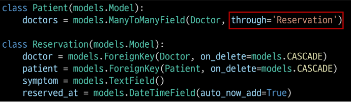

 

### M:N에서의 대표 methods
- add()
    - "지정된 객체를 관련 객체 집합에 추가"  
    (이미 존재하는 관계에 사용하면 관계가 복제되지 않음)

- remove()
    - "관련 객체 집합에서 지정된 모델 객체를 제거"

&nbsp;

## 3. 좋아요 기능 구현

## 3-1. 모델 관계 설정
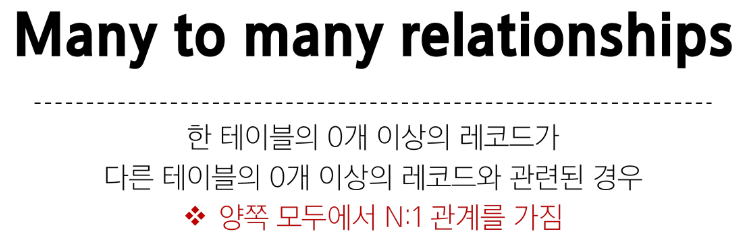
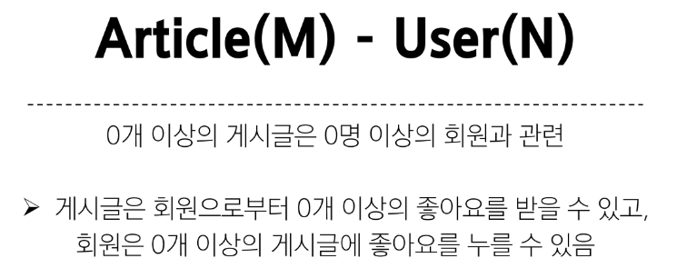

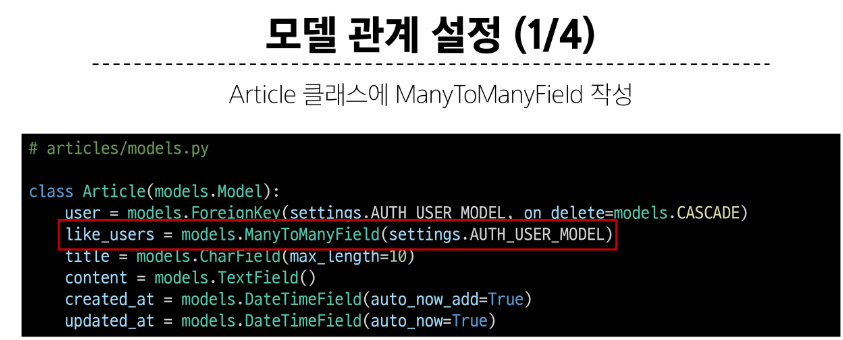
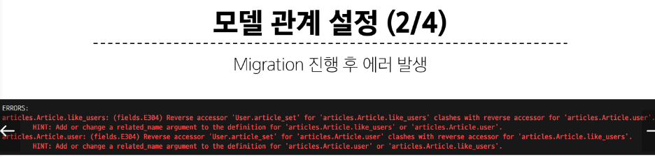
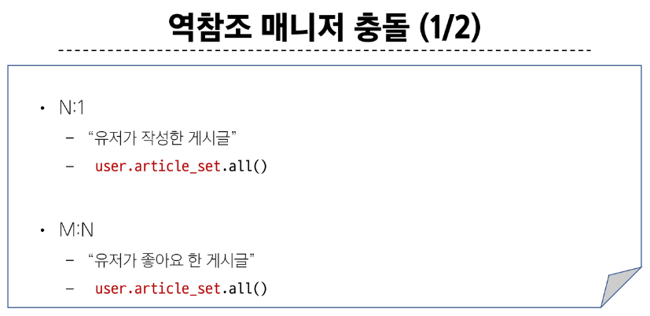
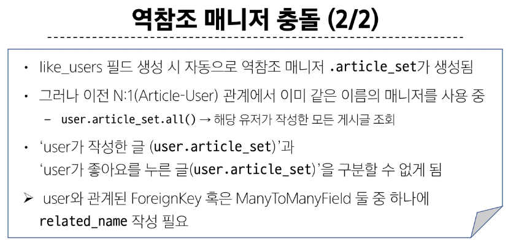
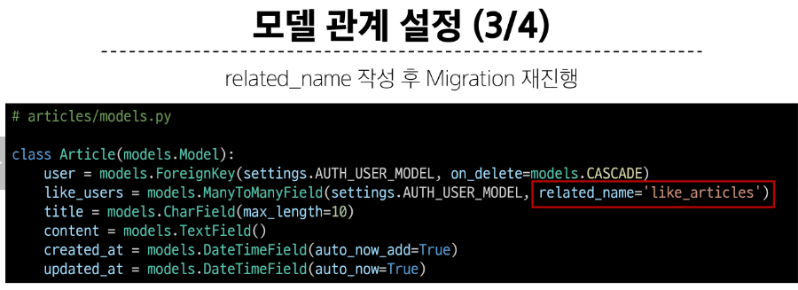
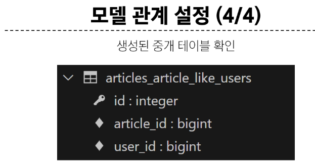
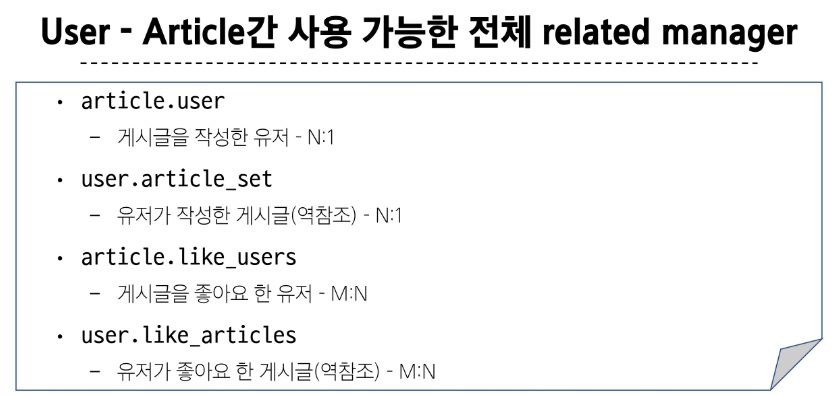

&nbsp;

## 3-2. 기능 구현
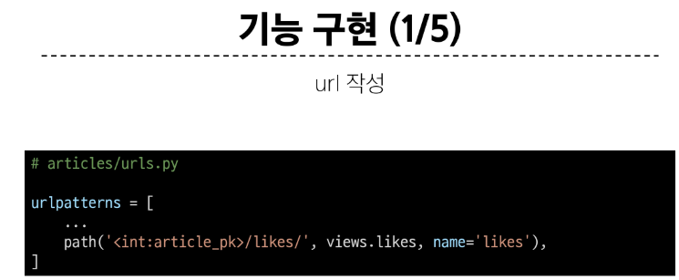
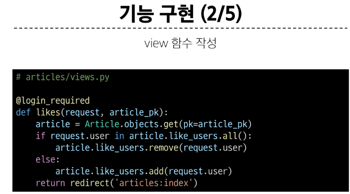
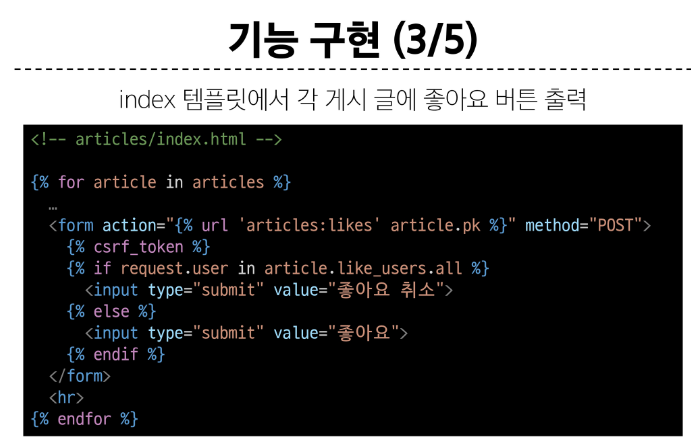
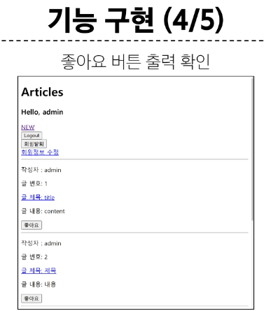
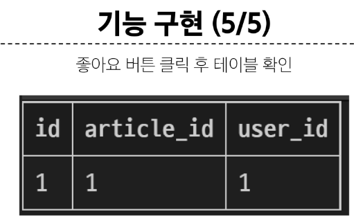