# 목차

- 1. 팔로우 기능 구현
    - 1-1. 프로필
    - 1-2. 기능 구현

- 2. Fixtures
    - 2-1. Fixtures 활용

- 3. Improve query
    - 3-1. annotate
    - 3-2. select_related
    - 3-3. prefetch_related
    - 3-4. select_related & prefetch_related

&nbsp;

## 1. 팔로우 기능 구현
## 1-1. 프로필

### 프로필 페이지
- 각 회원의 개인 프로필 페이지에 팔로우 기능을 구현하기 위해 프로필 페이지를 먼저 구현하기

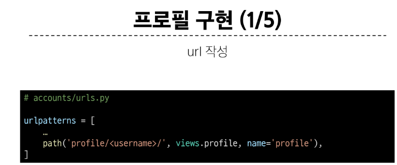
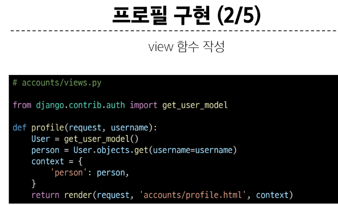
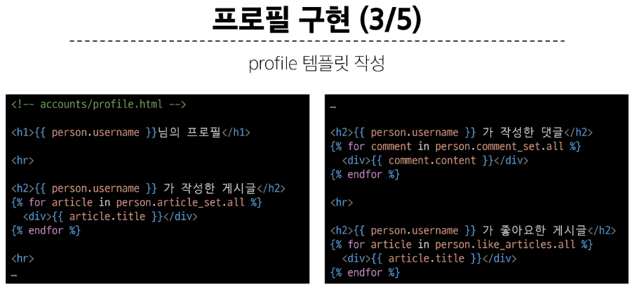
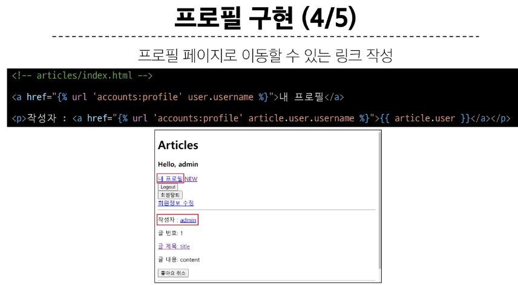
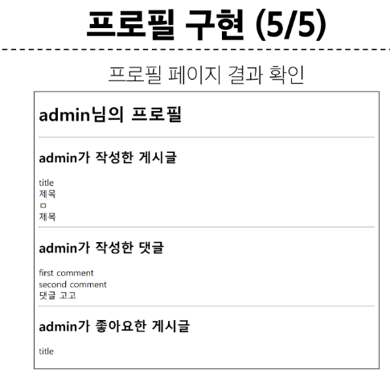

 

## 1-2. 기능 구현
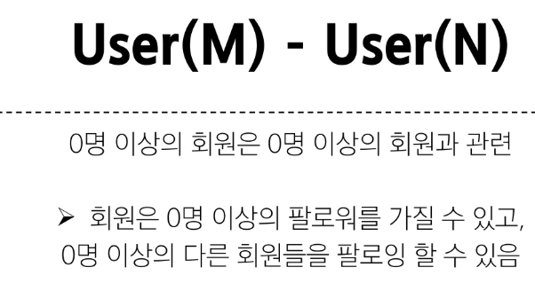
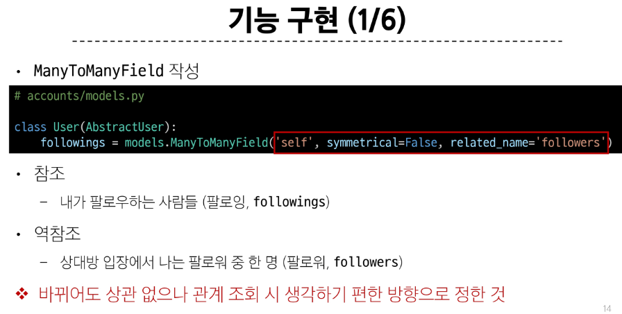
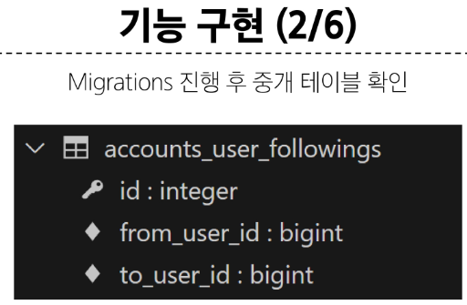
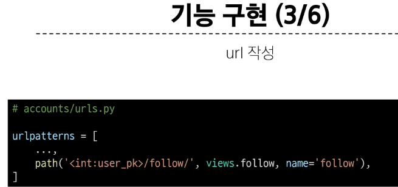
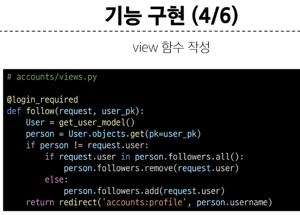
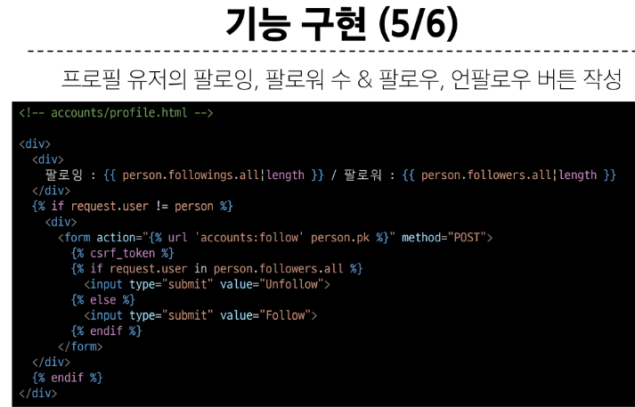
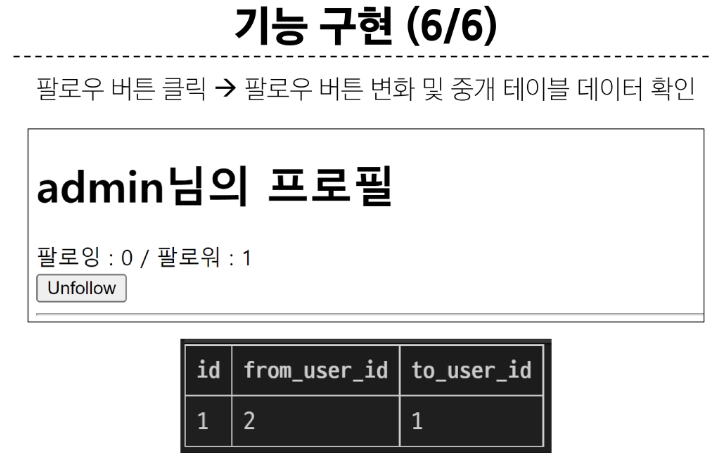

 

### 참고
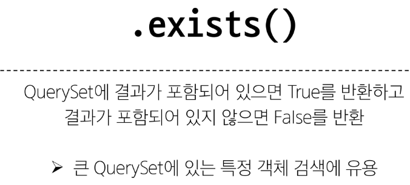
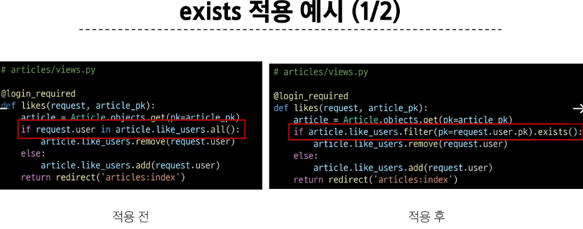
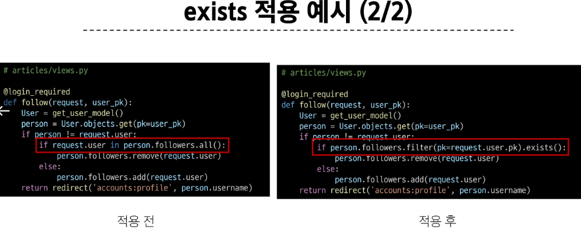

&nbsp;

## 2. Fixtures
- Django가 데이터베이스로 가져오는 방법을 알고 있는 데이터 모음
    - 데이터는 데이터베이스 구조에 맞추어 작성 되어있음

- 초기 데이터 제공 -> Fixtures의 사용 목적

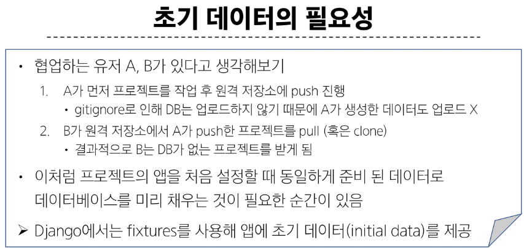

 

## 2-1. Fixtures 활용
### 사전 준비
- M:N 까지 모두 작성된 Django 프로젝트에서 유저, 게시글, 댓글 등 각 데이터를 최소 2~3개 이상 생성해두기

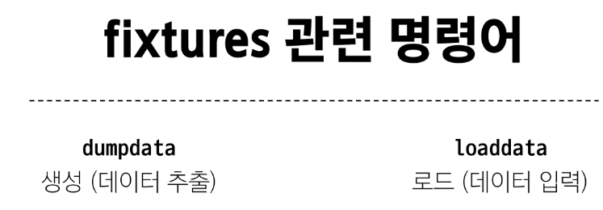

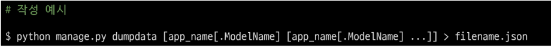
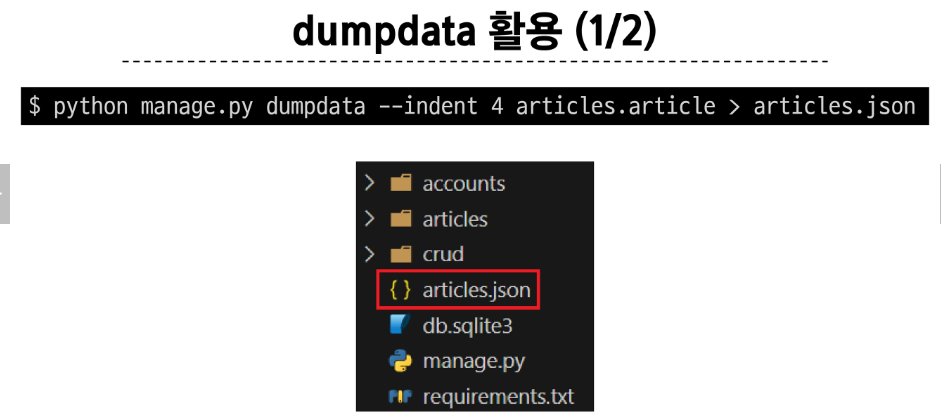
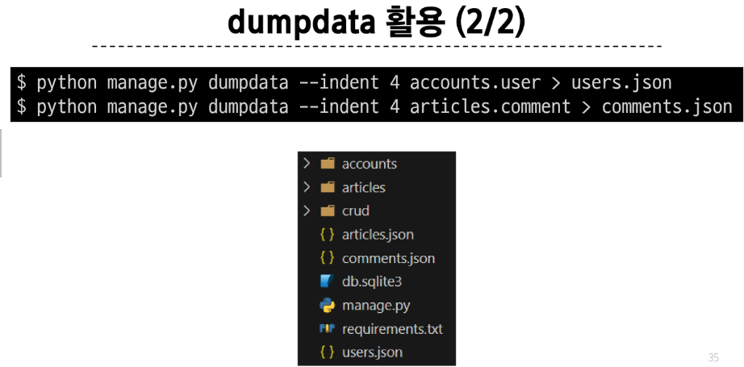

 

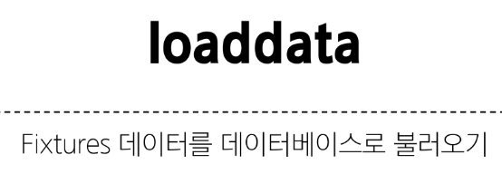
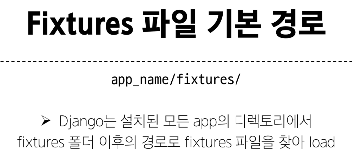
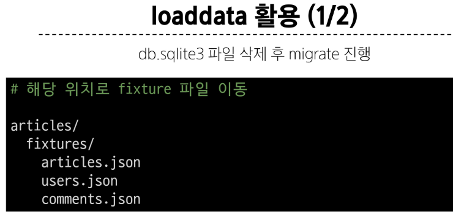
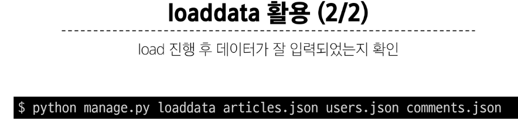
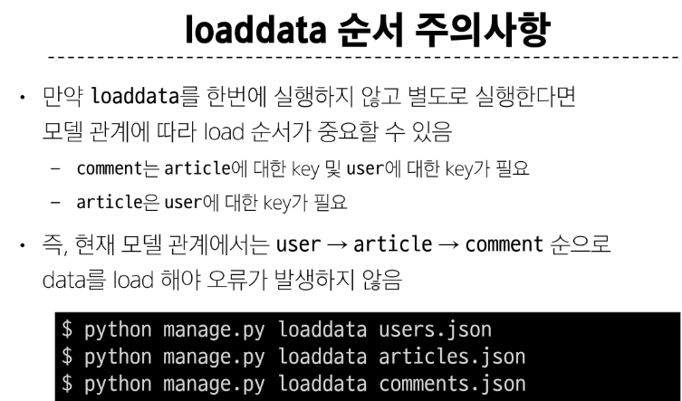

 

### 참고
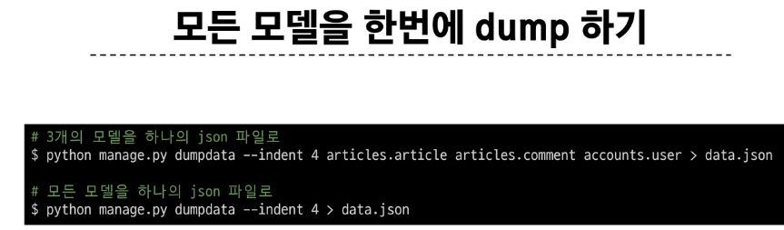
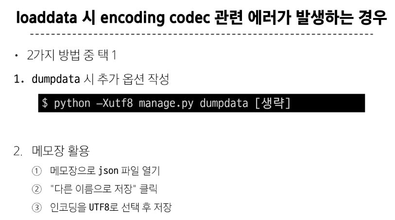
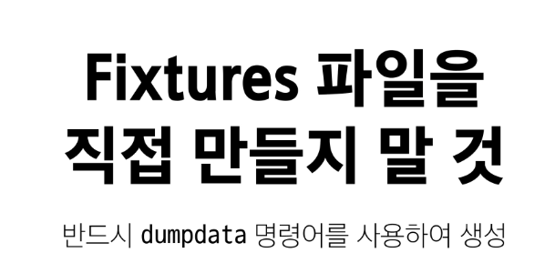

&nbsp;

#### 강의와 함께 눈으로 한번 봐보고 넘겨도 된다고 하셨지만 그래도 강의 다시 보면서 생각하기!
## 3. Improve query

## 3-1. annotate

## 3-2. select_related

## 3-3. prefetch_related

## 3-4. select_related & prefetch_related